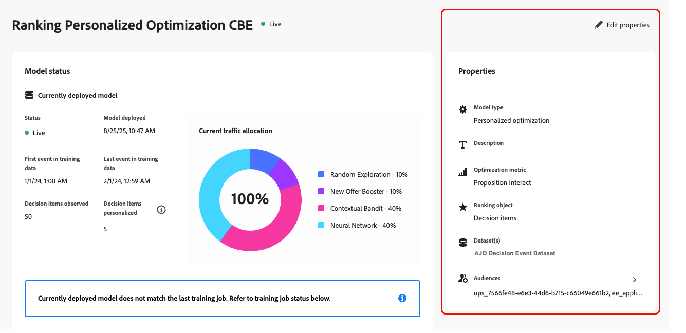
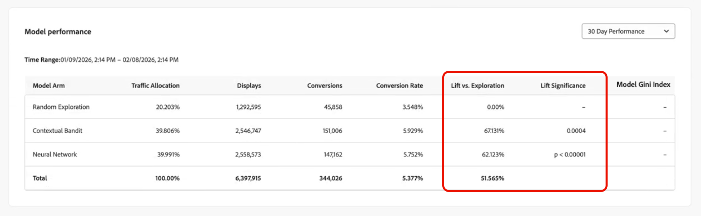

# AI 모델 모니터링 {#ai-model-observability}

마케터, 데이터 과학자 또는 의사 결정 관리자이든, 개인화된 최적화 모델의 수행 및 동작 방식을 이해하면 AI를 사용하는 각 고객에 대한 최상의 오퍼를 선택하는 데 도움이 됩니다.

이를 위해 [!DNL Journey Optimizer]에서 직접 AI 모델의 상태, 교육 상태 및 진화를 모니터링할 수 있습니다.

이렇게 하면 모델이 작동하는지 여부, 마지막으로 교육을 받은 시기, 교육 중 발생한 사항, 비즈니스 결과를 유도하는 방법(예: 전환 또는 매출), 작동하지 않을 때의 문제 해결<!-- (for example, unexpected decision item count, training data date range, or insufficient events)-->을 명확하게 볼 수 있습니다.

>[!AVAILABILITY]
>
>현재 이 기능은 [개인화된 최적화](personalized-optimization-model.md) 모델에서만 지원됩니다.

➡️ [비디오에서 이 기능 살펴보기](#video)

## 교육 상태 보기 {#from-ai-model-list}

모델이 라이브로 설정되면 지속적인 라이프사이클에 들어갑니다. 데이터가 수집되고 모델은 오퍼의 등급을 최적화하기 위해 정기적으로 재교육됩니다. AI 모델 목록에서 개인화된 최적화 모델의 교육 상태를 확인할 수 있습니다.

1. **[!UICONTROL Decisioning]** > **[!UICONTROL 전략 설정]** > **[!UICONTROL AI 모델]**(으)로 이동하여 AI 모델 인벤토리를 엽니다.

1. 사용 가능한 모든 AI 모델과 상태를 볼 수 있습니다.

1. 개인화된 최적화 유형의 각 **[!UICONTROL Live]** AI 모델에 대해 두 개의 열을 통해 다음을 확인할 수 있습니다.
   * 마지막 교육 작업이 실행되었을 때(**[!UICONTROL 마지막 교육]**),
   * 각 모델이 성공적으로 교육되었는지 여부(**[!UICONTROL 교육 결과]**).

   

   이를 통해 추가 조사 또는 문제 해결이 필요한 모델을 신속하게 식별할 수 있습니다.

## 모델 상태 보고서 액세스 {#access-ai-model-details}

목록에서 개인화된 최적화 AI 모델을 클릭합니다. 여기에서 아래 나열된 요소를 볼 수 있습니다.

* **[!UICONTROL 현재 배포된 모델]** - 이 섹션에는 현재 배포된 모델, 배포 시 모델이 사용하는 데이터 날짜 범위, 포함 및 개인화된 의사 결정 항목(오퍼) 수, 하위 모델 간 현재 트래픽 할당<!-- (random exploration, new offer booster?, contextual bandit, neural network)-->이 표시됩니다.

  

  이 예에서 모델은 5개의 의사 결정 항목에 대해 교육되었으며, 모델은 의사 결정 항목 중 3개에 대한 개인화된 예측을 개발하기에 충분한 트래픽을 갖는다. 나머지 2개의 결정 사항은 임의로 송달된다.

  또한 모델이 현재 개인화된 신경망에 40%의 트래픽을 할당하고, 상황별 절약에 40%의 트래픽을 할당하고, 무작위 탐색에 20%의 트래픽을 할당한다는 것을 알 수 있습니다.

* **[!UICONTROL 마지막 교육 작업]** - 이 섹션에는 마지막 교육 작업의 상태, 실행 시기 및 모든 오류 메시지가 표시됩니다. [오류 상태에 대해 자세히 알아보기](#check-for-error-states)

  

  이 예에서는 배포된 모델이 예상대로 교육 작업과 일치하는지 확인할 수 있습니다.

* **[!UICONTROL 속성]** - 이 섹션에는 사용된 데이터 세트, 최적화 지표 및 개인화된 최적화 모델을 교육하는 데 사용된 대상자와 같은 모델의 속성이 표시됩니다.

  

  이러한 요소를 수정하려면 **[!UICONTROL 속성 편집]**&#x200B;을 클릭하십시오. AI 모델 만들기 화면으로 리디렉션됩니다. [자세히 알아보기](create-ai-models.md)

* **[!DNL Model performance]** - 이 섹션에서는 각 하위 모델에 대한 트래픽 할당 및 전환율과 같이, 시간에 따른 모델의 각 암(arm)의 성능을 보여줍니다. **최근 7일**&#x200B;과 **최근 30일** 사이를 전환할 수 있습니다. 상승도와 통계적 유의성은 모델이 실제로 마케팅 결과를 개선하고 있는지 여부를 나타내는 주요 지표입니다.

  

  이 예에서는 지난 30일 동안 개인화된 하위 모델이 전환율의 60% 이상 상승을 제공하고 있으며, 이 상승은 통계적으로 유의미한 것으로, 이는 이 AI 모델이 귀하의 비즈니스에 영향을 미치고 있음을 의미합니다.

* **[!UICONTROL 시간 경과에 따른 모델 트래픽 할당]** - 이 섹션에서는 모델이 시간 경과에 따라 어떻게 발전했는지 보여 줍니다. 모델을 처음 배포할 때 아직 오퍼 데이터가 수집되지 않았기 때문에 트래픽의 100%가 무작위입니다. 첫 번째 재교육 후, 트래픽은 일반적으로 개인화된 팔로 이동합니다.

  

  이 예제에서 시간이 지남에 따라 모델이 재학습되면서 트래픽 할당이 100% 무작위 탐색에서 신경망 및 컨텍스트 기반 밴딧 트래픽으로 전환되었음을 알 수 있습니다.

## 교육 오류 이해 {#check-for-error-states}

마지막 교육 작업이 실패한 개인화된 최적화 AI 모델에 대한 오류 세부 정보를 보려면 아래 단계를 따르십시오.

1. 목록에서 모델을 클릭합니다. 모델 상태 세부 정보가 표시됩니다.

   {width="95%"}

   이 예에서는 마지막 교육 작업이 실패하여 배포된 모델이 없음을 볼 수 있습니다.

   >[!NOTE]
   >
   >모델이 배포되지 않으면 획일적인 무작위 트래픽 할당을 사용하여 의사 결정 요청이 제공됩니다.

1. **[!UICONTROL 마지막 교육 작업]** 섹션에서 오류 세부 정보를 살펴봅니다.

   {width="70%"}

   이 모델에 대해 선택한 데이터 세트에 피드백 이벤트가 없으면 일반적으로 교육 작업이 실패합니다. 즉, 데이터 세트를 채우거나 적절한 전환 이벤트로 새 데이터 세트를 선택해야 합니다.

1. 모델의 **[!UICONTROL 속성]**&#x200B;에서 선택한 데이터 세트를 확인할 수 있습니다. 다른 데이터 집합을 선택하려면 **[!UICONTROL 속성 편집]**&#x200B;을 클릭하세요. [자세히 알아보기](create-ai-models.md)

   {align="left" width="45%"}

## 자주 묻는 질문 {#faq}

+++ 어떤 AI 모델을 모니터링할 수 있습니까?

AI 모델 모니터링은 현재 [개인화된 최적화](personalized-optimization-model.md) 모델에 대해서만 지원됩니다. 다른 등급 모델 유형은 아직 모델 상태 보고서를 노출하지 않습니다.
+++

+++ 내 모델의 교육 작업이 실패한 이유는 무엇입니까?

모델에 대해 선택한 데이터 세트에 피드백(전환) 이벤트가 없거나 거의 없는 경우 교육 작업이 종종 실패합니다. **[!UICONTROL 마지막 교육 작업]** 섹션에서 오류 세부 정보를 확인한 다음 모델의 **[!UICONTROL 속성]**&#x200B;을 검토하여 데이터 집합 및 최적화 지표를 확인하십시오. 올바른 이벤트로 데이터 집합을 채우거나 적절한 전환 데이터로 [다른 데이터 집합을 선택](create-ai-models.md)합니다.
+++

+++ AI 모델 모니터링은 캠페인 및 여정 보고서와 어떤 관련이 있습니까?

AI 모델 모니터링은 캠페인 또는 여정 보고와 다릅니다. 단일 AI 모델은 여러 캠페인 또는 여러 여정에서 사용할 수 있으며, 캠페인 또는 여정 보고서에는 지정된 게재에 사용된 모델이 표시되지 않습니다. AI 모델 상태 모니터링을 사용하여 모델 자체를 이해하고 모니터링합니다. 게재 수준 지표에는 [캠페인 보고서](../../reports/campaign-global-report-cja.md) 및 [여정 보고서](../../reports/journey-global-report-cja.md)를 사용하십시오.
+++

+++ 내 최적화 지표는 매출이나 주문 값과 같은 연속 지표이지 클릭이나 전환과 같은 바이너리 지표가 아닙니다. 보고된 전환 및 전환율 값을 해석하려면 어떻게 해야 합니까?

매출액 또는 주문 값과 같은 연속 지표를 사용할 때 모델은 주어진 오퍼(전환 확률이 아님)의 표시와 관련된 예상 값을 예측하려고 합니다. 보고된 &quot;전환&quot; 값은 각 모델 암에 대해 기록된 오퍼와 연결된 총 매출(또는 주문 값)입니다. 보고된 &quot;전환율&quot;은 전환 값을 디스플레이 값으로 나눈 값이며, 연속 지표의 경우 100%를 초과할 수 있습니다.
+++

+++ 상승도 중요도란 무엇입니까?

상승도 유의성은 보고된 상승도 대 무작위 탐색의 통계적 유의성이다. 유의성은 비율 차이의 카이 제곱 검정을 사용하여 계산되며, 이는 두 인구 비율에 대한 Z-검정의 유의성 계산과 동일한 결과를 제공한다.
+++

+++ 지니지표 모형은 무엇인가? 지니 지수의 &quot;좋은&quot; 값은 무엇입니까?

모형 지니지수(Gini coefficient라고도 함)는 모형의 예측력에 대한 오프라인 측정치이다. 모델 Gini 지수의 범위는 0(예측 능력 없음)부터 1(모든 고객에 대한 모든 오퍼의 전환 또는 지표 값을 완벽하게 예측)까지입니다. 다양한 의사 결정 사용 사례로 인해 사용자 행동이 달라지고 모델 결과가 달라지므로 범용 &quot;양호&quot; Gini 인덱스 값은 없습니다. 동일한 사용 사례 내에서 Gini 인덱스 값이 높을수록 더 높은 품질 모델을 나타냅니다.
+++

+++ Gini 색인은 어떻게 계산됩니까?

각 모델 암에 대한 Gini 인덱스는 최적화 지표가 이진인지 아니면 연속인지에 따라 다르게 계산됩니다.

**이진 최적화 지표**(예: 클릭 수, 주문 수): Gini 인덱스는 수신기 작동 특성(ROC) 곡선의 곡선 아래 면적(AUC)을 기반으로 계산되며, 일반적으로 ROC AUC 또는 간단히 AUC라고 합니다. ROC AUC는 0.5(예측 능력이 0인 무작위 모델)부터 1.0(완전 예측 능력)까지이다. ROC AUC는 공식 Gini = 2 x (ROC AUC) - 1을 사용하여 Gini 인덱스로 변환됩니다.

**연속 최적화 지표**(예: 수입, 순서 값): Gini 인덱스는 모델의 누적 예측 양성과 모집단의 누적 실제 양성에 연결된 로렌츠 곡선 아래의 영역을 기반으로 계산됩니다. 로렌츠 곡선 아래의 면적은 0.0(완전예측력)부터 0.5(예측력이 0인 확률모형)까지이다. Lorenz AUC는 공식 Gini = 1 - 2 x (Lorenz AUC)를 사용하여 Gini 인덱스로 변환됩니다.
+++

+++ Gini 지수 또는 상승도 / 상승도 중요도 중 어느 것이 모델 품질을 더 잘 측정합니까?

일반적으로 상승도 및 상승도 중요도와 같은 모델 품질의 온라인 측정은 모델 품질을 측정하는 &quot;골드 표준&quot; 방법으로 간주됩니다. Gini 인덱스는 고객 데이터 과학 팀이 의사 결정 모델을 평가할 때 추가 데이터 포인트를 제공하는 것으로 보고되었습니다.
+++

<!--
## Understanding statuses and errors {#statuses-errors}

* **Success** – The latest training job completed successfully. The model is trained and deployed for ranking.
* **Failed** – The latest training job failed (for example, no events in the datasets). The UI shows an error message and a request ID; use these when troubleshooting or contacting support.
* **In progress** – A training job is running. Some metrics may be temporarily unavailable until it finishes.
* **Pending** – No result yet (for example, model recently activated or settings recently changed).

If no model has been successfully deployed yet, the "currently deployed model" section and some performance fields will be empty or show the initial-state messaging.
-->

## 사용 방법 비디오 {#video}

[!DNL Journey Optimizer]에서 AI 등급 모델을 모니터링하고 교육 상태 및 성과를 해석하는 방법을 알아봅니다.

>[!VIDEO](https://video.tv.adobe.com/v/3479856?captions=kor&quality=12)

## 관련 설명서 {#related}

* [AI 모델 정보](ai-models.md)
* [개인화된 최적화 모델](personalized-optimization-model.md)
* [AI 모델 만들기](create-ai-models.md)
* [이벤트를 수집할 데이터 세트 만들기](../data-collection/create-dataset.md)
