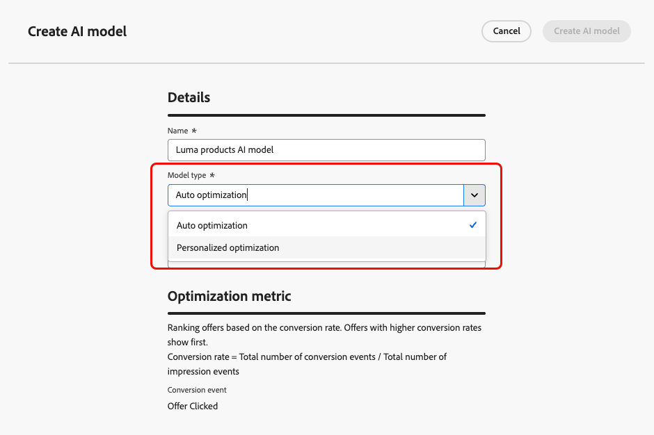

# AI 모델 구축 {#create-ai-models}

[!DNL Journey Optimizer]을(를) 사용하면 **AI 모델**&#x200B;을(를) 만들어 비즈니스 목표에 따라 오퍼의 등급을 지정할 수 있습니다.

>[!CAUTION]
>
>AI 모델을 만들거나 편집하거나 삭제하려면 **순위 전략 관리** 권한이 있어야 합니다. [자세히 알아보기](../../administration/high-low-permissions.md#manage-ranking-strategies)

## AI 모델 만들기 {#create-ranking-strategy}

>[!CONTEXTUALHELP]
>id="ajo_exd_ai_model_metric"
>title="최적화 지표"
>abstract="[!DNL Journey Optimizer]는 **전환율**(전환율 = 총 전환 이벤트 수 / 총 노출 이벤트 수)을 기준으로 오퍼의 순위를 매깁니다. 전환율은 다음 두 가지 유형의 지표를 사용하여 계산됩니다. **노출 이벤트**(표시되는 오퍼)와 **전환 이벤트**(이메일이나 웹을 통해 클릭을 유도하는 오퍼). 이러한 이벤트는 제공된 Web SDK 또는 Mobile SDK를 사용하여 자동으로 캡처됩니다."

AI 모델을 만들려면 아래 단계를 수행합니다.

1. 전환 이벤트가 수집될 데이터 세트를 만듭니다. [방법 알아보기](../data-collection/create-dataset.md)

1. **[!UICONTROL 의사 결정]** > **[!UICONTROL 전략 설정]** 메뉴로 이동한 다음 **[!UICONTROL AI 모델]**&#x200B;을 선택합니다.

   

   지금까지 만든 모든 AI 모델이 나열됩니다.

1. **[!UICONTROL AI 모델 만들기]** 단추를 클릭합니다.

1. 고유한 이름을 지정하고 필요한 경우 AI 모델에 대한 설명을 지정합니다.

1. 만들려는 AI 모델의 유형을 선택합니다.

   * **[!UICONTROL 자동 최적화]**&#x200B;은(는) 이전 오퍼 성능을 기반으로 오퍼를 최적화합니다. [자세히 알아보기](auto-optimization-model.md)
   * **[!UICONTROL 개인화된 최적화]**&#x200B;은(는) 대상 및 오퍼 성능을 기반으로 오퍼를 최적화하고 개인화합니다. [자세히 알아보기](personalized-optimization-model.md)

   

1. **[!UICONTROL 최적화 지표]** 섹션에서는 오퍼의 순위를 계산하기 위해 AI 모델이 사용하는 전환 이벤트에 대한 정보를 제공합니다.

   [!DNL Journey Optimizer]는 **전환율**(전환율 = 총 전환 이벤트 수 / 총 노출 이벤트 수)을 기준으로 오퍼의 순위를 매깁니다. 전환율은 두 가지 유형의 지표를 사용하여 계산됩니다.
   * **노출 이벤트**(표시되는 오퍼)
   * **전환 이벤트**(전자 메일 또는 웹을 통해 클릭을 발생시키는 오퍼).

   이러한 이벤트는 제공된 웹 SDK 또는 모바일 SDK을 사용하여 자동으로 캡처됩니다. [Adobe Experience Platform Web SDK](https://experienceleague.adobe.com/docs/experience-platform/edge/home.html?lang=ko) 개요에서 자세히 알아보세요.

   +++ 사용자 지정 [!DNL Customer Journey Analytics] 지표에 대한 모델 최적화 중

   >[!NOTE]
   >
   >이 기능은 관리자 권한이 있는 [!DNL Customer Journey Analytics] 고객만 사용할 수 있습니다.
   >
   >시작하기 전에 Journey Optimizer 데이터 세트를 기본 데이터 보기로 내보내기 위해 Customer Journey Analytics과 Journey Optimizer을 통합했는지 확인하십시오. [데이터를 활용하는 방법 알아보기 [!DNL Journey Optmizer] 데이터 입력 [!DNL Customer Journey Analytics]](../../reports/cja-ajo.md)

   **[!UICONTROL 개인화된 최적화]** 모델은 비즈니스 목표를 정의하고 고객 데이터를 사용하여 비즈니스 지향 모델을 교육하여 개인화된 오퍼를 제공하고 KPI를 극대화할 수 있는 AI 모델의 유형입니다.

   기본적으로 개인화된 최적화 모델은 **오퍼 클릭 수**&#x200B;를 최적화 지표로 사용합니다. [!DNL Customer Journey Analytics]을(를) 사용하여 작업하는 경우 [!DNL Decisioning]을(를) 사용하면 사용자 지정 지표를 활용하여 모델을 최적화할 수 있습니다.

   이렇게 하려면 **[!UICONTROL 개인화된 최적화]** 모델 유형을 선택하고 **[!UICONTROL 전환 이벤트]** 드롭다운을 확장합니다. 기본 [!DNL Customer Journey Analytics] [데이터 보기](https://experienceleague.adobe.com/ko/docs/analytics-platform/using/cja-dataviews/data-views){target="_blank"}의 모든 지표가 목록에 표시됩니다. 모델을 최적화할 지표를 선택합니다.

   {width=85%}

   >[!NOTE]
   >
   >기본적으로 [!DNL Customer Journey Analytics]의 지표는 &quot;마지막 터치&quot; 속성 모델을 사용하며, 이 속성 모델은 전환 전에 가장 최근에 발생하는 접점에 크레딧의 100%를 할당합니다.
   >
   >속성 모델을 수정할 수 있지만 모든 속성 모델이 AI 모델 최적화에 이상적이지는 않습니다. 모델의 정확도와 성능을 보장하기 위해 최적화 목표에 맞는 속성 모델을 신중하게 선택하는 것이 좋습니다.
   >
   >사용 가능한 속성 모델 및 사용 지침에 대한 자세한 내용은 [[!DNL Customer Journey Analytics] 설명서](https://experienceleague.adobe.com/ko/docs/analytics-platform/using/cja-dataviews/component-settings/attribution){target="_blank"}를 참조하세요.

   +++

1. 전환 및 노출 이벤트가 수집되는 데이터 세트를 선택합니다. [이 섹션](../data-collection/create-dataset.md)에서 이러한 데이터 세트를 만드는 방법을 알아보세요.

   {width=85%}

   >[!CAUTION]
   >
   >**[!UICONTROL 경험 이벤트 - 제안 상호 작용]** 필드 그룹(이전 이름: mixin)과 연결된 스키마에서 만든 데이터 세트만 드롭다운 목록에 표시됩니다.

1. **[!UICONTROL 개인화된 최적화]** AI 모델을 만드는 경우 AI 모델을 교육하는 데 사용할 세그먼트를 선택하십시오.

   <!--➡️ [Discover this feature in video](#video)-->

   >[!NOTE]
   >
   >최대 5개의 대상을 선택할 수 있습니다.

1. AI 모델을 저장하고 활성화합니다.

<!--At this point, you must have:

* created the AI model,
* defined which type of event you want to capture - offer displayed (impression) and/or offer clicked (conversion),
* and in which dataset you want to collect the event data.-->

이제 오퍼가 표시 및/또는 클릭될 때마다 **[!UICONTROL Adobe Experience Platform Web SDK]** 또는 Mobile SDK을 사용하여 [경험 이벤트 - 제안 상호 작용](https://experienceleague.adobe.com/docs/experience-platform/edge/web-sdk-faq.html?lang=ko#what-is-adobe-experience-platform-web-sdk%3F){target="_blank"} 필드 그룹에 의해 해당 이벤트가 자동으로 캡처되도록 할 수 있습니다.

이벤트 유형(표시된 오퍼 또는 클릭한 오퍼)을 보낼 수 있으려면 Adobe Experience Platform으로 전송되는 경험 이벤트의 각 이벤트 유형에 대해 올바른 값을 설정해야 합니다. [방법 알아보기](../data-collection/schema-requirement.md)

<!--
## How-to video {#video}

Learn how to create a personalized optimization model and how to apply it to a decision.

>[!VIDEO](https://video.tv.adobe.com/v/3445958?captions=kor&quality=12)-->
