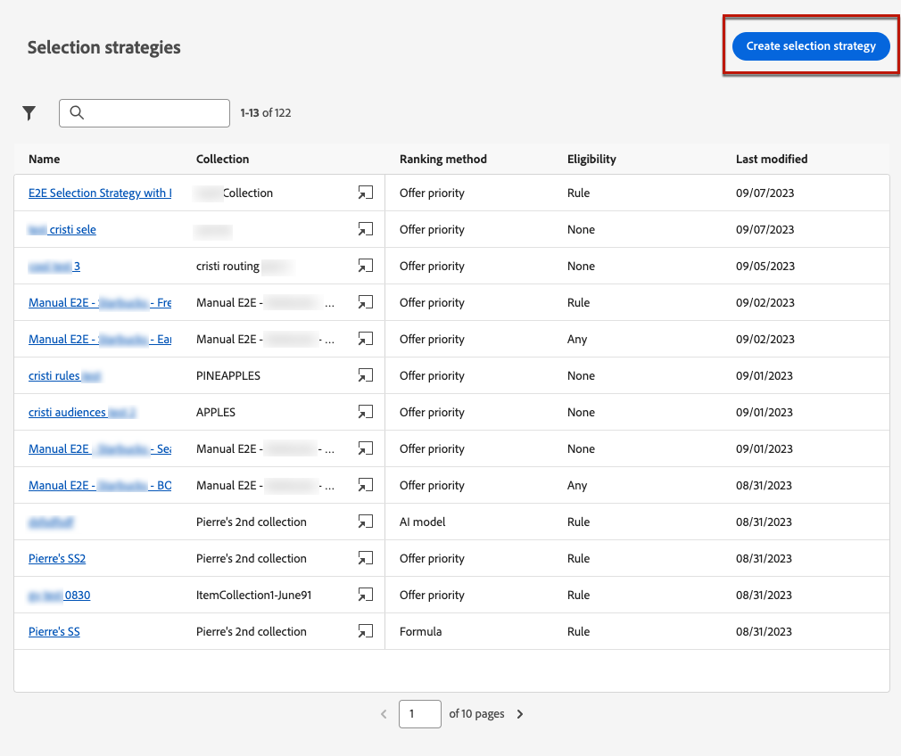
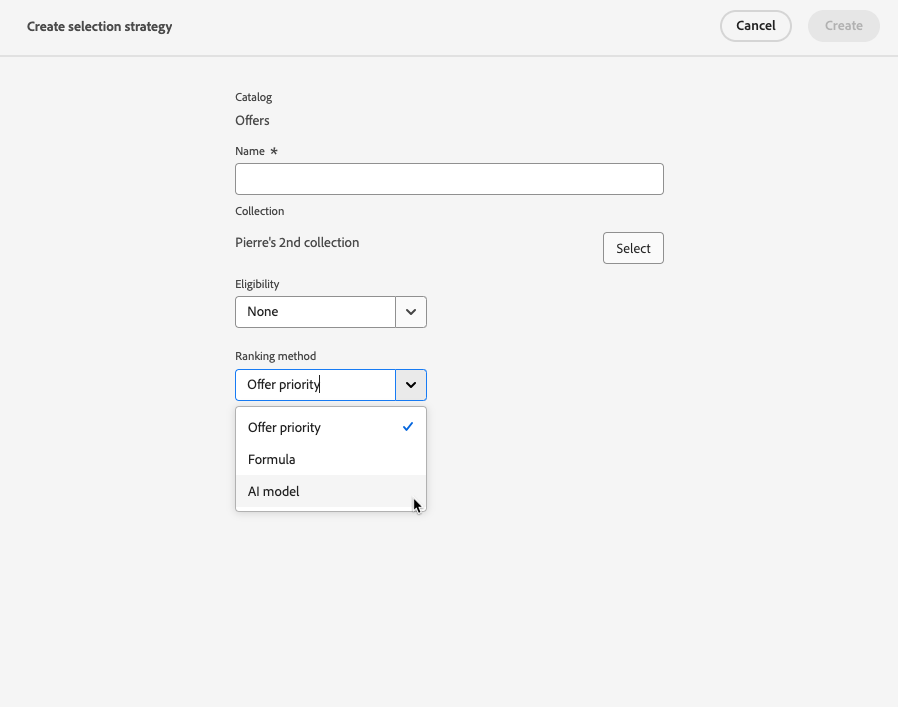

# 선택 전략 만들기 {#selection-strategies}

>[!BEGINSHADEBOX]

이 설명서의 내용:

* [Experience Decisioning 시작](gs-experience-decisioning.md)
* 결정 항목 관리
   * [항목 카탈로그 구성](catalogs.md)
   * [결정 항목 만들기](items.md)
   * [항목 컬렉션 관리](collections.md)
* 항목 선택 구성
   * [의사 결정 규칙 만들기](rules.md)
   * [등급 메서드 만들기](ranking.md)
* **[선택 전략 만들기](selection-strategies.md)**
* [결정 정책 만들기](create-decision.md)

>[!ENDSHADEBOX]

선택 전략은 재사용 가능한 항목이며, 다음에서 선택할 때 표시할 오퍼를 결정하는 자격 제한 및 등급 방법과 연관된 컬렉션으로 구성됩니다. [결정 방침](create-decision.md).

## 선택 전략 액세스 및 관리

1. 다음으로 이동 **[!UICONTROL 경험 의사 결정]** > **[!UICONTROL 구성]** > **[!UICONTROL 선택 전략]**.

1. 지금까지 만든 모든 선택 전략이 나열됩니다. 필터를 사용하여 등급 방법에 따라 전략을 검색할 수 있습니다.

   

1. 편집할 선택 전략 이름을 클릭합니다.

1. 각 전략에 대해 선택한 컬렉션, 등급 방법 및 자격 조건도 표시됩니다. 각 컬렉션 이름 옆에 있는 아이콘을 클릭하여 컬렉션을 직접 편집할 수 있습니다.

   

## 선택 전략 만들기

선택 전략을 만들려면 아래 단계를 수행합니다.

1. 다음에서 **[!UICONTROL 선택 전략]** 인벤토리, 클릭 **[!UICONTROL 선택 전략 만들기]**.

   

1. 전략의 이름을 추가합니다.

   >[!NOTE]
   >
   >현재는 기본값만 **[!UICONTROL 오퍼]** 카탈로그를 사용할 수 있습니다.

1. 이름부터 시작하여 선택 전략에 대한 세부 정보를 입력합니다.

   

1. 오퍼 선택 [컬렉션](collections.md) 고려할 오퍼가 포함되어 있습니다.

1. 사용 **[!UICONTROL 자격 요건]** 이 선택 전략에 대한 오퍼 선택을 제한하는 필드.

   

   * 오퍼 선택을 Experience Platform 대상의 구성원으로 제한하려면 다음을 선택합니다. **[!UICONTROL 대상]** 목록에서 대상자를 선택합니다. [대상자를 사용한 작업 방법 알아보기](../audience/about-audiences.md)

   * 의사 결정 규칙과 함께 선택 제한을 추가하려면 **[!UICONTROL 결정 규칙]** 옵션을 선택하고 선택한 규칙을 선택합니다. [규칙을 만드는 방법 알아보기](rules.md)

1. 각 프로필에 가장 적합한 오퍼를 선택하는 데 사용할 순위 방법을 정의합니다. [자세히 알아보기](#select-ranking-method)

   

   * 기본적으로 여러 오퍼가 이 전략에 적합한 경우 [오퍼 우선 순위](#offer-priority) 메서드는 오퍼에 정의된 값을 사용합니다.

   * 특정 계산된 점수를 사용하여 게재할 적격 오퍼를 선택하려면 다음을 선택합니다. [공식](#ranking-formula) 또는 [AI 모델](#ai-ranking).

1. **[!UICONTROL 만들기]**&#x200B;를 클릭합니다. 이제 사용할 준비가 되었습니다. [결정](create-decision.md)

## 등급 방법 선택 {#select-ranking-method}

여러 오퍼가 주어진 선택 전략에 적합한 경우 선택 전략을 생성할 때 각 프로필에 가장 적합한 오퍼를 선택하는 방법을 선택할 수 있습니다. 오퍼의 순위를 지정할 수 있는 기준:

* [오퍼 우선 순위](#offer-priority)
* [공식](#ranking-formula)
* [AI 등급](#ai-ranking)

### 오퍼 우선 순위 {#offer-priority}

기본적으로 여러 오퍼가 의사 결정에서 주어진 배치에 적합한 경우 가장 높은 수치를 보이는 항목입니다 **우선 순위** 는 고객에게 먼저 제공됩니다.

오퍼의 우선순위 점수는 을(를) 생성할 때 지정됩니다. [결정 항목](items.md).

### 순위 공식 {#ranking-formula}

Journey Optimizer에서는 오퍼 우선 순위 외에도 다음을 만들 수 있습니다 **등급 수식**. 오퍼의 우선 순위 점수를 고려하지 않고, 주어진 배치에 대해 먼저 제시해야 할 오퍼를 결정하는 수식입니다.

예를 들어 종료 날짜가 지금부터 24시간 미만인 모든 오퍼의 우선순위를 늘리거나, 프로필의 관심 지점이 &quot;실행 중&quot;인 경우 &quot;실행 중&quot; 카테고리의 오퍼를 늘릴 수 있습니다. 등급 수식 만들기 방법 알아보기 [이 섹션](ranking.md).

만든 후에는 이 공식을 선택 전략에 사용할 수 있습니다. 이 선택 전략을 사용할 때 여러 오퍼를 표시할 수 있는 경우, 의사 결정은 선택한 공식을 사용하여 먼저 게재할 오퍼를 계산합니다.

### AI 등급 {#ai-ranking}

AI 모델을 선택하여 주어진 프로필에 대해 표시할 오퍼에 자동으로 등급을 지정하는 교육된 모델 시스템을 사용할 수도 있습니다. 에서 AI 모델을 만드는 방법을 알아봅니다. [이 섹션](ranking.md).

AI 모델이 만들어지면 선택 전략에 사용할 수 있습니다. 여러 오퍼가 적합한 경우 교육된 모델 시스템은 이 선택 전략에 대해 먼저 제시해야 하는 오퍼를 결정합니다.
