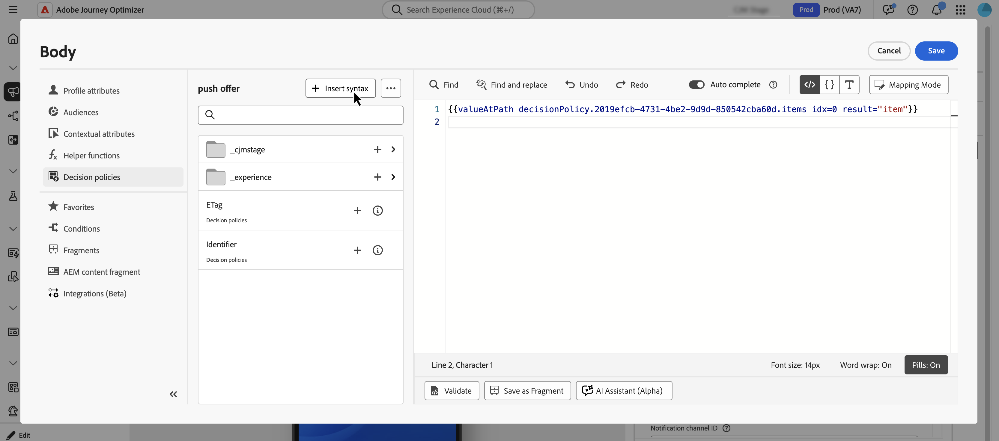
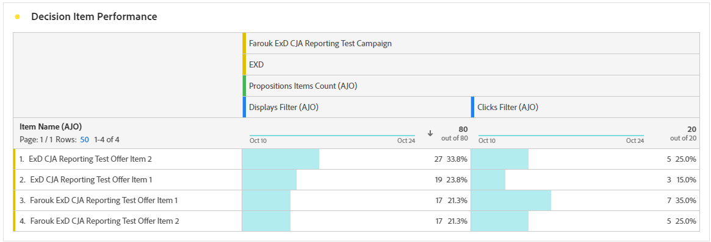

# 메시지에 결정 정책 사용 {#create-decision}

콘텐츠에 의사 결정 정책을 추가한 후에는 개인화를 위해 반환된 의사 결정 항목의 속성을 사용할 수 있습니다. 이렇게 하려면 먼저 의사 결정 정책 코드를 콘텐츠에 삽입합니다.

>[!CAUTION]
>
>결정 정책은 **코드 기반 경험**, **SMS**, **푸시 알림** 및 **이메일** 채널에 대해 모든 고객이 사용할 수 있습니다.

## 의사 결정 정책 코드 삽입 {#insert}

>[!BEGINTABS]

>[!TAB 코드 기반 경험]

1. 코드 기반 환경을 편집하고 **[!UICONTROL 결정 정책]**(으)로 이동합니다.

2. 결정 정책 코드를 추가하려면 **[!UICONTROL 정책 삽입]**&#x200B;을 선택하십시오.

   

>[!NOTE]
>
>코드 기반 경험의 경우 의사 결정 정책에 조각이 포함된 의사 결정 항목이 포함되어 있으면 의사 결정 정책 코드에서 이러한 조각을 활용할 수 있습니다. [조각을 활용하는 방법 알아보기](fragments-decision-policies.md)

>[!TAB 이메일]

1. **Personalization 편집기**&#x200B;를 열고 **[!UICONTROL 의사 결정 정책]**(으)로 이동합니다.

2. **[!UICONTROL 구문 삽입]**&#x200B;을 선택하여 의사 결정 정책에 대한 코드를 추가합니다.

   

   >[!NOTE]
   >
   >삽입 옵션이 나타나지 않으면 상위 구성 요소에 대해 의사 결정 정책이 이미 구성되어 있을 수 있습니다.

3. 아직 구성 요소에 할당된 배치가 없으면 목록에서 배치를 선택하고 **[!UICONTROL 할당]**&#x200B;을 클릭합니다.

   

   >[!NOTE]
   >
   >동일한 이메일에서 여러 개의 결정 정책을 사용하는 경우(예: 머리글에 대해 한 개의 결정 정책과 바닥글에 대해 한 개의 결정 정책), 동일한 오퍼가 배치 간에 중복 제거됩니다. 이 오퍼는 두 번 렌더링되지 않습니다. 두 번째 결정 정책은 대체 오퍼를 구성하지 않은 경우 콘텐츠를 반환하지 않고 빈 공간을 표시합니다. 이 경우 대체 오퍼가 대신 표시됩니다.

전자 메일 Designer에서 **[!UICONTROL 직접 코드 작성]** 모드를 사용할 때 의사 결정 정책 코드를 삽입할 수도 있습니다. **[!UICONTROL 의사 결정 정책]**(으)로 이동하고 **[!UICONTROL 구문 삽입]**&#x200B;을 선택합니다. 배치를 직접 할당할 수 있도록 배치 선택 UI가 표시됩니다. [자신의 전자 메일 콘텐츠를 코딩하는 방법에 대해 알아보세요](../email/code-content.md).

>[!AVAILABILITY]
>
>**[!UICONTROL 자신의 코드 작성]** 모드에서 의사 결정 정책을 삽입하는 방법은 제한된 가용성입니다.

>[!NOTE]
>
>**[!UICONTROL 자체 코드 작성]** 모드에서는 **[!UICONTROL 반복 그리드]** 구성 요소를 사용할 수 없으므로 정책당 하나의 결정 항목만 반환할 수 있습니다.

>[!TAB SMS]

1. **Personalization 편집기**&#x200B;를 열고 **[!UICONTROL 의사 결정 정책]**(으)로 이동합니다.

2. **[!UICONTROL 구문 삽입]**&#x200B;을 선택하여 의사 결정 정책에 대한 코드를 추가합니다.

   

>[!TAB 푸시]

1. **Personalization 편집기**&#x200B;를 열고 **[!UICONTROL 의사 결정 정책]**(으)로 이동합니다.

2. **[!UICONTROL 구문 삽입]**&#x200B;을 선택하여 의사 결정 정책에 대한 코드를 추가합니다.

   

>[!IMPORTANT]
>
>푸시 알림을 사용하는 Experience Decisioning에는 모바일 SDK의 특정 버전이 필요합니다. 이 기능을 구현하기 전에 [릴리스 정보](https://developer.adobe.com/client-sdks/home/release-notes){target="_blank"}를 확인하여 필요한 버전을 식별하고 그에 따라 업그레이드했는지 확인하십시오. [이 섹션](https://developer.adobe.com/client-sdks/home/current-sdk-versions){target="_blank"}에서 사용 가능한 플랫폼에 대한 모든 SDK 버전을 볼 수도 있습니다.

>[!ENDTABS]

결정 정책 코드가 추가됩니다. 이제 반환된 의사 결정 항목의 속성을 사용하여 콘텐츠를 개인화할 수 있습니다.

>[!NOTE]
>
>코드 기반 경험 및 이메일 채널의 경우 반환할 의사 결정 항목마다 이 시퀀스를 한 번씩 반복합니다. 예를 들어 [결정을 만들 때](create-decision-policy.md) 2개 항목을 반환하도록 선택한 경우 시퀀스를 두 번 반복합니다. SMS 및 푸시 채널의 경우 하나의 결정 항목만 반환할 수 있습니다.

## 의사 결정 항목 속성을 사용하여 개인화 {#attributes}

콘텐츠에 의사 결정 정책에 대한 코드를 추가하면 반환된 의사 결정 항목의 모든 속성을 개인화할 수 있습니다. [개인 맞춤화를 사용하여 작업하는 방법을 알아보세요](../personalization/personalize.md).

특성은 &quot;오퍼&quot; [카탈로그 스키마](catalogs.md)에 저장됩니다. 개인화 편집기에서 다음 폴더에 표시됩니다.
* **사용자 지정 특성**: `_\<imsOrg\>` 폴더
* **표준 특성**: `_experience` 폴더

[!DNL Journey Optimizer] 조각에서는 기본적으로 의사 결정 항목 특성 및 컨텍스트 특성이 지원되지 않습니다. 그러나 아래 설명된 것처럼 전역 변수를 대신 사용할 수 있습니다.

특성을 추가하려면 특성 옆에 있는 **`+`** 아이콘을 클릭합니다. 필요한 만큼 속성을 추가할 수 있습니다. 프로필 데이터와 같은 다른 개인화 속성도 포함할 수 있습니다.

* **Email** 및 **코드 기반** 채널의 경우 `#each` 루프 내에서 대괄호 `[ ]`을(를) 사용하여 특성을 래핑한 다음 닫는 `/each` 태그 앞에 쉼표를 추가하십시오.

  +++예제 참조

  

  +++

* **SMS** 및 **Push** 채널의 경우, 결정 정책의 구문 코드 뒤에 특성을 삽입하십시오. 이 구문은 항상 1행을 유지해야 합니다.

  +++예제 참조

  

  +++

  >[!NOTE]
  >이미지 자산 속성을 SMS나 푸시 콘텐츠(예: 제목 또는 본문)에 삽입하는 경우 속성 값이 URL로 표시됩니다. 이미지 자체는 해당 필드에서 렌더링되지 않습니다.

* 결정 항목 추적을 사용하려면 `trackingToken` 특성을 추가하십시오. `trackingToken: {{item._experience.decisioning.decisionitem.trackingToken}}`

## 콘텐츠 미리 보기 및 테스트

콘텐츠를 빌드한 후 여정 또는 캠페인을 활성화하기 전에 미리보기 및 테스트하십시오. 시뮬레이션 인터페이스에서 선택한 프로필을 기반으로 의사 결정 항목을 렌더링합니다. [콘텐츠를 미리 보고 테스트하는 방법에 대해 알아보세요](../content-management/preview-test.md).

## 다음 단계 {#final-steps}

콘텐츠가 준비되면 캠페인 또는 여정을 검토하고 게시합니다.

* [여정 게시](../building-journeys/publish-journey.md)
* [캠페인 검토 및 활성화](../campaigns/review-activate-campaign.md)

코드 기반 경험의 경우 개발자가 채널 구성에 정의된 표면에 대한 콘텐츠를 가져오기 위해 API 또는 SDK 호출을 수행하면 바로 웹 페이지 또는 앱에 변경 사항이 적용됩니다.

## 캠페인 요약에서 의사 결정 정책 세부 정보 보기 {#decision-policy-summary}

작업 또는 API로 트리거된 [캠페인](../campaigns/get-started-with-campaigns.md)이(가) 해당 콘텐츠에서 의사 결정 정책을 사용하면 캠페인 요약 페이지에 캠페인에 사용된 모든 정책을 나열하는 **[!UICONTROL 의사 결정 정책]** 섹션이 표시됩니다.

각 의사 결정 정책의 기술 세부 사항에 액세스하여 클립보드에 복사할 수 있으므로 Adobe 지원 또는 엔지니어링 팀의 문제를 해결하는 데 유용합니다.

의사 결정 정책 세부 정보 및 기술 정보에 액세스하려면 아래 단계를 따르십시오.

1. [구성](../campaigns/review-activate-campaign.md#action-campaign-review) 중에 **[!UICONTROL 활성화 검토]**&#x200B;를 클릭하거나 **[!UICONTROL 캠페인]** 목록에서 캠페인을 열어 캠페인 요약을 엽니다.

1. **[!UICONTROL 의사 결정 정책]** 섹션에는 캠페인에 사용된 모든 정책이 나열됩니다.

   

1. 결정 정책을 선택하거나 **[!UICONTROL 모두 보기]**&#x200B;를 클릭합니다. 다음을 포함하여 각 정책에 대한 세부 사항을 검토할 수 있습니다.

   * 의사 결정 정책에 사용된 전략
   * 반환할 항목 수
   * 각 선택 전략에 사용되는 컬렉션, 등급 방법 및 자격 규칙
   * 적합한 결정 항목이 없는 경우 사용되는 대체 오퍼

   

1. 컬렉션을 클릭하여 포함된 모든 결정 항목을 표시합니다.

1. 의사 결정 항목을 클릭하여 세부 정보에 액세스하고 필요한 경우 편집합니다. 그러면 새 브라우저 탭에서 열립니다. 또는 **[!UICONTROL 항목 보기]**&#x200B;를 클릭하여 컬렉션에 없는 결정 항목을 표시합니다.

   

1. 각 선택 전략에 사용되는 순위 방법 및 자격 규칙에 대한 정보를 볼 수도 있습니다.

   {width="80%"}

1. 캠페인 요약으로 돌아가서 **[!UICONTROL 작업]** 섹션에서 결정 정책을 선택하고 **정보** 아이콘을 클릭하여 결정 정책의 기술 세부 정보에 액세스할 수도 있습니다.

   

1. 결정 정책의 JSON 표현을 클립보드에 복사하려면 **클립보드에 복사** 아이콘을 클릭하십시오.

   복사된 JSON에는 조직 이름 및 ID, 샌드박스 이름, 의사 결정 정책 ID 및 전체 의사 결정 정책 구조가 포함됩니다. 이 정보를 Adobe 지원 또는 엔지니어링 팀과 공유하여 의사 결정 정책 문제를 보다 신속하게 해결할 수 있습니다.

## 보고 대시보드 사용

의사 결정의 성과를 파악하기 위해 캠페인 또는 여정 보고서에서 즉시 사용 가능한 의사 결정 지표를 보거나, 사용자 지정 Customer Journey Analytics 대시보드를 작성하여 성과를 측정하고 의사 결정 정책 및 오퍼가 전달되고 참여하는 방식에 대한 통찰력을 얻을 수 있습니다. [의사 결정 보고에 대해 자세히 알아보세요](cja-reporting.md).

