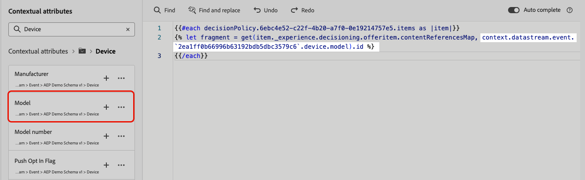

# 메시지에 의사 결정 정책 사용 {#create-decision}

의사 결정 정책을 만들면, 반환된 의사 결정 항목에 연결된 정책 및 속성을 개인화를 위해 콘텐츠에 사용할 수 있습니다. 이렇게 하려면 먼저 의사 결정 정책과 연결된 코드를 콘텐츠에 삽입해야 합니다. 완료되면 해당 속성을 개인화에 활용할 수 있습니다.

## 의사 결정 정책 코드 삽입 {#insert-code}

>[!BEGINTABS]

>[!TAB 코드 기반 경험]

1. 개인화 편집기를 열고 **[!UICONTROL 의사 결정 정책]** 메뉴에 액세스합니다.

1. 결정 정책에 해당하는 코드를 추가하려면 **[!UICONTROL 정책 삽입]**&#x200B;을 선택하십시오.

   

   >[!NOTE]
   >
   >코드 삽입 단추가 표시되지 않으면 상위 구성 요소에 대해 의사 결정 정책이 이미 구성되어 있을 수 있습니다.

1. 결정 정책에 대한 코드가 추가됩니다. 이 순서는 결정 정책이 반환될 횟수를 반복합니다. 예를 들어 [결정을 만들](#add-decision) 때 다시 2개 항목을 반환하도록 선택한 경우 동일한 시퀀스가 두 번 반복됩니다.

>[!TAB 이메일]

1. 개인화 편집기를 열고 **[!UICONTROL 의사 결정 정책]** 메뉴에 액세스합니다.

1. 결정 정책에 해당하는 코드를 추가하려면 **[!UICONTROL 구문 삽입]**&#x200B;을 선택하십시오.

   

   >[!NOTE]
   >
   >코드 삽입 단추가 표시되지 않으면 상위 구성 요소에 대해 의사 결정 정책이 이미 구성되어 있을 수 있습니다.

1. 미리 구성 요소와 연결된 배치가 없으면 목록에서 배치를 선택하고 **[!UICONTROL 할당]**&#x200B;을 클릭합니다.

   

>[!ENDTABS]

1. 결정 정책에 대한 코드가 추가됩니다. 이 순서는 결정 정책이 반환될 횟수를 반복합니다. 예를 들어 [결정을 만들](#add-decision) 때 다시 2개 항목을 반환하도록 선택한 경우 동일한 시퀀스가 두 번 반복됩니다.

## 의사 결정 항목 속성 활용 {#attributes}

이제 해당 코드 내에 원하는 모든 결정 특성을 추가할 수 있습니다. 사용 가능한 특성은 **[!UICONTROL 오퍼]** 카탈로그의 스키마에 저장됩니다. 사용자 지정 특성은 **`_<imsOrg`>** 폴더에 저장되고 표준 특성은 **`_experience`** 폴더에 저장됩니다. [오퍼 카탈로그의 스키마에 대해 자세히 알아보기](catalogs.md)


>[!NOTE]
>
>결정 정책 항목 추적의 경우 결정 정책 콘텐츠에 대해 `trackingToken` 특성을 다음과 같이 추가해야 합니다.
>&#x200B;>`trackingToken: {{item._experience.decisioning.decisionitem.trackingToken}}`

속성을 추가하려면 속성 옆에 있는 &#39;+&#39; 아이콘을 클릭합니다. 코드에 원하는 수만큼 속성을 추가할 수 있습니다.


대괄호 `#each` 쌍 안에 `[ ]` 루프를 래핑하고 닫는 `/each` 바로 앞에 쉼표를 추가해야 합니다.


프로필 속성과 같이 개인화 편집기에서 사용할 수 있는 다른 속성을 추가할 수도 있습니다.


## 조각 활용 {#fragments}

의사 결정 정책에 조각이 포함된 의사 결정 항목이 포함되어 있는 경우 의사 결정 정책 코드에서 이러한 조각을 활용할 수 있습니다. [조각에 대해 자세히 알아보기](../content-management/fragments.md)

>[!AVAILABILITY]
>
>이 기능은 현재 조직 집합(제한된 가용성)에만 사용할 수 있습니다. 자세한 내용은 Adobe 담당자에게 문의하십시오.

예를 들어 여러 모바일 디바이스 모델에 대해 서로 다른 콘텐츠를 표시하려고 한다고 가정해 보겠습니다. 해당 디바이스에 해당하는 조각을 결정 정책에서 사용 중인 결정 항목에 추가했는지 확인하십시오. [방법을 알아보세요](items.md#attributes).

{width=70%}

완료되면 다음 방법 중 하나를 사용할 수 있습니다.

>[!BEGINTABS]

>[!TAB 직접 코드 삽입]

아래의 코드 블록을 의사 결정 정책 코드에 복사하여 붙여넣기만 하면 됩니다. `variable`을(를) 조각 ID로 바꾸고 `placement`을(를) 조각 참조 키로 바꿉니다.

```

{{fragment id = variable}}
```

>[!TAB 자세한 단계 따르기]

1. **[!UICONTROL 도우미 함수]**(으)로 이동하고 조각에 대한 변수를 선언할 수 있는 코드 창에 **Let** 함수 ` {{variable}}`을(를) 추가합니다.

   

1. **맵** > **Get** 함수 ``을(를) 사용하여 식을 빌드합니다. 맵은 결정 항목에서 참조된 조각이며 문자열은 **[!UICONTROL 조각 참조 키]**(으)로 결정 항목에 입력한 장치 모델일 수 있습니다.

   

1. 이 디바이스 모델 ID가 포함된 상황별 속성을 사용할 수도 있습니다.

   

1. 조각에 대해 선택한 변수를 조각 ID로 추가합니다.

   

>[!ENDTABS]

결정 항목의 **[!UICONTROL 조각]** 섹션에서 조각 ID와 참조 키가 선택됩니다.

>[!WARNING]
>
>조각 키가 올바르지 않거나 조각 컨텐츠가 유효하지 않은 경우 렌더링이 실패하여 Edge 호출에 오류가 발생합니다.

### 조각을 사용할 때의 보호 기능 {#fragments-guardrails}

**결정 항목 및 컨텍스트 특성**

[!DNL Journey Optimizer] 조각에서는 기본적으로 결정 항목 특성 및 contextal 특성이 지원되지 않습니다. 그러나 아래 설명된 것처럼 전역 변수를 대신 사용할 수 있습니다.

조각에서 *sport* 변수를 사용한다고 가정해 보겠습니다.

1. 조각에서 이 변수를 참조합니다. 예를 들면 다음과 같습니다.

   ```
   Elevate your practice with new {{sport}} gear!
   ```

1. 결정 정책 블록 내에서 **Let** 함수를 사용하여 변수를 정의합니다. 아래 예에서 *sport*&#x200B;은(는) 결정 항목 특성으로 정의됩니다.

   ```
   {#each decisionPolicy.13e1d23d-b8a7-4f71-a32e-d833c51361e0.items as |item|}}
   
   {{fragment id = get(item._experience.decisioning.offeritem.contentReferencesMap, "placement1").id }}
   {{/each}}
   ```

**결정 항목 조각 콘텐츠 유효성 검사**

* 이러한 조각의 동적 특성으로 인해 캠페인에서 사용할 경우, 의사 결정 항목에서 참조되는 조각에 대해 캠페인 콘텐츠 생성 중 메시지 유효성 검사를 건너뜁니다.

* 조각 콘텐츠의 유효성 검사는 조각 생성 및 게시 중에만 수행됩니다.

* JSON 조각의 경우 JSON 개체의 유효성이 보장되지 않습니다. 표현식 조각 콘텐츠가 결정 항목에서 사용할 수 있도록 유효한 JSON인지 확인하십시오.

런타임 시 캠페인 콘텐츠(의사 결정 항목의 조각 콘텐츠 포함)의 유효성이 검사됩니다. 유효성 검사 실패 시 캠페인이 렌더링되지 않습니다.

## 다음 단계 {#final-steps}

콘텐츠가 준비되면 캠페인 또는 여정을 검토하고 게시합니다.

* [여정 게시](../building-journeys/publishing-the-journey.md)
* [캠페인 검토 활성화](../campaigns/review-activate-campaign.md)
* [코드 기반 경험 게시 및 활성화](../code-based/publish-code-based.md)

코드 기반 경험의 경우 개발자가 채널 구성에 정의된 표면에 대한 콘텐츠를 가져오기 위해 API 또는 SDK 호출을 수행하면 바로 웹 페이지 또는 앱에 변경 사항이 적용됩니다.

>[!NOTE]
>
>현재 [코드 기반 경험](../code-based/create-code-based.md) 캠페인이나 여정에서 의사 결정을 사용하여 사용자 인터페이스의 콘텐츠를 시뮬레이션할 수 없습니다. [이 섹션](../code-based/code-based-decisioning-implementations.md)에서 해결 방법을 사용할 수 있습니다.

의사 결정의 성과를 확인하려면 사용자 지정 [Customer Journey Analytics 보고 대시보드](cja-reporting.md)를 만들 수 있습니다.

