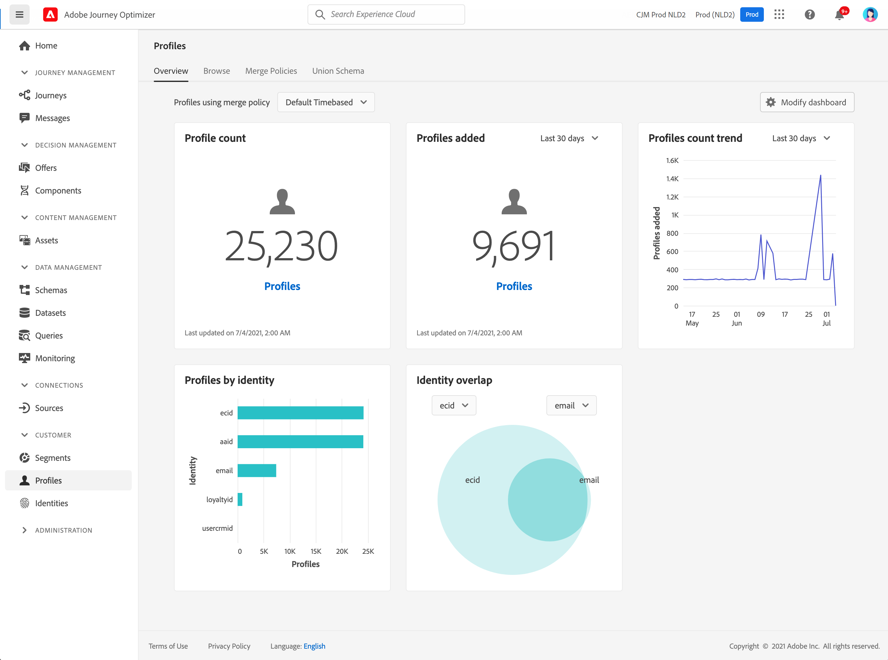

# 프로필 시작 {#profiles-gs}

[!DNL Adobe Journey Optimizer]에서 실시간 고객 프로필을 활용하여 온라인, 오프라인, CRM 및 타사 등 여러 채널의 데이터를 결합하여 각 개별 고객의 전체적인 보기를 확인할 수 있습니다. **** 프로필을 사용하면 모든 고객 상호 작용을 실행 가능하고 타임스탬프가 지정된 계정을 제공하는 통합 보기에 고객 데이터를 통합할 수 있습니다.

>[!NOTE]
>
>조직이 [!DNL Adobe Journey Optimizer]을(를) 처음 사용하고 아직 활성 프로필 데이터 세트 또는 병합 정책이 만들어지지 않은 경우 **프로필** 대시보드가 표시되지 않습니다. 대신 **개요** 탭에는 실시간 고객 프로필을 시작하는 데 도움이 되는 Adobe Experience Platform 설명서 링크가 표시됩니다.

**프로필 대시보드**&#x200B;에 액세스하여 사용하는 방법과 대시보드에 표시된 지표에 대한 자세한 정보는 [이 섹션](https://experienceleague.adobe.com/docs/experience-platform/profile/ui/user-guide.html?lang=ko){target=&quot;_blank&quot;}을 참조하십시오.

여러 소스에서 데이터 조각을 함께 가져와서 결합하여 각 개별 고객에 대한 전체 보기를 볼 수 있습니다. 이 데이터를 함께 가져올 때 병합 정책은 데이터의 우선 순위가 지정되는 방식과 통합 보기를 만들기 위해 결합할 데이터를 결정하는 데 사용되는 규칙입니다.

이 [설명서](https://experienceleague.adobe.com/docs/experience-platform/profile/merge-policies/ui-guide.html){target=&quot;_blank&quot;}에서 **병합 정책**&#x200B;에 대해 자세히 알아보십시오.

**참조 -**

* [실시간 고객 프로필 설명서](https://experienceleague.adobe.com/docs/experience-platform/query/home.html?lang=ko){target=&quot;_blank&quot;}
* [실시간 고객 프로필 개요 비디오](https://experienceleague.adobe.com/docs/experience-platform/profile/home.html){target=&quot;_blank&quot;}
