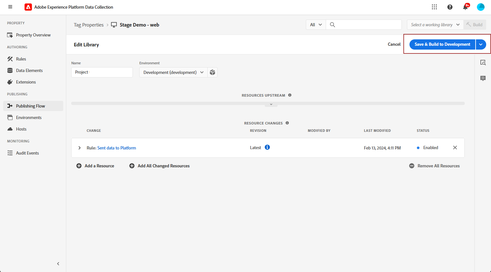

# 웹 인앱 채널 구성 {#configure-in-app-web}

## 전제 조건 {#prerequisites}

* 에 대해 최신 버전을 사용 중인지 확인하십시오. **Adobe Experience Platform 웹 SDK** 확장명.

* 설치 **Adobe Experience Platform 웹 SDK** 의 확장 **태그 속성** 및 활성화 **개인화 스토리지** 옵션을 선택합니다.

  이 구성은 클라이언트에서 이벤트 기록을 저장하는 데 필수적이며, 규칙 빌더에서 빈도 규칙을 구현하기 위한 전제 조건입니다. [자세히 알아보기](https://experienceleague.adobe.com/docs/experience-platform/tags/extensions/client/web-sdk/web-sdk-extension-configuration.html?lang=en)

  

## 플랫폼 규칙에 전송된 데이터 구성 {#configure-sent-data-trigger}

1. 액세스 권한 **Adobe Experience Platform 데이터 수집** 인스턴스로 이동하여 **태그 속성** 을(를) 사용하여 구성 **Adobe Experience Platform 웹 SDK** 확장명.

1. 다음에서 **작성** 메뉴, 선택 **규칙** 그러면 **새 규칙 만들기** 또는 **규칙 추가**.

   

1. 다음에서 **이벤트** 섹션, 클릭 **추가** 및 를 다음과 같이 구성합니다.

   * **확장**: 코어

   * **이벤트 유형**: 라이브러리가 로드되었습니다(페이지 상단).

   

1. 클릭 **변경 내용 유지** 이벤트 구성을 저장합니다.

1. 다음에서 **작업** 섹션, 클릭 **추가** 및 를 다음과 같이 구성합니다.

   * **확장**: Adobe Experience Platform 웹 SDK

   * **작업 유형**: 이벤트 보내기

   

1. 다음에서 **개인화** 의 섹션 **작업** 을(를) 입력하고 을(를) 활성화합니다. **시각적 개인화 결정 렌더링** 옵션을 선택합니다.

   

1. 다음에서 **의사 결정 컨텍스트** 섹션에서 다음을 정의합니다. **키** 및 **값** 게재할 경험을 결정하는 쌍입니다.

   

1. 저장 **작업** 을 클릭하여 구성 **변경 내용 유지**.

1. 다음 위치로 이동 **게시 플로우** 메뉴 아래의 제품에서 사용할 수 있습니다. 새로 만들기 **라이브러리** 또는 기존 항목 선택 **라이브러리** 새로 만든 항목 추가 **규칙** 할 수 있습니다. [자세히 알아보기](https://experienceleague.adobe.com/docs/experience-platform/tags/publish/libraries.html?lang=en#create-a-library)

1. 출처: **라이브러리**, 선택 **개발에 저장 및 구축**.

   

## 수동 규칙 구성 {#configure-manual-trigger}

1. 액세스 권한 **Adobe Experience Platform 데이터 수집** 인스턴스로 이동하여 **태그 속성** 을(를) 사용하여 구성 **Adobe Experience Platform 웹 SDK** 확장명.

1. 다음에서 **작성** 메뉴, 선택 **규칙** 그러면 **새 규칙 만들기** 또는 **규칙 추가**.

   

1. 다음에서 **이벤트** 섹션, 클릭 **추가** 및 를 다음과 같이 구성합니다.

   * **확장**: 코어

   * **이벤트 유형**: 클릭

   

1. 다음에서 **구성 클릭**, 다음을 정의합니다. **선택기** 평가됩니다.

   

1. 클릭 **변경 내용 유지** 을(를) 저장하려면 **이벤트** 구성.

1. 다음에서 **작업** 섹션, 클릭 **추가** 및 를 다음과 같이 구성합니다.

   * **확장**: Adobe Experience Platform 웹 SDK

   * **작업 유형**: 규칙 세트 평가

   

1. 다음에서 **규칙 세트 평가 작업** 의 섹션 **작업** 을(를) 입력하고 을(를) 활성화합니다. **시각적 개인화 결정 렌더링** 옵션을 선택합니다.

   

1. 다음에서 **의사 결정 컨텍스트** 섹션에서 다음을 정의합니다. **키** 및 **값** 게재할 경험을 결정하는 쌍입니다.

1. 액세스 **게시 플로우** 메뉴, 새로 만들기 **라이브러리** 또는 기존 항목 선택 **라이브러리** 새로 만든 항목 추가 **규칙**. [자세히 알아보기](https://experienceleague.adobe.com/docs/experience-platform/tags/publish/libraries.html?lang=en#create-a-library)

1. 출처: **라이브러리**, 선택 **개발에 저장 및 구축**.

   

