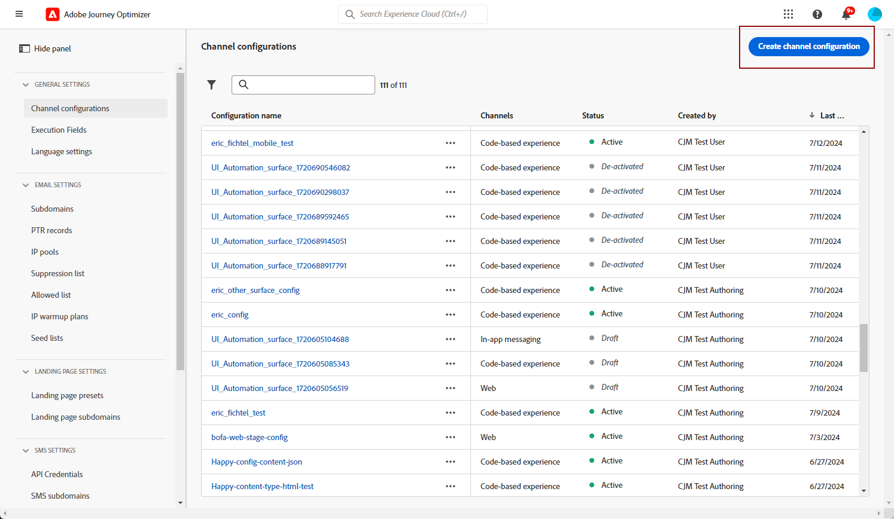

# 웹 인앱 채널 구성 {#configure-in-app-web}

## 전제 조건 {#prerequisites}

* **Adobe Experience Platform Web SDK** 확장 프로그램에 최신 버전을 사용하고 있는지 확인하십시오.

* **태그 속성**&#x200B;에 **Adobe Experience Platform Web SDK** 확장을 설치하고 **Personalization 저장소** 옵션을 사용하도록 설정합니다.

  이 구성은 클라이언트에서 이벤트 기록을 저장하는 데 필수적이며, 규칙 빌더에서 빈도 규칙을 구현하기 위한 전제 조건입니다. [자세히 알아보기](https://experienceleague.adobe.com/docs/experience-platform/tags/extensions/client/web-sdk/web-sdk-extension-configuration.html?lang=ko)

  

## 플랫폼 규칙에 전송된 데이터 구성 {#configure-sent-data-trigger}

1. **Adobe Experience Platform 데이터 수집** 인스턴스에 액세스하여 **Adobe Experience Platform Web SDK** 확장으로 구성된 **태그 속성**&#x200B;으로 이동합니다.

1. **작성** 메뉴에서 **규칙**&#x200B;을 선택한 다음 **새 규칙 만들기** 또는 **규칙 추가**&#x200B;를 선택합니다.

   

1. **이벤트** 섹션에서 **추가**&#x200B;를 클릭하고 다음과 같이 구성하십시오.

   * **확장**: 코어

   * **이벤트 유형**: 라이브러리가 로드되었습니다(페이지 상단).

   

1. 이벤트 구성을 저장하려면 **변경 내용 유지**&#x200B;를 클릭합니다.

1. **작업** 섹션에서 **추가**&#x200B;를 클릭하고 다음과 같이 구성하십시오.

   * **확장**: Adobe Experience Platform Web SDK

   * **작업 유형**: 이벤트 보내기

   

1. **Action** 형식의 **Personalization** 섹션에서 **시각적 개인화 결정 렌더링** 옵션을 사용하도록 설정하십시오.

   

1. **결정 컨텍스트** 섹션에서 전달할 경험을 결정하는 **키** 및 **값** 쌍을 정의합니다.

   

1. **변경 내용 유지**&#x200B;를 클릭하여 **작업** 구성을 저장합니다.

1. **게시 흐름** 메뉴로 이동합니다. 새 **라이브러리**&#x200B;를 만들거나 기존 **라이브러리**&#x200B;를 선택하고 새로 만든 **규칙**&#x200B;을(를) 추가하십시오. [자세히 알아보기](https://experienceleague.adobe.com/docs/experience-platform/tags/publish/libraries.html?lang=ko#create-a-library)

1. **라이브러리**&#x200B;에서 **개발에 저장 및 빌드**&#x200B;를 선택합니다.

   

## 수동 규칙 구성 {#configure-manual-trigger}

1. **Adobe Experience Platform 데이터 수집** 인스턴스에 액세스하여 **Adobe Experience Platform Web SDK** 확장으로 구성된 **태그 속성**&#x200B;으로 이동합니다.

1. **작성** 메뉴에서 **규칙**&#x200B;을 선택한 다음 **새 규칙 만들기** 또는 **규칙 추가**&#x200B;를 선택합니다.

   

1. **이벤트** 섹션에서 **추가**&#x200B;를 클릭하고 다음과 같이 구성하십시오.

   * **확장**: 코어

   * **이벤트 유형**: 클릭

   

1. **구성 클릭**&#x200B;에서 평가할 **선택기**&#x200B;을(를) 정의합니다.

   

1. **변경 내용 유지**&#x200B;를 클릭하여 **이벤트** 구성을 저장합니다.

1. **작업** 섹션에서 **추가**&#x200B;를 클릭하고 다음과 같이 구성하십시오.

   * **확장**: Adobe Experience Platform Web SDK

   * **작업 유형**: 규칙 집합 평가

   

1. **작업** 형식의 **규칙 집합 평가 작업** 섹션에서 **시각적 개인화 결정 렌더링** 옵션을 사용하도록 설정하십시오.

   

1. **결정 컨텍스트** 섹션에서 전달할 경험을 결정하는 **키** 및 **값** 쌍을 정의합니다.

1. **게시 흐름** 메뉴에 액세스하거나 새 **라이브러리**&#x200B;를 만들거나 기존 **라이브러리**&#x200B;를 선택하고 새로 만든 **규칙**&#x200B;을(를) 추가하십시오. [자세히 알아보기](https://experienceleague.adobe.com/docs/experience-platform/tags/publish/libraries.html?lang=ko#create-a-library)

1. **라이브러리**&#x200B;에서 **개발에 저장 및 빌드**&#x200B;를 선택합니다.

   

## 인앱 웹 구성 만들기 {#in-app-config}

1. **[!UICONTROL 채널]** > **[!UICONTROL 일반 설정]** > **[!UICONTROL 채널 구성]** 메뉴에 액세스한 다음 **[!UICONTROL 채널 구성 만들기]**&#x200B;를 클릭하십시오.

   

1. 구성의 이름 및 설명(선택 사항)을 입력한 다음 구성할 채널을 선택합니다.

   >[!NOTE]
   >
   > 이름은 문자(A-Z)로 시작해야 합니다. 영숫자만 포함할 수 있습니다. 밑줄 `_`, 점 `.`, 하이픈 `-`도 사용할 수 있습니다.

1. 구성에 사용자 지정 또는 핵심 데이터 사용 레이블을 할당하려면 **[!UICONTROL 액세스 관리]**&#x200B;를 선택할 수 있습니다. [OLAC(개체 수준 액세스 제어)에 대해 자세히 알아보세요](../administration/object-based-access.md).

1. 이 구성을 사용하여 동의 정책을 메시지에 연결하려면 **[!UICONTROL 마케팅 액션]**&#x200B;을 선택하십시오. 마케팅 액션과 관련된 모든 동의 정책은 고객의 선호도를 존중하기 위해 활용됩니다. [자세히 알아보기](../action/consent.md#surface-marketing-actions)

1. **인앱 메시지** 채널을 선택하십시오.

1. 앱 구성을 정의합니다. 두 가지 옵션을 사용하여 변경할 수 있습니다.

   * **[!UICONTROL 페이지 URL]**&#x200B;을 입력하여 특정 페이지에 변경 내용을 적용할 수 있습니다.

   * 동일한 패턴을 따르는 여러 URL을 타겟팅하는 규칙을 만들 수 있습니다.

+++ 페이지 일치 규칙을 작성하는 방법입니다.

      1. **[!UICONTROL 규칙과 일치하는 페이지]**&#x200B;을(를) 앱 구성으로 선택하고 **[!UICONTROL 페이지 URL]**&#x200B;을(를) 입력하십시오.

      1. **[!UICONTROL 구성 규칙 편집]** 창에서 **[!UICONTROL 도메인]** 및 **[!UICONTROL 페이지]** 필드에 대한 조건을 정의합니다.
      1. 조건 드롭다운에서 기준을 추가로 개인화합니다.

         예를 들어, 여기에서 Luma 웹 사이트의 모든 판매 제품 페이지에 표시되는 요소를 편집하려면 도메인 > 다음으로 시작 > luma 및 페이지 > 포함 > 판매 를 선택합니다.

         

      1. 필요한 경우 다른 규칙을 만들려면 **[!UICONTROL 다른 페이지 규칙 추가]**&#x200B;를 클릭합니다.

      1. **[!UICONTROL 기본 작성 및 미리 보기 URL]**&#x200B;을(를) 선택하십시오.

      1. 변경 내용을 저장합니다. 규칙이 **[!UICONTROL 캠페인 만들기]** 화면에 표시됩니다.

+++

1. 인앱 웹 구성을 제출합니다.

이제 캠페인 내에서 [웹 인앱을 만들기](../in-app/create-in-app-web.md)할 수 있습니다.
