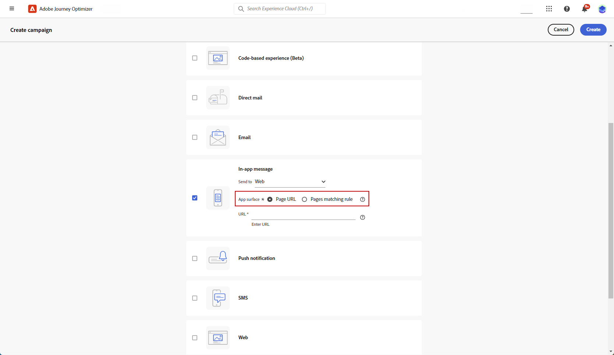

# 웹 인앱 메시지 만들기 {#create-in-app-web}

## 웹 인앱 채널 구성 {#configure-web-inapp}

웹 인앱 채널을 설정하려면 아래 단계를 따르십시오.

* 웹 인앱 메시지를 지원하도록 웹 SDK 태그 확장을 설치합니다. [자세히 알아보기](https://experienceleague.adobe.com/docs/experience-platform/tags/extensions/client/web-sdk/web-sdk-extension-configuration.html?lang=en)

* 트리거를 사용자 지정합니다. 웹 인앱 메시지는 플랫폼으로 데이터를 전송하는 트리거와 수동 트리거의 두 가지 유형을 지원합니다. [자세히 알아보기](https://experienceleague.adobe.com/docs/experience-platform/edge/personalization/ajo/web-in-app-messaging.html)

## 웹 인앱 메시지 캠페인 만들기 {#create-inapp-web-campaign}

1. **[!UICONTROL 캠페인]** 메뉴에 액세스한 다음 **[!UICONTROL 캠페인 만들기]**&#x200B;를 클릭합니다.

1. **[!UICONTROL 속성]** 섹션에서 캠페인 실행 유형(예약됨 또는 API 트리거됨)을 선택합니다. [이 페이지](../campaigns/create-campaign.md#campaigntype)에서 캠페인 유형에 대해 자세히 알아보세요.

1. **[!UICONTROL 작업]** 섹션에서 **[!UICONTROL 인앱 메시지]**&#x200B;를 선택하세요. **[!UICONTROL 전송 대상]** 드롭다운에서 웹을 선택합니다.

   

1. 앱 표면을 정의합니다. 두 가지 옵션을 사용하여 변경할 수 있습니다.

   * **[!UICONTROL 페이지 URL]**&#x200B;을 입력하여 특정 페이지에 변경 내용을 적용할 수 있습니다.

   * 동일한 패턴을 따르는 여러 URL을 타겟팅하는 규칙을 만들 수 있습니다.

+++ 페이지 일치 규칙을 작성하는 방법입니다.

      1. **[!UICONTROL 페이지 일치 규칙]**&#x200B;을(를) 앱 표면으로 선택합니다.
      1. **[!UICONTROL 규칙 만들기]**&#x200B;를 클릭합니다.

         

      1. **[!UICONTROL 표면 규칙 편집]** 창에서 **[!UICONTROL 도메인]** 및 **[!UICONTROL 페이지]** 필드에 대한 기준을 정의합니다.
      1. 조건 드롭다운에서 기준을 추가로 개인화합니다.

         예를 들어, 여기에서 Luma 웹 사이트의 모든 판매 제품 페이지에 표시되는 요소를 편집하려면 도메인 > 다음으로 시작 > luma 및 페이지 > 포함 > 판매 를 선택합니다.

         

      1. 변경 내용을 저장합니다. 규칙이 **[!UICONTROL 캠페인 만들기]** 화면에 표시됩니다.

+++

   

1. 앱 표면을 선택하고 구성한 후 **[!UICONTROL 만들기]**&#x200B;를 클릭합니다.

## 웹 인앱 메시지 캠페인 정의 {#configure-inapp}

1. **[!UICONTROL 속성]** 섹션에서 **[!UICONTROL 제목]** 및 **[!UICONTROL 설명]** 설명을 입력하십시오.

1. 인앱 메시지에 사용자 지정 또는 핵심 데이터 사용 레이블을 할당하려면 **[!UICONTROL 액세스 관리]**&#x200B;를 선택하세요. [자세히 알아보기](../administration/object-based-access.md).

1. 사용 가능한 Adobe Experience Platform 대상 목록에서 타깃팅할 대상을 정의하려면 **[!UICONTROL 대상 선택]** 단추를 클릭하십시오. [자세히 알아보기](../audience/about-audiences.md).

   

1. **[!UICONTROL ID 네임스페이스]** 필드에서 선택한 대상에서 개인을 식별하기 위해 사용할 네임스페이스를 선택합니다. [자세히 알아보기](../event/about-creating.md#select-the-namespace).

1. **[!UICONTROL 작업]** 메뉴에서 이전에 **[!UICONTROL 앱 표면]**(으)로 구성된 설정을 찾을 수 있습니다. 필요한 경우 여기에서 변경하거나 **[!UICONTROL 규칙 편집]**&#x200B;을 클릭하여 규칙을 업데이트할 수 있습니다.

1. 콘텐츠 실험 구성을 시작하고 처리를 만들어 성능을 측정하고 대상 대상에 가장 적합한 옵션을 식별하려면 **[!UICONTROL 실험 만들기]**&#x200B;를 클릭하십시오. [자세히 알아보기](../content-management/content-experiment.md)

1. 메시지를 트리거할 이벤트 및 조건을 선택하려면 **[!UICONTROL 트리거 편집]**&#x200B;을 클릭하세요. 규칙 빌더를 사용하면 충족될 경우 인앱 메시지 전송과 같은 작업 세트를 트리거하는 기준과 값을 지정할 수 있습니다.

   1. 필요한 경우 이벤트 드롭다운을 클릭하여 트리거 를 변경합니다.

      +++사용 가능한 트리거 를 참조하십시오.

      | 패키지 | 트리거 | 정의 |
      |---|---|---|
      | 플랫폼 | 플랫폼으로 데이터 전송됨 | 모바일 앱이 Adobe Experience Platform에 데이터를 보내기 위해 Edge Experience 이벤트를 발행할 때 트리거됩니다. 일반적으로 API는 AEP Edge 확장에서 [sendEvent](https://developer.adobe.com/client-sdks/documentation/edge-network/api-reference/#sendevent)를 호출합니다. |
      | 수동 | 수동 트리거 | 데이터 세트를 정의하는 상수인 키(예: 성별, 색상, 가격)와 세트에 속하는 변수인 값(예: 남성/여성, 녹색, 100)의 두 가지 연결된 데이터 요소입니다. |

+++

   1. 트리거에서 여러 이벤트 또는 조건을 고려하려면 **[!UICONTROL 조건 추가]**&#x200B;를 클릭하십시오.

   1. **[!UICONTROL 트리거]**&#x200B;를 더 추가하여 규칙을 확장하려면 **[!UICONTROL Or]** 조건을 선택하십시오.

      

   1. 사용자 지정 **[!UICONTROL 트레이트]**&#x200B;를 추가하고 규칙을 보다 세밀하게 조정하려면 **[!UICONTROL And]** 조건을 선택하십시오.

      +++사용 가능한 트레이트 를 참조하십시오.

      | 패키지 | 트레이트 | 정의 |
      |---|---|---|
      | 플랫폼 | XDM 이벤트 유형 | 지정된 이벤트 유형이 충족되면 트리거됩니다. |
      | 플랫폼 | XDM 값 | 지정된 XDM 값이 충족되면 트리거됩니다. |
+++

      

   1. 트리거를 함께 그룹화하려면 **[!UICONTROL 그룹 만들기]**&#x200B;를 클릭하세요.

1. 인앱 메시지가 활성 상태일 때 트리거 빈도를 선택합니다. 다음 옵션을 사용할 수 있습니다.

   * **[!UICONTROL 항상]**: **[!UICONTROL 모바일 앱 트리거]** 드롭다운에서 선택한 이벤트가 발생하면 항상 메시지를 표시합니다.
   * **[!UICONTROL 한 번]**: **[!UICONTROL 모바일 앱 트리거]** 드롭다운에서 선택한 이벤트가 처음 발생할 때만 이 메시지를 표시합니다.
   * **[!UICONTROL 클릭할 때까지]**: **[!UICONTROL 모바일 앱 트리거]** 드롭다운에서 선택한 이벤트가 SDK에서 &quot;클릭함&quot; 동작을 사용하여 상호 작용 이벤트를 보낼 때까지 발생할 때 이 메시지를 표시합니다.
   * **[!UICONTROL X회]**: 이 메시지를 X회 표시합니다.

1. 필요한 경우 인앱 메시지를 표시할 **[!UICONTROL 요일]** 또는 **[!UICONTROL 시간]**&#x200B;을(를) 선택하십시오.

1. 캠페인은 특정 날짜 또는 되풀이되는 빈도로 실행되도록 디자인됩니다. [이 섹션](../campaigns/create-campaign.md#schedule)에서 캠페인의 **[!UICONTROL 일정]**&#x200B;을 구성하는 방법을 알아보세요.

   

1. 이제 **[!UICONTROL 콘텐츠 편집]** 버튼을 사용하여 콘텐츠 디자인을 시작할 수 있습니다. [자세히 알아보기](design-in-app.md)

   

**관련 항목:**

* [인앱 메시지 테스트 및 보내기](send-in-app.md)
* [인앱 보고서 ](../reports/campaign-global-report.md#inapp-report)
* [인앱 구성](inapp-configuration.md)
