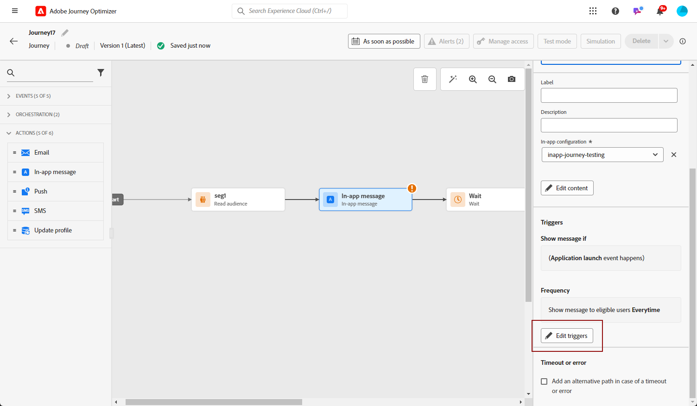
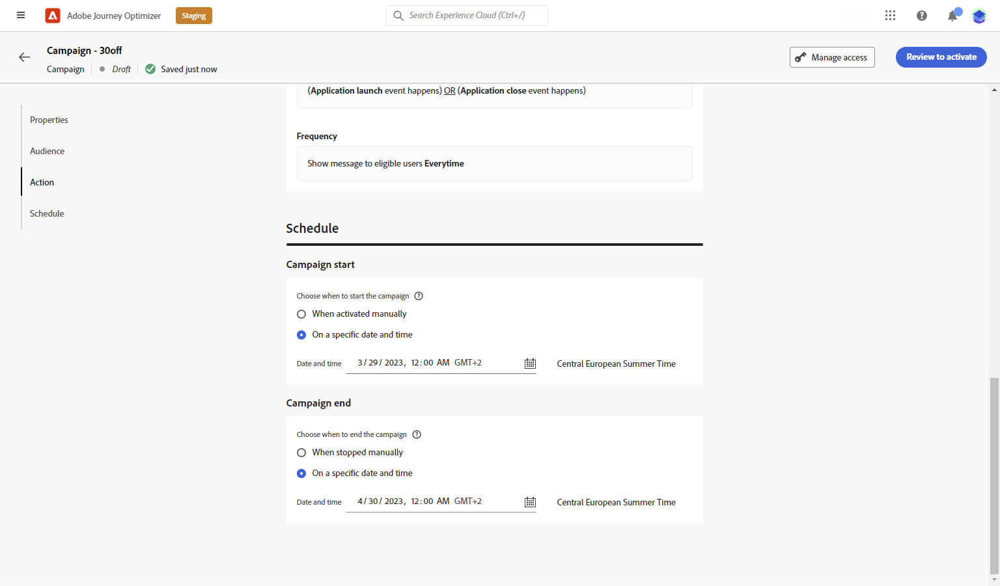

# 인앱 메시지 만들기  {#create-in-app}

캠페인 또는 여정에서 인앱 메시지를 추가할 수 있습니다. 아래 설명된 단계에 따라 두 컨텍스트에서 인앱 메시지를 만드십시오.

>[!BEGINTABS]

>[!TAB 여정에 인앱 메시지 추가]

여정에 인앱 메시지를 추가하려면 다음 단계를 수행합니다.

1. 여정을 연 다음 **[!UICONTROL 인앱]** 의 활동 **[!UICONTROL 작업]** 팔레트의 섹션입니다.

   프로필이 여정 끝에 도달하면 표시되는 모든 인앱 메시지가 자동으로 만료됩니다. 이러한 이유로, 적절한 타이밍을 보장하기 위해 인앱 활동 후에 대기 활동이 자동으로 추가됩니다.

   

1. 입력 **[!UICONTROL 레이블]** 및 **[!UICONTROL 설명]** 메시지를 표시합니다.

1. 다음을 선택합니다. [인앱 표면](inapp-configuration.md) 사용할 수 있습니다.

   

1. 이제 를 사용하여 콘텐츠 디자인을 시작할 수 있습니다. **[!UICONTROL 콘텐츠 편집]** 단추를 클릭합니다. [자세히 알아보기](design-in-app.md)

1. 클릭 **[!UICONTROL 트리거 편집]** 트리거를 구성합니다.

   

1. 인앱 메시지가 활성 상태일 때 트리거 빈도를 선택합니다.

   * **[!UICONTROL 모든 시간 표시]**: 다음에서 이벤트가 선택될 때 항상 메시지를 표시합니다. **[!UICONTROL 모바일 앱 트리거]** 드롭다운이 발생합니다.
   * **[!UICONTROL 한 번 표시]**: 다음에서 이벤트를 처음 선택할 때만 이 메시지 표시 **[!UICONTROL 모바일 앱 트리거]** 드롭다운이 발생합니다.
   * **[!UICONTROL 클릭스루까지 표시]**: 다음에서 이벤트를 선택하면 이 메시지 표시: **[!UICONTROL 모바일 앱 트리거]** 드롭다운은 SDK에서 &quot;클릭됨&quot; 동작을 사용하여 상호 작용 이벤트를 전송할 때까지 발생합니다.

1. 다음에서 **[!UICONTROL 모바일 앱 트리거]** 드롭다운에서 메시지를 트리거할 이벤트 및 기준을 선택합니다.

   1. 왼쪽 드롭다운에서 메시지를 트리거하는 데 필요한 이벤트를 선택합니다.
   1. 오른쪽 드롭다운에서 선택한 이벤트에 필요한 유효성 검사를 선택합니다.
   1. 다음을 클릭합니다. **[!UICONTROL 추가]** 트리거에서 여러 이벤트 또는 기준을 고려하도록 하려면 버튼을 클릭합니다. 그런 다음 위의 단계를 반복합니다.
   1. 이벤트가 연결되는 방식을 선택합니다(예: 선택). **[!UICONTROL 및]** 원한다면 **모두** 메시지를 표시하거나 선택하려면 트리거가 true여야 합니다. **[!UICONTROL 또는]** 메시지를 표시하려면 다음을 수행합니다. **다음 중 하나** 이 트리거를 true로 설정합니다.
   1. 클릭 **[!UICONTROL 저장]** 트리거가 구성된 경우.

   

1. 필요한 경우 추가 작업 또는 이벤트를 끌어다 놓아 여정 흐름을 완료합니다. [자세히 알아보기](../building-journeys/about-journey-activities.md)

1. 인앱 메시지가 준비되면 구성을 완료하고 여정을 게시하여 활성화합니다.

여정 구성 방법에 대한 자세한 내용은 [이 페이지](../building-journeys/journey-gs.md).

>[!TAB 캠페인에 인앱 메시지 추가]

캠페인에 인앱 메시지를 추가하려면 다음 단계를 수행합니다.

1. 액세스 **[!UICONTROL 캠페인]** 메뉴를 선택한 다음 **[!UICONTROL 캠페인 만들기]**.

1. 다음에서 **[!UICONTROL 속성]** 섹션에서 캠페인 실행 유형(예약됨 또는 API 트리거됨)이 실행되는 시점을 선택합니다. 에서 캠페인 유형에 대해 자세히 알아보기 [이 페이지](../campaigns/create-campaign.md#campaigntype).

1. 다음에서 **[!UICONTROL 작업]** 섹션에서 다음을 선택합니다. **[!UICONTROL 인앱 메시지]** 및 **[!UICONTROL 앱 표면]** 인앱 메시지에 대해 이전에 구성되었습니다. 그런 다음 을 클릭합니다. **[!UICONTROL 만들기]**.

   에서 인앱 구성에 대해 자세히 알아보기 [이 페이지](inapp-configuration.md).

   

1. 다음에서 **[!UICONTROL 속성]** 섹션에서 다음을 입력합니다. **[!UICONTROL 제목]** 및 **[!UICONTROL 설명]** 설명.

1. 인앱 메시지에 사용자 지정 또는 핵심 데이터 사용 레이블을 할당하려면 다음을 선택합니다. **[!UICONTROL 액세스 관리]**. [자세히 알아보기](../administration/object-based-access.md).

1. 다음을 클릭합니다. **[!UICONTROL 대상자 선택]** 사용 가능한 Adobe Experience Platform 대상 목록에서 타깃팅할 대상을 정의하는 단추입니다. [자세히 알아보기](../audience/about-audiences.md).

   

1. 다음에서 **[!UICONTROL ID 네임스페이스]** 필드에서 선택한 대상에서 개인을 식별하기 위해 사용할 네임스페이스를 선택합니다. [자세히 알아보기](../event/about-creating.md#select-the-namespace).

1. 클릭 **[!UICONTROL 실험 만들기]** 콘텐츠 실험 구성을 시작하고 처리를 만들어 성능을 측정하고 타겟 대상자에 대한 최상의 옵션을 식별합니다. [자세히 알아보기](../campaigns/content-experiment.md)

1. 클릭 **[!UICONTROL 트리거 편집]** 메시지를 트리거할 이벤트 및 기준을 선택합니다. 규칙 빌더를 사용하면 충족될 경우 인앱 메시지 전송과 같은 작업 세트를 트리거하는 기준과 값을 지정할 수 있습니다.

   1. 필요한 경우 이벤트 드롭다운을 클릭하여 트리거 를 변경합니다.

   1. 클릭 **[!UICONTROL 조건 추가]** 트리거에서 여러 이벤트 또는 기준을 고려하도록 하려는 경우.

   1. 다음을 선택합니다. **[!UICONTROL 또는]** 조건을 더 추가하려면 **[!UICONTROL 트리거]** 를 사용하여 규칙을 추가로 확장할 수 있습니다.

      

   1. 다음을 선택합니다. **[!UICONTROL 및]** 조건을 추가하려면 **[!UICONTROL 트레이트]** 그리고 규칙을 더 잘 세밀하게 조정하십시오.

      +++사용 가능한 트레이트 를 참조하십시오.

      | 패키지 | 트레이트 | 정의 |
      |---|---|---|
      | 장치 정보 | 통신사 이름 | 목록의 통신사 이름 중 하나가 충족되면 트리거됩니다. |
      | 장치 정보 | 장치 이름 | 장치 이름 중 하나가 충족되면 트리거됩니다. |
      | 장치 정보 | 로케일 | 목록의 언어 중 하나가 충족되면 트리거됩니다. |
      | 장치 정보 | OS 버전 | 지정된 OS 버전 중 하나가 충족되면 트리거됩니다. |
      | 장치 정보 | 이전 OS 버전 | 지정된 이전 OS 버전 중 하나가 충족되면 트리거됩니다. |
      | 장치 정보 | 실행 모드 | 실행 모드가 애플리케이션 또는 확장인 경우 트리거됩니다. |
      | 응용 프로그램 수명 주기 | 앱 ID | 지정된 앱 ID가 충족되면 트리거됩니다. |
      | 응용 프로그램 수명 주기 | 요일 | 지정된 요일이 충족될 때 트리거됩니다. |
      | 응용 프로그램 수명 주기 | 최초 사용 이후 일 | 처음 사용한 이후 지정된 일 수가 충족되면 트리거됩니다. |
      | 응용 프로그램 수명 주기 | 마지막 사용 이후 일 | 마지막 사용 이후 지정된 일 수가 충족되면 트리거됩니다. |
      | 응용 프로그램 수명 주기 | 업그레이드 이후 일 | 마지막 업그레이드 이후 지정된 일 수가 충족되면 트리거됩니다. |
      | 응용 프로그램 수명 주기 | 설치 날짜 | 지정된 설치 날짜가 충족되면 트리거됩니다. |
      | 응용 프로그램 수명 주기 | 시작 | 지정된 실행 수가 충족되면 트리거됩니다. |
      | 응용 프로그램 수명 주기 | 하루 중 시간 | 지정된 시간이 충족될 때 트리거됩니다. |
      | 장소 | 현재 POI | 고객이 지정된 관심 영역(POI)에 들어갈 때 위치 SDK에 의해 트리거됩니다. |
      | 장소 | 마지막으로 입력한 POI | 마지막으로 입력한 POI(관심 영역)에 따라 위치 SDK에 의해 트리거됩니다. |
      | 장소 | 마지막으로 종료한 POI | 고객이 마지막으로 종료한 관심 영역(POI)에 따라 위치 SDK에 의해 트리거됩니다. |

+++

      

   1. 클릭 **[!UICONTROL 그룹 만들기]** 트리거를 함께 그룹화합니다.

1. 인앱 메시지가 활성 상태일 때 트리거 빈도를 선택합니다. 다음 옵션을 사용할 수 있습니다.

   * **[!UICONTROL 항상]**: 다음에서 이벤트가 선택될 때 항상 메시지를 표시합니다. **[!UICONTROL 모바일 앱 트리거]** 드롭다운이 발생합니다.
   * **[!UICONTROL 한 번]**: 다음에서 이벤트를 처음 선택할 때만 이 메시지 표시 **[!UICONTROL 모바일 앱 트리거]** 드롭다운이 발생합니다.
   * **[!UICONTROL 클릭스루할 때까지]**: 다음에서 이벤트를 선택하면 이 메시지 표시: **[!UICONTROL 모바일 앱 트리거]** 드롭다운은 SDK에서 &quot;클릭됨&quot; 동작을 사용하여 상호 작용 이벤트를 전송할 때까지 발생합니다.
   * **[!UICONTROL X 회]**: 이 메시지를 X회 표시합니다.

1. 필요한 경우 다음 중 하나를 선택합니다 **[!UICONTROL 요일]** 또는 **[!UICONTROL 하루 중 시간]** 인앱 메시지가 표시됩니다.

1. 캠페인은 특정 날짜 또는 되풀이되는 빈도로 실행되도록 디자인됩니다. 구성 방법 알아보기 **[!UICONTROL 예약]** 의 내 캠페인 [이 섹션](../campaigns/create-campaign.md#schedule).

   

1. 이제 를 사용하여 콘텐츠 디자인을 시작할 수 있습니다. **[!UICONTROL 콘텐츠 편집]** 단추를 클릭합니다. [자세히 알아보기](design-in-app.md)

   

>[!ENDTABS]

## 방법 비디오{#video}

* 아래 비디오에서는 캠페인에서 인앱 메시지를 만들고, 구성하고, 게시하는 방법을 보여 줍니다.

  >[!VIDEO](https://video.tv.adobe.com/v/3410430?quality=12&learn=on)

* 아래 비디오에서는 A/B 테스트 인앱 메시지에 대한 콘텐츠 실험을 구성하고 분석하는 방법을 보여 줍니다.

  >[!VIDEO](https://video.tv.adobe.com/v/3419898)

**관련 항목:**

* [인앱 메시지 디자인](design-in-app.md)
* [인앱 메시지 테스트 및 보내기](send-in-app.md)
* [인앱 보고서 ](../reports/campaign-global-report.md#inapp-report)
* [인앱 구성](inapp-configuration.md)