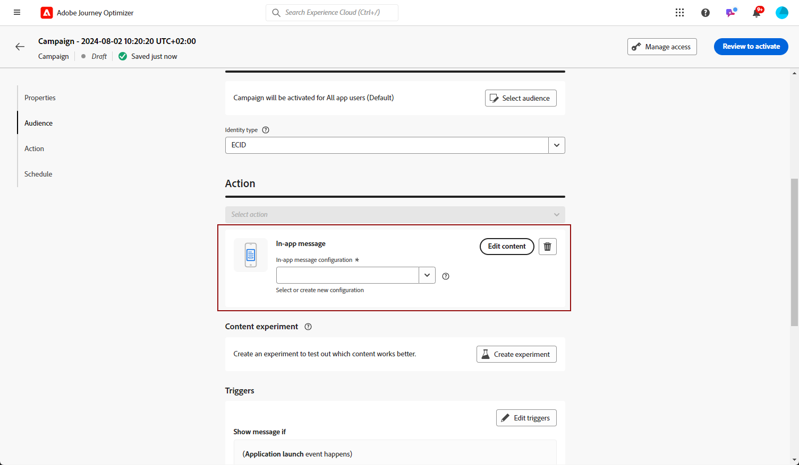
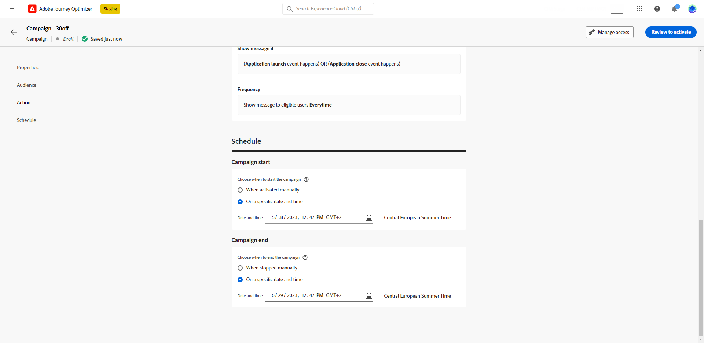

# 인앱 메시지 만들기 {#create-in-app}

## 캠페인 및 인앱 메시지 만들기{#create-in-app-in-a-campaign}

인앱 메시지를 만들려면 아래 단계를 수행하십시오.

1. 액세스 권한 **[!UICONTROL 캠페인]** 메뉴를 클릭한 다음 **[!UICONTROL 캠페인 만들기]**.

1. 에서 **[!UICONTROL 속성]** 섹션에서 캠페인을 실행할 시기를 지정합니다.

1. 에서 **[!UICONTROL 작업]** 섹션에서 **[!UICONTROL 인앱 메시지]** 그리고 **[!UICONTROL 앱 표면]** 이전에 인앱 메시지에 대해 구성했습니다. 그런 다음 **[!UICONTROL 만들기]**.

   [인앱 구성에 대해 자세히 알아보기](inapp-configuration.md).

   

1. 에서 **[!UICONTROL 속성]** 섹션에서 캠페인 편집 **[!UICONTROL 제목]** 및 **[!UICONTROL 설명]**.

1. 사용자 지정 또는 핵심 데이터 사용 레이블을 랜딩 페이지에 지정하려면 을(를) 선택합니다 **[!UICONTROL 액세스 관리]**. [자세히 알아보기](../administration/object-based-access.md).

1. 을(를) 클릭합니다. **[!UICONTROL 대상 선택]** 사용 가능한 Adobe Experience Platform 세그먼트 목록에서 타깃팅할 대상을 정의하는 단추입니다. [자세히 알아보기](../segment/about-segments.md).

   

1. 에서 **[!UICONTROL ID 네임스페이스]** 필드에서 선택한 세그먼트에서 개인을 식별하는 데 사용할 네임스페이스를 선택합니다. [자세히 알아보기](../event/about-creating.md#select-the-namespace).

1. 인앱 메시지가 활성 상태일 때 트리거의 빈도를 선택합니다.

   * **[!UICONTROL 항상 표시]**
   * **[!UICONTROL 한 번 표시]**
   * **[!UICONTROL 클릭스루할 때까지 표시]**

1. 메시지를 트리거하는 이벤트를 **[!UICONTROL 모바일 앱 트리거]**
드롭다운.

   트리거를 선택하여 인앱 메시지를 표시하는 사용자 작업을 선택합니다.

   

1. 캠페인은 특정 날짜 또는 반복 빈도에 실행되도록 디자인됩니다. 구성 방법 알아보기 **[!UICONTROL 예약]** 캠페인 [이 섹션](../campaigns/create-campaign.md#schedule).

   

1. 이제 을(를) 사용하여 콘텐츠 디자인을 시작할 수 있습니다 **[!UICONTROL 컨텐츠 편집]** 버튼을 클릭합니다.

   

## 인앱 메시지 보내기{#in-app-send}

### 장치에서 미리 보기 {#preview-device}

특정 장치에서 인앱 알림을 미리 볼 수 있습니다.

1. 클릭 **[!UICONTROL 장치에서 미리 보기]**.

   

1. 에서 **[!UICONTROL 장치에 연결]** 창 **[!UICONTROL 시작]**.

1. 에 을 입력합니다. **[!UICONTROL 기본 URL]** 응용 프로그램의 **[!UICONTROL 다음]**.

   

1. 장치로 QR 코드를 스캔하고 표시된 PIN 코드를 입력합니다.

이제 장치에서 인앱 메시지를 직접 트리거하여 실제 장치에서 메시지를 미리 보고 검토할 수 있습니다.

### 인앱 알림 검토 및 활성화{#in-app-review}

인앱 메시지가 만들어지고 해당 컨텐츠가 정의되고 개인화되면 검토하고 활성화할 수 있습니다.

이렇게 하려면 아래 단계를 수행합니다.

1. 를 사용하십시오 **[!UICONTROL 활성화 검토]** 메시지의 요약을 표시하는 단추입니다.

   요약에서는 필요한 경우 캠페인을 수정하고 매개 변수가 잘못되었거나 누락되었는지 확인할 수 있습니다.

   

1. 캠페인이 올바르게 구성되었는지 확인하고 를 클릭합니다. **[!UICONTROL 활성화]**.

이제 캠페인이 활성화됩니다. 캠페인에 구성된 인앱 알림이 즉시 또는 지정된 날짜에 전송됩니다.

전송되면 캠페인 보고서 내에서 인앱 메시지가 미치는 영향을 측정할 수 있습니다. 보고와 관련한 자세한 정보는 [이 섹션](inapp-report.md)을 참조하십시오.

**관련 항목:**

* [인앱 메시지 디자인](design-in-app.md)
* [인앱 보고서](inapp-report.md)
* [인앱 구성](inapp-configuration.md)
