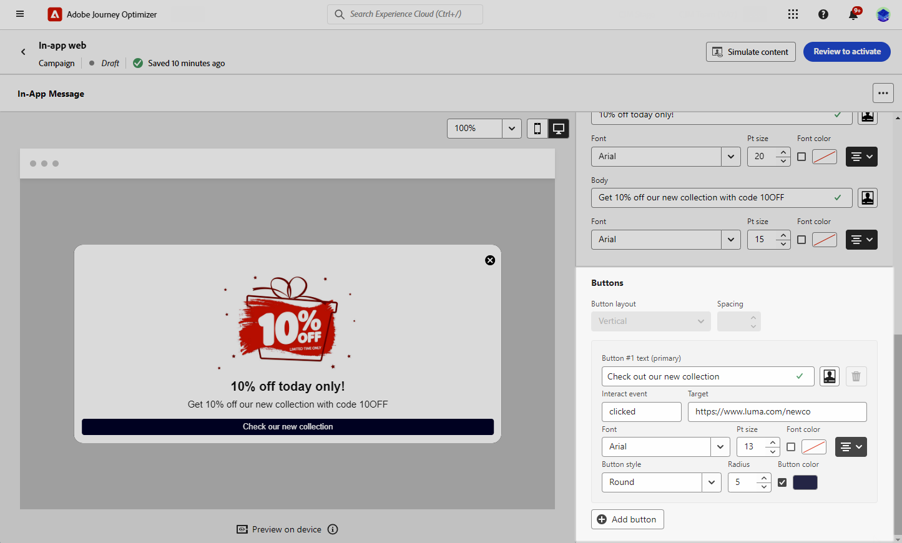

# 인앱 콘텐츠 디자인  {#design-content}

>[!CONTEXTUALHELP]
>id="ajo_campaigns_inapp_content"
>title="인앱 콘텐츠 정의"
>abstract="인앱 메시지의 콘텐츠 및 스타일을 사용자 정의합니다. 또한 미디어 및 작업 버튼을 추가하여 메시지를 더욱 매력적이고 효과적으로 만들 수 있습니다."

인앱 컨텐츠를 편집하여 경험 선택 사항을 구성할 수 있습니다.

* 다음 기간 **[!UICONTROL 캠페인]**, **[!UICONTROL 작업]** 메뉴, 메시지 콘텐츠를 구성하려면 다음을 클릭합니다. **[!UICONTROL 콘텐츠 편집]** 단추를 클릭합니다.

  

* 다음 기간 **[!UICONTROL 여정]**: 인앱의 고급 메뉴에서 **[!UICONTROL 작업]**&#x200B;를 사용하여 콘텐츠 디자인을 시작할 수 있습니다. **[!UICONTROL 콘텐츠 편집]** 단추를 클릭합니다.

  

다음 **[!UICONTROL 고급 서식]** 전환 은 경험을 사용자 지정하는 추가 옵션을 활성화합니다.

인앱 메시지가 만들어지고 콘텐츠가 정의되고 개인화되면 이를 검토하고 활성화할 수 있습니다. 그러면 캠페인 일정에 따라 알림이 전송됩니다. [이 페이지](send-in-app.md)에서 자세히 알아보십시오.

## 메시지 레이아웃 {#message-layout}

>[!CONTEXTUALHELP]
>id="ajo_campaigns_inapp_authoring_message_layout"
>title="인앱 콘텐츠 정의"
>abstract="메시지 레이아웃에서는 메시지를 구성하는 데 일반적으로 사용되는 템플릿을 제공합니다. 사용자 정의 레이아웃에서는 사용자 정의 HTML 메시지를 업로드하거나 작성할 수 있는 옵션을 제공합니다."

다음에서 **[!UICONTROL 메시지 레이아웃]** 섹션에서, 메시징 요구 사항에 따라 선택할 네 가지 레이아웃 옵션 중 하나를 선택합니다.

* **[!UICONTROL 전체 화면]**: 이 유형의 레이아웃은 대상 디바이스의 전체 화면을 포함합니다.

  미디어(이미지, 비디오), 텍스트 및 버튼 구성 요소를 지원합니다.

* **[!UICONTROL 모달]**: 이 레이아웃은 큰 경고 스타일 창에 나타나며 백그라운드에서 애플리케이션이 계속 표시됩니다.

  미디어(이미지, 비디오), 텍스트 및 버튼 구성 요소를 지원합니다.

* **[!UICONTROL 배너]**: 이 유형의 레이아웃은 기본 OS 경고 메시지로 표시됩니다.

  다음만 추가할 수 있습니다. **[!UICONTROL 머리글]** 및 a **[!UICONTROL 본문]** 메시지를 표시합니다.

* **[!UICONTROL 사용자 정의]**: 사용자 지정 메시지 모드를 사용하면 사전 구성된 HTML 메시지 중 하나를 직접 가져오고 편집할 수 있습니다.

   * 선택 **[!UICONTROL 작성]** 원시 HTML 코드를 입력하거나 붙여넣습니다.

     왼쪽 창을 사용하여 Journey Optimizer 개인화 기능을 활용합니다. 이 작업에 대한 자세한 정보는 [이 섹션](../personalization/personalize.md)을 참조하십시오.

   * 선택 **[!UICONTROL 가져오기]** HTML 내용이 포함된 HTML 또는 .zip 파일을 가져옵니다.

## 컨텐츠 탭 {#content-tab}

다음에서 **콘텐츠** 탭에서 알림의 콘텐츠와 스타일을 정의하고 개인화할 수 있습니다. **닫기** 단추를 클릭합니다. 인앱 알림에 미디어를 추가하고 이 탭에서 작업 버튼을 추가할 수도 있습니다.

### 닫기 버튼 {#close-button}

>[!CONTEXTUALHELP]
>id="ajo_campaigns_inapp_authoring_close"
>title="닫기 버튼의 스타일을 선택합니다."
>abstract="닫기 버튼 섹션에서는 메시지 닫기 버튼의 변형을 선택할 수 있는 옵션과 사용자 정의 이미지를 업로드할 수 있는 옵션이 제공됩니다."

다음을 선택합니다. **[!UICONTROL 스타일]** / **[!UICONTROL 닫기 단추]**.

사용 가능한 스타일은 다음과 같습니다.

* **[!UICONTROL 단순]**
* **[!UICONTROL 원]**
* **[!UICONTROL 사용자 정의 이미지]** 미디어 URL 또는 에셋에서 참조할 수 있습니다.

+++고급 서식이 있는 추가 옵션

다음과 같은 경우 **[!UICONTROL 고급 서식 모드]** 이(가) 켜져 있으면 **[!UICONTROL 색상]** 단추의 색상과 불투명도를 선택하는 옵션입니다.

+++

### 미디어 {#add-media}

>[!CONTEXTUALHELP]
>id="ajo_campaigns_inapp_authoring_media"
>title="인앱 메시지에 미디어를 추가하여 최종 사용자에게 매력적인 경험을 제공하십시오."
>abstract="콘텐츠에 직접 연결되는 링크를 제공하거나 자산 선택기를 사용하여 Asset Essentials에서 메시지에 추가할 미디어를 선택합니다."

다음 **[!UICONTROL 미디어]** 필드를 사용하면 인앱 메시지에 미디어를 추가하여 최종 사용자를 위한 매력적인 경험을 만들 수 있습니다.

미디어 URL을 입력하거나 **[!UICONTROL 에셋 선택]** 아이콘 : 자산 라이브러리에 저장된 자산을 인앱 메시지에 직접 추가합니다. [에셋 관리에 대해 자세히 알아보기](../content-management/assets.md).
다음을 추가할 수도 있습니다. **[!UICONTROL 대체 텍스트]** 화면 읽기 애플리케이션용.

+++고급 서식이 있는 추가 옵션

다음과 같은 경우 **[!UICONTROL 고급 서식 모드]** 이(가) 켜져 있으므로 **[!UICONTROL 최대 높이]** 및 **[!UICONTROL 최대 폭]** 미디어.

+++

### 콘텐츠 {#title-body}

>[!CONTEXTUALHELP]
>id="ajo_campaigns_inapp_authoring_content"
>title="메시지를 작성하려면 헤더 및 본문 필드에 내용을 입력합니다."
>abstract="여기에서 헤더 및 본문 텍스트를 모두 추가할 수 있습니다. 개인화 토큰을 포함하려면 개인화 대화 상자를 엽니다."

메시지를 작성하려면 **[!UICONTROL 머리글]** 및 **[!UICONTROL 본문]** 필드.

사용 **[!UICONTROL 개인화]** 아이콘을 클릭하여 개인화를 추가합니다. Adobe Journey Optimizer 표현식 편집기의 개인화에 대해 자세히 알아보기 [이 섹션에서](../personalization/personalize.md).

+++고급 서식이 있는 추가 옵션

다음과 같은 경우 **[!UICONTROL 고급 서식 모드]** 이(가) 켜져 있으므로 다음을 선택할 수 있습니다. **[!UICONTROL 머리글]** 및 **[!UICONTROL 본문]**:

* 다음 **[!UICONTROL 글꼴]**
* 다음 **[!UICONTROL Pt 크기]**
* 다음 **[!UICONTROL 글꼴 색상]**
* 다음 **[!UICONTROL 정렬]**
+++

### 버튼 {#add-buttons}

>[!CONTEXTUALHELP]
>id="ajo_campaigns_inapp_authoring_buttons"
>title="사용자가 인앱 메시지와 상호 작용할 수 있는 버튼을 추가합니다."
>abstract="이 섹션에서는 메시지에 클릭 유도 버튼을 추가할 수 있습니다. 각 버튼에 대해 사용자 정의 텍스트 및 대상을 포함할 수 있습니다."

사용자가 인앱 메시지와 상호 작용할 수 있는 버튼을 추가합니다.

버튼을 개인화하려면

1. 단추 #1 텍스트(기본) 필드를 편집합니다. 다음을 사용할 수도 있습니다 **[!UICONTROL 개인화]** 아이콘 을 클릭하여 콘텐츠 및 개인화 데이터를 정의합니다.

1. 다음 항목 선택 **[!UICONTROL 이벤트 상호 작용]** - 사용자가 버튼과 상호 작용한 후의 버튼 작업을 정의합니다.

1. 웹 URL 또는 딥 링크를 **[!UICONTROL Target]** 필드.

1. 여러 버튼을 추가하려면 **[!UICONTROL 추가 단추]**.

+++고급 서식이 있는 추가 옵션

다음과 같은 경우 **[!UICONTROL 고급 서식 모드]** 이(가) 켜져 있으므로 다음을 선택할 수 있습니다. **[!UICONTROL 단추]**:

* 다음 **[!UICONTROL 글꼴]**
* 다음 **[!UICONTROL Pt 크기]**
* 다음 **[!UICONTROL 글꼴 색상]**
* 다음 **[!UICONTROL 정렬]**
* 다음 **[!UICONTROL 단추 스타일]**
* 다음 **[!UICONTROL 반경]**
* 다음 **[!UICONTROL 단추 색상]**

+++

## 설정 탭 {#settings-tab}

다음에서 **설정** 탭에서는 메시지 레이아웃을 정의하고 인앱 메시지를 미리 볼 수 있습니다. 고급 서식 옵션에 액세스할 수도 있습니다.

### 미리 보기 {#preview-tab}

>[!CONTEXTUALHELP]
>id="ajo_campaigns_inapp_authoring_preview"
>title="인앱 메시지를 미리 볼 수 있습니다."
>abstract="메시지가 디바이스의 메시지 요약으로 전송될 때 표시되는 미리보기 이미지입니다."

>[!NOTE]
>
>미리 보기는 모바일 인앱 메시지에만 사용할 수 있습니다.

다음 **[!UICONTROL 앱 미리보기]** 인앱 메시지 뒤에 배경을 추가할 수 있습니다.

* URL 링크의 미디어.

* 에셋 라이브러리의 에셋입니다.

* 배경색입니다.

### 레이아웃 {#layout-options}

>[!CONTEXTUALHELP]
>id="ajo_campaigns_inapp_authoring_layout"
>title="인앱 메시지의 메시지 레이아웃을 정의합니다."
>abstract="이 섹션에서는 인앱 메시지에 배경을 추가할 수 있습니다. 이를 위해서는 UI 인계가 활성화되어야 합니다."

다음 **[!UICONTROL 배경 이미지]** 필드를 사용하면 인앱 메시지에 배경을 추가할 수 있습니다.

* URL 링크의 미디어.

* 배경색입니다.

### 메시지 {#message-tab}

>[!CONTEXTUALHELP]
>id="ajo_campaigns_inapp_authoring_message_advanced"
>title="메시지 고급 설정을 정의합니다."
>abstract="이 섹션에서는 특히 고급 서식을 활성화한 경우 인앱 콘텐츠의 개인화를 향상할 수 있습니다."

기본적으로 활성화되어 있는 UI 인계 옵션을 사용하면 인앱 메시지 뒤의 배경을 어둡게 하여 콘텐츠에 초점을 강조할 수 있습니다.

+++고급 서식이 있는 추가 옵션

다음과 같은 경우 **[!UICONTROL 고급 서식 모드]** 이(가) 켜져 있으면 다음 옵션을 사용하여 메시지를 추가로 개인화할 수 있습니다.

* **[!UICONTROL 제스처 사용자 지정]**: 사용자 스와이프 인터랙션을 사용자 정의할 수 있습니다. 무시 를 선택하면 사용자 지정 상호 작용 이벤트 및/또는 대상 대상을 추가할 수 있습니다.

* **[!UICONTROL UI 인계 사용자 지정]**: 배경에 표시할 색상과 해당 불투명도를 선택할 수 있습니다.

* **[!UICONTROL 크기 사용자 지정]**: 인앱 알림의 폭과 높이를 조정할 수 있습니다.

* **[!UICONTROL 위치 사용자 지정]**: 사용자 화면에서 인앱 메시지의 위치를 사용자 지정할 수 있습니다. 세로 및 가로 정렬을 변경할 수 있습니다.

* **[!UICONTROL 애니메이션 맞춤화]**: 애니메이션 표시 및 닫기 를 사용자 지정할 수 있습니다(예: 인앱 알림이 사용자 디바이스의 왼쪽이나 맨 위에 표시되는 경우).

* **[!UICONTROL 메시지 라운드 모서리]**: 를 변경하여 인앱 알림에 라운드 코너를 추가할 수 있습니다. **[!UICONTROL 모퉁이 반경]**.

+++

**관련 항목:**

* [인앱 메시지 만들기](create-in-app.md)
* [인앱 보고서 ](../reports/campaign-global-report.md#inapp-report)
* [인앱 구성](inapp-configuration.md)

## 방법 비디오{#video}

아래 비디오에서는 인앱 메시지를 작성하고 테스트하는 방법을 보여 줍니다.

>[!VIDEO](https://video.tv.adobe.com/v/3410471?quality=12&learn=on)
