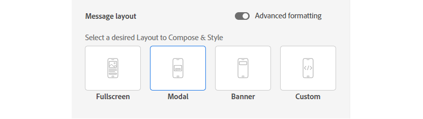
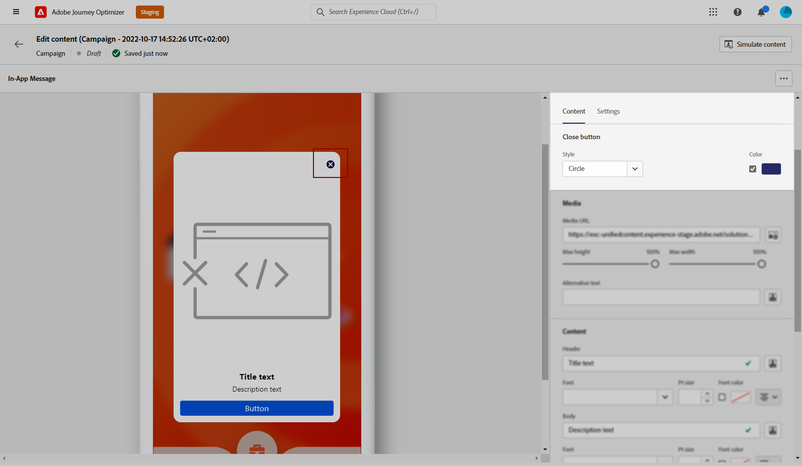

# 인앱 콘텐츠 디자인  {#design-content}

인앱 콘텐츠를 편집하여 메시지 레이아웃 및 표시, 텍스트 및 단추 옵션 등의 경험 옵션을 구성할 수 있습니다.

메시지 콘텐츠를 구성하려면 **[!UICONTROL 컨텐츠 편집]** 버튼을 클릭하고 화면의 오른쪽 섹션에 있는 옵션을 사용하여 인앱 메시지 콘텐츠를 디자인합니다.

다음 **[!UICONTROL 고급 서식]** 을 전환하면 경험을 사용자 지정할 추가 옵션이 활성화됩니다.

인앱 메시지가 만들어지고 해당 컨텐츠가 정의되고 개인화되면 검토하고 활성화할 수 있습니다. 그런 다음 캠페인 일정에 따라 알림이 전송됩니다. [이 페이지](create-in-app.md#in-app-send)에서 자세히 알아보십시오.

## 메시지 레이아웃 {#message-layout}

에서 **[!UICONTROL 메시지 레이아웃]** 섹션에서 메시징 요구 사항에 따라 선택할 수 있는 4가지 레이아웃 옵션 중 하나를 선택합니다.

* **[!UICONTROL 전체 화면]**: 이러한 유형의 레이아웃은 대상 디바이스의 전체 화면을 포함합니다.

   미디어(이미지, 비디오), 텍스트 및 버튼 구성 요소를 지원합니다.

* **[!UICONTROL 모달]**: 이 레이아웃은 큰 경고 스타일 창에 나타나며 백그라운드에서 애플리케이션이 계속 표시됩니다.

   미디어(이미지, 비디오), 텍스트 및 버튼 구성 요소를 지원합니다.

* **[!UICONTROL 배너]**: 이 유형의 레이아웃은 기본 OS 경고 메시지로 표시됩니다.

   을(를) 추가할 수만 있습니다 **[!UICONTROL Header]** 그리고 **[!UICONTROL 본문]** 메시지를 표시합니다.

* **[!UICONTROL 사용자 지정]**: 사용자 지정 메시지 모드에서는 사전 구성된 HTML 메시지 중 하나를 직접 가져오고 편집할 수 있습니다.

   * 선택 **[!UICONTROL 작성]** 원시 HTML 코드를 입력하거나 붙여넣습니다.

      왼쪽 창을 사용하여 Journey Optimizer 개인화 기능을 활용할 수 있습니다. 이 작업에 대한 자세한 정보는 [이 섹션](../personalization/personalize.md)을 참조하십시오.

   * 선택 **[!UICONTROL 가져오기]** HTML 컨텐츠가 들어 있는 HTML 또는 .zip 파일을 가져오려면 다음을 수행하십시오.

## 콘텐츠 탭 {#content-tab}

에서 **컨텐츠** 탭에서 다음을 정의하고 개인화할 수 있습니다. 알림의 내용 및 스타일 **닫기** 버튼을 클릭합니다. 인앱 알림에 미디어를 추가하고 이 탭에서 작업 버튼을 추가할 수도 있습니다.

### 닫기 단추 {#close-button}

을(를) 선택합니다 **[!UICONTROL 스타일]** 당신의 **[!UICONTROL 닫기 단추]**.

사용 가능한 스타일은 다음과 같습니다.

* **[!UICONTROL 단순]**
* **[!UICONTROL 원]**
* **[!UICONTROL 사용자 지정 이미지]** 미디어 URL 또는 자산에서 제외합니다.

+++고급 서식이 있는 추가 옵션

만약 **[!UICONTROL 고급 서식 모드]** 이 켜져 있으면 확인할 수 있습니다 **[!UICONTROL 색상]** 단추의 색상 및 불투명도를 선택하는 옵션입니다.

+++

### 미디어 {#add-media}

다음 **[!UICONTROL 미디어]** 필드를 사용하면 인앱 메시지에 미디어를 추가하여 최종 사용자를 위한 매력적인 경험을 만들 수 있습니다.

미디어 URL을 입력하거나 **[!UICONTROL 자산 선택]** 아이콘을 클릭하여 자산 라이브러리에 저장된 자산을 인앱 메시지에 직접 추가합니다. [자산 관리에 대해 자세히 알아보기](../email/assets-essentials.md).
을(를) 추가할 수도 있습니다 **[!UICONTROL 대체 텍스트]** 화면 읽기 응용 프로그램용

+++고급 서식이 있는 추가 옵션

만약 **[!UICONTROL 고급 서식 모드]** 이 켜져 있으면 사용자 정의할 수 있습니다 **[!UICONTROL 최대 높이]** 및 **[!UICONTROL 최대 너비]** 공유할 수 있습니다.

+++

### 헤더 및 본문 {#title-body}

메시지를 작성하려면 다음 위치에서 콘텐츠를 입력합니다. **[!UICONTROL Header]** 및 **[!UICONTROL 본문]** 필드.

를 사용하십시오 **[!UICONTROL 개인화]** 아이콘을 클릭하여 개인화를 추가합니다. Adobe Journey Optimizer 표현식 편집기의 개인화에 대해 자세히 알아보기 [이 섹션](../personalization/personalize.md).

+++고급 서식이 있는 추가 옵션

만약 **[!UICONTROL 고급 서식 모드]** 이(가) 켜져 있으면 **[!UICONTROL Header]** 및 **[!UICONTROL 본문]**:

* a **[!UICONTROL 글꼴]**
* a **[!UICONTROL Pt 크기]**
* a **[!UICONTROL 글꼴 색상]**
* a **[!UICONTROL 정렬]**
+++

### 버튼 {#add-buttons}

사용자가 인앱 메시지와 상호 작용할 수 있는 단추를 추가합니다.

단추를 개인화하려면:

1. 단추 #1 text (primary) 필드를 편집합니다. 를 사용할 수도 있습니다 **[!UICONTROL 개인화]** 아이콘을 사용하여 콘텐츠 및 개인화 데이터를 정의할 수 있습니다.

1. 선택 **[!UICONTROL 상호 작용 이벤트]** 사용자가 상호 작용한 후 단추의 동작을 정의합니다.

1. 에 웹 URL이나 딥 링크를 입력합니다. **[!UICONTROL Target]** 필드.

1. 단추를 여러 개 추가하려면 **[!UICONTROL 추가 단추]**.

+++고급 서식이 있는 추가 옵션

만약 **[!UICONTROL 고급 서식 모드]** 이(가) 켜져 있으면 **[!UICONTROL 단추]**:

* a **[!UICONTROL 글꼴]**
* a **[!UICONTROL Pt 크기]**
* a **[!UICONTROL 글꼴 색상]**
* a **[!UICONTROL 정렬]**
* a **[!UICONTROL 단추 스타일]**
* a **[!UICONTROL 반경]**
* a **[!UICONTROL 단추 색상]**

+++

## 설정 탭 {#settings-tab}

에서 **설정** 탭에서 메시지 레이아웃을 정의하고 인앱 메시지를 미리 볼 수 있습니다. 고급 서식 옵션에 액세스할 수도 있습니다.

### 미리 보기 {#preview-tab}

다음 **[!UICONTROL 앱 미리 보기]** 인앱 메시지 뒤에 배경을 추가할 수 있습니다.

* URL 링크의 미디어.

* 자산 라이브러리의 자산입니다.

* 배경색입니다.

### 레이아웃 {#layout-options}

다음 **[!UICONTROL 배경 이미지]** 필드를 사용하면 인앱 메시지에 배경을 추가할 수 있습니다.

* URL 링크의 미디어.

* 배경색입니다.

### 메시지 {#message-tab}

기본적으로 활성화된 UI 인계 옵션을 사용하면 인앱 메시지 배경의 배경색을 어둡게 하여 콘텐츠에 대한 포커스를 강조할 수 있습니다.

+++고급 서식이 있는 추가 옵션

만약 **[!UICONTROL 고급 서식 모드]** 이 켜져 있으면 다음 옵션을 사용하여 메시지를 추가로 개인화할 수 있습니다.

* **[!UICONTROL 제스처 사용자 지정]**: 사용자 스와이프 상호 작용이 무엇인지 사용자 지정할 수 있습니다. 해제 를 선택한 경우 사용자 지정 상호 작용 이벤트 및/또는 타겟 대상을 추가할 수 있습니다.

* **[!UICONTROL UI 인계 사용자 지정]**: 배경에 표시할 색상과 불투명도를 선택할 수 있습니다.

* **[!UICONTROL 크기 사용자 지정]**: 인앱 알림의 폭과 높이를 조정할 수 있습니다.

* **[!UICONTROL 위치 사용자 지정]**: 사용자의 화면에서 인앱 메시지 위치를 사용자 지정할 수 있습니다. 세로 및 가로 정렬을 변경할 수 있습니다.

* **[!UICONTROL 애니메이션 사용자 정의]**: 애니메이션 표시 및 해지를 사용자 지정할 수 있습니다. 예를 들어, 인앱 알림이 사용자 장치의 왼쪽 또는 맨 위에 표시되는 경우입니다.

* **[!UICONTROL 메시지 라운드 코너]**: 를 사용하면 를 변경하여 인앱 알림에 라운드 코너를 추가할 수 있습니다. **[!UICONTROL 모퉁이 반경]**.

+++

**관련 항목:**

* [인앱 메시지 만들기](create-in-app.md)
* [인앱 보고서 ](inapp-report.md)
* [인앱 구성](inapp-configuration.md)

## 방법 비디오{#video}

아래 비디오에서는 인앱 메시지를 작성 및 테스트하는 방법을 보여 줍니다.

>[!VIDEO](https://video.tv.adobe.com/v/3410471?quality=12&learn=on)
