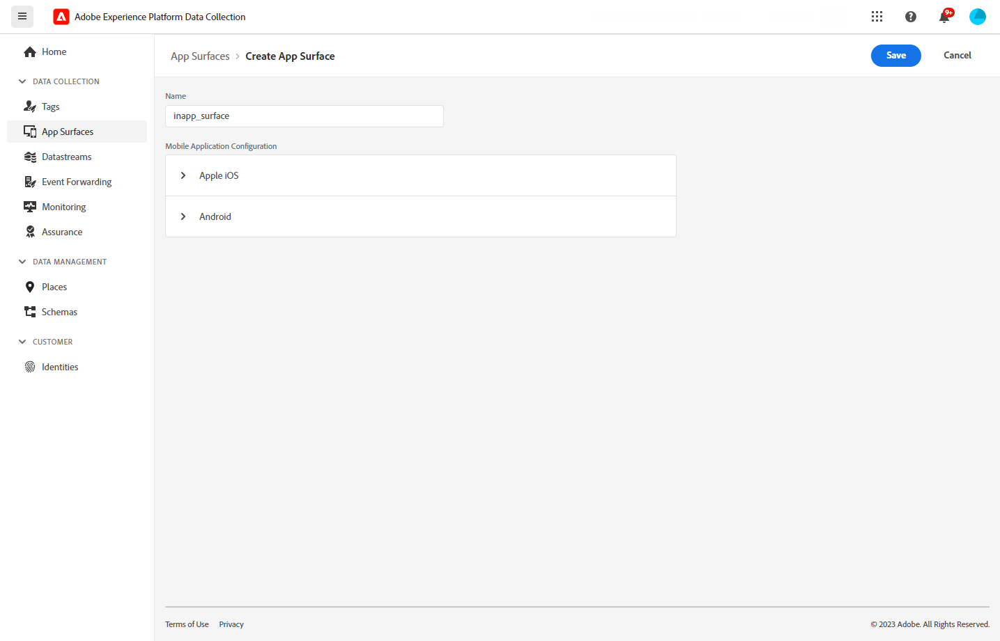

# 전제 조건 및 구성 {#inapp-configuration}

## 구성 단계 {#inapp-steps}

을 사용하여 여정 및 캠페인에서 인앱 메시지를 보내려면 [!DNL Journey Optimizer], 다음 구성 단계를 수행해야 합니다.

1. 시작하기 전에 적절한 Journey Optimizer 캠페인 권한이 있는지 확인해야 합니다. 인앱 메시지를 여정에서만 사용하려는 경우에도 마찬가지입니다. 이 경우에도 Campaign 권한이 필요합니다. [자세히 알아보기](../campaigns/get-started-with-campaigns.md#campaign-prerequisites).
에 액세스하려면 특정 권한이 부여되어야 합니다. **앱 표면** Adobe Experience Platform 메뉴 아래의 제품에서 사용할 수 있습니다. 다음에서 자세히 알아보기 [이 비디오](#video).
1. Adobe Experience Platform 데이터 수집 데이터스트림에서 Adobe Journey Optimizer을 활성화하고 다음에 설명된 대로 Adobe Experience Platform에서 기본 병합 정책을 확인합니다. [게재 사전 요구 사항](#delivery-prerequisites) 아래요.
1. 다음에 자세히 설명된 대로 Adobe Experience Platform 데이터 수집에서 앱 표면 을 만들고 구성합니다. [이 섹션](#channel-prerequisites).
1. 콘텐츠 실험을 사용하는 경우 다음에 나열된 요구 사항을 따라야 합니다. [이 섹션](#experiment-prerequisite).

권한 부여가 완료되면 첫 인앱 메시지를 만들고 구성하고 전송할 수 있습니다. 방법은 [이 섹션](create-in-app.md)을 참조하십시오.

## 게재 사전 요구 사항 {#delivery-prerequisites}

인앱 메시지를 올바르게 배달하려면 다음 설정을 정의해야 합니다.

* 다음에서 [Adobe Experience Platform 데이터 수집](https://experienceleague.adobe.com/docs/experience-platform/edge/datastreams/overview.html?lang=ko-KR){target="_blank"}와 같은 데이터 스트림이 아래에 정의되어 있는지 확인합니다. **[!UICONTROL Adobe Experience Platform]** Adobe Experience Platform Edge 및 **[!UICONTROL Adobe Journey Optimizer]** 옵션이 활성화되었습니다.

  이렇게 하면 Journey Optimizer 인바운드 이벤트가 Adobe Experience Platform Edge에서 올바르게 처리됩니다. [자세히 알아보기](https://experienceleague.adobe.com/docs/experience-platform/edge/datastreams/configure.html){target="_blank"}

  

* 위치 [Adobe Experience Platform](https://experienceleague.adobe.com/docs/experience-platform/profile/home.html?lang=ko){target="_blank"}을(를) 사용하여 기본 병합 정책이 있는지 확인합니다. **[!UICONTROL Active-On-Edge 병합 정책]** 옵션이 활성화되었습니다. 이렇게 하려면 **[!UICONTROL 고객]** > **[!UICONTROL 프로필]** > **[!UICONTROL 병합 정책]** Experience Platform 메뉴. [자세히 알아보기](https://experienceleague.adobe.com/docs/experience-platform/profile/merge-policies/ui-guide.html#configure){target="_blank"}

  이 병합 정책은 다음 사용자가 사용합니다. [!DNL Journey Optimizer] 인바운드 채널을 통해 에지에서 인바운드 캠페인을 올바르게 활성화하고 게시할 수 있습니다. [자세히 알아보기](https://experienceleague.adobe.com/docs/experience-platform/profile/merge-policies/ui-guide.html?lang=ko){target="_blank"}

  >[!NOTE]
  >
  >사용자 지정 사용 시 **[!UICONTROL 데이터 세트 환경 설정]** 병합 정책입니다. 다음을 추가하십시오. **[!UICONTROL 여정 인바운드]** 지정된 병합 정책 내의 데이터 세트입니다.

  

* Journey Optimizer 모바일 경험 전달 문제를 해결하려면 다음을 사용할 수 있습니다. **Edge 게재** 다음 범위 내 보기 **Adobe Experience Platform 보증**. 이 플러그인을 사용하면 요청 호출을 자세히 검사하고, 예상 Edge 호출이 예상대로 발생하는지 확인하고, ID 맵, 세그먼트 멤버십 및 동의 설정을 포함한 프로필 데이터를 검사할 수 있습니다. 또한 요청이 자격을 부여한 활동을 검토하고 자격이 없는 활동을 식별할 수 있습니다.

  사용 **Edge 게재** 플러그인은 인바운드 구현을 효과적으로 이해하고 문제를 해결하는 데 필요한 인사이트를 얻을 수 있도록 도와줍니다.

  [Edge 게재 보기에서 자세히 알아보기](https://experienceleague.adobe.com/en/docs/experience-platform/assurance/view/edge-delivery)

## 채널 구성 사전 요구 사항 {#channel-prerequisites}

1. 액세스 **[!UICONTROL 앱 표면]** 메뉴 및 클릭 **[!UICONTROL 앱 표면 만들기]**.

1. 에 이름 추가 **[!UICONTROL 앱 표면]**.

   

1. 다음에서 **[!UICONTROL Apple iOS]** 드롭다운에서 Apple iOS에 대한 모바일 애플리케이션을 구성합니다.

+++ 추가 정보

   1. 을(를) 입력합니다. **[!UICONTROL iOS 번들 ID]**. 을(를) 참조하십시오 [Apple 설명서](https://developer.apple.com/documentation/appstoreconnectapi/bundle_ids) 에 대한 추가 정보를 위해 **번들 ID**.

   1. (선택 사항) **[!UICONTROL 샌드박스]** 푸시 알림을 보낼 위치. 특정 샌드박스를 선택하려면 필요한 액세스 권한이 필요합니다.

      샌드박스 관리에 대한 자세한 내용은 다음을 참조하십시오. [이 페이지](../administration/sandboxes.md#assign-sandboxes).

   1. 활성화 **[!UICONTROL 푸시 자격 증명]** 필요한 경우 .p8 인증 키 파일을 끌어서 놓는 옵션입니다.

      또한 을 활성화할 수 있습니다. **[!UICONTROL 푸시 자격 증명 수동 입력]** APNs 인증 키를 직접 복사하여 붙여넣는 옵션.

   1. 다음을 입력하십시오. **[!UICONTROL 키 ID]** 및 **[!UICONTROL 팀 ID]**.

      

+++

1. 다음에서 **[!UICONTROL Android]** 드롭다운에서 Android용 모바일 애플리케이션을 구성합니다.

+++ 추가 정보

   1. 을(를) 입력합니다. **[!UICONTROL Android 패키지 이름]**. 을(를) 참조하십시오 [Android 설명서](https://support.google.com/admob/answer/9972781?hl=en#:~:text=The%20package%20name%20of%20an,supported%20third%2Dparty%20Android%20stores) 에 대한 추가 정보를 위해 **패키지 이름**.

   1. (선택 사항) **[!UICONTROL 샌드박스]** 푸시 알림을 보낼 위치. 특정 샌드박스를 선택하려면 필요한 액세스 권한이 필요합니다.

      샌드박스 관리에 대한 자세한 내용은 다음을 참조하십시오. [이 페이지](../administration/sandboxes.md#assign-sandboxes).

   1. 활성화 **[!UICONTROL 푸시 자격 증명]** 필요한 경우 .json 개인 키 파일을 드래그 앤 드롭하는 옵션입니다.

      또한 을 활성화할 수 있습니다. **[!UICONTROL 푸시 자격 증명 수동 입력]** 옵션을 사용하여 FCM 개인 키를 직접 복사하여 붙여넣을 수 있습니다.

      

1. 클릭 **[!UICONTROL 저장]** 의 구성을 완료했을 때 **[!UICONTROL 앱 표면]**.

   

   사용자 **[!UICONTROL 앱 표면]** 이제 인앱 메시지로 새 캠페인을 만들 때 사용할 수 있습니다. [자세히 알아보기](create-in-app.md)

1. 앱 표면을 만든 후 이제 모바일 속성을 만들어야 합니다.

   을(를) 참조하십시오 [이 페이지](https://experienceleague.adobe.com/docs/experience-platform/tags/admin/companies-and-properties.html#for-mobile) 자세한 절차.

   

1. 새로 만든 속성의 확장 메뉴에서 다음 확장을 설치합니다.

   * Adobe Experience Platform 에지 네트워크
   * Adobe Journey Optimizer
   * AEP 보증
   * 동의
   * 신원
   * 모바일 코어
   * 프로필

   을(를) 참조하십시오 [이 페이지](https://experienceleague.adobe.com/docs/experience-platform/tags/ui/extensions/overview.html#add-a-new-extension) 자세한 절차.

   

이제 인앱 채널이 구성되었습니다. 사용자에게 인앱 메시지를 보낼 수 있습니다.

## 콘텐츠 실험 사전 요구 사항 {#experiment-prerequisites}

인앱 채널에 대해 콘텐츠 실험을 활성화하려면 다음을 확인해야 합니다. [데이터 세트](../data/get-started-datasets.md) 인앱 구현에 사용됨 [데이터스트림](https://experienceleague.adobe.com/docs/experience-platform/datastreams/overview.html){target="_blank"} 는 보고 구성에도 포함됩니다.

즉, 실험 보고를 구성할 때 웹 데이터 스트림에 없는 데이터 세트를 추가하면 웹 데이터가 콘텐츠 실험 보고서에 표시되지 않습니다.

에서 콘텐츠 실험 보고를 위한 데이터 세트를 추가하는 방법을 알아봅니다. [이 섹션](../content-management/reporting-configuration.md#add-datasets).

>[!NOTE]
>
>데이터 집합은 [!DNL Journey Optimizer] 보고 시스템이며, 데이터 수집이나 데이터 수집에는 영향을 주지 않습니다.

다음과 같은 경우 **아님** 다음 사전 정의 사용 [필드 그룹](https://experienceleague.adobe.com/docs/experience-platform/xdm/tutorials/create-schema-ui.html?lang=ko#field-group){target="_blank"} 데이터 세트 스키마의 경우: `AEP Web SDK ExperienceEvent` 및 `Consumer Experience Event` (에 정의됨) [이 페이지](https://experienceleague.adobe.com/docs/platform-learn/implement-web-sdk/initial-configuration/configure-schemas.html#add-field-groups){target="_blank"}) 다음 필드 그룹을 추가해야 합니다. `Experience Event - Proposition Interactions`, `Application Details`, `Commerce Details`, 및 `Web Details`. 이러한 요구 사항은 [!DNL Journey Optimizer] 콘텐츠 실험 보고는 각 프로필이 참여하고 있는 실험 및 처리를 추적합니다.

>[!NOTE]
>
>이러한 필드 그룹을 추가해도 일반 데이터 수집에는 영향을 주지 않습니다. 실험이 실행 중인 페이지에만 추가되며 다른 모든 추적은 그대로 유지됩니다.

## 방법 비디오{#video}

아래 비디오에서는 를 할당하는 방법을 보여 줍니다. **앱 구성 관리** 앱 표면 메뉴에 대한 액세스 권한.

>[!VIDEO](https://video.tv.adobe.com/v/3421607)

**관련 항목:**

* [인앱 메시지 만들기 ](create-in-app.md)
* [캠페인 만들기](../campaigns/create-campaign.md)
* [인앱 메시지 디자인](design-in-app.md)
* [인앱 보고서 ](../reports/campaign-global-report.md#inapp-report)

