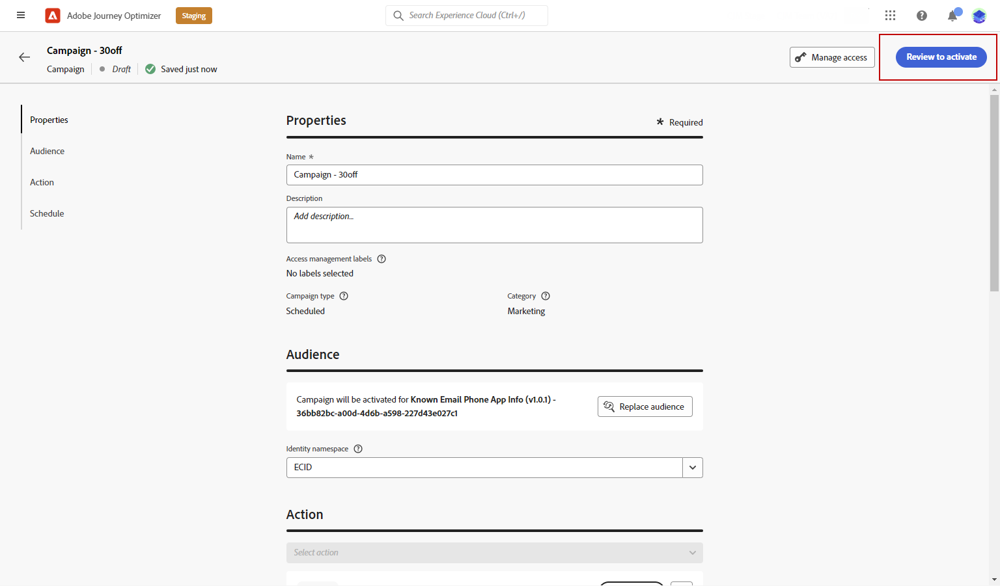

# 인앱 알림 테스트하고 보내기 {#create-in-app}

## 장치에서 미리 보기 {#preview-device}

모든 사용자가 앱을 사용하기 전에 인앱 알림을 살짝 엿보려면 특정 장치에서 미리 볼 수 있습니다. 이 기능을 사용하면 선택한 장치에서 알림이 표시되고 작동하는지 확인할 수 있으므로 대상을 위한 더 나은 사용자 경험을 제공할 수 있습니다.

이렇게 하려면 아래 단계를 수행합니다.

1. 클릭 **[!UICONTROL 장치에서 미리 보기]**.

   

1. 에서 **[!UICONTROL 장치에 연결]** 창 **[!UICONTROL 시작]**.

1. 에 을 입력합니다. **[!UICONTROL 기본 URL]** 응용 프로그램의 **[!UICONTROL 다음]**.

   

1. 장치로 QR 코드를 스캔하고 표시된 PIN 코드를 입력합니다.

이제 장치에서 인앱 메시지를 직접 트리거하여 실제 장치에서 메시지를 미리 보고 검토할 수 있습니다.

## 인앱 알림 검토 및 활성화{#in-app-review}

인앱 메시지가 만들어지고 해당 컨텐츠가 정의되고 개인화되면 검토하고 활성화할 수 있습니다.

이렇게 하려면 아래 단계를 수행합니다.

1. 를 사용하십시오 **[!UICONTROL 활성화 검토]** 메시지의 요약을 표시하는 단추입니다.

   요약에서는 필요한 경우 캠페인을 수정하고 매개 변수가 잘못되었거나 누락되었는지 확인할 수 있습니다.

   

1. 캠페인이 올바르게 구성되었는지 확인하고 를 클릭합니다. **[!UICONTROL 활성화]**.

이제 캠페인이 활성화됩니다. 캠페인에 구성된 인앱 알림이 즉시 또는 지정된 날짜에 전송됩니다.

전송되면 캠페인 또는 여정 보고서 내에서 인앱 메시지가 미치는 영향을 측정할 수 있습니다. 보고와 관련한 자세한 정보는 [이 섹션](../reports/campaign-global-report.md#inapp-report)을 참조하십시오.

**관련 항목:**

* [인앱 메시지 만들기 ](create-in-app.md)
* [인앱 메시지 디자인](design-in-app.md)
* [인앱 보고서 ](../reports/campaign-global-report.md#inapp-report)
* [인앱 구성](inapp-configuration.md)
