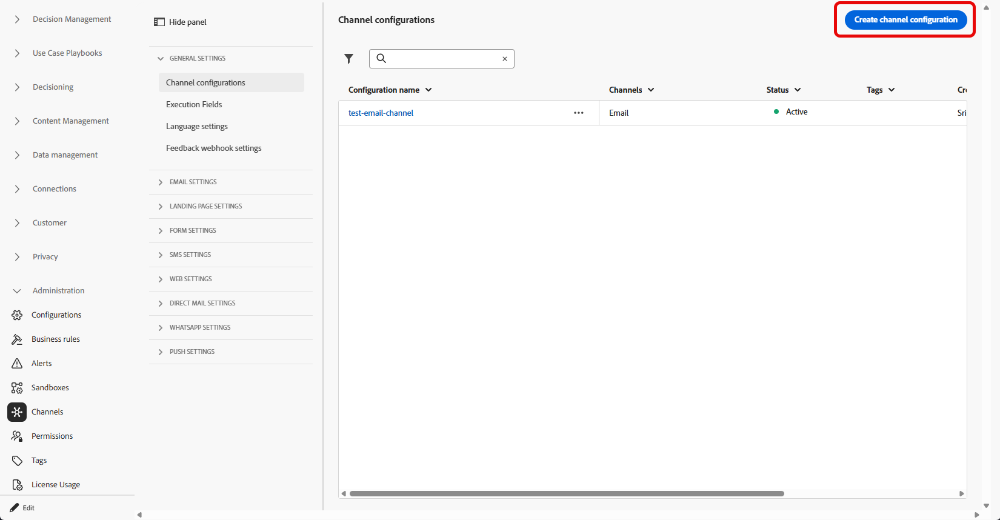

# 받은 편지함 구성 {#inbox-configuration}

받은 편지함을 통해 콘텐츠 카드 경험을 전달하려면 **채널 구성**&#x200B;에서 **[!UICONTROL 받은 편지함]** 채널 구성을 정의해야 합니다. 이 구성은 표면을 동의, 선택적 액세스 레이블 및 웹 또는 iOS 또는 Android 앱에서 경험이 표시되는 위치에 연결합니다. 구성을 만들려면 아래 단계를 수행하십시오.

1. **[!UICONTROL 채널]** > **[!UICONTROL 일반 설정]** > **[!UICONTROL 채널 구성]** 메뉴에 액세스한 다음 **[!UICONTROL 채널 구성 만들기]**&#x200B;를 클릭하십시오.

   

1. 구성의 이름 및 설명(선택 사항)을 입력합니다.

   >[!NOTE]
   >
   > 이름은 문자(A-Z)로 시작해야 합니다. 영숫자만 포함할 수 있습니다. 밑줄 `_`, 점 `.`, 하이픈 `-`도 사용할 수 있습니다.

1. 구성에 사용자 지정 또는 핵심 데이터 사용 레이블을 할당하려면 **[!UICONTROL 액세스 관리]**&#x200B;를 선택할 수 있습니다. [OLAC(개체 수준 액세스 제어)에 대해 자세히 알아보세요](../administration/object-based-access.md).

1. **[!UICONTROL 받은 편지함]** 채널을 선택하십시오.

   

1. 이 구성을 사용하여 동의 정책을 메시지에 연결하려면 **[!UICONTROL 마케팅 액션]**&#x200B;을 선택하십시오. 마케팅 액션과 관련된 모든 동의 정책은 고객의 선호도를 존중하기 위해 활용됩니다. [자세히 알아보기](../action/consent.md#surface-marketing-actions)

1. 받은 편지함 경험을 적용할 플랫폼을 선택합니다.

   

1. 웹:

   * **[!UICONTROL 페이지 URL]**&#x200B;에서 받은 편지함이 표시될 페이지의 URL을 입력하거나 선택하십시오. 경험이 한 페이지로 제한된 경우 사용합니다.

   * **[!UICONTROL 페이지의 위치]**&#x200B;에서 받은 편지함 표면에 사이트가 사용하는 영역 또는 식별자와 같은 페이지 내 배치를 정의합니다. [자세히 알아보기](../web/web-configuration.md)

     

1. iOS 및 Android의 경우

   * 구성이 올바른 iOS 또는 Android 빌드에 적용되도록 **[!UICONTROL 앱 ID]**&#x200B;에서 앱의 식별자를 입력하거나 선택하십시오.

   * **[!UICONTROL 앱 내부의 위치 또는 경로]**&#x200B;에서 사용자가 받은 편지함을 열 화면, 경로 또는 컨테이너를 지정합니다.

1. 변경 사항을 제출합니다.

이제 받은 편지함 경험을 만들 때 구성을 선택할 수 있습니다.

➡️ [이 페이지에 설명된 단계를 따릅니다](inbox-create.md)
