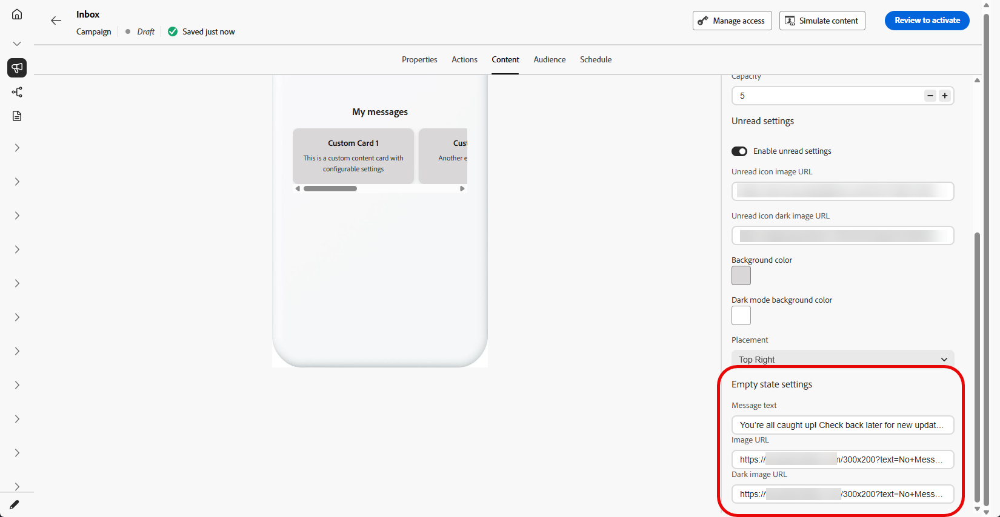

# 받은 편지함 디자인 {#inbox-design}

받은 편지함 디자인은 각 메시지가 받은 편지함 표면 내의 타겟팅된 프로필에 렌더링되는 방식을 제어합니다. 이 구성은 받은 편지함 템플릿, 목록 및 확장된 프레젠테이션, 새 메시지와 이미 본 메시지를 구분하는 읽기 상태 표시기를 포함합니다.

받은 편지함 캠페인을 만드는 전체 절차는 [받은 편지함 만들기](inbox-create.md)를 참조하세요.

1. 만든 **[!UICONTROL 받은 편지함 캠페인]**&#x200B;의 [콘텐츠](inbox-create.md) 탭을 엽니다.

1. **[!UICONTROL 컨테이너 제목]**&#x200B;을 설정합니다.

1. 받은 편지함 레이아웃 선택:

   * **[!UICONTROL 목록 레이아웃]**: 프로필에서 메시지를 스크롤하여 한 번에 하나씩 열 수 있도록 각 콘텐츠 카드를 세로 목록으로 표시합니다.

   * **[!UICONTROL 캐러셀 레이아웃]**: 프로필이 받은 편지함 표면을 벗어나지 않고 하이라이트를 통해 옆으로 스와이프하거나 이동할 수 있도록 수평 캐러셀에 카드를 표시합니다.

   

1. 받은 편지함 **용량**&#x200B;을(를) 지정하십시오. 받은 편지함에 보관하도록 구성된 최대 콘텐츠 카드 수입니다.

1. **[!UICONTROL 읽지 않은 설정]**&#x200B;을(를) 전환하고 읽지 않은 메시지를 표시하는 방법을 구성하십시오.

   * **[!UICONTROL 읽지 않은 아이콘 이미지 URL]**: 읽지 않은 항목 옆이나 위에 표시된 이미지를 제공합니다. 앱 또는 사이트에서 어두운 테마를 사용할 때 아이콘이 표시되고 브랜드에 표시되도록 어두운 모드 URL을 추가하십시오.

   * **[!UICONTROL 배경색]**: 읽지 않은 처리가 브랜드와 일치하고 받은 편지함 배경에 대해 읽을 수 있도록 밝은 색 및 필요한 경우 어두운 모드의 색을 설정합니다.

   * **[!UICONTROL 배치]**: 드롭다운을 사용하여 읽지 않은 아이콘이 표시되는 위치를 선택하여 레이아웃에 맞춥니다.

   

1. **[!UICONTROL Empty 상태]**&#x200B;에서 표시할 메시지가 없을 때 프로필에 표시되는 내용을 구성합니다.

   * **[!UICONTROL 메시지 텍스트]**: 받은 편지함을 설명하는 짧은 텍스트가 비어 있거나 다음 단계를 제안합니다.

   * **[!UICONTROL 이미지 URL]**: 빈 영역을 표시하는 대신 빈 상태를 강화하는 라이트 모드의 선택적 일러스트레이션 또는 그래픽입니다.

   * **[!UICONTROL 어두운 이미지 URL]**: 어두운 모드로 튜닝된 선택적 이미지이므로 낮은 대비나 거친 가장자리 없이 빈 상태가 올바르게 보입니다.

   

1. 미리 보기 패널을 열고 빈 받은 편지함이 표시되는 방식을 검토하려면 을 클릭하세요.

   

1. **[!UICONTROL 데이터]** 섹션에서 **[!UICONTROL 메타 추가]**&#x200B;를 클릭하여 사용자 지정 키/값 쌍을 페이로드에 추가합니다.

1. 받은 편지함의 다크 모드 미리 보기를 열고 어두운 테마 색상과 이미지를 확인하려면  아이콘을 클릭하세요.

   

준비가 되면 설정을 검토하고 받은 편지함을 활성화합니다. 활성화한 후에는 [콘텐츠 카드](../content-card/create-content-card.md)와 함께 사용할 수 있습니다.

