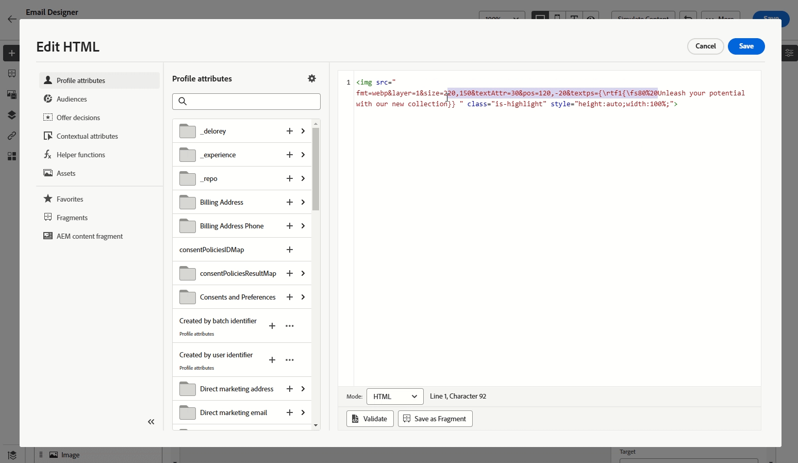
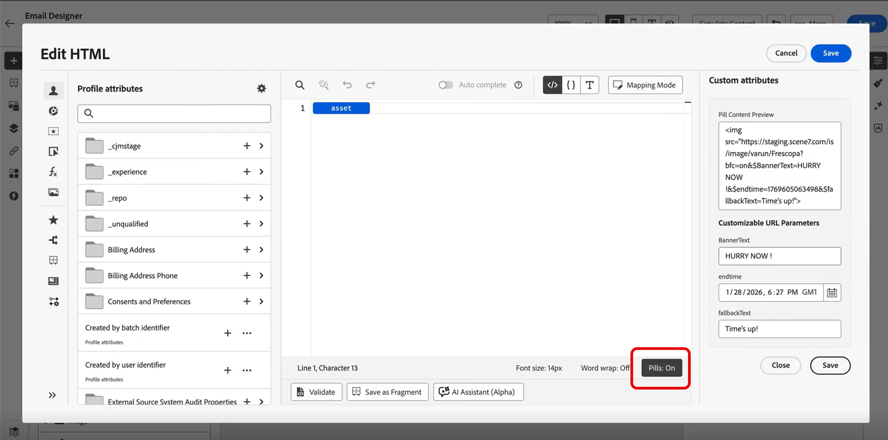

# Dynamic Media 작업 {#aem-dynamic}

>[!BEGINSHADEBOX]

**이 페이지에서:** 텍스트 오버레이 및 다이내믹 미디어 템플릿을 포함하여 Adobe Experience Manager 다이내믹 미디어를 Journey Optimizer 콘텐츠 내에 삽입, 조정 및 개인화하는 방법을 알아봅니다.

>[!ENDSHADEBOX]

## Dynamic Media 시작 {#gs-aem-dynamic}

이제 에셋 선택기가 Dynamic Media를 지원하므로 Journey Optimizer 내에서 승인된 Dynamic Media 렌디션을 원활하게 선택하고 사용할 수 있습니다. Adobe Experience Manager의 자산에 대한 변경 사항은 즉시 Journey Optimizer 콘텐츠에 반영되므로 수동으로 업데이트하지 않아도 최신 버전을 항상 사용할 수 있습니다.

이 통합은 Dynamic Media Manager as a Cloud Service을 사용하는 고객에게만 제공됩니다.

Adobe Experience Manager as a Cloud Service의 Dynamic Media에 대한 자세한 내용은 [Experience Manager 설명서](https://experienceleague.adobe.com/en/docs/experience-manager-cloud-service/content/assets/dynamicmedia/dynamic-media){target="_blank"}를 참조하세요.

>[!AVAILABILITY]
>
>의료 고객의 경우 Journey Optimizer Healthcare Shield 및 Adobe Experience Manager Extended Security for Healthcare 추가 기능 오퍼링의 라이선스가 있을 때만 통합이 가능합니다.

## 고려 사항

* Adobe Experience Manager as a Cloud Service에서 OpenAPI가 포함된 Dynamic Media가 활성화되어 있는지 확인합니다. [자세히 알아보기](https://experienceleague.adobe.com/en/docs/experience-manager-cloud-service/content/assets/dynamicmedia/dynamic-media-open-apis/dynamic-media-open-apis-overview#enable-dynamic-media-open-apis){target="_blank"}

* Adobe Journey Optimizer과 Dynamic Media 통합은 Dynamic Media [Scene7 모드](https://experienceleague.adobe.com/en/docs/experience-manager-65/content/assets/dynamic/config-dms7){target="_blank"} 및 [OpenAPI를 통해](https://experienceleague.adobe.com/en/docs/experience-manager-cloud-service/content/assets/dynamicmedia/dynamic-media-open-apis/dynamic-media-open-apis-overview){target="_blank"}할 수 있습니다.

* Dynamic Media Scene7 자산의 경우 Journey Optimizer은 URL의 시작 부분에 기본 수정자(`bfc=off&fmt=png-alpha`)를 추가합니다. 사전 설정에서 `fmt` 또는 `bfc`도 설정하는 경우 Scene7에서 반복된 매개 변수의 마지막 항목을 사용하므로 이 설정이 우선합니다. 예기치 않은 결과가 발생하지 않도록 하려면 사전 설정에서 `fmt`/`bfc`을(를) 제거하거나 URL의 기본 수정자 앞으로 이동하십시오.

* 자산 선택기가 `/images` 기반 URL 형식을 반환합니다. GIF 또는 SVG과 같은 원래 형식의 자산을 전달하려면 대신 `/content` 경로를 사용하도록 URL을 수동으로 업데이트해야 합니다. 자세한 내용은 [Dynamic Media 모범 사례 설명서](https://experienceleague.adobe.com/en/docs/experience-manager-cloud-service/content/assets/dynamicmedia/dm-journey/dm-best-practices#deliver-gif-images){target="_blank"}를 참조하세요.

## Dynamic Media 추가 및 관리 {#dynamic-media}

Adobe Experience Manager as a Cloud Service의 Dynamic Media를 Journey Optimizer 콘텐츠에 직접 삽입하여 화면 또는 브라우저에 맞게 콘텐츠를 개선하고 최적화합니다.  그런 다음 필요에 따라 크기를 조정하고, 자르고, 강화하고, 기타 조정할 수 있습니다.

<!--
>[!AVAILABILITY]
>
>Older versions of Outlook (including 2016) do not support rendering of content with Dynamic Media.  We are actively working on a permanent fix to enhance compatibility. In the meantime, apply the following guidelines:
>
>* For Dynamic Media Scene7 URLs: Append `?bfc=on` to the image URL. This enables automatic format negotiation, ensuring the most compatible image format is delivered based on the client's capabilities.
>
>* For Dynamic Media with Open API: Use the `.avif` format. This format includes built-in fallback mechanisms to deliver a compatible format when necessary.
>
-->

HTML 콘텐츠에 Adobe Experience Manager 에셋을 추가하려면 다음 단계를 따르십시오.

1. **[!UICONTROL HTML 구성 요소]**&#x200B;를 콘텐츠로 끌어서 놓습니다.

1. **[!UICONTROL 소스 코드 표시]**&#x200B;를 선택합니다.

   

1. **[!UICONTROL HTML 편집]** 메뉴에서 **[!UICONTROL Assets]**(으)로 이동한 다음 **[!UICONTROL 자산 선택기 열기]**&#x200B;를 클릭합니다.

   또는 에셋의 URL을 복사하여 붙여넣을 수 있습니다.

   

1. AEM 에셋을 검색하고 콘텐츠에 추가하려는 에셋을 선택합니다.

1. 이미지 매개 변수(예: 높이, 너비, 회전, 뒤집기, 밝기, 색조 등) 조정 필요한 경우 에셋 요구 사항과 일치시킵니다.

   URL에 추가할 수 있는 이미지 매개 변수의 전체 목록을 보려면 [Experience Manager 설명서](https://experienceleague.adobe.com/en/docs/dynamic-media-developer-resources/image-serving-api/image-serving-api/http-protocol-reference/command-reference/c-command-reference){target="_blank"}를 참조하세요.

   

1. **[!UICONTROL 저장]**&#x200B;을 클릭합니다.

이제 콘텐츠에 Dynamic Media가 포함됩니다. Experience Manager에서 수행하는 모든 업데이트는 Journey Optimizer에 자동으로 표시됩니다.

## 텍스트 오버레이 개인화 {#text-overlay}

기존 텍스트 오버레이를 원하는 새 텍스트로 대체하여 모든 다이내믹 미디어를 손쉽게 맞춤화할 수 있으므로 원활한 업데이트 및 개인화가 가능합니다.

예를 들어 실험 기능을 사용하면 각 처리에 대해 다른 텍스트로 대체하여 기존 텍스트 오버레이를 업데이트하여 메시지를 열 때 각 프로필에 대해 사용자 지정되도록 할 수 있습니다.

>[!AVAILABILITY]
>
>**텍스트 오버레이 개인화**&#x200B;는 Dynamic Media [Scene7 모드](https://experienceleague.adobe.com/en/docs/experience-manager-65/content/assets/dynamic/config-dms7){target="_blank"}에서만 사용할 수 있습니다. 의료 고객은 Scene7 모드에 액세스할 수 없으므로 콘텐츠는 이미지의 Journey Optimizer 바이너리 사본을 사용하여 렌더링됩니다. 예외는 Adobe 담당자에게 문의하십시오.

텍스트 오버레이를 개인화하려면 다음 단계를 수행합니다.

1. **[!UICONTROL HTML 구성 요소]**&#x200B;를 콘텐츠로 끌어서 놓습니다.

1. **[!UICONTROL 소스 코드 표시]**&#x200B;를 선택합니다.

1. **[!UICONTROL HTML 편집]** 메뉴에서 **[!UICONTROL Assets]**&#x200B;에 액세스한 다음 **[!UICONTROL 자산 선택기 열기]**&#x200B;에 액세스합니다.

   에셋 URL을 복사하여 붙여넣을 수도 있습니다.

1. AEM 에셋을 탐색하고 콘텐츠에 추가할 에셋을 선택합니다.

1. 오버레이를 원하는 텍스트로 바꿉니다.

   

1. 이미지 매개 변수를 업데이트합니다.

   * **레이어**: 텍스트를 배치할 기본 요소를 입력합니다.
   * **크기**: 텍스트 블록의 크기를 업데이트합니다.
   * **TextAttr**: 텍스트 글꼴 크기를 조정합니다.
   * **게시물**: 이미지에서 텍스트 위치를 설정합니다.

   >[!WARNING]
   >
   >Dynamic Media를 업데이트하려면 레이어 매개 변수가 필요합니다.

   

1. **[!UICONTROL 저장]**&#x200B;을 클릭합니다.

이제 컨텐츠에 업데이트된 텍스트 오버레이가 포함됩니다.

## Dynamic Media 템플릿 추가 및 관리 {#dynamic-media-template}

Journey Optimizer에서 Dynamic Media 템플릿을 쉽게 추가하고 필요할 때마다 미디어 콘텐츠를 업데이트합니다. 이제 개인화 필드를 미디어에 통합하여 Journey Optimizer 내에서 보다 맞춤화되고 매력적인 콘텐츠를 만들 수 있습니다.

[다이내믹 미디어 템플릿](https://experienceleague.adobe.com/en/docs/dynamic-media-classic/using/template-basics/quick-start-template-basics){target="_blank"}에 대해 자세히 알아보세요.

>[!AVAILABILITY]
>
>**Dynamic Media 템플릿**&#x200B;은(는) Dynamic Media [Scene7 모드](https://experienceleague.adobe.com/en/docs/experience-manager-65/content/assets/dynamic/config-dms7)에서만 사용할 수 있습니다. 의료 서비스 고객은 Scene7 모드에 액세스할 수 없으므로 콘텐츠가 렌더링되지 않습니다. 예외는 Experience Manager 지원 센터에 문의하십시오.

### 이미지 구성 요소 사용 {#image-component}

이미지 구성 요소를 사용하여 다이내믹 템플릿을 콘텐츠에 직접 삽입할 수 있습니다.

1. 캠페인이나 여정을 열고 콘텐츠에 액세스합니다.

1. **이미지 구성 요소**&#x200B;를 레이아웃으로 끌어서 놓습니다.

   이미지 구성 요소에 대한 자세한 내용은 [이 페이지](../email/content-components.md)를 참조하세요.

   

1. AEM 에셋을 검색하고 콘텐츠에 추가하려는 Dynamic Media 템플릿을 선택합니다.

   

1. **이미지 설정**&#x200B;에서 Dynamic Media 템플릿의 매개 변수에 액세스하도록 이동합니다.

   사용 가능한 필드는 Adobe Experience Manager에서 [템플릿 만들기](https://experienceleague.adobe.com/en/docs/dynamic-media-classic/using/template-basics/creating-template-parameters#creating_template_parameters){target="_blank"} 중에 추가된 매개 변수에 따라 다릅니다.

   

1. 다른 필드를 채우고 개인화 편집기를 사용하여 개인화된 콘텐츠를 추가합니다. 프로필 이름, 도시 또는 기타 관련 세부 정보와 같은 모든 속성을 사용하여 보다 사용자 정의된 경험을 만들 수 있습니다.

   [이 페이지](../personalization/personalize.md)의 개인화에 대해 자세히 알아보세요.

   

1. 조건부 콘텐츠는 Dynamic Media 구성 요소에 적용되어 콘텐츠의 다른 변형을 생성할 수 있습니다. [자세히 알아보기](../personalization/dynamic-content.md)

1. **[!UICONTROL 저장]**&#x200B;을 클릭합니다.

테스트를 수행하고 콘텐츠의 유효성을 검사하면 대상자에게 메시지를 보낼 수 있습니다.

### HTML 구성 요소 사용 {#html-component}

HTML 구성 요소를 사용하여 다이내믹 템플릿을 콘텐츠에 직접 삽입할 수 있습니다.

1. 캠페인이나 여정을 열고 콘텐츠에 액세스합니다.

1. **HTML 구성 요소**&#x200B;를 레이아웃으로 끌어서 놓습니다.

   

1. **[!UICONTROL 소스 코드 표시]**&#x200B;를 선택합니다.

   

1. **[!UICONTROL HTML 편집]** 메뉴에서 **[!UICONTROL Assets]**&#x200B;에 액세스한 다음 **[!UICONTROL 자산 선택기 열기]**&#x200B;에 액세스합니다.

   에셋 URL을 복사하여 붙여넣을 수도 있습니다.

1. 에셋 요구 사항에 맞게 필요에 따라 이미지 텍스트 매개 변수를 조정합니다.

   

1. **[!UICONTROL 저장]**&#x200B;을 클릭합니다.

테스트를 수행하고 콘텐츠의 유효성을 검사하면 대상자에게 메시지를 보낼 수 있습니다.

## 카운트다운 타이머 삽입 {#countdown}

수신자가 이메일을 열면 실시간으로 업데이트되는 Dynamic Media 카운트다운 타이머로 긴급도를 만들고 전환을 극대화합니다. 이 기능은 플래시 판매, 제한 시간 오퍼 및 시간에 민감한 프로모션에 이상적입니다.

예를 들어 소매 브랜드의 마케터는 48시간 플래시 세일을 실행합니다. 프로모션 이메일에 카운트다운 타이머를 사용하여 다음을 수행합니다.

* 즉시 여는 수신자에게는 &quot;47시간 남음&quot;이 표시됩니다.
* 24시간 후에 여는 수신자는 &quot;23시간 남음&quot;을 확인합니다.
* 판매 종료 후 오픈하는 수신자에게는 &quot;시간이 다 되었습니다!&quot;가 표시됩니다.

Adobe Experience Manager에서 Dynamic Media 템플릿에 카운트다운 타이머를 추가하는 방법에 대한 자세한 내용은 [이 문서](assets/do-not-localize/countdown.pdf)를 참조하십시오.

1. **[!DNL Adobe Experience Manager]**&#x200B;에서 Dynamic Media 템플릿을 만들고 카운트다운 타이머 구성 요소를 추가합니다.

   

1. **[!DNL Journey Optimizer]**&#x200B;에서 새 캠페인을 만들거나 기존 캠페인을 연 다음 이메일 Designer에 액세스합니다.

1. **HTML** 또는 **에셋** 구성 요소를 전자 메일 콘텐츠로 끌어다 놓습니다.

1. 구성 요소 위로 마우스를 가져간 후 **[!UICONTROL 소스 코드 표시]**(HTML 구성 요소의 경우) 또는 **[!UICONTROL 찾아보기]**(에셋 구성 요소의 경우)를 클릭합니다.

   

1. **[!UICONTROL HTML 편집]** 메뉴에서 **[!UICONTROL Assets]**(으)로 이동하고 **[!UICONTROL 자산 선택기 열기]**&#x200B;를 클릭하여 게시된 Dynamic Media 템플릿을 찾아 선택합니다.

   

1. 알약을 켜짐으로 전환하여 알약 경험을 활성화하십시오. 이렇게 하면 긴 속성 경로를 숨겨서 가독성이 향상됩니다.

   

1. **[!UICONTROL 사용자 지정 특성]** 메뉴에서 템플릿에 필요한 사용자 지정 가능한 URL 매개 변수를 구성합니다.

   완료되면 **[!UICONTROL 저장]**&#x200B;을 클릭하세요.

   

1. 또는 전자 메일 Designer에서 자산을 선택한 다음 **[!UICONTROL 설정]** 메뉴에 액세스하여 Dynamic Media 템플릿의 매개 변수에 액세스할 수도 있습니다.

   다음을 구성합니다.

   * **배너 텍스트**: 타이머에 표시되는 텍스트입니다.
   * **종료 시간**: 카운트다운이 만료되는 날짜와 시간입니다. GMT(그리니치 표준시)로만 시간을 입력합니다. 시스템에서 다른 시간대를 허용하지 않습니다.
   * **대체 텍스트**: 타이머가 끝난 후에 표시되는 메시지

   

1. 실시간 카운트다운 업데이트가 적용된 타이머를 보고 구성을 확인하려면 **[!UICONTROL 미리 보기]**&#x200B;를 클릭하세요.

수신자가 이메일을 열면 플래시 세일이 남은 정확한 시간을 보게 됩니다. 나중에 이메일을 다시 열면 카운트다운이 현재 남은 시간을 반영하도록 자동으로 업데이트됩니다. 종료 날짜 이후에 기본 메시지가 자동으로 표시됩니다.

## 사용 방법 비디오 {#video}

Adobe Experience Manager Dynamic Media를 Adobe Journey Optimizer와 통합하여 실시간 콘텐츠 업데이트 및 개인화를 활성화하는 방법에 대해 알아봅니다.

이 튜토리얼에서는 AJO 내에서 직접 이미지를 수정하고, HTML 모드를 사용하여 텍스트 오버레이를 추가하고, 초개인화를 위해 AEM에서 다이내믹 미디어 템플릿을 만들고, 다양한 대상자 세그먼트에 콘텐츠를 맞춤화하여 캠페인을 개인화하는 방법을 다룹니다. 이 통합으로 마케터가 애플리케이션 간 전환 없이 매력적이고 개인화된 캠페인을 효율적으로 만들 수 있습니다.

>[!VIDEO](https://video.tv.adobe.com/v/3457695/?learn=on&enablevpops=&autoplay=true)

