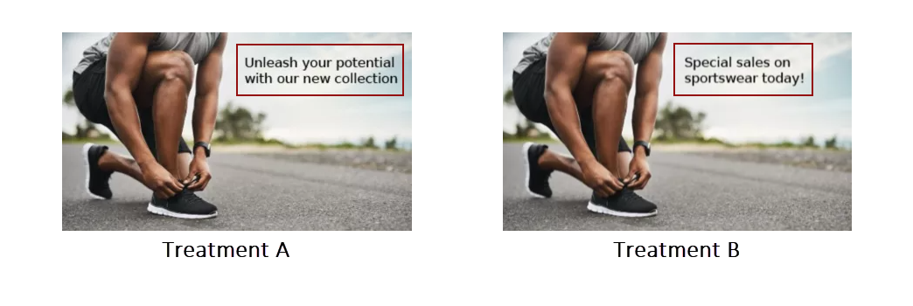
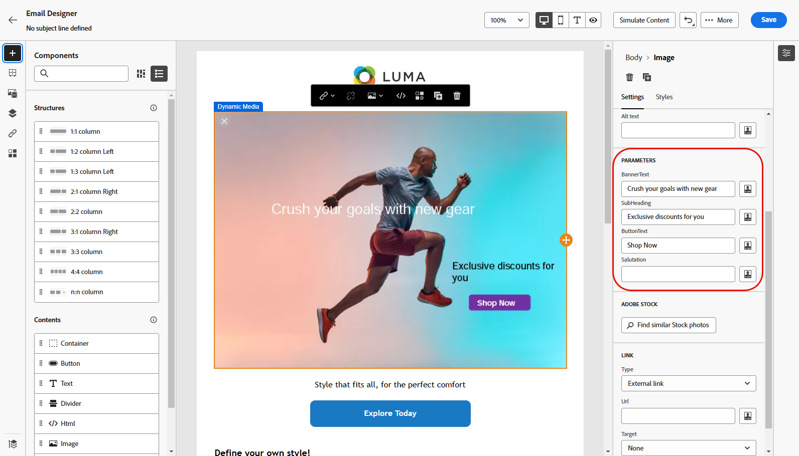

# Dynamic Media 작업 {#aem-dynamic}

>[!AVAILABILITY]
>
>이 통합은 조직 집합(제한된 가용성)에만 사용할 수 있습니다. 액세스 권한을 받으려면 Adobe 담당자에게 문의하십시오.

이제 에셋 선택기가 Dynamic Media를 지원하므로 Journey Optimizer 내에서 승인된 Dynamic Media 렌디션을 원활하게 선택하고 사용할 수 있습니다. Adobe Experience Manager의 자산에 대한 변경 사항은 즉시 Journey Optimizer 콘텐츠에 반영되므로 수동으로 업데이트하지 않아도 최신 버전을 항상 사용할 수 있습니다.

이 통합은 Dynamic Media Manager as a Cloud Service을 사용하는 고객에게만 제공됩니다.

Adobe Experience Manager as a Cloud Service의 Dynamic Media에 대한 자세한 내용은 [Experience Manager 설명서](https://experienceleague.adobe.com/en/docs/experience-manager-cloud-service/content/assets/dynamicmedia/dynamic-media){target="_blank"}를 참조하세요.

## Dynamic Media 추가 및 관리 {#dynamic-media}

Adobe Experience Manager as a Cloud Service의 Dynamic Media를 Journey Optimizer 콘텐츠에 직접 삽입하여 화면 또는 브라우저에 맞게 콘텐츠를 개선하고 최적화합니다.  그런 다음 필요에 따라 크기를 조정하고, 자르고, 강화하고, 기타 조정할 수 있습니다.

1. **[!UICONTROL HTML 구성 요소]**&#x200B;를 콘텐츠로 끌어서 놓습니다.

1. **[!UICONTROL 소스 코드 표시]**&#x200B;를 선택합니다.

   

1. **[!UICONTROL HTML 편집]** 메뉴에서 **[!UICONTROL Assets]**(으)로 이동한 다음 **[!UICONTROL 자산 선택기 열기]**&#x200B;를 클릭합니다.

   또는 에셋의 URL을 복사하여 붙여넣을 수 있습니다.

   

1. AEM 에셋을 검색하고 콘텐츠에 추가하려는 에셋을 선택합니다.

1. 에셋 요구 사항에 맞게 필요에 따라 이미지 매개 변수(예: 높이, 너비, 회전, 뒤집기, 밝기, 색조 등)를 조정합니다.

   URL에 추가할 수 있는 이미지 매개 변수의 전체 목록을 보려면 [Experience Manager 설명서](https://experienceleague.adobe.com/en/docs/dynamic-media-developer-resources/image-serving-api/image-serving-api/http-protocol-reference/command-reference/c-command-reference)를 참조하세요.

   

1. **[!UICONTROL 저장]**&#x200B;을 클릭합니다.

이제 콘텐츠에 Dynamic Media가 포함됩니다. Experience Manager에서 수행하는 모든 업데이트는 Journey Optimizer에 자동으로 표시됩니다.

## 텍스트 오버레이 개인화 {#text-overlay}

기존 텍스트 오버레이를 원하는 새 텍스트로 대체하여 모든 다이내믹 미디어를 손쉽게 맞춤화할 수 있으므로 원활한 업데이트 및 개인화가 가능합니다.

예를 들어 실험 기능을 사용하면 각 처리에 대해 다른 텍스트로 대체하여 기존 텍스트 오버레이를 업데이트하여 메시지를 열 때 각 프로필에 대해 사용자 지정되도록 할 수 있습니다.

1. **[!UICONTROL HTML 구성 요소]**&#x200B;를 콘텐츠로 끌어서 놓습니다.

1. **[!UICONTROL 소스 코드 표시]**&#x200B;를 선택합니다.

1. **[!UICONTROL HTML 편집]** 메뉴에서 **[!UICONTROL Assets]**&#x200B;에 액세스한 다음 **[!UICONTROL 자산 선택기 열기]**&#x200B;에 액세스합니다.

   에셋 URL을 복사하여 붙여넣을 수도 있습니다.

1. AEM 에셋을 탐색하고 콘텐츠에 추가할 에셋을 선택합니다.

1. 오버레이를 원하는 텍스트로 바꿉니다.

   

1. 이미지 매개 변수를 업데이트합니다.

   * **레이어**: 텍스트를 배치할 기본 요소를 입력합니다.
   * **크기**: 텍스트 블록의 크기를 업데이트합니다.
   * **TextAttr**: 텍스트 글꼴 크기를 조정합니다.
   * **게시물**: 이미지에서 텍스트 위치를 설정합니다.

   >[!WARNING]
   >
   >Dynamic Media를 업데이트하려면 레이어 매개 변수가 필요합니다.

   

1. **[!UICONTROL 저장]**&#x200B;을 클릭합니다.

이제 컨텐츠에 업데이트된 텍스트 오버레이가 포함됩니다.

## Dynamic Media 템플릿 추가 및 관리 {#dynamic-media-template}

Journey Optimizer에서 Dynamic Media 템플릿을 쉽게 추가하고 필요할 때마다 미디어 콘텐츠를 업데이트합니다. 이제 개인화 필드를 미디어에 통합하여 Journey Optimizer 내에서 보다 맞춤화되고 매력적인 콘텐츠를 만들 수 있습니다.

[다이내믹 미디어 템플릿](https://experienceleague.adobe.com/en/docs/dynamic-media-classic/using/template-basics/quick-start-template-basics)에 대해 자세히 알아보세요.

### 이미지 구성 요소 사용 {#image-component}

이미지 구성 요소를 사용하여 다이내믹 템플릿을 콘텐츠에 직접 삽입할 수 있습니다.

1. 캠페인이나 여정을 열고 콘텐츠에 액세스합니다.

1. **이미지 구성 요소**&#x200B;를 레이아웃으로 끌어서 놓습니다.

   이미지 구성 요소에 대한 자세한 내용은 [이 페이지](../email/content-components.md)를 참조하세요.

   

1. AEM 에셋을 검색하고 콘텐츠에 추가하려는 Dynamic Media 템플릿을 선택합니다.

   

1. **이미지 설정**&#x200B;에서 Dynamic Media 템플릿의 매개 변수에 액세스하도록 이동합니다.

   사용 가능한 필드는 Adobe Experience Manager에서 [템플릿 만들기](https://experienceleague.adobe.com/en/docs/dynamic-media-classic/using/template-basics/creating-template-parameters#creating_template_parameters) 중에 추가된 매개 변수에 따라 다릅니다.

   

1. 다른 필드를 채우고 개인화 편집기를 사용하여 개인화된 콘텐츠를 추가합니다. 프로필 이름, 도시 또는 기타 관련 세부 정보와 같은 모든 속성을 사용하여 보다 사용자 정의된 경험을 만들 수 있습니다.

   [이 페이지](../personalization/personalize.md)에서 개인화에 대해 자세히 알아보세요.

   

1. 조건부 콘텐츠는 Dynamic Media 구성 요소에 적용되어 콘텐츠의 다른 변형을 생성할 수 있습니다. [자세히 알아보기](../personalization/dynamic-content.md)

1. **[!UICONTROL 저장]**&#x200B;을 클릭합니다.

테스트를 수행하고 콘텐츠의 유효성을 검사하면 대상자에게 메시지를 보낼 수 있습니다.

### HTML 구성 요소 사용 {#html-component}

HTML 구성 요소를 사용하여 다이내믹 템플릿을 콘텐츠에 직접 삽입할 수 있습니다.

1. 캠페인이나 여정을 열고 콘텐츠에 액세스합니다.

1. **HTML 구성 요소**&#x200B;를 레이아웃으로 끌어서 놓습니다.

   

1. **[!UICONTROL 소스 코드 표시]**&#x200B;를 선택합니다.

   

1. **[!UICONTROL HTML 편집]** 메뉴에서 **[!UICONTROL Assets]**&#x200B;에 액세스한 다음 **[!UICONTROL 자산 선택기 열기]**&#x200B;에 액세스합니다.

   에셋 URL을 복사하여 붙여넣을 수도 있습니다.

1. 에셋 요구 사항에 맞게 필요에 따라 이미지 텍스트 매개 변수를 조정합니다.

   

1. **[!UICONTROL 저장]**&#x200B;을 클릭합니다.

테스트를 수행하고 콘텐츠의 유효성을 검사하면 대상자에게 메시지를 보낼 수 있습니다.

<!--
## Personalization with Text Overlay

Easily customize any dynamic media by replacing the existing text overlay with new text of your choice, allowing for seamless updates and personalization.

In this example, our goal is to update the existing text overlay by replacing it with a new validity date and adding a personalization block, ensuring it is customized for each profile when they open their messages.

1. Drag and drop an **[!UICONTROL HTML component]** into your content.

1. Select **[!UICONTROL Show the source code]**.

1. From the **[!UICONTROL Edit HTML]** menu, access **[!UICONTROL Assets]** then **[!UICONTROL Open asset selector]**.

    You can also simply copy and paste your assets URL.

1. Browse through your AEM assets and select the one you want to add to your content.

1. Replace the overlay with the desired text.

    Here we change the validity date from 31st December 2024 to the 1st July 2025.

1. Add the required personalization fields to your image.

1. Click **[!UICONTROL Save]**.

Your content now includes your updated text overlay and personalization.

## Add Dynamic media conditional content

Enable conditional content in your dynamic media to better target your audience and deliver a more personalized experience.

1. Drag and drop an **[!UICONTROL HTML component]** into your content.

1. Select **[!UICONTROL Show the source code]**.

1. From the **[!UICONTROL Edit HTML]** menu, access **[!UICONTROL Assets]** then **[!UICONTROL Open asset selector]**.

    You can also simply copy and paste your assets URL.

1. Browse through your AEM assets and select the one you want to add to your content.

1. Once your dynamic media is inserted to your content, select **[!UICONTROL Enable conditional]** content from your HTML component toolbar to create your different user experiences. 

1. From the Variant - 1, click **[!UICONTROL Select condition]** to fine tune your audience.

1. Choose your condition or create a new one if needed and click **[!UICONTROL Select]**.

    [Learn more on conditions](../personalization/create-conditions.md)

1. Select your **[!UICONTROL Component]** and access the **[!UICONTROL Settings]** menu.

1. In the **[!UICONTROL Custom Attributes]** menu, populate the Dynamic Media text and personalization fields to customize the content for your audience.

-->
