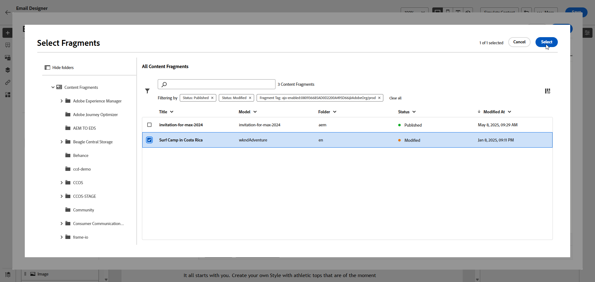

# Adobe Experience Manager Content 조각 {#aem-fragments}

이제 Adobe Experience Manager을 Adobe Journey Optimizer과 통합하여 AEM 콘텐츠 조각을 Journey Optimizer 이메일 콘텐츠에 원활하게 통합할 수 있습니다. 이렇게 간소화된 연결을 통해 AEM 콘텐츠에 액세스하고 활용하는 프로세스를 간소화하여 개인화되고 동적인 캠페인 및 여정을 만들 수 있습니다.

AEM 콘텐츠 조각에 대한 자세한 내용은 [Experience Manager 설명서](https://experienceleague.adobe.com/en/docs/experience-manager-cloud-service/content/sites/authoring/fragments/content-fragments)를 참조하세요.

## 제한 사항 {#limitations}

* 이메일 채널에만 사용할 수 있습니다.

* 각 샌드박스가 단일 인스턴스로 제한되어 있으므로 사용자는 현재 연결된 AEM 인스턴스를 전환할 수 없습니다.

* 이메일에 발생한 우발적 오류의 위험을 줄이기 위해 콘텐츠 조각을 게시할 수 있는 액세스 권한이 있는 사용자의 수를 제한하는 것이 좋습니다.

* 다국어 콘텐츠의 경우 수동 흐름만 지원됩니다.

* 변형은 현재 지원되지 않습니다.

* 특히 Journey Optimizer에 대한 태그를 만들어야 합니다.

+++ Journey Optimizer 태그를 만드는 방법 알아보기

   1. **Experience Manager** 환경에 액세스합니다.

   1. **도구** 메뉴에서 **일반** 탭으로 이동하여 **태그 지정**&#x200B;을 선택합니다.

   1. **새 태그 만들기**&#x200B;를 클릭합니다.

   1. ID가 `ajo-enabled:{AJO-OrgId}/{AJO-SandboxName}` 구문을 준수하는지 확인하십시오.

   1. **만들기**&#x200B;를 클릭합니다.

  이제 이 Journey Optimizer 태그를 콘텐츠 조각에 할당할 수 있습니다.
+++

## AEM 컨텐츠 조각 추가 {#aem-add}

이제 [AEM 콘텐츠 조각](https://experienceleague.adobe.com/en/docs/experience-manager-cloud-service/content/sites/authoring/fragments/content-fragments)을 만들고 개인화한 후 여정 최적화 도구 캠페인이나 여정으로 가져올 수 있습니다.

1. 이메일 작업으로 [여정](../email/create-email.md) 또는 [캠페인](../email/create-email.md)을 만든 후 이메일 디자이너에 액세스하여 이메일 콘텐츠를 구성하십시오. [자세히 알아보기](../email/get-started-email-design.md)

1. 텍스트 블록 안이나 제목 줄을 클릭하고 상황별 도구 모음에서 **[!UICONTROL Personalization 추가]**&#x200B;를 선택합니다.

   

1. 왼쪽 창의 **[!UICONTROL AEM 콘텐츠 조각]** 메뉴에서 **[!UICONTROL AEM CF 선택기 열기]**&#x200B;를 클릭합니다.

   

1. 사용 가능한 목록에서 **[!UICONTROL 콘텐츠 조각]**&#x200B;을(를) 선택하여 Journey Optimizer 콘텐츠로 가져옵니다.

1. 콘텐츠 조각 목록을 미세 조정하려면 **[!UICONTROL 필터 표시]**&#x200B;를 클릭하십시오.

   기본적으로 콘텐츠 조각 필터는 승인된 콘텐츠만 표시하도록 사전 설정되어 있습니다.

   

1. **[!UICONTROL 콘텐츠 조각]**&#x200B;을 선택한 후 **[!UICONTROL 선택]**&#x200B;을 클릭하여 엽니다.

   

1. **[!UICONTROL 콘텐츠 조각]**&#x200B;에서 원하는 필드를 선택하여 콘텐츠에 추가하십시오. 콘텐츠를 추가하거나 해당 값을 복사할 수 있습니다.

   값을 복사하도록 선택하면 **[!UICONTROL 콘텐츠 조각]**&#x200B;에 대한 향후 업데이트가 캠페인이나 여정에 반영되지 않습니다.

   

1. **[!UICONTROL 저장]**&#x200B;을 클릭하고 미리 보기에서 메시지를 확인합니다. 이제 [이 섹션](../content-management/preview.md)에 자세히 설명된 대로 메시지 콘텐츠를 테스트하고 확인할 수 있습니다.

테스트를 수행하고 콘텐츠의 유효성을 검사하면 [Campaign](../campaigns/review-activate-campaign.md) 또는 [여정](../building-journeys/publishing-the-journey.md)을(를) 통해 대상자에게 이메일을 보낼 수 있습니다.
