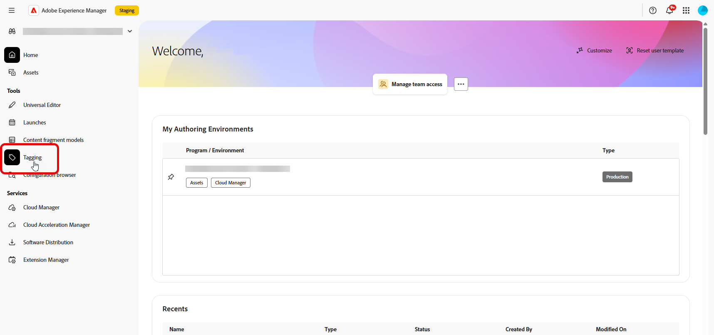
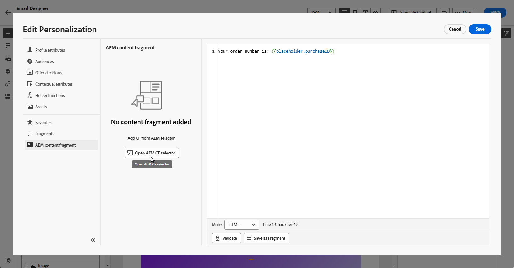

# Adobe Experience Manager 컨텐츠 조각을 사용한 작업 {#aem-fragments}

>[!AVAILABILITY]
>
>이 통합은 **Adobe Experience Manager as a Cloud Service 사이트**&#x200B;에 적용되며, **콘텐츠 조각**&#x200B;에만 적용됩니다. Journey Optimizer은 **Publish** 계층(작성자 아님)에서 조각을 읽습니다.

Adobe Experience Manager과 Journey Optimizer 간의 통합은 다음 데이터 흐름을 따릅니다.

1. **[Dispatcher 구성](https://experienceleague.adobe.com/ko/docs/experience-manager-cloud-service/content/sites/administering/content-fragments/content-fragments-with-journey-optimizer#dispatcher-configuration){target="_blank"}**: Journey Optimizer에서 콘텐츠 조각 관리 API를 통해 Adobe Experience Manager 콘텐츠 조각에 액세스할 수 있도록 하려면 먼저 Dispatcher을 구성해야 합니다. 이는 통합을 위한 필수 조건입니다.

1. **[만들기 및 작성자](https://experienceleague.adobe.com/ko/docs/experience-manager-cloud-service/content/sites/administering/content-fragments/managing#creating-a-content-fragment)**: 콘텐츠가 Adobe Experience Manager에서 콘텐츠 조각으로 만들어지고 구성됩니다.

1. **[태그 지정](https://experienceleague.adobe.com/ko/docs/experience-manager-cloud-service/content/sites/administering/content-fragments/managing#manage-tags)**: 콘텐츠 조각은 Journey Optimizer 관련 태그(`ajo-enabled:{OrgId}/{SandboxName}`)로 태그 지정되어야 합니다.

1. **[게시](https://experienceleague.adobe.com/ko/docs/experience-manager-cloud-service/content/sites/administering/content-fragments/managing#publishing-and-previewing-a-fragment)**: 콘텐츠 조각이 Adobe Experience Manager에 게시되어 Journey Optimizer에서 사용할 수 있습니다.

1. **[액세스](#aem-add)**: Journey Optimizer은 Adobe Experience Manager 게시 인스턴스에서 사용 가능한 콘텐츠 조각을 실시간으로 가져와서 표시합니다.

1. **[통합](#aem-add)**: 콘텐츠 조각을 선택하여 캠페인 또는 여정에 통합합니다.

컨텐츠 조각이 Adobe Experience Manager에 게시되면 Journey Optimizer 측의 컨텐츠를 업데이트하는 이벤트가 전송됩니다. 업데이트에 성공하면 단일 여정의 경우 약 5분 내에 콘텐츠 조각을 사용할 수 있고 일괄 처리 사례의 경우 다음 처리 배치에서 사용할 수 있습니다. Journey Optimizer에서 업데이트를 사용할 수 있게 되면 해당되는 모든 캠페인 및 여정에 걸쳐 게시된 최신 콘텐츠가 사용됩니다.

>[!AVAILABILITY]
>
>의료 고객의 경우 Journey Optimizer Healthcare Shield 및 Adobe Experience Manager Extended Security for Healthcare 추가 기능 오퍼링의 라이선스가 있을 때만 통합이 가능합니다.

## Experience Manager에서 태그 만들기 및 할당

>[!IMPORTANT]
>
>Journey Optimizer에서 컨텐츠 조각 관리 API를 통해 Adobe Experience Manager 컨텐츠 조각에 액세스할 수 있도록 하려면 먼저 [Dispatcher을 구성](https://experienceleague.adobe.com/ko/docs/experience-manager-cloud-service/content/sites/administering/content-fragments/content-fragments-with-journey-optimizer#dispatcher-configuration){target="_blank"}해야 합니다.

Journey Optimizer에서 컨텐츠 조각을 사용하기 전에 Journey Optimizer에 특별히 태그를 만들어야 합니다.

1. **Experience Manager** 환경에 액세스합니다.

1. **도구** 메뉴에서 **태그 지정**&#x200B;을 선택합니다.

   

1. **태그 만들기**&#x200B;를 클릭합니다.

1. ID가 `ajo-enabled:{AJO-OrgId}/{AJO-SandboxName}` 구문을 준수하는지 확인하십시오.

1. **만들기**&#x200B;를 클릭합니다.

1. [Experience Manager 설명서](https://experienceleague.adobe.com/ko/docs/experience-manager-cloud-service/content/sites/administering/content-fragments/content-fragment-models){target="_blank"}에 자세히 설명된 대로 콘텐츠 조각 모델을 정의하고 새로 만든 Journey Optimizer 태그를 할당하십시오.

이러한 실시간 연결은 콘텐츠가 항상 최신 상태임을 보장하지만 게시된 조각에 대한 모든 변경 사항이 활성 캠페인 및 여정에 즉시 영향을 준다는 것을 의미합니다.

이제 Journey Optimizer에서 나중에 사용할 수 있도록 콘텐츠 조각을 만들고 구성할 수 있습니다. 자세한 내용은 [Experience Manager 설명서](https://experienceleague.adobe.com/ko/docs/experience-manager-cloud-service/content/sites/administering/content-fragments/managing){target="_blank"}를 참조하세요.

## Experience Manager 컨텐츠 조각 추가 {#aem-add}

이제 AEM 콘텐츠 조각을 만들고 개인화한 후 여정 최적화 도구 캠페인이나 여정으로 가져올 수 있습니다.

1. [캠페인](../campaigns/create-campaign.md) 또는 [여정](../building-journeys/journey-gs.md)을 만듭니다.

1. AEM 컨텐츠 조각에 액세스하려면 텍스트 필드 내에서 을 클릭하거나 HTML 컨텐츠 구성 요소를 통해 소스 코드를 엽니다.

   

1. 왼쪽 창의 **[!UICONTROL AEM 콘텐츠 조각]** 메뉴에서 **[!UICONTROL AEM CF 선택기 열기]**&#x200B;를 클릭합니다.

   

1. 목록을 탐색하고 Journey Optimizer 콘텐츠로 가져올 **[!UICONTROL 콘텐츠 조각]**&#x200B;을 선택하십시오.

   >[!NOTE]
   >
   > 조각에 하나 이상의 **게시** 변형이 있는 경우 선택기에 **[!UICONTROL 변형]** 드롭다운이 표시됩니다. **[!UICONTROL 변형]**&#x200B;을 선택하지 않으면 **Main** 변형이 자동으로 사용됩니다. [콘텐츠 조각 변형을 사용하여 작업](#aem-variations)에서 자세히 알아보세요.

1. 콘텐츠 조각 목록을 미세 조정하려면 **[!UICONTROL 필터 표시]**&#x200B;를 클릭하십시오.

   기본적으로 콘텐츠 조각 필터는 승인된 콘텐츠만 표시하도록 사전 설정되어 있습니다.

   

1. **[!UICONTROL 콘텐츠 조각]**&#x200B;을 선택한 후 **[!UICONTROL 선택]**&#x200B;을 클릭하여 추가합니다.

   

1. 조각 정보를 표시하려면 **[!UICONTROL 조각 보기]**&#x200B;를 클릭하세요. **[!UICONTROL 조각 정보]** 메뉴를 열면 편집기가 읽기 전용 모드로 전환됩니다.

   Adobe Experience Manager에서 조각을 보려면 오른쪽 메뉴에서 **[!UICONTROL 미리 보기]**&#x200B;를 선택하십시오.

   

1. 조각의 고급 메뉴에 액세스하려면 을 클릭하세요.

   * **[!UICONTROL 조각 교체]**
   * **[!UICONTROL 참조 살펴보기]**
   * **[!UICONTROL AEM에서 열기]**

   

1. **[!UICONTROL 조각]**&#x200B;에서 원하는 필드를 선택하여 콘텐츠에 추가하십시오.

   <!--
    Note that if you choose to copy the value, any future updates to the Content Fragment will not be reflected in your campaign or journey. However, using dynamic placeholders ensures real-time updates.-->

   

1. 콘텐츠 조각 특성(예: 조각 모델의 경로 또는 URL 필드)에 저장된 이미지 URL을 표시하려면 `` 태그와 조각 특성을 소스로 사용하여 HTML에 삽입합니다. 예:

   ```html
   
   ```

   >[!NOTE]
   >
   >Adobe Experience Manager의 상대 이미지 URL은 지원되지 않습니다. **절대** URL을 사용하십시오.

1. **알약: 해제**&#x200B;를 선택하여 긴 특성 경로를 숨겨 가독성을 향상하는 알약 경험을 사용하도록 설정합니다.

   

1. 조각 텍스트 내에서 Adobe Experience Manager에서 작성된 **개인화 자리 표시자**&#x200B;를 사용하려면 다음과 같이 Adobe Experience Manager의 콘텐츠 조각에서 해당 자리 표시자를 정의합니다. `{{name}}`.

   Journey Optimizer에서 이러한 토큰은 자리 표시자입니다. **알약** 경험이 있는 사용자는 조각 필드와 함께 오른쪽 레일의 **[!UICONTROL AEM 콘텐츠 조각]** 섹션에 표시됩니다.

1. 실시간 개인화를 사용하려면 **[!UICONTROL 콘텐츠 조각]** 내에서 사용되는 모든 자리 표시자를 조각 도우미 태그의 매개 변수로 사용자가 명시적으로 선언해야 합니다. 다음과 같이 이러한 자리 표시자를 프로필 속성, 컨텍스트 속성, 정적 문자열 또는 사전 정의된 변수에 매핑합니다.

   1. **프로필 또는 컨텍스트 특성 매핑**: 자리 표시자를 프로필 또는 컨텍스트 특성(예: name = profile.person.name.firstName)에 할당합니다.

   1. **정적 문자열 매핑**: 큰 따옴표 안에 고정 문자열 값을 할당하십시오(예: name = &quot;John&quot;).

   1. **변수 매핑**: 같은 HTML 내에서 이전에 선언된 변수를 참조합니다(예: name = &#39;variableName&#39;).
이 경우 다음 구문을 사용하여 조각 ID를 추가하기 전에 **_variableName_**&#x200B;이(가) 선언되었는지 확인하십시오.

      ```html
       
      ```

   아래 예에서 **_month_** 자리 표시자는 조각 내의 **_profile.person.birthDate_** 특성에 매핑됩니다.

   {zoomable="yes"}

1. **[!UICONTROL 저장]**&#x200B;을 클릭합니다. 이제 [이 섹션](../content-management/preview.md)에 자세히 설명된 대로 메시지 콘텐츠를 테스트하고 확인할 수 있습니다.

   <!--Note that the Content Fragment you selected stays active for this message. When you open the Personalization Editor in another field or content block, you can keep working with the same fragment from the **[!UICONTROL AEM Content Fragment]** section and add more fields without reopening **[!UICONTROL Open AEM CF selector]**.-->

테스트를 수행하고 콘텐츠의 유효성을 검사하면 대상자에게 [캠페인을 전송](../campaigns/review-activate-campaign.md)하거나 [여정을 게시](../building-journeys/publish-journey.md)할 수 있습니다.

Adobe Experience Manager을 사용하면 컨텐츠 조각이 사용되는 Journey Optimizer 캠페인 또는 여정을 식별할 수 있습니다. 자세한 내용은 [Adobe Experience Manager 설명서](https://experienceleague.adobe.com/ko/docs/experience-manager-cloud-service/content/sites/administering/content-fragments/extension-content-fragment-ajo-external-references){target="_blank"}를 참조하세요.

## 컨텐츠 조각 변형 작업 {#aem-variations}

Adobe Experience Manager에서 각 콘텐츠 조각은 다음과 같이 구성됩니다.

* **Main**: 항상 존재하며 삭제할 수 없으며 모든 변형의 기본인 조각의 핵심 콘텐츠입니다.
* **변형**: 작성자가 특정 채널 또는 시나리오에 대해 만드는 **Main**&#x200B;의 순열 중 하나 이상입니다. 변형은 개별 자산이 아닌 조각 내부에 있으며 **기본**&#x200B;과(와) 비교 및 동기화할 수 있습니다.

변형 사용 사례의 예:

* 푸시 알림용 사본의 짧은 버전과 이메일용 더 긴 버전.
* 별도의 조각을 만들지 않고 영역 톤 조정
* 채널별 메시징(예: 모바일과 비교한 웹).

➡️ [Adobe Experience Manager 설명서에서 자세히 알아보기](https://experienceleague.adobe.com/ko/docs/experience-manager-65/content/assets/content-fragments/content-fragments-variations)

Journey Optimizer을 사용하면 조각을 삽입할 때 사용할 변형을 선택할 수 있으므로 다양한 캠페인이나 여정이 조각을 복제하지 않고도 Adobe Experience Manager에서 동일한 소스 콘텐츠의 다양한 표현물을 사용할 수 있습니다.

변형을 선택하려면 다음을 수행하십시오.

1. [여정](../campaigns/create-campaign.md) 또는 [캠페인](../building-journeys/journey-gs.md)을 엽니다.

1. 텍스트 필드에서 을 클릭하거나 HTML 콘텐츠 구성 요소에서 HTML 소스를 엽니다.

1. **[!UICONTROL AEM 콘텐츠 조각]**&#x200B;에서 **[!UICONTROL CF 선택기 열기]**&#x200B;를 클릭합니다.

   

1. 표 보기에서 로케일별 Adobe Experience Manager 콘텐츠 조각을 선택하려면 **[!UICONTROL 표 사용자 지정]**&#x200B;을 사용하여 **[!UICONTROL 언어]** 열을 추가하십시오. 로케일 값이 테이블에 표시되어 적절한 조각을 식별하고 선택할 수 있습니다.

   

1. **[!UICONTROL 콘텐츠 조각]**&#x200B;을 선택하세요.

1. 을 클릭하여 **[!UICONTROL 세부 정보]** 메뉴를 엽니다. 조각에 게시된 변형이 하나 이상 있으면 조각 세부 정보 옆에 **[!UICONTROL 변형]** 드롭다운이 표시됩니다.

   

1. **[!UICONTROL 빠른 세부 정보]** 메뉴에서 **[!UICONTROL 참조 탐색]**&#x200B;을 클릭하여 변형 세부 정보, 미리 보기 및 증명을 위한 관련 옵션을 Adobe Experience Manager에서 엽니다.

1. 변형을 선택한 다음 **[!UICONTROL 선택]**&#x200B;을 클릭합니다.

   >[!NOTE]
   >
   > 변형을 선택하지 않거나 변형 지원을 사용하기 전에 조각을 추가한 경우 Journey Optimizer은 게재 시 **Main** 변형을 자동으로 사용합니다.

변형이 있는 조각을 삽입하면 Adobe Experience Manager에서 다시 게시하면 활성 캠페인이나 여정에서 **참조된 변형**&#x200B;이 자동으로 업데이트됩니다. 미리 보기 및 증명에서는 선택한 변형과 해당 변형에 대해 최근에 게시된 콘텐츠를 계속 사용합니다.
