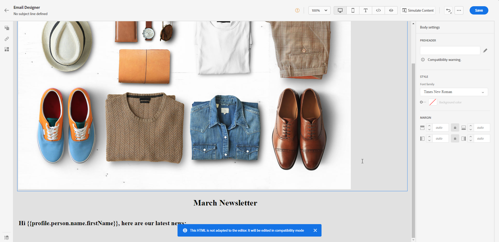

# Adobe Experience Manager 템플릿 작업 {#aem-templates}

## Adobe Experience Manager 템플릿 시작 {#gs-aem-templates}

Adobe Journey Optimizer을 사용하면 Adobe Experience Manager 사이트를 통해 사용자 지정 메시지를 만들 수 있습니다. Adobe Experience Manager의 콘텐츠 소스를 사용하여 템플릿을 디자인한 다음 Adobe Journey Optimizer으로 전송합니다. 이렇게 공유된 템플릿은 Adobe Journey Optimizer의 이메일 디자이너에서 액세스할 수 있으므로, 원하는 대상자에게 메시지를 만들고 보내는 프로세스를 단순화할 수 있습니다.

>[!AVAILABILITY]
>
>Adobe Experience Manager과의 통합은 현재 사용자를 선택하는 베타 버전으로만 사용할 수 있습니다.
>베타 사용자인 경우 [이 양식](https://forms.office.com/pages/responsepage.aspx?id=Wht7-jR7h0OUrtLBeN7O4Wf0cbVTQ3tCpW_unE-w8-JUN1FaNlAzNkhPSUdaSkJXVFRCNTRJNVRFSy4u){target="_blank"}을(를) 사용하여 피드백을 공유하십시오.

### 전제 조건 {#prerequisites}

이 기능의 사용을 시작하기 전에 다음 요구 사항에 맞는지 확인하십시오.

* **Experience Manager 설정**

  이 기능은 [Adobe Experience Manager as a Cloud Service](https://experienceleague.adobe.com/docs/experience-manager-cloud-service/content/overview/introduction.html?lang=ko-KR){target="_blank"}에서 사용할 수 있습니다.

  Beta 프로그램의 일부로 Cloud Service 구성은 Adobe Experience Manager의 Adobe에서 Adobe Journey Optimizer에 연결하기 위해 수행됩니다.

* **사용 권한**

  Adobe Journey Optimizer에서 콘텐츠 템플릿을 만들고 편집하고 삭제하려면 **[!DNL Content Library Manager]** 제품 프로필에 **[!DNL Manage Library Items]** 권한이 포함되어 있어야 합니다. [자세히 알아보기](../administration/ootb-product-profiles.md#content-library-manager)

### 가드레일 및 제한 사항{#aem-templates-limitations}

Adobe Journey Optimizer과 함께 Adobe Experience Manager 사용을 더욱 최적화하려면 다음 추가 보호 기능 및 제한 사항에 유의해야 합니다.

* Experience Manager 템플릿의 개인화를 적용하려면 적절한 Journey Optimizer 구문이 필요합니다. [자세히 알아보기](../personalization/personalization-syntax.md)

* 벌크 템플릿 내보내기는 현재 지원되지 않으므로 개별적으로 템플릿을 내보내야 합니다.

* 현재 Experience Manager과 Journey Optimizer 간 동기화를 사용할 수 없습니다. Experience Manager 템플릿을 Journey Optimizer으로 보낸 후 변경한 경우 사용자는 템플릿을 다시 내보낸 다음 Journey Optimizer으로 다시 보내야 합니다.

## Journey Optimizer에 템플릿 보내기{#aem-templates-send}

Adobe Experience Manager 템플릿을 Adobe Journey Optimizer으로 내보내려면 아래 단계를 따르십시오.

1. Adobe Experience Manager 홈페이지에서 **[!UICONTROL 아웃바운드 마케팅]**&#x200B;을(를) 선택합니다.

   

1. 콘텐츠 라이브러리에서 이전에 구성한 템플릿을 사용하거나 처음부터 새로 만들 수 있습니다. [자세히 알아보기](https://experienceleague.adobe.com/docs/experience-manager-65/authoring/authoring/managing-pages.html#creating-a-new-page)

1. Journey Optimizer 개인화 구문을 템플릿에 통합하여 맞춤화 기능을 향상시킬 수 있습니다. [자세히 알아보기](../personalization/personalization-syntax.md)

   

1. Journey Optimizer으로 내보낼 템플릿을 선택하고 고급 메뉴에서 **[!UICONTROL 보내기]**&#x200B;를 클릭합니다.

   

1. 콘텐츠 템플릿의 **[!UICONTROL 이름]**&#x200B;을(를) 입력하고 대상 **[!UICONTROL 샌드박스]**&#x200B;를 선택하십시오.

   

1. **[!UICONTROL 보내기]** 단추를 클릭하면 내보내기 프로세스가 시작됩니다. 내보내기가 완료되면 사용자 인터페이스에 다음 메시지가 표시됩니다. &quot;템플릿 &quot;XX&quot;가 AJO에 성공적으로 전송되었습니다.&quot;

템플릿이 선택한 샌드박스의 Adobe Journey Optimizer 콘텐츠 템플릿에 추가됩니다.

## Adobe Experience Manager 템플릿 사용 및 개인화{#aem-templates-perso}

Experience Manager 템플릿을 Journey Optimizer에서 콘텐츠 템플릿으로 사용할 수 있게 되면 개인화를 포함하여 이메일에 필요한 콘텐츠를 식별하고 통합할 수 있습니다.

1. Journey Optimizer의 **[!UICONTROL 콘텐츠 템플릿]** 메뉴에서 가져온 템플릿에 액세스합니다.

   

1. **[!UICONTROL 경고]** 단추를 클릭하면 중요한 설정이 누락되었는지 빠르게 확인할 수 있습니다. 이렇게 하면 메시지가 올바르게 구성되었는지 확인하고 잠재적인 오류나 문제를 방지하는 데 도움이 됩니다.

   

1. **[!UICONTROL 템플릿 속성]** 창에서 **[!UICONTROL 액세스 관리]** 단추를 클릭하여 사용자 지정 또는 핵심 데이터 사용 레이블을 템플릿에 할당합니다. [OLAC(개체 수준 액세스 제어)에 대해 자세히 알아보기](../administration/object-based-access.md)

1. Experience Manager 템플릿을 추가로 개인화하고 사용자 지정 개인 설정을 콘텐츠에 추가하려면 **[!UICONTROL 콘텐츠 편집]**&#x200B;을 클릭하세요. 이를 통해 쉽게 변경하고 템플릿을 특정 요구 사항에 맞게 조정할 수 있습니다. [자세히 알아보기](../email/get-started-email-design.md)

   >[!WARNING]
   >
   > 템플릿을 편집하고 개인화하려는 경우 호환성 모드만 사용할 수 있습니다.

1. 콘텐츠 템플릿이 준비되면 [테스트하고 확인](../content-management/content-templates.md#test-template)하세요.

1. 콘텐츠를 정의한 후에는 **[!UICONTROL 저장된 템플릿]** 컬렉션을 탐색하여 새 전자 메일을 만들 때 사용할 수 있습니다. 그런 다음 **[!UICONTROL 이 서식 파일 사용]**&#x200B;을 선택합니다.

   

1. 이제 콘텐츠를 편집하고 개인화할 수 있습니다. 전자 메일 콘텐츠를 만드는 방법에 대한 자세한 내용은 이 [페이지](../email/content-from-scratch.md)를 참조하세요.

   

1. Experience Manager 템플릿에 개인화된 콘텐츠를 추가한 경우 **[!UICONTROL 콘텐츠 시뮬레이션]**&#x200B;을 클릭하여 테스트 프로필을 사용하여 메시지에 표시되는 방식을 미리 봅니다.

[미리 보기 및 테스트 프로필에 대해 자세히 알아보기](../content-management/preview-test.md)

   

1. 메시지 미리 보기를 볼 때 개인화된 요소는 자동으로 선택한 테스트 프로필의 해당 데이터로 바뀝니다.

   필요한 경우 **[!UICONTROL 테스트 프로필 관리]** 단추를 통해 추가 테스트 프로필을 추가할 수 있습니다.

   

전자 메일이 준비되면 [여정](../building-journeys/journey-gs.md) 또는 [캠페인](../campaigns/create-campaign.md)의 구성을 완료하고 활성화하여 메시지를 보내십시오.
