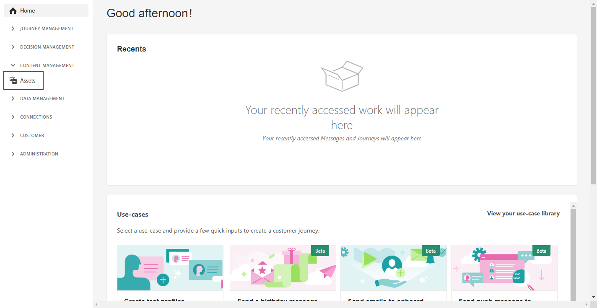

# [!DNL Experience Manager Assets]&#x200B;(으)로 자산 만들기 및 관리{#experience-manager-assets}

## [!DNL Experience Manager Assets] 시작 {#get-started-assets}

**[!DNL Adobe Experience Manager Assets]** 통합은 마케팅 워크플로와 크리에이티브 워크플로를 결합해 줍니다. 기본적으로 **[!DNL Adobe Journey Optimizer]**&#x200B;과(와) 통합되어 디지털 자산을 저장, 관리, 검색 및 배포하려면 **[!DNL Assets Essentials]** 또는 **[!DNL Assets as a Cloud Service]**&#x200B;에 액세스하십시오. 이 통합은 메시지의 내용을 채우는 데 사용할 수 있는 단일 중앙 집중식 자산 저장소 역할을 합니다.

**[!DNL Adobe Experience Manager Assets]**&#x200B;은(는) 크리에이티브 시스템을 확장하고 경험 전달을 위해 디지털 에셋을 통합하는 두 개의 공동 작업 및 중앙 집중식 에셋 작업 공간을 제공합니다.

* **[!DNL Assets as a Cloud Service]**: Adobe Experience Manager Assets as a Cloud Service은 효율적인 디지털 자산 관리 및 Dynamic Media 작업을 위해 사용하기 쉬운 클라우드 솔루션을 제공합니다. 인공 지능과 머신 러닝을 포함한 고급 기능을 매끄럽게 통합합니다.

  자세한 내용은 [Adobe Experience Manager as a Cloud Service 설명서](https://experienceleague.adobe.com/docs/experience-manager-cloud-service/content/assets/overview.html?lang=ko){target="_blank"}를 참조하세요.

* **[!DNL Assets Essentials]**: Experience Manager Assets Essentials는 통합 에셋 관리 및 공동 작업을 위한 Assets as a Cloud Service 경량 솔루션입니다. 현대적이고 간소화된 인터페이스를 통해 크리에이티브 및 마케팅 팀이 디지털 에셋을 간편하게 저장, 검색 및 배포할 수 있습니다.

  자세한 내용은 [Adobe Experience Manager Assets Essentials 설명서](https://experienceleague.adobe.com/docs/experience-manager-assets-essentials/help/introduction.html?lang=ko){target="_blank"}를 참조하세요.

계약에 따라 왼쪽 메뉴 **[!DNL Adobe Experience Manager Assets Essentials]** Assets **[!DNL Adobe Experience Manager Assets as a Cloud Service]** 섹션을 통해 **[!DNL Adobe Journey Optimizer]**&#x200B;에서 직접 **[!UICONTROL 또는]**&#x200B;에 액세스할 수 있습니다. [전자 메일 콘텐츠를 디자인](../email/get-started-email-design.md)할 때 에셋 및 폴더에 액세스할 수도 있습니다.

## 전제 조건{#assets-prerequisites}

>[!BEGINTABS]

>[!TAB Adobe Experience Manager Assets Essentials]

[!DNL Adobe Experience Manager Assets Essentials]을(를) 사용하기 전에 **Assets Essentials 소비자 사용자** 또는/및 **Assets Essentials 사용자** 제품 프로필에 사용자를 추가해야 합니다. [Assets Essentials 설명서](https://experienceleague.adobe.com/docs/experience-manager-assets-essentials/help/get-started-admins/deploy-administer.html?lang=ko#add-user-groups){target="_blank"}에서 자세히 알아보세요.

>[!NOTE]
>2022년 1월 6일 이전에 획득한 Journey Optimizer 제품의 경우 조직에 **[!DNL Adobe Experience Manager Assets Essentials]**&#x200B;을(를) 배포해야 합니다. [Assets Essentials 배포](https://experienceleague.adobe.com/docs/experience-manager-assets-essentials/help/deploy-administer.html?lang=ko){target="_blank"} 섹션에서 자세히 알아보십시오.

>[!TAB Adobe Experience Manager Assets as a Cloud Service]

**[!DNL Adobe Experience Manager Assets as a Cloud Service]**&#x200B;을(를) 사용하기 전에 Assets Cloud Services에 사용자를 추가해야 합니다. [Adobe Experience Manager Assets as a Cloud Service](https://experienceleague.adobe.com/docs/experience-manager-cloud-service/content/security/ims-support.html?lang=ko)에서 자세히 알아보세요.

>[!ENDTABS]

## 에셋 업로드 및 삽입{#add-asset}

파일을 **[!DNL Assets Essentials]** 또는 **[!DNL Assets as a Cloud Service]**(으)로 가져오려면 먼저 파일을 저장할 폴더를 검색하거나 만들어야 합니다. 그러면 이메일 콘텐츠에 삽입할 수 있습니다.

1. [!DNL Adobe Journey Optimizer] 홈 페이지에서 **[!UICONTROL 콘텐츠 관리]** 메뉴의 **[!UICONTROL Assets]** 탭을 선택하여 **[!DNL Assets Essentials]** 또는 **[!DNL Assets as a Cloud Service]**&#x200B;에 액세스합니다.

   

1. Journey Optimizer에서 Assets에 대한 저장소를 선택합니다. 이 솔루션이 있는 경우 **[!DNL Assets Essentials]** 또는 **[!DNL Assets as a Cloud Service]** 리포지토리를 선택할 수 있습니다.

   

   +++ Assets 저장소를 전환하는 방법에 대해 알아봅니다.

   Assets 저장소를 변경하려면 오른쪽 상단의 계정 아이콘을 선택하고 **[!UICONTROL 저장소 선택]**&#x200B;을 클릭합니다.

   

   +++

1. 중앙 섹션 또는 트리 보기에서 폴더를 두 번 클릭하여 엽니다.

   **[!UICONTROL 폴더 만들기]**&#x200B;를 클릭하여 새 폴더를 만들 수도 있습니다.

   

1. 선택한 폴더 또는 만든 폴더에서 **[!UICONTROL Assets 추가]**&#x200B;를 클릭하여 새 자산을 폴더에 업로드합니다.

   

1. **[!UICONTROL 파일 업로드]**&#x200B;에서 **[!UICONTROL 찾아보기]**&#x200B;를 클릭하고 **[!UICONTROL 파일 찾아보기]** 또는 **[!UICONTROL 폴더 찾아보기]**&#x200B;를 원할 경우 선택합니다.

1. 업로드할 파일을 선택합니다. 완료되면 **[!UICONTROL 업로드]**&#x200B;를 클릭합니다. 에셋 관리 방법에 대한 자세한 내용은 이 [페이지](https://experienceleague.adobe.com/docs/experience-manager-assets-essentials/help/manage-organize.html?lang=ko)를 참조하세요.

1. Adobe Photoshop Express으로 에셋을 추가로 편집하려면 에셋을 더블 클릭합니다. 그런 다음 오른쪽 메뉴에서 **[!UICONTROL 편집 모드]** 아이콘을 선택합니다. [자세히 알아보기](https://experienceleague.adobe.com/docs/experience-manager-assets-essentials/help/edit-images.html?lang=ko){target="_blank"}.

   

1. [!DNL Adobe Journey Optimizer]에서 전자 메일 Designer의 왼쪽 창에서 **[!UICONTROL 자산 선택기]** 메뉴를 선택합니다.

   

1. 이전에 만든 **[!UICONTROL Assets]** 폴더를 선택하십시오. 검색 창에서 에셋 또는 폴더를 검색할 수도 있습니다.

1. 이메일 콘텐츠에서 에셋을 끌어다 놓습니다.

   

1. **[!UICONTROL 설정]** 및 **[!UICONTROL 스타일]** 탭을 사용하여 외부 링크 또는 텍스트 추가와 같은 에셋을 추가로 사용자 지정할 수 있습니다. [구성 요소 설정에 대해 자세히 알아보기](../email/content-components.md)

   

   <!--
    After adding your asset to your email, use the **[!UICONTROL Find similar Stock photos]** option to locate Stock photos that match the content, color, and composition of your image. [Learn more about Adobe Stock](stock.md).

    Note that this option is available for licensed/unlicensed Stock images and images from your Assets folder. 

    
    -->

## 자주 묻는 질문 {#faq-assets}

Adobe Experience Manager Assets에 대한 FAQ는 다음과 같습니다.

세부 정보가 필요하십니까? 이 페이지 하단의 피드백 옵션을 사용하여 질문을 제기하거나 [Adobe Journey Optimizer 커뮤니티](https://experienceleaguecommunities.adobe.com/t5/adobe-journey-optimizer/ct-p/journey-optimizer?profile.language=ko){target="_blank"}에 연결하세요.

+++ Journey Optimizer 내에서 Assets Essentials 번들 저장소를 계속 사용할 수 있습니까?

**[!DNL Adobe Experience Manager Assets as a Cloud Service]**&#x200B;에 프로비전된 경우 사용자에게 올바른 권한이 있는 경우 **[!DNL Adobe Experience Manager Assets Essentials]** 및 **[!DNL Adobe Experience Manager Assets as a Cloud Service]** 저장소에 모두 액세스할 수 있습니다. 이러한 저장소는 분리되어 있으며 동기화되지 않습니다. Journey Optimizer의 사용자는 스테이지, 개발 등과 같이 권한이 부여된 다른 환경을 포함하여 이러한 두 저장소를 모두 볼 수 있으며 저장소 선택기를 사용하여 이들 저장소 간을 원활하게 전환할 수 있어야 합니다.

+++

+++ 자산은 어떻게 관리됩니까? Assets as a Cloud Service의 변경 사항이 Journey Optimizer에 반영됩니까?

**[!DNL Adobe Experience Manager Assets as a Cloud Service]**&#x200B;은(는) **[!DNL Adobe Experience Manager Assets Essentials]**&#x200B;과(와) 유사하게 Journey Optimizer과 통합됩니다. 에셋이 수정되면 바이너리 사본이 생성됩니다. **[!DNL Assets as a Cloud Service]**&#x200B;의 업데이트는 라이브 이메일 캠페인에 자동으로 전파되지 않습니다. 에셋과 진행 중인 이메일 캠페인 간의 동기화를 보장하려면 이메일 Designer에서 모든 변경 사항을 수동으로 다시 선택해야 합니다.

+++

+++ Journey Optimizer에서 이메일을 작성하는 동안 Dynamic Media URL을 사용할 수 있습니까?

예. Journey Optimizer 이메일 작성 내에서 Dynamic Media URL을 사용할 수 있습니다. 자산 선택기에서 를 선택하는 대신 URL을 붙여넣기만 하면 됩니다.

+++

+++ Journey Optimizer 사용자가 Journey Optimizer 인터페이스에서 Adobe Experience Manager Assets as a Cloud Service 저장소를 변경할 수 있습니까?

Journey Optimizer 사용자가 권한이 있는 **[!DNL Adobe Experience Manager Assets as a Cloud Service]** 표준 사용자이고 저장소에 대한 편집 권한이 있는 한 **[!DNL Adobe Experience Manager Assets as a Cloud Service]** 저장소를 편집할 수 있습니다.

+++

+++ Journey Optimizer에서 보낸 이메일에 이미지가 로드되지 않는 이유는 무엇입니까?

자산(이미지 등)이 Adobe Experience Manager을 통해 관리되고 Journey Optimizer에서 사용되는 경우, TTL(Time-To-Live)이 포함된 자산 라이프사이클 정책이 적용됩니다. TTL 기간이 만료되면 스토리지 (CDN)에서 에셋을 제거할 수 있으며, 이로 인해 해당 에셋을 참조하는 이메일에 이미지가 손상될 수 있습니다.

>[!NOTE]
>
>에셋 TTL은 Adobe Journey Optimizer 백엔드 서비스에서 관리하며 현재 고객이 구성할 수 없습니다. 현재 TTL 기간은 모든 Journey Optimizer 조직에 대해 730일로 설정됩니다.

+++

+++ 에셋 만료로 인해 손상된 이미지를 해결하려면 어떻게 합니까?

자산이 만료된 경우 이미지 가용성을 복원하려면 다음을 수행하십시오.

1. **영향을 받는 자산을 다시 게시합니다**: Adobe Experience Manager의 자산으로 이동하여 다시 게시합니다. 이렇게 하면 자산을 CDN에서 다시 사용할 수 있게 됩니다.

2. **콘텐츠 참조 업데이트**: 만료된 에셋을 참조하는 콘텐츠 조각 또는 템플릿을 사용하는 경우:
   * 콘텐츠 조각의 초안 또는 복제 만들기
   * 에셋 다시 추가 또는 다시 선택
   * 업데이트된 콘텐츠 게시

3. **사전 관리**: 차후 중단을 방지하려면 활성 전자 메일 캠페인에 사용된 자산, 특히 TTL 만료 기간에 근접한 자산을 정기적으로 검토하고 다시 게시하는 것이 좋습니다.

>[!CAUTION]
>
>다시 게시 요구 사항은 모든 환경(프로덕션, 스테이징, 개발)에 적용됩니다. 라이프사이클을 적절하게 관리하여 에셋을 계속 사용할 수 있도록 합니다.

+++

+++ 향후 자산 만료 논리가 개선됩니까?

예. Adobe은 자산 만료 및 라이프사이클 관리 논리를 세분화하기 위한 개선 작업을 활발히 진행하고 있습니다. 이러한 개선 사항은 자산 라이프사이클 상태에 대한 가시성을 향상하고 라이브 캠페인에서 이미지가 손상될 위험을 줄이는 것을 목표로 합니다.

최신 업데이트는 Adobe 계정 팀에 문의하거나 Adobe Journey Optimizer 릴리스 정보를 모니터링하십시오.

+++
