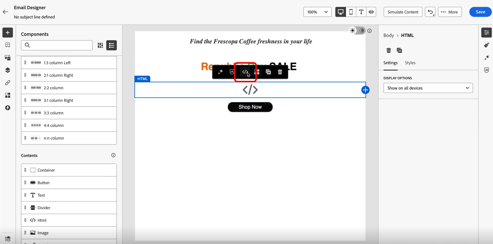
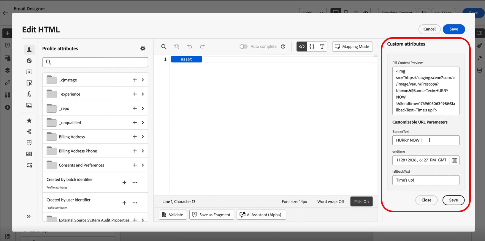

# 카운트다운 타이머 삽입 {#countdown}

수신자가 이메일을 열면 실시간으로 업데이트되는 Dynamic Media 카운트다운 타이머로 긴급도를 만들고 전환을 극대화합니다. 이 기능은 플래시 판매, 제한 시간 오퍼 및 시간에 민감한 프로모션에 이상적입니다.

예를 들어 소매 브랜드의 마케터는 48시간 플래시 세일을 실행합니다. 프로모션 이메일에 카운트다운 타이머를 사용하여 다음을 수행합니다.

* 즉시 여는 수신자에게는 &quot;47시간 남음&quot;이 표시됩니다.
* 24시간 후에 여는 수신자는 &quot;23시간 남음&quot;을 확인합니다.
* 판매 종료 후 오픈하는 수신자에게는 &quot;시간이 다 되었습니다!&quot;가 표시됩니다.

Adobe Experience Manager에서 Dynamic Media 템플릿에 카운트다운 타이머를 추가하는 방법에 대한 자세한 내용은 [이 문서](assets/do-not-localize/countdown.pdf)를 참조하십시오.

1. **[!DNL Adobe Experience Manager]**&#x200B;에서 Dynamic Media 템플릿을 만들고 카운트다운 타이머 구성 요소를 추가합니다.

   

1. **[!DNL Journey Optimizer]**&#x200B;에서 새 캠페인을 만들거나 기존 캠페인을 연 다음 이메일 Designer에 액세스합니다.

1. **HTML** 또는 **에셋** 구성 요소를 전자 메일 콘텐츠로 끌어다 놓습니다.

1. 구성 요소 위로 마우스를 가져간 후 **[!UICONTROL 소스 코드 표시]**(HTML 구성 요소의 경우) 또는 **[!UICONTROL 찾아보기]**(에셋 구성 요소의 경우)를 클릭합니다.

   

1. **[!UICONTROL HTML 편집]** 메뉴에서 **[!UICONTROL Assets]**(으)로 이동하고 **[!UICONTROL 자산 선택기 열기]**&#x200B;를 클릭하여 게시된 Dynamic Media 템플릿을 찾아 선택합니다.

   

1. 알약을 켜짐으로 전환하여 알약 경험을 활성화하십시오. 이렇게 하면 긴 속성 경로를 숨겨서 가독성이 향상됩니다.

   

1. **[!UICONTROL 사용자 지정 특성]** 메뉴에서 템플릿에 필요한 사용자 지정 가능한 URL 매개 변수를 구성합니다.

   완료되면 **[!UICONTROL 저장]**&#x200B;을 클릭하세요.

   

1. 또는 전자 메일 Designer에서 자산을 선택한 다음 **[!UICONTROL 설정]** 메뉴에 액세스하여 Dynamic Media 템플릿의 매개 변수에 액세스할 수도 있습니다.

   다음을 구성합니다.

   * **배너 텍스트**: 타이머에 표시되는 텍스트입니다.
   * **종료 시간**: 카운트다운이 만료되는 날짜와 시간입니다. GMT(그리니치 표준시)로만 시간을 입력합니다. 시스템에서 다른 시간대를 허용하지 않습니다.
   * **대체 텍스트**: 타이머가 끝난 후에 표시되는 메시지

   

1. 실시간 카운트다운 업데이트가 적용된 타이머를 보고 구성을 확인하려면 **[!UICONTROL 미리 보기]**&#x200B;를 클릭하세요.

수신자가 이메일을 열면 플래시 세일이 남은 정확한 시간을 보게 됩니다. 나중에 이메일을 다시 열면 카운트다운이 현재 남은 시간을 반영하도록 자동으로 업데이트됩니다. 종료 날짜 이후에 기본 메시지가 자동으로 표시됩니다.
