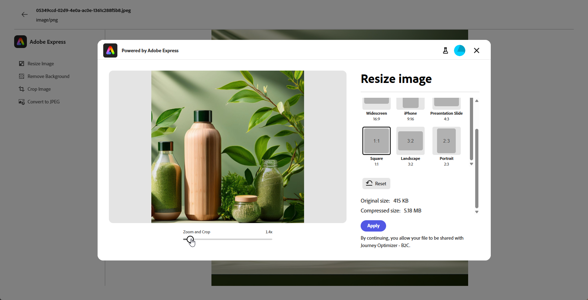
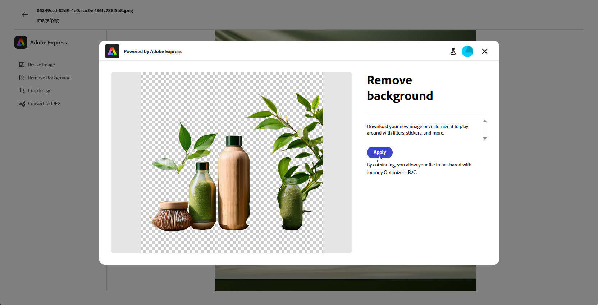
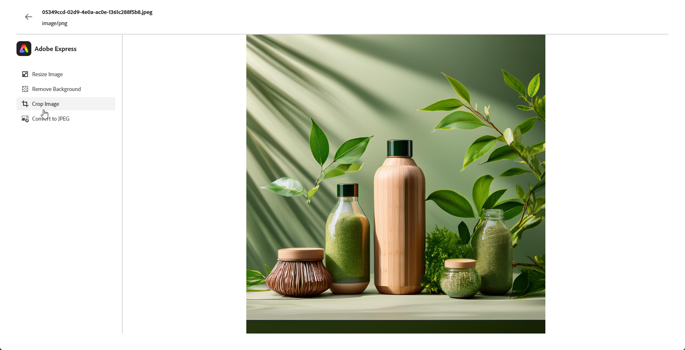

# [!DNL Adobe Express]로 자산 편집{#express}

>[!CONTEXTUALHELP]
>id="ajo_express_menu"
>title="Adobe Express 통합"
>abstract="Adobe Express 통합 기능을 활용하여 자산을 개인화합니다. 이 기능을 사용하면 이미지 크기를 조정하고, 배경을 제거하고, 시각 자료를 자르고, 자산을 JPEG 또는 PNG로 변환할 수 있습니다."

>[!AVAILABILITY]
>
>Adobe Journey Optimizer의 Adobe Express 통합은 현재 Healthcare Shield 또는 Privacy and Security Shield에서 사용할 수 없습니다.

Adobe Journey Optimizer의 Adobe Express 통합을 통해 콘텐츠를 만드는 동안 Adobe Express의 강력한 편집 도구에 쉽게 액세스할 수 있습니다. 이 통합을 통해 솔루션 간에 전환할 필요 없이 이미지 크기를 조정하고, 배경을 제거하고, 시각적 개체를 자르고, 자산을 JPEG 또는 PNG로 변환할 수 있습니다.

Adobe Express에 대한 자세한 내용은 [이 설명서](https://helpx.adobe.com/kr/express/user-guide.html)를 참조하세요.

**[!DNL Adobe Express]** 메뉴에 액세스하려면 전자 메일 디자이너에서 **이미지 설정**&#x200B;에 액세스한 다음 **[!UICONTROL Adobe Express에서 편집]**&#x200B;을 클릭하세요.

## 이미지 크기 조정 {#resize}

1. Adobe Express 메뉴에서 **[!UICONTROL 이미지 크기 조정]**&#x200B;을 선택합니다.

   

1. 자산의 비율에 가장 적합한 **[!UICONTROL 종횡비]**&#x200B;를 선택하십시오.

   

1. 슬라이더를 사용하여 에셋을 확대/축소하고 자르고, 드래그하여 표시 영역을 패닝 및 조정합니다.

   

1. 자산을 원래 상태로 복원하려면 **[!UICONTROL 재설정]**&#x200B;을 클릭하세요.

1. 이미지 크기 조정이 사용자의 요구를 충족하면 **[!UICONTROL 적용]**&#x200B;을 클릭합니다. 그런 다음 수정된 자산을 **[!UICONTROL 저장]**&#x200B;합니다.

1. **[!UICONTROL 이미지 업로드]** 창에서 **[!UICONTROL 다음]**&#x200B;을(를) 클릭하고 수정된 자산을 저장할 폴더를 선택하십시오.

   그런 다음 **[!UICONTROL 가져오기]**&#x200B;를 클릭합니다.

이제 이미지를 콘텐츠에서 사용할 준비가 되었습니다.

## 배경 제거 {#background}

1. Adobe Express 메뉴에서 **[!UICONTROL 배경 제거]**&#x200B;를 선택합니다.

   

1. 에셋은 배경색 없이 자동으로 표시됩니다.

   콘텐츠에서 사용하려면 **[!UICONTROL 적용]**&#x200B;을 클릭하세요.

   

1. **[!UICONTROL 저장]**&#x200B;을 클릭합니다.

1. **[!UICONTROL 이미지 업로드]** 창에서 **[!UICONTROL 다음]**&#x200B;을(를) 클릭하고 수정된 자산을 저장할 폴더를 선택하십시오.

   그런 다음 **[!UICONTROL 가져오기]**&#x200B;를 클릭합니다.

이제 이미지를 콘텐츠에서 사용할 준비가 되었습니다.

## 이미지 자르기 {#crop-image}

1. Adobe Express 메뉴에서 **[!UICONTROL 이미지 자르기]**&#x200B;를 선택합니다.

   

1. 모서리 핸들을 드래그하여 필요에 따라 이미지를 조정하고 자릅니다.

   

1. 콘텐츠에서 사용하려면 **[!UICONTROL 적용]**&#x200B;을 클릭하세요. 그런 다음 수정된 자산을 **[!UICONTROL 저장]**&#x200B;합니다.

1. **[!UICONTROL 이미지 업로드]** 창에서 **[!UICONTROL 다음]**&#x200B;을(를) 클릭하고 수정된 자산을 저장할 폴더를 선택하십시오.

   그런 다음 **[!UICONTROL 가져오기]**&#x200B;를 클릭합니다.

이제 이미지를 콘텐츠에서 사용할 준비가 되었습니다.

## JPEG 또는 PNG로 변환 {#convert}

1. Adobe Express 메뉴에서 이미지 원본 형식에 따라 **[!UICONTROL JPEG으로 변환]** 또는 **[!UICONTROL PNG로 변환]**&#x200B;을 선택합니다.

   

1. 전환을 시작하려면 **[!UICONTROL 적용]**&#x200B;을 클릭하세요.

   

1. **[!UICONTROL 저장]**&#x200B;을 클릭합니다.

1. 형식을 변경하면 다른 이름으로 새 이미지로 저장할 수 있습니다. **[!UICONTROL 이름]**&#x200B;을(를) 업데이트하고 **[!UICONTROL 저장]**&#x200B;을 클릭합니다.

   

1. **[!UICONTROL 이미지 업로드]** 창에서 **[!UICONTROL 다음]**&#x200B;을(를) 클릭하고 수정된 자산을 저장할 폴더를 선택하십시오.

   그런 다음 **[!UICONTROL 가져오기]**&#x200B;를 클릭합니다.

이제 이미지를 콘텐츠에서 사용할 준비가 되었습니다.
