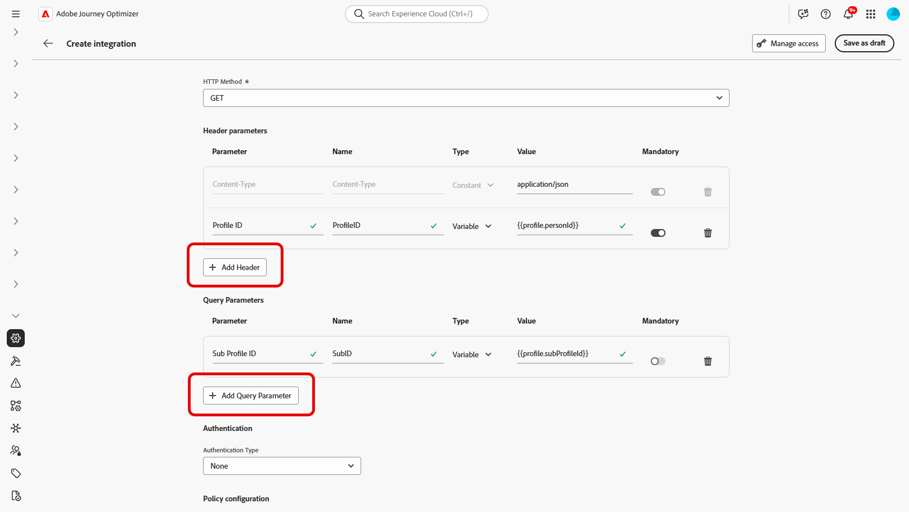

# 통합 작업 {#external-sources}

## 개요

**통합** 기능을 사용하면 타사 데이터 소스를 Adobe Journey Optimizer에 원활하게 통합할 수 있습니다. 이 기능을 사용하면 외부 데이터 및 콘텐츠 소스를 캠페인에 효율적으로 통합할 수 있으므로 여러 채널에 걸쳐 고도로 개인화되고 동적인 메시지를 전달할 수 있습니다.

이 기능을 사용하여 외부 데이터에 액세스하고 다음과 같은 서드파티 도구에서 콘텐츠를 가져올 수 있습니다.

* 충성도 시스템의 **보상 포인트**.
* 제품에 대한 **가격 정보**.
* 추천 엔진에서 **제품 추천**.
* **물류 업데이트**(게재 상태 등).

## 통합 구성 {#configure}

관리자는 다음 단계에 따라 외부 통합을 설정할 수 있습니다.

1. 왼쪽 메뉴에서 **[!UICONTROL 구성]** 섹션으로 이동한 다음 **[!UICONTROL 통합]** 카드에서 **[!UICONTROL 관리]**&#x200B;을 클릭합니다.

   그런 다음 **[!UICONTROL 통합 만들기]**&#x200B;를 클릭하여 새 구성을 시작합니다.

   

1. 통합을 위해 **[!UICONTROL 이름]** 및 **[!UICONTROL 설명]**&#x200B;을 제공하세요.

   >[!NOTE]
   >
   >이러한 필드에는 공백을 포함할 수 없습니다.

1. 레이블과 기본값을 사용하여 정의할 수 있는 변수가 있는 경로 매개 변수를 포함할 수 있는 API 끝점 **[!UICONTROL URL]**&#x200B;을(를) 입력하십시오.

1. **[!UICONTROL 이름]** 및 **[!UICONTROL 기본값]**&#x200B;을(를) 사용하여 **[!UICONTROL 경로 템플릿]**&#x200B;을(를) 구성하십시오.

   

1. GET과 POST 사이의 **[!UICONTROL HTTP 메서드]**&#x200B;를 선택합니다.

1. 통합에 필요한 경우 **[!UICONTROL 헤더 추가]** 및/또는 **[!UICONTROL 쿼리 매개 변수 추가]**&#x200B;를 클릭합니다. 각 매개 변수에 대해 다음 세부 사항을 제공합니다.

   * **[!UICONTROL 매개 변수]**:: 매개 변수를 참조하는 데 내부적으로 사용되는 고유 식별자입니다.

   * **[!UICONTROL 이름]**: API에 필요한 매개 변수의 실제 이름입니다.

   * **[!UICONTROL 유형]**: 고정 값으로 **상수**&#x200B;를 선택하거나 동적 입력으로 **변수**&#x200B;를 선택합니다.

   * **[!UICONTROL 값]**: 상수에 직접 값을 입력하거나 변수 매핑을 선택하십시오.

   * **[!UICONTROL 필수]**: 이 매개 변수가 필요한지 여부를 지정합니다.

   

1. **[!UICONTROL 인증 유형]** 선택:

   * **[!UICONTROL 인증 없음]**: 자격 증명이 필요하지 않은 열린 API의 경우.

   * **[!UICONTROL API 키]**: 정적 API 키를 사용하여 요청을 인증합니다. **[!UICONTROL API 키 이름{&#x200B;1},]** API 키 값{3&#x200B;}을(를) 입력하고 **[!UICONTROL 위치]**&#x200B;를 지정하십시오.****

   * **[!UICONTROL 기본 인증]**: 표준 HTTP 기본 인증을 사용합니다. **[!UICONTROL 사용자 이름]** 및 **[!UICONTROL 암호]**&#x200B;를 입력하십시오.

   * **[!UICONTROL OAuth 2.0]**: OAuth 2.0 프로토콜을 사용하여 인증합니다.  아이콘을 클릭하여 **[!UICONTROL 페이로드]**&#x200B;를 구성하거나 업데이트합니다.

   

1. API 요청에 대해 **[!UICONTROL 시간 초과]** 기간과 같은 **[!UICONTROL 정책 구성]**&#x200B;을(를) 설정하고 제한, 캐시 및/또는 다시 시도하도록 선택하십시오.

1. **[!UICONTROL 응답 페이로드]** 필드를 사용하여 메시지 개인화에 사용해야 하는 샘플 출력의 필드를 결정할 수 있습니다.

    아이콘을 클릭하고 샘플 JSON 응답 페이로드를 붙여 넣어 데이터 형식을 자동으로 검색합니다.

1. 개인화를 위해 표시할 필드를 선택하고 해당 데이터 유형을 지정합니다.

   

1. **[!UICONTROL 테스트 연결 보내기]**&#x200B;를 사용하여 통합의 유효성을 검사합니다.

   유효성을 검사하면 **[!UICONTROL 활성화]**&#x200B;를 클릭합니다.

## 개인화에 외부 통합 사용 {#personalization}

마케터는 구성된 통합을 사용하여 콘텐츠를 개인화할 수 있습니다. 다음 단계를 수행하십시오.

1. 캠페인 콘텐츠에 액세스하고 텍스트 또는 HTML **[!UICONTROL 구성 요소]**&#x200B;에서 **[!UICONTROL 개인화 추가]**&#x200B;를 클릭하세요.

[구성 요소에 대해 자세히 알아보기](../email/content-components.md)

   

1. 모든 활성 통합을 보려면 **[!UICONTROL 통합]** 섹션으로 이동하고 **[!UICONTROL 통합 열기]**&#x200B;를 클릭하십시오.

   

1. 통합을 선택하고 **[!UICONTROL 저장]**&#x200B;을 클릭합니다.

   

1. **[!UICONTROL 알약]** 모드를 활성화하여 고급 통합 메뉴를 잠금 해제합니다.

   

1. 통합 설정을 완료하려면 이전에 [구성](#configure) 중에 지정한 통합 특성을 정의하세요.

   일정하게 유지되는 정적 값이나 사용자 프로필에서 정보를 동적으로 가져오는 프로필 속성을 사용하여 이러한 속성에 값을 할당할 수 있습니다.

   

1. 통합 특성이 정의되면 이제  아이콘을 클릭하여 개인화된 메시지를 보내는 데 콘텐츠의 통합 필드를 사용할 수 있습니다.

   

1. **[!UICONTROL 저장]**&#x200B;을 클릭합니다.

이제 통합 개인화가 귀하의 콘텐츠에 성공적으로 적용되어 각 수신자가 귀하가 구성한 속성에 따라 맞춤형의 관련 경험을 받게 됩니다.

