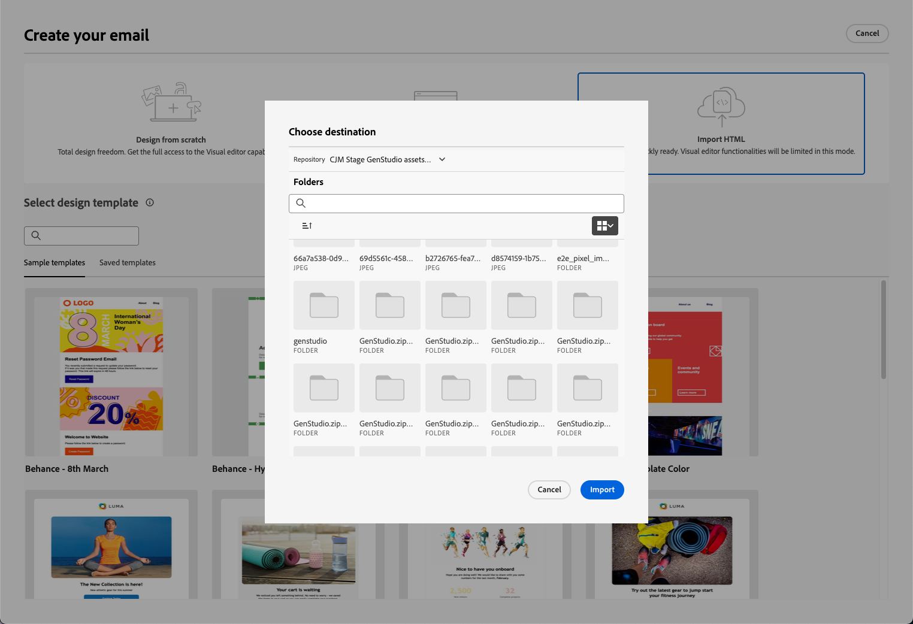
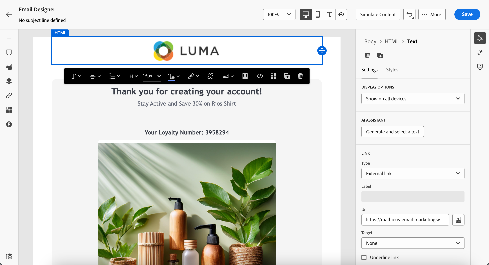

# GenStudio for Performance Marketing 작업 {#ajo-genstudio}

>[!CONTEXTUALHELP]
>id="ajo_genstudio_button"
>title="GenStudio에서 제작된 템플릿 사용하기"
>abstract="Adobe GenStudio for Performance Marketing과의 원활한 통합 덕분에 Adobe AI 기술로 향상된 GenStudio 템플릿을 손쉽게 가져올 수 있습니다."

## GenStudio 시작 {#gs-genstudio}

[Adobe GenStudio for Performance Marketing](https://experienceleague.adobe.com/ko/docs/genstudio-for-performance-marketing/user-guide/home){target="_blank"}은(는) 마케팅 팀이 고유한 광고 및 이메일을 만들어 브랜드 표준을 준수하고 엔터프라이즈 정책을 준수하는 영향력이 크고 개인화된 마케팅 캠페인을 유도할 수 있는 생성 AI 우선 애플리케이션입니다. Adobe AI 기술을 활용함으로써 크리에이티브가 혁신에 집중할 수 있도록 콘텐츠 생성 및 관리의 복잡성을 간소화하는 포괄적인 도구 모음을 제공합니다.

>[!AVAILABILITY]
>
>* [!DNL Adobe Journey Optimizer]의 GenStudio 통합은 현재 **Healthcare Shield** 또는 **Privacy and Security Shield** 추가 기능과 함께 사용할 수 없습니다.
>
>* 이 기능은 이메일 채널에만 사용할 수 있습니다.

마케팅 효율성을 높이고 브랜드 일관성을 유지하기 위해 [!DNL **GenStudio for Performance Marketing**] 경험을 [!DNL **Adobe Journey Optimizer**]&#x200B;과(와) 원활하게 통합할 수 있습니다. 이를 통해 [!DNL GenStudio]의 고급 오케스트레이션 기능과 함께 [!DNL Journey Optimizer]의 AI 기반 콘텐츠 생성을 활용할 수 있습니다.

>[!INFO]
>
>더 자세히 알아보려면 이 [개요](https://business.adobe.com/products/genstudio-for-performance-marketing.html#watch-overview){target="_blank"}와 [의 &#x200B;](https://business.adobe.com/products/genstudio-for-performance-marketing.html#demo){target="_blank"}데모[!DNL Adobe GenStudio for Performance Marketing]을(를) 확인하십시오.

➡️ [비디오에서 이 기능 살펴보기](#video)

## 전제 조건 {#genstudio-prerequisites}

[!DNL GenStudio for Performance Marketing]과(와) [!DNL Journey Optimizer] 통합을 사용하려면 다음 요구 사항이 충족되었는지 확인하십시오.

* 조직에 [!DNL GenStudio for Performance Marketing]에 대한 활성 라이선스가 있어야 합니다.

* [!DNL GenStudio for Performance Marketing]과(와) [!DNL Adobe Journey Optimizer]은(는) 모두 동일한 IMS 조직에 속해야 합니다.

* 통합 기능을 활용하려면 **에서 사용자에게 최소** Collaborator[!DNL GenStudio for Performance Marketing] 이상의 역할이 있어야 합니다. [GenStudio에서 사용자 역할에 대해 자세히 알아보기](https://experienceleague.adobe.com/en/docs/genstudio-for-performance-marketing/user-guide/intro/user-roles){target="_blank"}

<!--To access the GenStudio integration in [!DNL Adobe Journey Optimizer] feature, users need to be granted the **xxx** permission. [Learn more](../administration/permissions.md)

>[!IMPORTANT]
>
>* Before starting using this capability, read out related [Guardrails and Limitations](#generative-guardrails).-->

<!--Guardrails and limitations {#genstudio-guardrails}

General guidelines for using the GenStudio integration in [!DNL Adobe Journey Optimizer] for email generation are listed below:

See if guidelines/limitations such as the ones listed [here](../content-management/gs-generative.md#generative-guardrails) for AI Assistant can apply.

The following limitations apply to GenStudio integration in [!DNL Adobe Journey Optimizer]:-->

## Journey Optimizer의 GenStudio 기능 활용 {#use-genstudio}

[!DNL GenStudio for Performance Marketing] 및 [!DNL Journey Optimizer] 통합을 사용하면 회사 마케터가 함께 더 효율적으로 작업하여 프로세스를 간소화할 수 있습니다.

예를 들어 [!DNL Journey Optimizer]을(를) 사용하여 이메일 캠페인을 개발 및 자동화하는 기술 마케터는 [!DNL GenStudio]을(를) 사용하여 콘텐츠를 만드는 성능 마케터와 공동 작업을 수행할 수 있습니다.

이 통합을 통해 두 플랫폼 모두 함께 작동하여 [!DNL GenStudio]의 브랜드 내 콘텐츠를 [!DNL Journey Optimizer]&#x200B;(으)로 쉽게 통합하여 특정 고객 세그먼트를 타겟팅하고 판매를 촉진하는 매력적인 이메일을 제공할 수 있습니다.

### 주요 기능 {#genstudio-capabilities}

이 통합을 통해 마케팅 조직의 강력한 기능이 잠금 해제됩니다.

* **AI 기반 콘텐츠 생성**: Adobe의 생성 AI를 활용하여 지능형 카피 제안 및 디자인 요소를 통해 여러 브랜드 내 이메일 변형을 효율적으로 만들 수 있습니다.

* **원활한 워크플로 통합**: Journey Optimizer 이메일 템플릿을 GenStudio으로 내보내고 AI 프롬프트로 변형을 만든 다음 간소화된 프로세스에서 다시 Journey Optimizer으로 가져옵니다.

* **중앙 집중식 에셋 관리**: Adobe Experience Manager Assets에서 제공하는 GenStudio의 ContentHub에 액세스하여 모든 디지털 에셋을 하나의 중앙 위치에서 구성, 저장 및 검색할 수 있습니다.

* **콘텐츠 실험**: 여러 GenStudio 이메일 변형을 Journey Optimizer으로 가져오고 실험 기능을 활용하여 가장 성과가 좋은 콘텐츠를 테스트하고 식별합니다.

* **성과 기반 인사이트**: AI 기반 분석으로 캠페인 성과를 추적하여 대상자에게 공감하는 크리에이티브 요소를 이해하고 향후 캠페인을 최적화합니다.

### 일반적인 사용 사례 {#genstudio-use-cases}

[!DNL GenStudio for Performance Marketing]과(와) 간의 통합
Journey Optimizer&rbrack;은(는) 다양한 마케팅 시나리오를 지원합니다.

* **제품 출시 캠페인**: 제품 공지에 대한 여러 이메일 변형을 빠르게 생성하고, 다양한 대상 세그먼트로 테스트하고, 고객 기반에서 우수성이 검증된 버전을 확장하십시오.

* **휴일 및 계절별 프로모션**: GenStudio 템플릿을 사용하여 시간에 민감한 캠페인 콘텐츠를 규모에 맞게 제작하여 엄격한 기한을 준수하면서 브랜드 일관성을 보장합니다.

* **규모에 맞는 A/B 테스트**: GenStudio에서 다양한 콘텐츠 변형을 만들고 Journey Optimizer에서 체계적으로 테스트하여 이메일 성능을 지속적으로 개선합니다.

* **다중 세그먼트 개인화**: GenStudio에서 다양한 고객 담당자를 위해 맞춤 콘텐츠를 생성한 다음 최대 관련성을 위해 Journey Optimizer의 해당 세그먼트에 각 변형을 배포합니다.

## GenStudio 통합 사용 {#how-to-use}

통합 워크플로우는 템플릿을 Journey Optimizer에서 GenStudio으로 내보내는 단계와 GenStudio 경험을 다시 Journey Optimizer으로 가져오는 단계의 두 가지 주요 단계로 구성됩니다.

### Journey Optimizer에서 GenStudio으로 HTML 템플릿 내보내기 {#export-from-ajo-to-genstudio}

브랜드의 지침이 포함된 [!DNL Journey Optimizer] HTML 템플릿을 [!DNL GenStudio for Performance Marketing]&#x200B;(으)로 내보내는 것부터 시작하십시오. 아래 단계를 수행합니다.

1. [!DNL Journey Optimizer]에서 여정 또는 캠페인의 전자 메일 콘텐츠에 액세스합니다. [방법 알아보기](../email/get-started-email-design.md#key-steps)

1. 이메일 Designer의 **[!UICONTROL 자세히]** 단추에서 **[!UICONTROL HTML 내보내기]**&#x200B;를 선택합니다.

   {zoomable="yes"}

1. 이 HTML 내보내기 템플릿을 [!DNL GenStudio for Performance Marketing]에 업로드합니다. <!--Make sure you detect the fields that the generative AI uses to insert content in order to create an actionable template.-->

   >[!NOTE]
   >
   >HTML 템플릿을 [!DNL GenStudio]Adobe GenStudio for Performance Marketing 사용 안내서[&#x200B; 전용 섹션에서 &#x200B;](https://experienceleague.adobe.com/en/docs/genstudio-for-performance-marketing/user-guide/content/templates/use-templates#templates-from-ajo-and-marketo){target="_blank"}에 업로드하는 방법을 알아봅니다.

1. GenStudio에서 이 템플릿을 사용하여 AI 프롬프트가 있는 여러 이메일 변형을 만들고 저장합니다.

   >[!NOTE]
   >
   >GenStudio 전용 [섹션](https://experienceleague.adobe.com/en/docs/genstudio-for-performance-marketing/user-guide/create/create-email-experience){target="_blank"}에서 전자 메일 경험을 만드는 방법을 알아봅니다.

### Journey Optimizer에서 GenStudio 경험 활용 {#leverage-genstudio-experiences}

GenStudio에서 전자 메일 변형을 만든 후 [!DNL Journey Optimizer]&#x200B;(으)로 다시 가져와 캠페인에서 사용합니다. 아래 단계를 수행합니다.

1. [!DNL Journey Optimizer]에서 [캠페인에 전자 메일을 추가](../email/create-email.md)합니다.

1. 캠페인 구성 화면에서 [콘텐츠 편집 화면](../email/create-email.md#define-email-content)을 클릭하고 **[!UICONTROL 이메일 본문 편집]**&#x200B;을 클릭하여 이메일 Designer을 엽니다. [방법 알아보기](../email/get-started-email-design.md#key-steps)

1. Designer 전자 메일 홈페이지에서 **[!UICONTROL HTML 가져오기]**&#x200B;를 선택하고 **[!UICONTROL Adobe GenStudio for Performance Marketing]** 단추를 클릭합니다.

   {zoomable="yes"}

1. GenStudio 경험을 탐색하여 콘텐츠 빌드를 시작합니다. 제품, 가상 사용자, 브랜드 또는 색상과 같은 여러 기준에 따라 경험을 필터링할 수 있습니다.

   <!--{zoomable="yes"}-->

1. 경험을 선택하고 **[!UICONTROL 사용]**&#x200B;을 클릭하세요.

   {zoomable="yes"}

1. GenStudio 경험을 가져올 폴더를 선택합니다.

   {zoomable="yes"}

1. 선택한 콘텐츠가 이메일 Designer에 표시됩니다.

   {zoomable="yes"}

   >[!NOTE]
   >
   >[템플릿 [!DNL Journey Optimizer] 에서 만든 GenStudio 경험 &#x200B;](#export-from-ajo-to-genstudio)을(를) 전체 편집 기능이 있는 이메일 Designer으로 직접 가져옵니다. [!DNL Journey Optimizer] 템플릿 없이 만든 GenStudio 경험을 [호환성 모드](../email/existing-content.md)(으)로 가져옵니다. 편집 기능이 제한될 수 있습니다.

1. [전자 메일 콘텐츠 편집 도구](../email/content-from-scratch.md) 및 [개인화 필드](../personalization/personalize.md)를 사용하여 필요에 따라 전자 메일을 편집하세요. 콘텐츠를 저장합니다.

1. 캠페인 요약 페이지로 돌아가서 **[!UICONTROL 실험 만들기]**&#x200B;를 클릭하여 실험을 사용하십시오. [콘텐츠 실험을 만드는 방법을 알아봅니다](../content-management/content-experiment.md)

   <!--{zoomable="yes"}-->

1. [!DNL GenStudio]에서 만든 다른 전자 메일 경험 변형을 가져오고 빠르게 활용하려면 몇 가지 처리를 만들고 위의 단계를 반복합니다.

   {zoomable="yes"}

1. 변경 내용을 저장하고 캠페인을 [활성화](../campaigns/review-activate-campaign.md)합니다.

1. 실험을 실행한 후 [실험 캠페인 보고서](../reports/campaign-global-report-cja-experimentation.md)를 사용하여 캠페인 처리가 어떻게 수행되는지 추적합니다. 그런 다음 실험 결과를 해석할 수 있습니다. [방법 알아보기](../content-management/get-started-experiment.md#interpret-results)

## 자주 묻는 질문 {#genstudio-faq}

[!DNL GenStudio for Performance Marketing]과의 [!DNL Journey Optimizer] 통합에 대한 일반적인 질문에 대한 답변을 찾아보십시오.

+++이메일 이외의 채널에 GenStudio 통합을 사용할 수 있습니까?

현재 [!DNL GenStudio for Performance Marketing] 통합은 전자 메일 채널에만 사용할 수 있습니다. 추가 채널에 대한 지원은 향후 릴리스에서 추가될 수 있습니다.
+++

+++모든 Journey Optimizer 고객이 GenStudio 통합을 사용할 수 있습니까?

**의료 서비스 실드** 또는 **개인 정보 보호 및 보안 실드** 추가 기능 서비스를 사용하는 조직에서는 현재 통합을 사용할 수 없습니다.
+++

+++GenStudio 콘텐츠를 Journey Optimizer으로 가져온 후 편집할 수 있습니까?

예. GenStudio 경험을 [!DNL Journey Optimizer]&#x200B;(으)로 가져온 후에는 Designer의 [콘텐츠 편집 도구](../email/content-from-scratch.md)를 사용하고 [개인화 필드](../personalization/personalize.md)를 추가하여 이메일 콘텐츠를 추가로 사용자 지정할 수 있습니다.
+++

+++Journey Optimizer 템플릿 없이 만든 GenStudio 경험은 어떻게 됩니까?

[!DNL Journey Optimizer] 템플릿에서 만든 GenStudio 경험을 이메일 Designer으로 직접 가져옵니다. [!DNL Journey Optimizer] 템플릿 없이 만든 GenStudio 경험을 [호환성 모드](../email/existing-content.md)(으)로 가져옵니다.
+++

+++Journey Optimizer에서 여러 GenStudio 이메일 변형을 테스트할 수 있습니까?

예. 다양한 GenStudio 이메일 변형을 가져와서 여러 콘텐츠 처리를 만들고 Journey Optimizer의 [콘텐츠 실험](../content-management/content-experiment.md) 기능을 사용하여 대상자에게 가장 적합한 변형을 테스트할 수 있습니다.
+++

+++GenStudio은 어떻게 브랜드 일관성을 보장합니까?

GenStudio은 AI 기반 브랜드 확인을 사용하여 생성된 모든 콘텐츠가 브랜드 표준 및 지침을 준수하는지 확인합니다. 브랜드 요소를 포함하는 템플릿을 업로드할 때 GenStudio은 이러한 표준을 플랫폼 내에서 생성된 모든 콘텐츠 변형에 적용합니다.
+++

+++GenStudio 경험에서 다른 팀 구성원과 공동 작업을 수행할 수 있습니까?

예, GenStudio은 공동 작업을 위해 설계되었습니다. 적절한 권한이 있는 여러 팀 구성원이 이메일 경험을 [!DNL Journey Optimizer]&#x200B;(으)로 가져오기 전에 만들고 구체화하는 작업을 함께 수행할 수 있습니다.
+++

## 사용 방법 비디오 {#video}

Journey Optimizer에서 GenStudio for Performance Marketing으로 이메일 템플릿을 내보내고, GenStudio에서 템플릿을 사용하여 브랜드 양식을 준수하는 이메일을 작성하고, 이를 Journey Optimizer로 원활하게 다시 가져오는 과정을 살펴봅니다.

>[!VIDEO](https://video.tv.adobe.com/v/3456038/?quality=12)