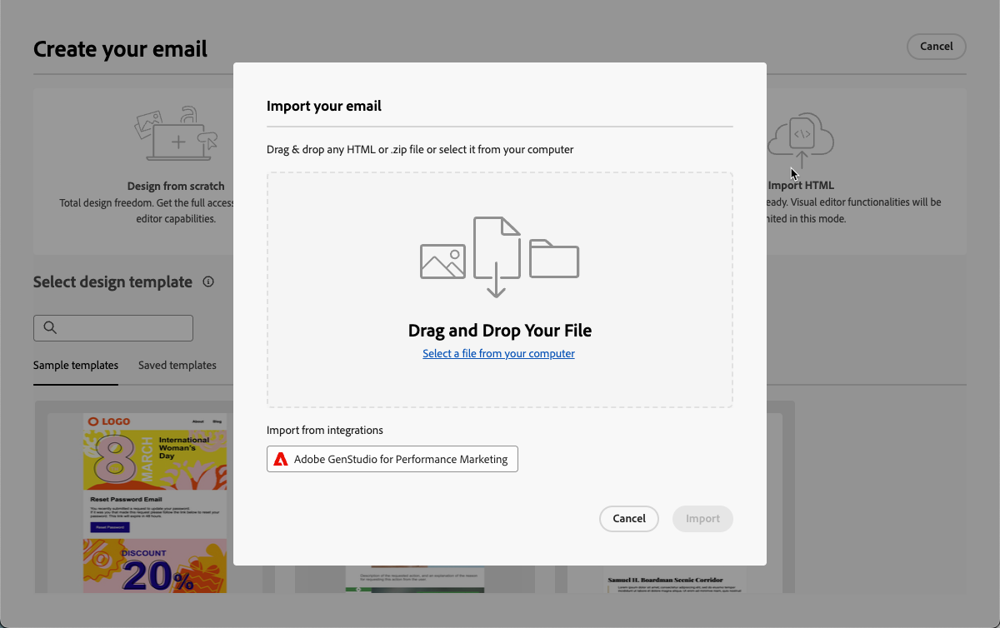

# GenStudio 통합 시작하기 {#gs-genstudio}

>[!CONTEXTUALHELP]
>id="ajo_genstudio_button"
>title="GenStudio에서 제작된 템플릿 사용하기"
>abstract="Adobe GenStudio for Performance Marketing과의 원활한 통합 덕분에 Adobe AI 기술로 향상된 GenStudio 템플릿을 손쉽게 가져올 수 있습니다."

>[!AVAILABILITY]
>
>[!DNL Adobe Journey Optimizer]의 GenStudio 통합은 현재 **Healthcare Shield** 또는 **Privacy and Security Shield** 추가 기능 오퍼링에서 사용할 수 없습니다.
>
>이 기능은 이메일 채널에서만 사용할 수 있습니다.

[Adobe GenStudio for Performance Marketing](https://business.adobe.com/products/genstudio-for-performance-marketing.html){target="_blank"}은(는) 마케팅 팀이 고유한 광고 및 이메일을 만들어 브랜드 표준을 준수하고 엔터프라이즈 정책을 준수하는 영향력이 크고 개인화된 마케팅 캠페인을 유도할 수 있는 생성 AI 우선 애플리케이션입니다. Adobe AI 기술을 활용함으로써 크리에이티브가 혁신에 집중할 수 있도록 콘텐츠 생성 및 관리의 복잡성을 간소화하는 포괄적인 도구 모음을 제공합니다.

전용 [설명서](https://experienceleague.adobe.com/ko/docs/genstudio-for-performance-marketing/user-guide/home){target="_blank"}에서 [!DNL GenStudio for Performance Marketing]에 대해 자세히 알아보세요.

>[!INFO]
>
>더 자세히 알아보려면 이 [개요](https://business.adobe.com/products/genstudio-for-performance-marketing.html#watch-overview){target="_blank"}와 [!DNL Adobe GenStudio for Performance Marketing]의 [데모](https://business.adobe.com/products/genstudio-for-performance-marketing.html#demo){target="_blank"}을(를) 확인하십시오.

<!--To access the GenStudio integration in [!DNL Adobe Journey Optimizer] feature, users need to be granted the **xxx** permission. [Learn more](../administration/permissions.md)

>[!IMPORTANT]
>
>* Before starting using this capability, read out related [Guardrails and Limitations](#generative-guardrails).-->

마케팅 효율성을 높이고 브랜드 일관성을 유지하기 위해 [!DNL **GenStudio for Performance Marketing**] 경험을 [!DNL **Adobe Journey Optimizer**]&#x200B;과(와) 원활하게 통합할 수 있습니다. 이를 통해 [!DNL Journey Optimizer]의 고급 오케스트레이션 기능과 함께 [!DNL GenStudio]의 AI 파워 콘텐츠 생성을 활용할 수 있습니다.

<!---->

<!--Guardrails and limitations {#genstudio-guardrails}

General guidelines for using the GenStudio integration in [!DNL Adobe Journey Optimizer] for email generation are listed below:

See if guidelines/limitations such as the ones listed [here](gs-generative.md#generative-guardrails) for the AI Assistant can apply.

The following limitations apply to GenStudio integration in [!DNL Adobe Journey Optimizer]:-->

## Journey Optimizer의 GenStudio 기능 활용 {#use-genstudio}

[!DNL GenStudio for Performance Marketing] 및 [!DNL Journey Optimizer] 통합을 사용하면 회사 마케터가 함께 더 효율적으로 작업하여 프로세스를 간소화할 수 있습니다.

예를 들어 [!DNL Journey Optimizer]을(를) 사용하여 이메일 캠페인을 개발 및 자동화하는 기술 마케터는 [!DNL GenStudio]을(를) 사용하여 콘텐츠를 만드는 성능 마케터와 공동 작업을 수행할 수 있습니다.

이 통합을 통해 두 플랫폼 모두 함께 작동하여 [!DNL GenStudio]의 브랜드 내 콘텐츠를 [!DNL Journey Optimizer]&#x200B;(으)로 쉽게 통합하여 특정 고객 세그먼트를 타겟팅하고 판매를 촉진하는 매력적인 이메일을 제공할 수 있습니다.

### Journey Optimizer에서 GenStudio으로 HTML 템플릿 내보내기 {#export-from-ajo-to-genstudio}

먼저 브랜드 지침을 포함하는 [!DNL Journey Optimizer] HTML 템플릿을 [!DNL GenStudio for Performance Marketing]&#x200B;(으)로 내보낼 수 있습니다. 아래 단계를 수행합니다.

1. [!DNL Journey Optimizer]에서 여정 또는 캠페인의 전자 메일 콘텐츠에 액세스합니다. [방법 알아보기](../email/get-started-email-design.md#key-steps)

1. 이메일 Designer의 **[!UICONTROL 자세히]** 단추에서 **[!UICONTROL HTML 내보내기]**&#x200B;를 선택합니다.

   {zoomable="yes"}

1. 이 HTML 내보내기 템플릿을 [!DNL GenStudio for Performance Marketing]에 업로드합니다. <!--Make sure you detect the fields that the generative AI uses to insert content in order to create an actionable template.-->

   >[!NOTE]
   >
   >HTML 템플릿을 [Adobe GenStudio for Performance Marketing 사용 안내서](https://experienceleague.adobe.com/en/docs/genstudio-for-performance-marketing/user-guide/content/templates/use-templates#templates-from-ajo-and-marketo){target="_blank"} 전용 섹션에서 [!DNL GenStudio]에 업로드하는 방법을 알아봅니다.

1. GenStudio에서 이 템플릿을 사용하여 AI 프롬프트가 있는 여러 이메일 변형을 만들고 저장합니다.

   >[!NOTE]
   >
   >GenStudio 전용 [섹션](https://experienceleague.adobe.com/en/docs/genstudio-for-performance-marketing/user-guide/create/create-email-experience){target="_blank"}에서 전자 메일 경험을 만드는 방법을 알아봅니다.

### Journey Optimizer에서 GenStudio 경험 활용 {#leverage-genstudio-experiences}

[!DNL Journey Optimizer]&#x200B;(으)로 가져와서 방금 만든 [!DNL GenStudio] 전자 메일 변형을 활용하려면 아래 단계를 따르십시오.

1. [!DNL Journey Optimizer]에서 [캠페인에 전자 메일을 추가](../email/create-email.md)합니다.

1. 캠페인 구성 화면에서 [콘텐츠 편집 화면](../email/create-email.md#define-email-content)을 클릭하고 **[!UICONTROL 이메일 본문 편집]**&#x200B;을 클릭하여 이메일 Designer을 엽니다. [방법 알아보기](../email/get-started-email-design.md#key-steps)

1. Designer 전자 메일 홈페이지에서 **[!UICONTROL HTML 가져오기]**&#x200B;를 선택하고 **[!UICONTROL Adobe GenStudio for Performance Marketing]** 단추를 클릭합니다.

   {zoomable="yes"}

1. GenStudio 경험을 탐색하여 콘텐츠 빌드를 시작합니다. 제품, 가상 사용자, 브랜드 또는 색상과 같은 여러 기준에 따라 경험을 필터링할 수 있습니다.

   <!--{zoomable="yes"}-->

1. 경험을 선택하고 **[!UICONTROL 사용]**&#x200B;을 클릭하세요.

   {zoomable="yes"}

1. GenStudio 경험을 가져올 폴더를 선택합니다.

   {zoomable="yes"}

1. 선택한 콘텐츠가 이메일 Designer에 표시됩니다.

   {zoomable="yes"}

   >[!NOTE]
   >
   > [!DNL Journey Optimizer] 템플릿](#export-from-ajo-to-genstudio)에서 만든 GenStudio 경험 [을(를) 이메일 Designer으로 직접 가져옵니다. [!DNL Journey Optimizer] 템플릿 없이 만든 GenStudio 경험을 [호환성 모드](../email/existing-content.md)(으)로 가져옵니다.

   [전자 메일 콘텐츠 편집 도구](../email/content-from-scratch.md) 및 [개인화 필드](../personalization/personalize.md)를 사용하여 전자 메일을 원하는 대로 편집하세요. 콘텐츠를 저장합니다.

1. 캠페인 요약 페이지로 돌아가서 **[!UICONTROL 실험 만들기]**&#x200B;를 클릭하여 실험을 사용하십시오. [콘텐츠 실험을 만드는 방법을 알아봅니다](../content-management/content-experiment.md)

   <!--{zoomable="yes"}-->

1. [!DNL GenStudio]에서 만든 다른 전자 메일 경험 변형을 가져오고 빠르게 활용하려면 몇 가지 처리를 만들고 위의 단계를 반복합니다.

   {zoomable="yes"}

1. 변경 내용을 저장하고 캠페인을 [활성화](../campaigns/review-activate-campaign.md)합니다.

실험을 실행한 후 [실험 캠페인 보고서](../reports/campaign-global-report-cja-experimentation.md)를 사용하여 캠페인 처리가 어떻게 수행되는지 추적합니다. 그런 다음 실험 결과를 해석할 수 있습니다. [방법 알아보기](../content-management/get-started-experiment.md#interpret-results)
