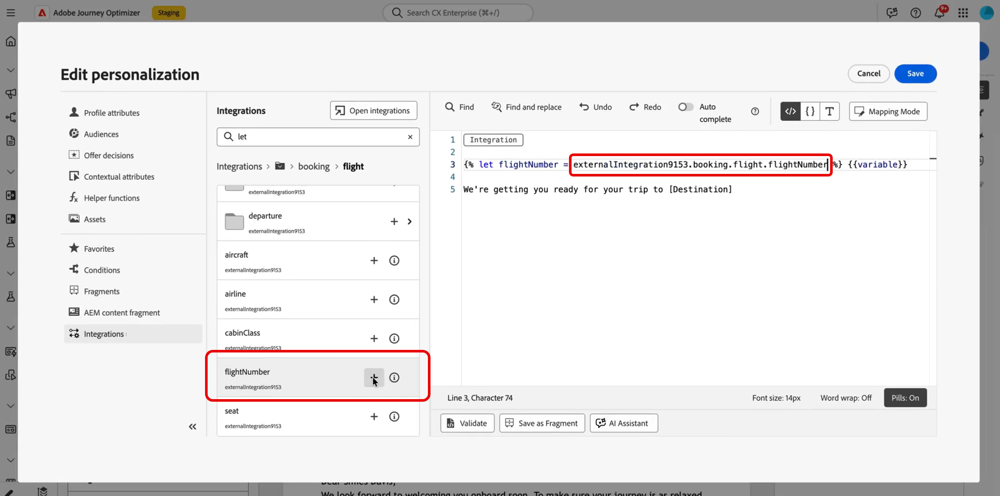

# 개인화에 외부 통합 사용 {#integrations-personalization}

>[!BEGINSHADEBOX]

**이 페이지에서:** 마케터가 구성된 통합을 적용하여 전자 메일, SMS 및 푸시 콘텐츠를 개인화하고 API 호출을 다른 호출로 연결하여 더 풍부하고 다이내믹한 메시지를 보내는 방법을 알아봅니다.

>[!ENDSHADEBOX]

콘텐츠에서 외부 통합을 사용하기 전에 관리자가 [통합 작업](integrations.md)에 설명된 대로 각 통합(끝점, 인증, 정책, 응답 페이로드 및 활성화)을 **구성 및 활성화**&#x200B;했는지 확인하십시오.

메시지에 **[!UICONTROL 조각]**&#x200B;당 최대 **3** 통합 및 최대 **5**&#x200B;을 추가할 수 있습니다. 조각에서만 제공되는 통합은 **5**&#x200B;에 포함되지 않습니다.

## 콘텐츠에 통합 개인화 적용 {#apply-integration-personalization}

마케터는 구성된 통합을 사용하여 콘텐츠를 개인화할 수 있습니다. 다음 단계를 수행하십시오.

1. 캠페인 콘텐츠에 액세스하고 텍스트 또는 HTML **[!UICONTROL 구성 요소]**&#x200B;에서 **[!UICONTROL 개인화 추가]**&#x200B;를 클릭하세요.

   [구성 요소에 대해 자세히 알아보기](../email/content-components.md)

   

1. 모든 활성 통합을 보려면 **[!UICONTROL 통합]** 섹션으로 이동하고 **[!UICONTROL 통합 열기]**&#x200B;를 클릭하십시오.

   **Journey Optimizer 조각**&#x200B;은(는) 통합에서 사용할 수 있지만 아웃바운드 채널만 지원합니다. 조각이 게시되면 기존 여정 및 캠페인에 영향을 주지 않도록 새 통합 추가 및 저장이 비활성화됩니다.

   

1. 통합을 선택하고 **[!UICONTROL 저장]**&#x200B;을 클릭합니다.

   

1. **[!UICONTROL 알약]** 모드를 활성화하여 고급 통합 메뉴를 잠금 해제합니다.

   

1. 통합 개인화를 작성할 때 통합 도우미에는 오류 또는 누락된 데이터가 기본 콘텐츠와 상호 작용하는 방법을 정의하는 **`required`** 필드가 포함됩니다.

   * **`required=true`**(기본값): 해당 메시지에 대한 렌더링이 중지됩니다. 전송이 **`ExternalDataLookupExclusion`**(으)로 제외되며 해당 제외는 **메시지 피드백 데이터 세트**&#x200B;에 기록됩니다.
   * **`required=false`**: 결과 변수가 **`null`**(으)로 설정되어 렌더링이 계속됩니다. 통합에서 데이터를 반환하지 않을 때 프로필이 빈 콘텐츠를 수신하지 않도록 템플릿에 기본 텍스트, 폴백 또는 조건부 논리를 사용하십시오.

     

1. 통합 설정을 완료하려면 이전에 [구성](integrations.md#configure) 중에 지정한 통합 특성을 정의하세요.

   일정하게 유지되는 정적 값이나 사용자 프로필에서 정보를 동적으로 가져오는 프로필 속성을 사용하여 이러한 속성에 값을 할당할 수 있습니다.

   

1. 통합 특성이 정의되면 이제  아이콘을 클릭하여 개인화된 메시지를 보내는 데 콘텐츠의 통합 필드를 사용할 수 있습니다.

   

   >[!NOTE]
   >
   >템플릿의 토큰은 통합 구성에 노출된 관리자 필드만 사용해야 합니다. 예를 들어 `temperature`이(가) 노출되면 `{{weatherResponse.temperature}}`이(가) 유효하며, `humidity`이(가) 노출되지 않으면 편집기에서 `{{weatherResponse.humidity}}`이(가) 거부됩니다.

1. **[!UICONTROL 저장]**&#x200B;을 클릭합니다.

이제 통합 개인화가 귀하의 콘텐츠에 성공적으로 적용되어 각 수신자가 귀하가 구성한 속성에 따라 맞춤형의 관련 경험을 받게 됩니다.


## 한 API 호출을 다른 API 호출에 매핑 {#map-integration-chain}

한 호출의 결과가 경로 세그먼트, 헤더 또는 쿼리 매개 변수와 같은 다음 결과를 제공하도록 통합을 연결할 수 있습니다. 호출은 동일한 메시지에서 순서대로 실행되므로 사용자 지정 코드 없이 보다 풍부한 개인화를 지원합니다.

시작하기 전에 다음을 확인하십시오.

* 관리자는 필요한 모든 통합을 구성하고 활성화했습니다. [통합 구성](integrations.md)을 참조하세요.
* 변수 경로 자리 표시자, 헤더 및 쿼리 매개 변수는 마케터 관련 레이블이 있는 통합 구성에서 설정됩니다.
* 관리자는 작성 시 표시되도록 각 통합의 **[!UICONTROL 응답 페이로드]**&#x200B;에 필요한 응답 필드를 노출했습니다.

아래 예제는 프로필의 예약에서 비행 번호를 반환하는 예약 통합을 사용한 다음 라이브 상태(지연, 대상)에 해당 번호를 사용하는 비행 정보 통합을 사용합니다. 두 번째 통합의 입력을 첫 번째 호출의 응답에 매핑합니다.

1. 메시지 또는 조각을 열고 개인화 편집기를 엽니다.

   

1. **[!UICONTROL 통합]**&#x200B;에서 **[!UICONTROL 통합 열기]**&#x200B;를 클릭합니다.

   

1. 응답이 다음 호출(예: 비행 식별자를 포함하는 예약 또는 예약 데이터)을 제공할 통합을 추가합니다.

   

1. (선택 사항) 이름이 지정된 변수를 예약 응답에 바인딩하려면 **[!UICONTROL Helper 함수]** 메뉴를 열고 도우미(예: `Let` 함수)를 추가합니다.

   >[!NOTE]
   >
   > 관리자 정의 **[!UICONTROL 응답 페이로드]**&#x200B;에 노출된 필드만 사용할 수 있습니다. 구성에 노출되지 않은 속성은 참조할 수 없습니다.

1. 도우미 변수를 사용하는 경우 해당 변수를 예약 통합이 다운스트림 사용을 위해 반환하는 필드(예: 승객 또는 예약 페이로드의 비행 번호)에 매핑합니다.

   

1. **[!UICONTROL 통합 열기]** 메뉴에서 두 번째 통합(예: 비행 상태)을 추가합니다.

   

1. 두 번째 통합에서 **[!UICONTROL 통합 특성]**&#x200B;을 엽니다. 경로 변수, 헤더 또는 쿼리 매개 변수와 같이 첫 번째 호출의 데이터를 재사용해야 하는 각 입력에 대해 첫 번째 통합 응답에서 매핑 소스를 선택합니다.

   **[!UICONTROL 알약]** 경험에서는 `Let` 문 없이 첫 번째 호출 출력을 두 번째 호출 입력에 직접 매핑할 수 있습니다. `Let`을(를) 사용한 경우 대신 해당 변수를 통해 매핑할 수 있습니다.

   

1. 두 번째 통합의 토큰을  컨트롤(예: 비행 정보 응답의 대상)이 있는 콘텐츠에 삽입합니다.

   

1. 콘텐츠를 저장합니다.

**[!UICONTROL 시뮬레이션]** 또는 전송 시 Journey Optimizer은 통합 순서를 실행합니다. 첫 번째 호출에서는 구성된 프로필 컨텍스트를 사용하고 그 결과는 두 번째 요청을 빌드합니다. 주어진 통합이 시뮬레이션에서 실행되는지 또는 전송 시간에 실행되는지는 설정 및 채널에 따라 다릅니다.


## 템플릿에서 Adobe Target 데이터 사용 {#use-adobe-target-in-templates}

이 섹션에서는 Adobe Journey Optimizer에서 **통합**&#x200B;을(를) 사용하여 전송 시 **[!DNL Adobe Target]**&#x200B;에서 개인화 데이터를 가져와 메시지 템플릿에서 사용하는 방법에 대해 설명합니다. 이 섹션에서는 Target 게재 API가 이미 통합으로 구성되어 있다고 가정합니다.

구성 단계는 [통합 작업](integrations.md) 및 [Adobe Target 권장 사항](vendor-integration.md#adobe-target-recommendations) 샘플을 참조하십시오.

Target 배달 API가 `prefetch.mboxes` 배열을 반환합니다. 각 mbox에는 `content` 및 `type` 필드가 있는 `options` 개체가 있습니다. `type` 값은 템플릿에서 `content`을(를) 사용하는 방법을 결정합니다. mbox 응답과 일치하는 탭을 연 다음 단계에 따라 메시지에 해당 데이터를 사용합니다.

>[!BEGINTABS]

>[!TAB JSON 콘텐츠]

`type`이(가) `json`인 경우 `content` 필드는 **JSON 문자열**&#x200B;입니다. 중첩된 필드에 액세스하기 전에 구문 분석합니다. 아래 예제는 JSON mbox에 대한 일반적인 배달 API 응답을 보여 줍니다.

```json
{
  "status": 200,
  "prefetch": {
    "mboxes": [
      {
        "index": 0,
        "name": "SummerOffer",
        "options": {
          "content": "{\"recommendations\":[{\"productId\":\"p101\",\"name\":\"Noise Smartwatch\",\"price\":2999},{\"productId\":\"p205\",\"name\":\"Boat Earbuds\",\"price\":1499}],\"strategy\":\"collaborative-filtering\"}",
          "type": "json"
        }
      }
    ]
  }
}
```

세 개의 도우미를 순서대로 사용하여 Target 응답을 가져오고 추출하고 구문 분석합니다.

1. **Target 응답을 가져옵니다.** `externalDataLookup`(으)로 구성된 Target 통합을 호출합니다. `integrationName`을(를) 해당 통합의 **[!UICONTROL Name]**(으)로 설정합니다(예제 자리 표시자 `target_recommendations` 대체). `result` 매개 변수를 사용하여 전체 배달 API 페이로드가 들어 있는 템플릿 변수의 이름을 지정하십시오(예: `targetResponse`).

   개인화 편집기의 왼쪽 탐색 영역에 있는 **[!UICONTROL 통합]** 메뉴에서 직접 통합을 선택할 수도 있습니다. [콘텐츠에 통합 개인화 적용](#apply-integration-personalization)을 참조하십시오.

   ```handlebars
   {{externalDataLookup integrationName="target_recommendations" result="targetResponse"}}
   ```

1. **valueAtPath를 사용하여 특정 mbox를 추출합니다.** `valueAtPath`은(는) 배열에서 0 기반 인덱스로 요소를 추출하여 템플릿 변수에 할당합니다. `idx` 매개 변수를 사용하여 액세스할 요소를 지정합니다.

   ```handlebars
   {{valueAtPath targetResponse.prefetch.mboxes idx=0 result="summerOffer"}}
   ```

   | 매개 변수 | 설명 |
   | --- | --- |
   | `path` | 배열 경로(위치, 키워드 없음) |
   | `idx` | 스토리지 액세스를 위한 0 기반 인덱스 (선택 사항) |
   | `result` | 추출된 값을 저장할 변수 이름 |

   >[!NOTE]
   >
   > `idx`이(가) 범위를 벗어나면 렌더링에서 예외가 발생합니다. 인덱스가 잘못되었을 수 있는 경우 ``(으)로 잘못된 인덱스를 보호하십시오. PQL 표현식은 경로로 사용할 수 없습니다. **릴리스 2025.9.0 이후 사용 가능.**

1. **parseJson을 사용하여 JSON 문자열을 구문 분석합니다.** mbox `options.content` 필드는 원시 JSON 문자열입니다. `parseJson`은(는) 필드를 템플릿에서 직접 액세스할 수 있는 구조화된 개체로 변환합니다.

   ```handlebars
   {{parseJson jsonStr=summerOffer.options.content result="summerOfferContent"}}
   ```

   | 매개 변수 | 설명 |
   | --- | --- |
   | `jsonStr` | 유효한 JSON이 포함된 문자열 필드의 경로 |
   | `result` | 구문 분석된 개체를 저장할 변수 이름 |

   >[!NOTE]
   >
   > JSON 문자열이 잘못되었거나 참조가 null이면 `result`이(가) `null`(으)로 설정됩니다. 렌더링 오류가 발생하지 않습니다. 실제 Target 응답으로 테스트하여 콘텐츠가 유효한 JSON인지 확인합니다. **사용 가능한 날짜: 2026.6.0**

1. **데이터에 액세스합니다.** 구문 분석되면 점 표기법을 사용하여 `summerOfferContent`의 필드에 액세스합니다. 권장 사항 목록을 렌더링하려면 다음을 수행하십시오.

   ```handlebars
   {{externalDataLookup integrationName="target_recommendations" result="targetResponse"}}
   {{valueAtPath targetResponse.prefetch.mboxes idx=0 result="summerOffer"}}
   {{parseJson jsonStr=summerOffer.options.content result="summerOfferContent"}}
   
   Strategy: {{summerOfferContent.strategy}}
   {{#each summerOfferContent.recommendations as |rec|}}
     {{rec.name}} — {{rec.price}}
   {{/each}}
   ```

>[!TAB HTML 콘텐츠]

`type`이(가) `html`인 경우 `content` 필드는 렌더링할 준비가 된 HTML 문자열입니다. 구문 분석할 필요가 없습니다. 아래 예제는 HTML mbox에 대한 일반적인 배달 API 응답을 보여 줍니다.

```json
{
  "status": 200,
  "prefetch": {
    "mboxes": [
      {
        "index": 0,
        "name": "SummerOffer",
        "options": {
          "content": "<div class=\"offer\"><h2>Summer Sale</h2><p>50% off Smartwatch</p></div>",
          "type": "html"
        }
      }
    ]
  }
}
```

mbox를 가져와서 추출한 다음 `content`을(를) 직접 렌더링합니다. `parseJson`을(를) 건너뛰십시오.

```handlebars
{{externalDataLookup integrationName="target_recommendations" result="targetResponse"}}
{{valueAtPath targetResponse.prefetch.mboxes idx=0 result="summerOffer"}}
{{{summerOffer.options.content}}}
```

>[!NOTE]
>
> **트리플 중괄호** `{{{...}}}`를 사용하여 HTML 콘텐츠를 있는 그대로 렌더링합니다. 이중 중괄호 `{{...}}`은(는) HTML 엔터티를 이스케이프하고 HTML 대신 원시 태그 문자열을 렌더링합니다.

>[!ENDTABS]

## 사용 방법 비디오 {#video}

이 비디오는 **통합**&#x200B;에서 Adobe Journey Optimizer을 외부 API에 연결하여 보다 관련성 있는 개인화를 위해 라이브 데이터 및 콘텐츠를 **아웃바운드** 채널, 이메일, SMS 및 푸시로 가져오는 방법을 보여 줍니다.

>[!VIDEO](https://video.tv.adobe.com/v/3484118/?learn=on)
