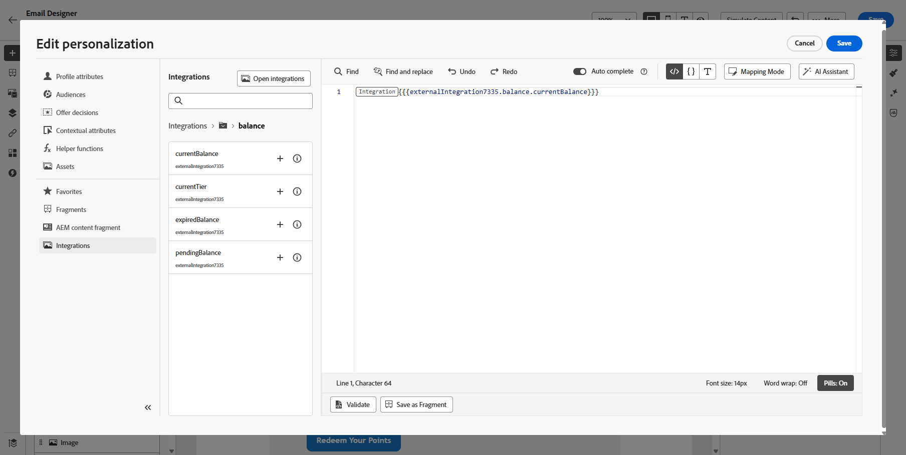

# 개인화에 외부 통합 사용 {#integrations-personalization}

콘텐츠에서 외부 통합을 사용하기 전에 관리자가 [통합 작업](integrations.md)에 설명된 대로 각 통합(끝점, 인증, 정책, 응답 페이로드 및 활성화)을 **구성 및 활성화**&#x200B;했는지 확인하십시오.

메시지에 **[!UICONTROL 조각]**&#x200B;당 최대 **3** 통합 및 최대 **5**&#x200B;을 추가할 수 있습니다. 조각에서만 제공되는 통합은 **5**&#x200B;에 포함되지 않습니다.

## 콘텐츠에 통합 개인화 적용 {#apply-integration-personalization}

마케터는 구성된 통합을 사용하여 콘텐츠를 개인화할 수 있습니다. 다음 단계를 수행하십시오.

1. 캠페인 콘텐츠에 액세스하고 텍스트 또는 HTML **[!UICONTROL 구성 요소]**&#x200B;에서 **[!UICONTROL 개인화 추가]**&#x200B;를 클릭하세요.

   [구성 요소에 대해 자세히 알아보기](../email/content-components.md)

   

1. 모든 활성 통합을 보려면 **[!UICONTROL 통합]** 섹션으로 이동하고 **[!UICONTROL 통합 열기]**&#x200B;를 클릭하십시오.

   **Journey Optimizer 조각**&#x200B;은(는) 통합에서 사용할 수 있지만 아웃바운드 채널만 지원합니다. 조각이 게시되면 기존 여정 및 캠페인에 영향을 주지 않도록 새 통합 추가 및 저장이 비활성화됩니다.

   

1. 통합을 선택하고 **[!UICONTROL 저장]**&#x200B;을 클릭합니다.

   

1. **[!UICONTROL 알약]** 모드를 활성화하여 고급 통합 메뉴를 잠금 해제합니다.

   

1. 통합 개인화를 작성할 때 통합 도우미에는 오류 또는 누락된 데이터가 기본 콘텐츠와 상호 작용하는 방법을 정의하는 **`required`** 필드가 포함됩니다.

   * **`required=true`**(기본값): 해당 메시지에 대한 렌더링이 중지됩니다. 전송이 **`ExternalDataLookupExclusion`**(으)로 제외되며 해당 제외는 **메시지 피드백 데이터 세트**&#x200B;에 기록됩니다.
   * **`required=false`**: 결과 변수가 **`null`**(으)로 설정되어 렌더링이 계속됩니다. 통합에서 데이터를 반환하지 않을 때 프로필이 빈 콘텐츠를 수신하지 않도록 템플릿에 기본 텍스트, 폴백 또는 조건부 논리를 사용하십시오.

     

1. 통합 설정을 완료하려면 이전에 [구성](integrations.md#configure) 중에 지정한 통합 특성을 정의하세요.

   일정하게 유지되는 정적 값이나 사용자 프로필에서 정보를 동적으로 가져오는 프로필 속성을 사용하여 이러한 속성에 값을 할당할 수 있습니다.

   

1. 통합 특성이 정의되면 이제  아이콘을 클릭하여 개인화된 메시지를 보내는 데 콘텐츠의 통합 필드를 사용할 수 있습니다.

   

   >[!NOTE]
   >
   >템플릿의 토큰은 통합 구성에 노출된 관리자 필드만 사용해야 합니다. 예를 들어 `temperature`이(가) 노출되면 `{{weatherResponse.temperature}}`이(가) 유효하며, `humidity`이(가) 노출되지 않으면 편집기에서 `{{weatherResponse.humidity}}`이(가) 거부됩니다.

1. **[!UICONTROL 저장]**&#x200B;을 클릭합니다.

이제 통합 개인화가 귀하의 콘텐츠에 성공적으로 적용되어 각 수신자가 귀하가 구성한 속성에 따라 맞춤형의 관련 경험을 받게 됩니다.

<!--

## Map one API call to another {#map-integration-chain}

You can **chain** integrations so that values returned by one active integration drive the inputs (path, headers, or query parameters) of another. That lets you build a real-time data flow in a single message without custom code.

Before you start, make sure that:

* An administrator has configured and activated every integration you need. See [Configure your Integration](integrations.md).
* Variable path placeholders, headers, and query parameters are set up in the integration configuration with marketer-facing labels.
* The administrator exposed the response fields you need in each integration's **[!UICONTROL Response payload]** so they appear when authoring.

In the below example, a reservation system integration returns a flight booking reference from the profile context. A separate flight-information integration expects that reference as a **path variable**. In the personalization editor, you map the second integration's variable to a field from the first integration's response, instead of a static value or profile attribute alone.

1. Open your message or fragment and place the cursor where you want personalized content (for example, a **[!UICONTROL Text]** field).

1. Open the personalization editor and go to **[!UICONTROL Integrations]** → **[!UICONTROL Open integrations]**.

1. Select the integration whose output will supply the downstream input (in the example, the reservation or profile API that returns the flight identifier).

1. Define that integration's inputs as usual—static values, profile attributes, or other allowed mappings—then save so its response is available for chaining.

    >[!NOTE]
    >
    > Fields must appear in the administrator-defined response payload for each integration. You cannot reference response properties that were not exposed in configuration.

1. Select the **second** integration (for example, the API that needs the flight number or booking reference on the URL path).

1. For each input that must come from the first call—often a **path variable** or **variable** header/query parameter—choose the mapping source that references the **first integration's response** (for example, the flight booking reference field from the reservation payload). Do not use a static test value if you need live, profile-specific data.

1. Insert the response tokens you need in the content (for example, destination name from the flight API, loyalty balance from a loyalty integration) using the  control.

1. Save the personalization.

When you **simulate** or send, Journey Optimizer resolves integrations in order: the first call runs with the profile context you configured; its output is used to build the second request. Different integrations may run at simulation time and at send time according to your setup and channel behavior.

-->

## 사용 방법 비디오 {#video}

이 비디오는 **통합**&#x200B;에서 Adobe Journey Optimizer을 외부 API에 연결하여 보다 관련성 있는 개인화를 위해 라이브 데이터 및 콘텐츠를 **아웃바운드** 채널, 이메일, SMS 및 푸시로 가져오는 방법을 보여 줍니다.

>[!VIDEO](https://video.tv.adobe.com/v/3484125/?captions=kor&learn=on)
