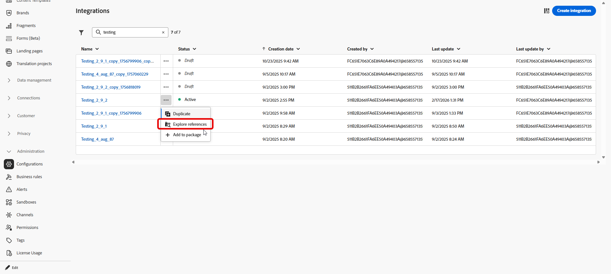
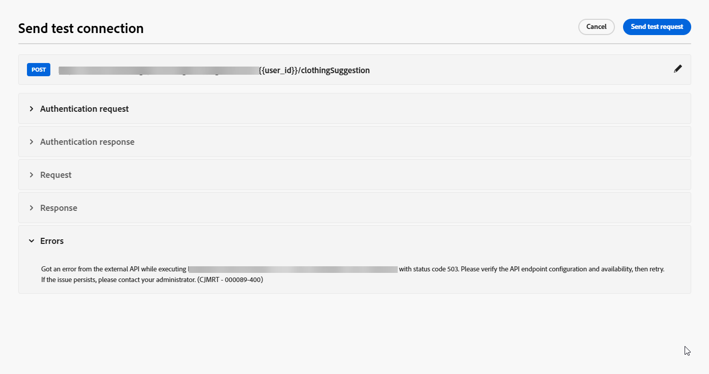

# 통합 작업 {#external-sources}

## 개요

**통합** 기능은 다른 곳에서 이미 관리하고 있는 데이터와 구성 가능한 콘텐츠가 있는 서드파티 시스템에 Adobe Journey Optimizer을 연결합니다. 작성 중 및 전송 시간에 해당 자료를 표시할 수 있으며, 이는 Journey Optimizer에서 사용하는 채널 전반에서 보다 반응적이고 개인화된 경험을 지원합니다.

이 기능을 사용하여 외부 데이터에 액세스하고 다음과 같은 서드파티 도구에서 콘텐츠를 가져올 수 있습니다.

* 충성도 시스템의 **보상 포인트**.
* 제품에 대한 **가격 정보**.
* 추천 엔진에서 **제품 추천**.
* **물류 업데이트**(게재 상태 등).

통합을 사용하려면 사용자에게 **[!UICONTROL AJO 통합 구성 관리]** 및 **[!UICONTROL AJO 통합 구성 보기]** 권한을 부여해야 합니다. [권한에 대해 자세히 알아보기](../administration/permissions.md)

+++ 통합 관련 권한을 할당하는 방법을 알아봅니다

1. **[!UICONTROL 권한]** 제품에서 **[!UICONTROL 역할]** 탭으로 이동하여 원하는 **[!UICONTROL 역할]**&#x200B;을 선택하십시오.

1. 권한을 수정하려면 **[!UICONTROL 편집]**&#x200B;을 클릭하십시오.

1. **[!UICONTROL AJO 통합 구성]** 리소스를 추가한 다음 드롭다운 메뉴에서 적절한 통합 권한을 선택합니다.

   

1. 변경 내용을 적용하려면 **[!UICONTROL 저장]**&#x200B;을 클릭하십시오.

   이 역할에 이미 할당된 모든 사용자의 권한은 자동으로 업데이트됩니다.

1. 새 사용자에게 이 역할을 할당하려면 **[!UICONTROL 역할]** 대시보드의 **[!UICONTROL 사용자]** 탭으로 이동하여 **[!UICONTROL 사용자 추가]**&#x200B;를 클릭하십시오.

1. 사용자 이름, 이메일 주소를 입력하거나 목록에서 선택한 다음 **[!UICONTROL 저장]**&#x200B;을 클릭합니다.

사용자를 이전에 만들지 않은 경우 [이 설명서](https://experienceleague.adobe.com/ko/docs/experience-platform/access-control/abac/permissions-ui/users)를 참조하세요.

+++

## 통합 구성 {#configure}

>[!AVAILABILITY]
>
> 이 통합 기능은 아웃바운드 채널(이메일, SMS 및 푸시)로 제한되며 JSON 또는 HTML 가져오기를 지원합니다.

관리자는 다음 단계에 따라 외부 통합을 설정할 수 있습니다.

1. 왼쪽 메뉴에서 **[!UICONTROL 구성]** 섹션으로 이동한 다음 **[!UICONTROL 통합]** 카드에서 **[!UICONTROL 관리]**&#x200B;을 클릭합니다.

   그런 다음 **[!UICONTROL 통합 만들기]**&#x200B;를 클릭하여 새 구성을 시작합니다.

   

1. 필요한 경우 **cURL** 명령을 붙여넣어 URL, HTTP 메서드, 헤더 및 쿼리 매개 변수를 자동으로 채웁니다.

1. 통합을 위해 **[!UICONTROL 이름]** 및 **[!UICONTROL 설명]**&#x200B;을 제공하세요.

   >[!NOTE]
   >
   >**[!UICONTROL 이름]** 필드에는 공백을 포함할 수 없습니다.

1. API 끝점 **[!UICONTROL URL]**&#x200B;을(를) 입력하십시오.

   경로 변수의 경우 레이블을 URL에서 중괄호로 묶어 `https://api.example.com/v1/products/{{productId}}`과(와) **[!UICONTROL 경로 템플릿]**&#x200B;에서 각 자리 표시자를 설정합니다.

1. URL에 추가한 모든 자리 표시자에 대해 **[!UICONTROL 이름]** 및 **[!UICONTROL 기본값]**&#x200B;을(를) 사용하여 **[!UICONTROL 경로 템플릿]**&#x200B;을 구성하십시오.

   **[!UICONTROL Name]**&#x200B;은(는) 편집기에서만 마케터를 나타내는 레이블이며 API 요청 시 전송되지 않습니다.

   

1. GET과 POST 사이의 **[!UICONTROL HTTP 메서드]**&#x200B;를 선택합니다.

1. 통합에 필요한 경우 **[!UICONTROL 헤더 추가]** 및/또는 **[!UICONTROL 쿼리 매개 변수 추가]**&#x200B;를 클릭합니다. 각 매개 변수에 대해 다음 세부 사항을 제공합니다.

   * **[!UICONTROL 매개 변수]**: API에 필요한 실제 헤더 또는 쿼리 매개 변수 이름입니다.

   * **[!UICONTROL 이름]**: 이 매개 변수에 대한 마케터용 레이블입니다. 작성자는 캠페인에서 값을 매핑할 때 이 매개 변수를 선택합니다.

   * **[!UICONTROL 유형]**: 고정 값으로 **상수**&#x200B;를 선택하거나 동적 입력으로 **변수**&#x200B;를 선택합니다.

   * **[!UICONTROL 값]**: 상수에 직접 값을 입력하거나 변수 매핑을 선택하십시오.

   * **[!UICONTROL 필수]**: 이 매개 변수가 필요한지 여부를 지정합니다. 필수 **[!UICONTROL 변수]** 매개 변수의 경우 런타임 시 확인된 값이 없고 기본값을 제공하지 않으면 요청 생성에 실패하고 오류가 발생하며 아웃바운드 API 호출이 수행되지 않습니다.

   

1. **[!UICONTROL 인증 유형]** 선택:

   * **[!UICONTROL 인증 없음]**: 자격 증명이 필요하지 않은 열린 API의 경우.

   * **[!UICONTROL API 키]**: 정적 API 키를 사용하여 요청을 인증합니다. **[!UICONTROL API 키 이름{&#x200B;1},**[!UICONTROL  API 키 값{3&#x200B;}을(를) 입력하고 **[!UICONTROL 위치]**&#x200B;를 지정하십시오.]**]**

   * **[!UICONTROL 기본 인증]**: 표준 HTTP 기본 인증을 사용합니다. **[!UICONTROL 사용자 이름]** 및 **[!UICONTROL 암호]**&#x200B;를 입력하십시오.

   * **[!UICONTROL OAuth 2.0]**: OAuth 2.0 프로토콜을 사용하여 인증합니다.  아이콘을 클릭하여 **[!UICONTROL 페이로드]**&#x200B;를 구성하거나 업데이트합니다.

   

1. API 요청에 대해 **[!UICONTROL 시간 초과]** 기간과 같은 **[!UICONTROL 정책 구성]**&#x200B;을(를) 설정하고 제한, 캐시 및/또는 다시 시도하도록 선택합니다.

   >[!NOTE]
   >
   >제한이 활성화된 경우 지원되는 비율은 50~5000TPS입니다. 각 API 끝점이 아닌 **통합**&#x200B;에 제한이 적용됩니다.
   >
   >다시 시도가 활성화된 상태에서 다른 실패가 기본적으로 **3**&#x200B;번 다시 시도되며, 시도 간격은 **200ms**, **400ms**, **800ms**&#x200B;입니다.

1. **[!UICONTROL 응답 페이로드]** 필드를 사용하여 메시지 개인화에 사용해야 하는 샘플 출력의 필드를 결정할 수 있습니다.

    아이콘을 클릭하고 샘플 JSON 응답 페이로드를 붙여 넣어 데이터 형식을 자동으로 검색합니다.

1. 개인화를 위해 표시할 필드를 선택하고 해당 데이터 유형을 지정합니다.

   

   >[!NOTE]
   >
   >**[!UICONTROL 응답 페이로드]** 구성은 해당 단계에 적용된 스키마를 포함하여 작성에 필요한 응답을 정의합니다. 마케터는 노출된 필드만 참조할 수 있으며 다른 경로에 대한 토큰은 편집기에서 유효성 검사에 실패합니다.

1. **[!UICONTROL 테스트 연결 보내기]**&#x200B;를 사용하여 통합의 유효성을 검사합니다. [연결 테스트 방법에 대해 자세히 알아보기](#connection)

   유효성을 검사하면 **[!UICONTROL 활성화]**&#x200B;를 클릭합니다.

1. 새로 생성된 통합에 액세스하여 다음을 수행할 수 있습니다.

   * **업데이트**: **인증** 세부 정보 및 **정책 구성**&#x200B;만 변경합니다. 업데이트는 라이브 여정 및 캠페인에 적용됩니다. 변경 내용을 저장하기 전에 **[!UICONTROL 참조 탐색]** 메뉴를 사용하여 통합 사용 위치를 확인하십시오.
   * **보관**: 통합 구성을 보관합니다.

   

활성화한 후  아이콘을 클릭하여 **[!UICONTROL 참조 탐색]** 메뉴에 액세스하고 이를 사용하는 여정 및 캠페인을 포함하여 이 구성에 대한 사용을 검토하십시오.

### 전송 시간 제한 및 동작 {#configure-send-time}

전송 시 외부 API의 응답은 기본적으로 최대 **4MB**&#x200B;일 수 있습니다. 더 큰 모든 항목은 통합 오류로 처리되며, 응답 크기로 인해 오류가 발생한 경우 **다시 시도가 시도되지 않습니다**.

호출은 사용자가 구성한 **조절** 속도를 따릅니다. Journey Optimizer에서는 외부 시스템이 다운되었거나 오류가 반환되는 경우에도 해당 제한까지 시도를 예약합니다. **cache**&#x200B;이(가) 활성화되면 정의한 캐시 **TTL**&#x200B;이(가) 만료될 때까지 **successful** 응답만 저장되고 재사용됩니다. 실패한 응답은 캐시되지 않습니다.

큐에 있는 각 메시지에는 TTL(유효성 기간)도 전달됩니다. 처리가 지연되고 메시지가 해당 창을 지나면 시스템이 **메시지를 삭제하고** **`MessageValidityExclusion`** 이벤트를 발생시키므로 큐에서 오래된 작업이 지워지고 리소스가 사용 가능한 상태로 유지됩니다.

## 연결 테스트 {#connection}

**[!UICONTROL 테스트 연결 보내기]**&#x200B;는 활성화 전에 대상 API에 대해 끝점 URL, 인증 및 요청 구조를 확인합니다. 이렇게 하면 메시지 처리 중 런타임 오류가 발생할 위험이 줄어듭니다.

1. URL, HTTP 메서드, 헤더 및 쿼리 매개 변수가 정의된 경우 **[!UICONTROL 테스트 연결 보내기]**&#x200B;를 클릭하여 연결 테스트를 실행하고 구성을 확인하십시오.

1. **[!UICONTROL 테스트 연결 보내기]** 대화 상자에서 URL 경로, 헤더 및 쿼리 매개 변수에 **[!UICONTROL 변수]** 자리 표시자의 기본값을 입력합니다.

   이러한 값은 테스트 요청에 포함됩니다. Journey Optimizer은 끝점을 호출하고 연결 성공 또는 실패 여부를 보고합니다.

   

1. 테스트가 성공적인 응답을 반환하는 경우 **[!UICONTROL 응답 페이로드로 사용]**&#x200B;을 선택하여 응답 본문을 **[!UICONTROL 응답 페이로드]** 필드에 복사합니다. [통합 구성](#configure)의 10단계를 참조하십시오. 여기에서 데이터 형식을 감지하고 개인화를 위해 필드를 선택할 수 있습니다.

   

1. 테스트가 성공하지 않으면 **[!UICONTROL 오류]** 드롭다운을 확장하여 오류 세부 정보를 검토하고 필요에 따라 통합 구성을 업데이트한 다음 **[!UICONTROL 테스트 연결 보내기]**&#x200B;를 다시 실행하십시오.

   

테스트가 성공하면 통합 구성에서 **[!UICONTROL 활성화]**&#x200B;를 선택합니다. [통합 구성](#configure)을 참조하세요.

