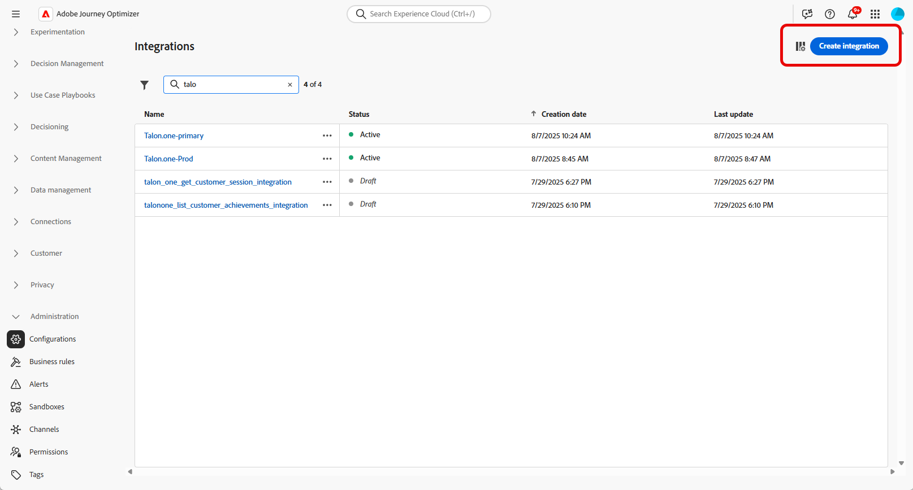
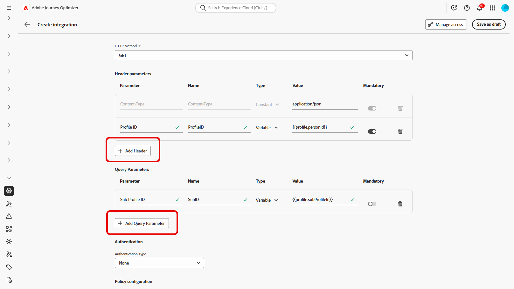

# 통합 작업 {#external-sources}

>[!BEGINSHADEBOX]

목차:

* **[통합 작업](integrations.md)**
* [시작하기](vendor-integration-gs.md)
* [사용 가능한 공급업체](vendor-integration.md)
* [FAQ](vendor-integration-faq.md)

>[!ENDSHADEBOX]

## 개요

**통합** 기능은 다른 곳에서 이미 관리하고 있는 데이터와 구성 가능한 콘텐츠가 있는 서드파티 시스템에 Adobe Journey Optimizer을 연결합니다. 작성 중 및 전송 시간에 해당 자료를 표시할 수 있으며, 이는 Journey Optimizer에서 사용하는 채널 전반에서 보다 반응적이고 개인화된 경험을 지원합니다.

이 기능을 사용하여 외부 데이터에 액세스하고 다음과 같은 서드파티 도구에서 콘텐츠를 가져올 수 있습니다.

* 충성도 시스템의 **보상 포인트**.
* 제품에 대한 **가격 정보**.
* 추천 엔진에서 **제품 추천**.
* **물류 업데이트**(게재 상태 등).

통합을 사용하려면 사용자에게 **[!UICONTROL AJO 통합 구성 관리]** 및 **[!UICONTROL AJO 통합 보기]** 권한을 부여해야 합니다. [권한에 대해 자세히 알아보기](../administration/permissions.md)

+++ 통합 관련 권한을 할당하는 방법을 알아봅니다

1. **[!UICONTROL 권한]** 제품에서 **[!UICONTROL 역할]** 탭으로 이동하여 원하는 **[!UICONTROL 역할]**&#x200B;을 선택하십시오.

1. 권한을 수정하려면 **[!UICONTROL 편집]**&#x200B;을 클릭하십시오.

1. **[!UICONTROL AJO 통합 구성]** 리소스를 추가한 다음 드롭다운 메뉴에서 적절한 통합 권한을 선택합니다.

   

1. 변경 내용을 적용하려면 **[!UICONTROL 저장]**&#x200B;을 클릭하십시오.

   이 역할에 이미 할당된 모든 사용자의 권한은 자동으로 업데이트됩니다.

1. 새 사용자에게 이 역할을 할당하려면 **[!UICONTROL 역할]** 대시보드의 **[!UICONTROL 사용자]** 탭으로 이동하여 **[!UICONTROL 사용자 추가]**&#x200B;를 클릭하십시오.

1. 사용자 이름, 이메일 주소를 입력하거나 목록에서 선택한 다음 **[!UICONTROL 저장]**&#x200B;을 클릭합니다.

사용자를 이전에 만들지 않은 경우 [이 설명서](https://experienceleague.adobe.com/ko/docs/experience-platform/access-control/abac/permissions-ui/users)를 참조하세요.

+++

## 통합 구성 {#configure}

>[!AVAILABILITY]
>
> 이 통합 기능은 아웃바운드 채널(이메일, SMS 및 푸시)로 제한되며 데이터를 JSON 또는 HTML 형식으로 제공합니다. API는 읽기 전용이며 검색 작업만 지원합니다.

관리자는 다음 단계에 따라 외부 통합을 설정할 수 있습니다.

1. 왼쪽 메뉴에서 **[!UICONTROL 구성]** 섹션으로 이동한 다음 **[!UICONTROL 통합]** 카드에서 **[!UICONTROL 관리]**&#x200B;을 클릭합니다.

   그런 다음 **[!UICONTROL 통합 만들기]**&#x200B;를 클릭하여 새 구성을 시작합니다.

   

1. 필요한 경우 **cURL** 명령을 붙여넣어 URL, HTTP 메서드, 헤더 및 쿼리 매개 변수를 자동으로 채웁니다.

1. 통합을 위해 **[!UICONTROL 이름]** 및 **[!UICONTROL 설명]**&#x200B;을 제공하세요.

   >[!NOTE]
   >
   >이러한 필드에는 공백을 포함할 수 없습니다.

1. 레이블과 기본값을 사용하여 정의할 수 있는 변수가 있는 경로 매개 변수를 포함할 수 있는 API 끝점 **[!UICONTROL URL]**&#x200B;을(를) 입력하십시오.

1. **[!UICONTROL 이름]** 및 **[!UICONTROL 기본값]**&#x200B;을(를) 사용하여 **[!UICONTROL 경로 템플릿]**&#x200B;을(를) 구성하십시오.

   

1. GET과 POST 사이의 **[!UICONTROL HTTP 메서드]**&#x200B;를 선택합니다.

1. 통합에 필요한 경우 **[!UICONTROL 헤더 추가]** 및/또는 **[!UICONTROL 쿼리 매개 변수 추가]**&#x200B;를 클릭합니다. 각 매개 변수에 대해 다음 세부 사항을 제공합니다.

   * **[!UICONTROL 매개 변수]**:: 매개 변수를 참조하는 데 내부적으로 사용되는 고유 식별자입니다.

   * **[!UICONTROL 이름]**: API에 필요한 매개 변수의 실제 이름입니다.

   * **[!UICONTROL 유형]**: 고정 값으로 **상수**&#x200B;를 선택하거나 동적 입력으로 **변수**&#x200B;를 선택합니다.

   * **[!UICONTROL 값]**: 상수에 직접 값을 입력하거나 변수 매핑을 선택하십시오.

   * **[!UICONTROL 필수]**: 이 매개 변수가 필요한지 여부를 지정합니다.

   

1. **[!UICONTROL 인증 유형]** 선택:

   * **[!UICONTROL 인증 없음]**: 자격 증명이 필요하지 않은 열린 API의 경우.

   * **[!UICONTROL API 키]**: 정적 API 키를 사용하여 요청을 인증합니다. **[!UICONTROL API 키 이름{&#x200B;1},**&#x200B;[!UICONTROL &#x200B; API 키 값{3&#x200B;}을(를) 입력하고 **[!UICONTROL 위치]**&#x200B;를 지정하십시오.]&#x200B;**]**

   * **[!UICONTROL 기본 인증]**: 표준 HTTP 기본 인증을 사용합니다. **[!UICONTROL 사용자 이름]** 및 **[!UICONTROL 암호]**&#x200B;를 입력하십시오.

   * **[!UICONTROL OAuth 2.0]**: OAuth 2.0 프로토콜을 사용하여 인증합니다.  아이콘을 클릭하여 **[!UICONTROL 페이로드]**&#x200B;를 구성하거나 업데이트합니다.

   

1. API 요청에 대해 **[!UICONTROL 시간 초과]** 기간과 같은 **[!UICONTROL 정책 구성]**&#x200B;을(를) 설정하고 제한, 캐시 및/또는 다시 시도하도록 선택합니다.

   제한이 활성화된 경우 지원되는 속도는 **50** TPS(최소)에서 **5,000**&#x200B;TPS(최대)까지 다양합니다.
다시 시도가 활성화되면 다른 실패는 기본적으로 **3번**&#x200B;번 다시 시도 후 **200ms**, **400ms**, **800ms**&#x200B;번 다시 시도합니다.

1. **[!UICONTROL 응답 페이로드]** 필드를 사용하여 메시지 개인화에 사용해야 하는 샘플 출력의 필드를 결정할 수 있습니다.

    아이콘을 클릭하고 샘플 JSON 응답 페이로드를 붙여 넣어 데이터 형식을 자동으로 검색합니다.

1. 개인화를 위해 표시할 필드를 선택하고 해당 데이터 유형을 지정합니다.

   

   >[!NOTE]
   >
   >**[!UICONTROL 응답 페이로드]** 구성은 해당 단계에 적용된 스키마를 포함하여 작성에 필요한 응답을 정의합니다. 마케터는 노출된 필드만 참조할 수 있으며 다른 경로에 대한 토큰은 편집기에서 유효성 검사에 실패합니다.

1. **[!UICONTROL 테스트 연결 보내기]**&#x200B;를 사용하여 통합의 유효성을 검사합니다.

   유효성을 검사하면 **[!UICONTROL 활성화]**&#x200B;를 클릭합니다.

### 전송 시간 제한 및 동작 {#configure-send-time}

전송 시 외부 API의 응답은 기본적으로 최대 **4MB**&#x200B;일 수 있습니다. 더 큰 모든 항목은 통합 오류로 처리되며, 응답 크기로 인해 오류가 발생한 경우 **다시 시도가 시도되지 않습니다**.

호출은 사용자가 구성한 **조절** 속도를 따릅니다. Journey Optimizer에서는 외부 시스템이 다운되었거나 오류가 반환되는 경우에도 해당 제한까지 시도를 예약합니다. **cache**&#x200B;이(가) 활성화되면 정의한 캐시 **TTL**&#x200B;이(가) 만료될 때까지 **successful** 응답만 저장되고 재사용됩니다. 실패한 응답은 캐시되지 않습니다.

큐에 있는 각 메시지에는 TTL(유효성 기간)도 전달됩니다. 처리가 지연되고 메시지가 해당 창을 지나면 시스템이 **메시지를 삭제하고** **`MessageValidityExclusion`** 이벤트를 발생시키므로 큐에서 오래된 작업이 지워지고 리소스가 사용 가능한 상태로 유지됩니다.

## 개인화에 외부 통합 사용 {#personalization}

개인화를 위해 외부 통합을 사용하기 전에 통합 호출의 예약 및 격리는 실행 컨텍스트에 따라 다릅니다.

* **일괄 실행**(일괄 캠페인, 오케스트레이션된 캠페인 및 API 트리거된 마케팅 캠페인): 각 일괄 실행은 전용 격리된 환경에서 작동합니다. 따라서 외부 시스템을 호출하는 동시 배치 실행은 서로 충돌하거나 방해하지 않습니다.

* **단일 실행**(단일 여정, 일괄 여정 및 API 트리거 트랜잭션 캠페인): 통합 트래픽은 브랜드 샌드박스별로 격리되므로 한 브랜드에 대해 느린 외부 API로 다른 브랜드가 지연되지 않습니다. 샌드박스 내에서 동시 통합은 다른 통합 지원 메시지를 잠시 지연시킬 수 있습니다. 각 메시지는 만료 전 최대 12시간 동안 시도됩니다.

마케터는 구성된 통합을 사용하여 콘텐츠를 개인화할 수 있습니다. 다음 단계를 수행하십시오.

1. 캠페인 콘텐츠에 액세스하고 텍스트 또는 HTML **[!UICONTROL 구성 요소]**&#x200B;에서 **[!UICONTROL 개인화 추가]**&#x200B;를 클릭하세요.

   [구성 요소에 대해 자세히 알아보기](../email/content-components.md)

   

1. 모든 활성 통합을 보려면 **[!UICONTROL 통합]** 섹션으로 이동하고 **[!UICONTROL 통합 열기]**&#x200B;를 클릭하십시오.

   콘텐츠 조각은 통합에서 사용할 수 있지만 아웃바운드 채널만 지원하므로 인바운드 게시가 성공하지 못합니다. 조각이 게시되면 기존 여정 및 캠페인에 영향을 주지 않도록 새 통합 추가 및 저장이 비활성화됩니다.

   

1. 통합을 선택하고 **[!UICONTROL 저장]**&#x200B;을 클릭합니다.

   

1. **[!UICONTROL 알약]** 모드를 활성화하여 고급 통합 메뉴를 잠금 해제합니다.

   

1. 통합 개인화를 작성할 때 통합 도우미에는 오류 또는 누락된 데이터가 기본 콘텐츠와 상호 작용하는 방법을 정의하는 **`required`** 필드가 포함됩니다.

   * **`required=true`**(기본값): 해당 메시지에 대한 렌더링이 중지됩니다. 전송이 **`ExternalDataLookupExclusion`**(으)로 제외되며 해당 제외는 **메시지 피드백 데이터 세트**&#x200B;에 기록됩니다.
   * **`required=false`**: 결과 변수가 **`null`**(으)로 설정되어 렌더링이 계속됩니다. 통합에서 데이터를 반환하지 않을 때 프로필이 빈 콘텐츠를 수신하지 않도록 템플릿에 기본 텍스트, 폴백 또는 조건부 논리를 사용하십시오.

     

1. 통합 설정을 완료하려면 이전에 [구성](#configure) 중에 지정한 통합 특성을 정의하세요.

   일정하게 유지되는 정적 값이나 사용자 프로필에서 정보를 동적으로 가져오는 프로필 속성을 사용하여 이러한 속성에 값을 할당할 수 있습니다.

   

1. 통합 특성이 정의되면 이제  아이콘을 클릭하여 개인화된 메시지를 보내는 데 콘텐츠의 통합 필드를 사용할 수 있습니다.

   

   >[!NOTE]
   >
   >템플릿의 토큰은 통합 구성에 노출된 관리자 필드만 사용해야 합니다. 예를 들어 `temperature`이(가) 노출되면 `{{weatherResponse.temperature}}`이(가) 유효하며, `humidity`이(가) 노출되지 않으면 편집기에서 `{{weatherResponse.humidity}}`이(가) 거부됩니다.

1. **[!UICONTROL 저장]**&#x200B;을 클릭합니다.

이제 통합 개인화가 귀하의 콘텐츠에 성공적으로 적용되어 각 수신자가 귀하가 구성한 속성에 따라 맞춤형의 관련 경험을 받게 됩니다.

