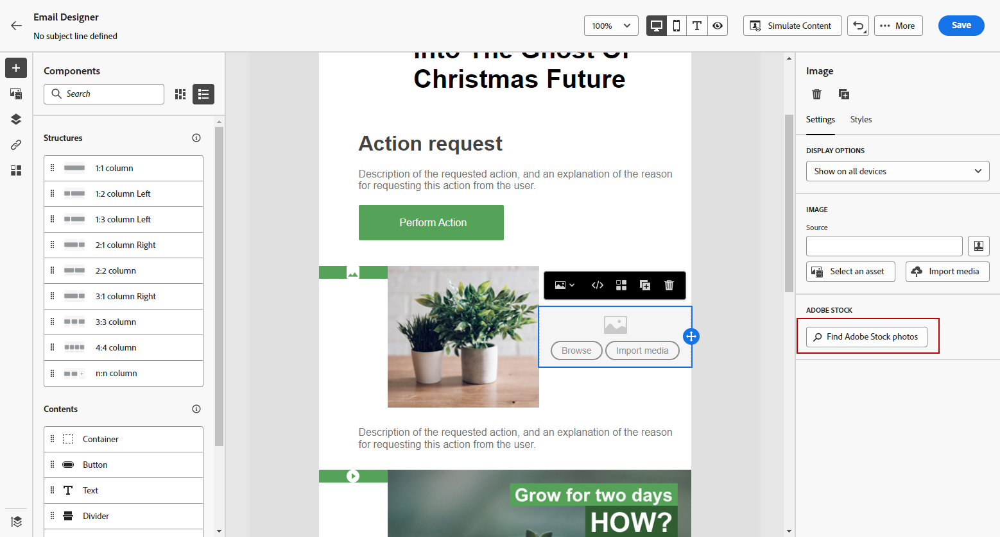

# [!DNL Adobe Stock]개 이미지로 작업 {#stock}

## [!DNL Adobe Stock] 시작 {#get-started-stock}

[!DNL Adobe Stock] 및 [!DNL Adobe Journey Optimizer] 이메일 디자이너 통합 플러그인을 사용하면 메시지를 작성하는 데 사용할 이미지를 쉽게 탐색, 라이선싱, 저장할 수 있습니다.

[Adobe Stock](https://helpx.adobe.com/stock/get-started.html){target="_blank"}에서는 고품질로 큐레이팅된 로열티가 없는 수백만 장의 사진, 비디오, 일러스트레이션 및 벡터 그래픽에 액세스할 수 있습니다. 자산의 라이센스를 부여할 신용 팩을 구매하거나 필요한 자산에 대해 하나의 표준 또는 확장 라이센스만 구매하도록 선택할 수 있습니다. Adobe Stock은 또한 에셋의 무료 컬렉션을 제공합니다.

[!DNL Adobe Journey Optimizer]의 **[!UICONTROL Adobe Stock 사진 찾기]** 옵션을 사용하면 [!DNL Adobe Stock]에서 이메일로 이미지를 바로 업로드하고 **[!UICONTROL Assets]** 폴더에 추가할 수 있습니다. 또한 **[!UICONTROL 유사한 Stock 사진 찾기]** 옵션은 게재에 사용하는 자산과 콘텐츠, 색상, 컴포지션이 비슷한 이미지를 찾는 데 도움이 됩니다.

## 권한{#stock-permissions}

AEM Assets Essentials 제품 프로필에 액세스하는 사용자는 **[!UICONTROL Adobe Stock 사진 찾기]** 및 **[!UICONTROL 유사한 이미지 찾기]** 옵션을 사용할 수 있습니다.

자세한 내용은 [Experience Manager Assets 설명서](https://experienceleague.adobe.com/docs/experience-manager-assets-essentials/help/get-started-admins/deploy-administer.html#add-users-to-essentials){target="_blank"}를 참조하세요.

## [!DNL Adobe Stock]의 이미지 삽입 {#add-stock-image}

[!DNL Adobe Stock]의 이미지를 콘텐츠에 추가하려면 아래 단계를 따르십시오.

1. 이메일 Designer의 **[!UICONTROL 콘텐츠 구성 요소]** 섹션에서 **이미지**&#x200B;를 끌어서 놓습니다.

1. Designer 메일 왼쪽의 **[!UICONTROL Adobe Stock 사진 찾기]** 단추를 클릭합니다.

   

1. 라이브러리를 검색하거나 검색 필드에 용어를 입력합니다.

   

1. 선택한 이미지를 선택하고 **[!UICONTROL 저장]**&#x200B;을 클릭합니다.

   선택한 이미지에 라이선스가 부여되지 않은 경우 [라이선스를 획득](#license-stock-image)해야 합니다.

## 유사한 사진 찾기 {#similar-stock-image}

전자 메일 콘텐츠에 있는 기존 이미지를 [!DNL Adobe Stock]의 사진으로 바꿀 수 있습니다. 이 옵션은 라이선스가 부여된/라이선스가 없는 스톡 이미지 및 Assets 폴더의 이미지와 같은 모든 이미지에 사용할 수 있습니다.

유사한 사진을 찾아보려면 아래 단계를 따르십시오.

1. 바꿀 이미지를 선택합니다.
1. **[!UICONTROL 유사한 스톡 사진 찾기]** 단추를 클릭하여 이미지의 내용, 색상 및 컴포지션과 일치하는 [!DNL Adobe Stock]의 에셋을 표시합니다.

   

1. 선택한 이미지를 선택하고 **[!UICONTROL 저장]**&#x200B;을 클릭합니다.

   

   선택한 이미지에 라이선스가 부여되지 않은 경우 [라이선스를 획득](#license-stock-image)해야 합니다.

1. 필요한 경우 **[!UICONTROL 설정]** 및 **[!UICONTROL 스타일]** 탭을 사용하여 이미지를 사용자 지정합니다. [구성 요소 설정에 대해 자세히 알아보세요](../email/content-components.md).

## [!DNL Adobe Stock]에서 라이선스 가져오기 {#license-stock-image}

이미 라이선스가 부여된 이미지는  아이콘으로 표시됩니다. 그렇지 않은 경우 라이선스를 부여해야 합니다.

이미지에 라이선스를 부여하고 다운로드하려면 아래 단계를 따르십시오.

1. 선택하고 **[!UICONTROL 라이선스 Adobe Stock 이미지]** 아이콘을 클릭합니다.

   

   라이선스를 구입하려면 [!DNL Adobe Stock] 웹 사이트로 리디렉션됩니다.

   

1. [!DNL Adobe Stock] 웹 사이트에서 이미지를 다운로드하고 워터마크를 제거하려면 에셋을 구매해야 합니다.

   이 구매는 Adobe Stock 플랜 또는 구독에 따라 다릅니다. 여러 Adobe Stock 계정이 있는 경우 마지막으로 사용한 Stock ID로 리디렉션됩니다. 이 경우 에셋에 라이선스를 부여하기 전에 올바른 계정에 로그인했는지 확인하십시오.

   Adobe Stock 계획 및 가격에 대한 자세한 내용은 [Adobe Stock 설명서](https://stock.adobe.com/plans){target="_blank"}를 참조하세요.

   >[!WARNING]
   > 허가되지 않은 이미지가 포함된 이메일이 전송되면 이미지는 워터마크와 함께 허가되지 않은 형식을 유지합니다.

1. 구매가 완료되면 이제 [!DNL Adobe Journey Optimizer]의 전자 메일로 돌아가서 **[!UICONTROL 주식 이미지 가져오기]**&#x200B;를 선택하여 라이선스가 부여된 이미지를 자산으로 가져올 수 있습니다.

   

1. 자산을 저장할 폴더를 선택합니다. [!DNL Experience Manager Assets]에 대한 자세한 내용은 이 [페이지](assets.md#get-started-assets)를 참조하세요.

## 관련 항목{#stock-related-topics}

* [Journey Optimizer의 이메일 디자인](../email/get-started-email-design.md)
* [이메일 디자인을 위한 구성 요소 설정](../email/content-components.md)
* [Adobe Stock 시작](https://helpx.adobe.com/stock/get-started.html){target="_blank"}.

