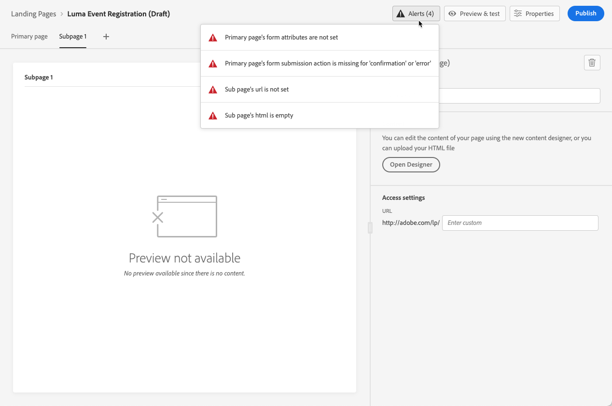

# 랜딩 페이지 만들기 및 게시 {#create-lp}

>[!CAUTION]
>
>랜딩 페이지를 테스트하고 게시하려면 다음을 수행해야 합니다. **[!UICONTROL 메시지 게시]** 권한.

## 랜딩 페이지 액세스 {#access-landing-pages}

랜딩 페이지 목록에 액세스하려면 다음을 선택합니다. **[!UICONTROL 여정 관리]** > **[!UICONTROL 랜딩 페이지]** 왼쪽 메뉴에서

다음 **[!UICONTROL 랜딩 페이지]** 목록에는 생성된 모든 항목이 표시됩니다. 상태 또는 수정 날짜에 따라 필터링할 수 있습니다.

이 목록에서 다음에 액세스할 수 있습니다. [랜딩 페이지 라이브 보고서](../reports/lp-report-live.md) 또는 [랜딩 페이지 글로벌 보고서](../reports/lp-report-global.md) 게시된 항목용.

랜딩 페이지를 삭제, 복제 및 게시 취소할 수도 있습니다.

>[!CAUTION]
>
>메시지에서 참조되는 랜딩 페이지의 게시를 취소하면 랜딩 페이지에 대한 링크가 끊어지고 오류 페이지가 표시됩니다.

랜딩 페이지 옆에 있는 세 점을 클릭하여 원하는 작업을 선택합니다.

>[!NOTE]
>
>은(는) 삭제할 수 없습니다. [게시됨](#publish-landing-page) 랜딩 페이지. 삭제하려면 먼저 게시를 취소해야 합니다.

## 랜딩 페이지 만들기 {#create-landing-page}

>[!CONTEXTUALHELP]
>id="ajo_lp_create"
>title="랜딩 페이지 정의 및 구성"
>abstract="랜딩 페이지를 만들려면 사전 설정을 선택한 다음 기본 페이지와 하위 페이지를 구성하고 게시하기 전에 마지막으로 테스트해야 합니다."
>additional-url="https://experienceleague.adobe.com/docs/journey-optimizer/using/landing-pages/lp-configuration/lp-presets.html?lang=ko-KR#lp-create-preset" text="랜딩 페이지 사전 설정 만들기"
>additional-url="https://experienceleague.adobe.com/docs/journey-optimizer/using/landing-pages/create-lp.html?lang=ko-KR#publish-landing-page" text="랜딩 페이지 게시"

>[!CONTEXTUALHELP]
>id="ajo_lp_access_management_labels"
>title="랜딩 페이지에 레이블 지정"
>abstract="민감한 디지털 자산을 보호하기 위해 레이블을 사용하여 랜딩 페이지에 대한 데이터 액세스를 관리하는 권한을 정의할 수 있습니다."
>additional-url="https://experienceleague.adobe.com/docs/journey-optimizer/using/access-control/object-based-access.html?lang=ko-KR" text="오브젝트 수준 액세스 제어"

랜딩 페이지를 만드는 주요 단계는 다음과 같습니다.

1. 랜딩 페이지 목록에서 **[!UICONTROL 랜딩 페이지 만들기]**.

   

1. 제목을 추가합니다. 필요한 경우 설명을 추가할 수 있습니다.

   

1. 사용자 지정 또는 핵심 데이터 사용 레이블을 랜딩 페이지에 할당하려면 다음을 선택합니다. **[!UICONTROL 액세스 관리]**. [OLAC(Object Level Access Control)에 대해 자세히 알아보기](../administration/object-based-access.md)

   <!--You can add a tag. See AEP documentation?-->

1. 사전 설정을 선택합니다. 에서 랜딩 페이지 사전 설정을 만드는 방법 알아보기 [이 섹션](../landing-pages/lp-presets.md#lp-create-preset).

   

1. **[!UICONTROL 만들기]**&#x200B;를 클릭합니다.

1. 기본 페이지 및 해당 속성이 표시됩니다. 기본 페이지 설정을 구성하는 방법 알아보기 [여기](#configure-primary-page).

   

1. + 아이콘을 클릭하여 하위 페이지를 추가합니다. 하위 페이지 설정을 구성하는 방법 알아보기 [여기](#configure-subpages).

   

을(를) 구성하고 설계하면 [기본 페이지](#configure-primary-page)및 [하위 페이지](#configure-subpages) 필요한 경우 다음을 수행할 수 있습니다 [테스트](#test-landing-page) 및 [게시](#publish-landing-page) 랜딩 페이지입니다.

## 기본 페이지 구성 {#configure-primary-page}

>[!CONTEXTUALHELP]
>id="ajo_lp_primary_page"
>title="기본 페이지 설정 정의"
>abstract="사용자가 이메일 또는 웹 사이트 등 랜딩 페이지 링크를 클릭하면 기본 페이지가 바로 표시됩니다."
>additional-url="https://experienceleague.adobe.com/docs/journey-optimizer/using/landing-pages/landing-pages-design/design-lp.html?lang=ko-KR" text="랜딩 페이지 콘텐츠 디자인"

>[!CONTEXTUALHELP]
>id="ajo_lp_access_settings"
>title="랜딩 페이지 URL 정의"
>abstract="이 섹션에서는 고유 랜딩 페이지 URL을 정의합니다. URL의 첫 번째 부분에서는 선택한 사전 설정의 일부로 랜딩 페이지 하위 도메인을 이전에 설정해야 합니다."
>additional-url="https://experienceleague.adobe.com/docs/journey-optimizer/using/landing-pages/lp-configuration/lp-subdomains.html?lang=ko-KR" text="랜딩 페이지 하위 도메인 구성"
>additional-url="https://experienceleague.adobe.com/docs/journey-optimizer/using/landing-pages/lp-configuration/lp-presets.html?lang=ko-KR#lp-create-preset" text="랜딩 페이지 사전 설정 만들기"

기본 페이지는 이메일이나 웹 사이트 등과 같이 사용자가 랜딩 페이지에 대한 링크를 클릭한 후 즉시 표시되는 페이지입니다.

기본 페이지 설정을 정의하려면 아래 단계를 따르십시오.

1. 페이지 이름을 변경할 수 있습니다. **[!UICONTROL 기본 페이지]** 기본적으로.

1. 콘텐츠 디자이너를 사용하여 페이지의 콘텐츠를 편집합니다. 랜딩 페이지 콘텐츠를 정의하는 방법 알아보기 [여기](design-lp.md).

   

1. 랜딩 페이지 URL 정의. URL의 첫 번째 부분에서는 이전에 의 일부로 랜딩 페이지 하위 도메인을 설정해야 합니다. [사전 설정](../landing-pages/lp-presets.md#lp-create-preset) 을(를) 선택했습니다. [자세히 알아보기](../landing-pages/lp-subdomains.md)

   >[!CAUTION]
   >
   >랜딩 페이지 URL은 고유해야 합니다.

   

   >[!NOTE]
   >
   >이 URL을 게시한 경우에도 웹 브라우저에 복사하여 붙여넣으면 랜딩 페이지에 액세스할 수 없습니다. 대신 에 설명된 대로 미리보기 기능을 사용하여 테스트할 수 있습니다 [이 섹션](#test-landing-page).

1. 랜딩 페이지에서 이미 사용 가능한 양식 데이터를 미리 로드하려면 **[!UICONTROL 프로필 정보로 양식 필드 미리 채우기]**.

   

   이 옵션이 활성화된 경우, 프로필이 이미 옵트인/아웃을 선택했거나 구독 목록에 이미 추가된 경우 랜딩 페이지를 표시할 때 해당 선택 사항이 반영됩니다.

   예를 들어, 프로필이 향후 이벤트에 대한 커뮤니케이션을 수신하도록 옵트인한 경우 다음에 해당 프로필에 랜딩 페이지를 표시할 때 해당 확인란이 이미 선택됩니다.

   

1. 페이지의 만료 날짜를 정의할 수 있습니다. 이 경우 페이지 만료 시 작업을 선택해야 합니다.

   * **[!UICONTROL 리디렉션 URL]**: 페이지가 만료되면 사용자가 리디렉션될 페이지의 URL을 입력합니다.
   * **[!UICONTROL 사용자 지정 페이지]**: [하위 페이지 구성](#configure-subpages) 표시되는 드롭다운 목록에서 선택합니다.
   * **[!UICONTROL 브라우저 오류]**: 페이지 대신 표시할 오류 텍스트를 입력합니다.

   

1. 다음에서 **[!UICONTROL 추가 데이터]** 섹션에서 하나 이상의 키와 해당 매개 변수 값을 정의합니다. 를 사용하여 기본 페이지 및 하위 페이지의 콘텐츠에서 이러한 키를 활용할 수 있습니다. [표현식 편집기](../personalization/personalization-build-expressions.md). 자세한 내용은 [이 섹션](lp-content.md#use-form-component#use-additional-data)을 참조하십시오.

   

1. 다음과 같은 경우에 하나 이상의 구독 목록을 선택한 경우 [기본 페이지 디자인](design-lp.md), 다음에 표시됩니다. **[!UICONTROL 구독 목록]** 섹션.

   

1. 랜딩 페이지에서 다음을 직접 수행할 수 있습니다 [여정 만들기](../building-journeys/journey-gs.md#jo-build) 그러면 사용자가 양식을 제출할 때 확인 메시지가 전송됩니다. 이 과정의 끝에 이러한 여정을 작성하는 방법에 대해 알아봅니다 [사용 사례](lp-use-cases.md#subscription-to-a-service).

   

   클릭 **[!UICONTROL 여정 만들기]** 로 리디렉션됩니다. **[!UICONTROL 여정 관리]** > **[!UICONTROL 여정]** 목록을 표시합니다.

## 하위 페이지 구성 {#configure-subpages}

>[!CONTEXTUALHELP]
>id="ajo_lp_subpage"
>title="하위 페이지 설정 정의"
>abstract="최대 2개의 하위 페이지를 추가할 수 있습니다. 예를 들어 사용자가 양식을 제출하면 표시되는 “감사” 페이지를 만들고, 랜딩 페이지에 문제가 발생하는 경우 호출되는 오류 페이지를 정의할 수 있습니다."
>additional-url="https://experienceleague.adobe.com/docs/journey-optimizer/using/landing-pages/landing-pages-design/design-lp.html?lang=ko-KR" text="랜딩 페이지 콘텐츠 디자인"

>[!CONTEXTUALHELP]
>id="ajo_lp_access_settings-subpage"
>title="랜딩 페이지 URL 정의"
>abstract="이 섹션에서는 고유 랜딩 페이지 URL을 정의합니다. URL의 첫 번째 부분에서는 선택한 사전 설정의 일부로 랜딩 페이지 하위 도메인을 이전에 설정해야 합니다."
>additional-url="https://experienceleague.adobe.com/docs/journey-optimizer/using/landing-pages/lp-configuration/lp-subdomains.html?lang=ko-KR" text="랜딩 페이지 하위 도메인 구성"
>additional-url="https://experienceleague.adobe.com/docs/journey-optimizer/using/landing-pages/lp-configuration/lp-presets.html?lang=ko-KR#lp-create-preset" text="랜딩 페이지 사전 설정 만들기"

최대 2개의 하위 페이지를 추가할 수 있습니다. 예를 들어 사용자가 양식을 제출하면 표시되는 “감사” 페이지를 만들고, 랜딩 페이지에 문제가 발생하는 경우 호출되는 오류 페이지를 정의할 수 있습니다.

하위 페이지 설정을 정의하려면 아래 단계를 수행합니다.

1. 페이지 이름을 변경할 수 있습니다. **[!UICONTROL 하위 페이지 1]** 기본적으로.

1. 콘텐츠 디자이너를 사용하여 페이지의 콘텐츠를 편집합니다. 랜딩 페이지 콘텐츠를 정의하는 방법 알아보기 [여기](design-lp.md).

   >[!NOTE]
   >
   >동일한 랜딩 페이지의 하위 페이지에서 기본 페이지에 대한 링크를 삽입할 수 있습니다. 예를 들어, 실수를 하여 다시 구독하려는 사용자를 리디렉션하려면 확인 하위 페이지에서 구독 기본 페이지에 링크를 추가할 수 있습니다. 에 링크를 삽입하는 방법 알아보기 [이 섹션](../email/message-tracking.md#insert-links).

1. 랜딩 페이지 URL 정의. URL의 첫 번째 부분을 사용하려면 이전에 랜딩 페이지 하위 도메인을 설정해야 합니다. [자세히 알아보기](../landing-pages/lp-subdomains.md)

   >[!CAUTION]
   >
   >랜딩 페이지 URL은 고유해야 합니다.

## 랜딩 페이지 테스트 {#test-landing-page}

>[!CONTEXTUALHELP]
>id="ac_preview_lp_profiles"
>title="랜딩 페이지 미리보기 및 테스트"
>abstract="랜딩 페이지 설정 및 콘텐츠가 정의되면 테스트 프로필을 사용하여 미리보기할 수 있습니다."
>additional-url="https://experienceleague.adobe.com/docs/journey-optimizer/using/audiences-profiles-identities/profiles/creating-test-profiles.html" text="테스트 프로필 선택"

랜딩 페이지 설정 및 콘텐츠를 정의하고 나면 테스트 프로필을 사용하여 미리 볼 수 있습니다. 를 삽입한 경우 [개인화된 콘텐츠](../personalization/personalize.md), 테스트 프로필 데이터를 사용하여 이 콘텐츠가 랜딩 페이지에 표시되는 방식을 확인할 수 있습니다.

>[!CAUTION]
>
>랜딩 페이지를 테스트하려면 다음을 수행해야 합니다. **[!UICONTROL 메시지 게시]** 권한.
>
>메시지를 미리 보고 증명을 보내려면 테스트 프로필을 사용할 수 있어야 합니다. 방법 알아보기 [테스트 프로필 만들기](../audience/creating-test-profiles.md).

1. 랜딩 페이지 인터페이스에서 **[!UICONTROL 콘텐츠 시뮬레이션]** 단추를 클릭하여 테스트 프로필 선택에 액세스합니다.

   

   >[!NOTE]
   >
   >다음 **[!UICONTROL 콘텐츠 시뮬레이션]** 단추는 콘텐츠 디자이너에서 액세스할 수도 있습니다.

1. 다음에서 **[!UICONTROL 시뮬레이트]** 화면에서 하나 이상의 테스트 프로필을 선택합니다.

   

   테스트 프로필을 선택하는 단계는 메시지를 테스트할 때와 동일합니다. 자세한 내용은 다음과 같습니다 [이 섹션](../email/preview.md#select-test-profiles).

1. 선택 **[!UICONTROL 미리보기 열기]** 랜딩 페이지를 테스트합니다.

   

1. 랜딩 페이지의 미리보기가 새 탭에서 열립니다. 개인화된 요소는 선택한 테스트 프로필 데이터로 대체됩니다.

   <!---->

1. 다른 테스트 프로필을 선택하여 랜딩 페이지의 각 변형에 대한 렌더링을 미리 봅니다.

## 경고 확인 {#check-alerts}

랜딩 페이지를 만드는 동안 게시 전에 중요한 작업을 수행해야 하는 경우 경고 메시지가 표시됩니다.

경고는 아래와 같이 화면 오른쪽 상단에 표시됩니다.

>[!NOTE]
>
>이 단추가 표시되지 않으면 경고가 발견되지 않은 것입니다.

두 가지 유형의 경고가 발생할 수 있습니다.

* **경고** 권장 사항 및 모범 사례를 참조하십시오. <!--For example, a message will display if -->

* **오류** 해결되지 않는 한 랜딩 페이지를 게시하지 못하도록 합니다. 예를 들어 기본 페이지 URL이 누락된 경우 경고가 표시됩니다.

<!--All possible warnings and errors are detailed [below](#alerts-and-warnings).-->

>[!CAUTION]
>
> 모두 해결해야 합니다. **오류** 게시 전 경고.

<!--The settings and elements checked by the system are listed below. You will also find information on how to adapt your configuration to resolve the corresponding issues.

**Warnings**:

* 

**Errors**:

* 

>[!CAUTION]
>
> To be able to publish your message, you must resolve all **error** alerts.
-->

## 랜딩 페이지 게시 {#publish-landing-page}

>[!CAUTION]
>
>랜딩 페이지를 게시하려면 다음을 수행해야 합니다. **[!UICONTROL 메시지 게시]** 권한.

랜딩 페이지가 준비되면 이를 게시하여 메시지에 사용할 수 있도록 할 수 있습니다.

>[!CAUTION]
>
>게시하기 전에 경고를 확인하고 해결하십시오. [자세히 알아보기](#check-alerts)

랜딩 페이지가 게시되면 다음과 함께 랜딩 페이지 목록에 추가됩니다. **[!UICONTROL 게시됨]** 상태.

이제 라이브이며 다음에서 사용할 준비가 되었습니다. [!DNL Journey Optimizer] 을(를) 통해 보낼 메시지 [여정](../building-journeys/journey.md).

>[!NOTE]
>
>특정 보고서를 통해 랜딩 페이지 영향을 모니터링할 수 있습니다. [자세히 알아보기](../reports/lp-report-live.md)

