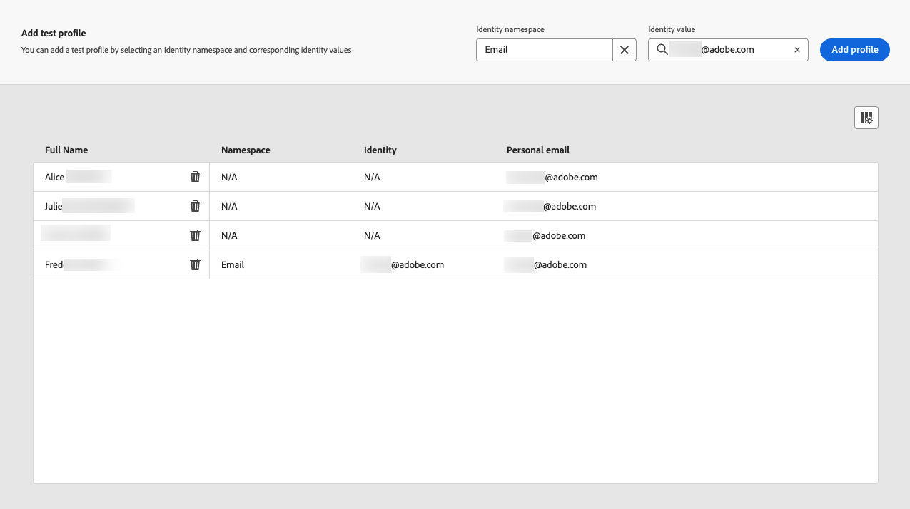

# 랜딩 페이지 만들기 및 게시 {#create-lp}

>[!CAUTION]
>
>현재 랜딩 페이지를 사용하면 사용자를 선택하기 위해 얼리 액세스에서 사용할 수 있습니다. 이 기능을 활용하려면 Adobe 계정 담당자에게 문의하십시오.

## 랜딩 페이지에 액세스 {#access-landing-pages}

랜딩 페이지 목록에 액세스하려면 다음을 선택합니다 **[!UICONTROL Journey Management]** > **[!UICONTROL Landing pages]** 왼쪽 메뉴에서 를 클릭합니다.

다음 **[!UICONTROL Landing Pages]** 목록에는 생성된 모든 항목이 표시됩니다. 상태 또는 수정 날짜에 따라 필터링할 수 있습니다.

## 랜딩 페이지 만들기 {#create-landing-page}

랜딩 페이지를 만드는 단계는 다음과 같습니다.

1. 랜딩 페이지 목록에서 **[!UICONTROL Create landing page]**.

   

1. 제목을 추가합니다. 필요한 경우 설명을 추가할 수 있습니다.

   

1. 사전 설정을 선택합니다.

   

   >[!NOTE]
   >
   >랜딩 페이지 사전 설정을 정의하려면 Adobe 계정 담당자 또는 [Adobe 고객 지원 지원 팀](https://helpx.adobe.com/kr/enterprise/admin-guide.html/enterprise/using/support-for-experience-cloud.ug.html){target=&quot;_blank&quot;}.

1. **[!UICONTROL Create]**&#x200B;을(를) 클릭합니다.

1. 기본 페이지 및 해당 속성이 표시됩니다. 기본 페이지 설정을 구성하는 방법 알아보기 [여기](#configure-primary-page).

   

1. + 아이콘을 클릭하여 하위 페이지를 추가합니다. 하위 페이지 설정을 구성하는 방법 알아보기 [여기](#configure-subpages).

   

구성 및 디자인 후 [기본 페이지](#configure-primary-page), 및 [하위 페이지](#configure-subpages) 있는 경우 다음을 수행할 수 있습니다. [테스트](#test-landing-page) 및 [게시](#publish-landing-page) 랜딩 페이지.

## 기본 페이지 구성 {#configure-primary-page}

기본 페이지는 이메일 또는 웹 사이트 등의 랜딩 페이지 링크를 클릭하면 사용자에게 즉시 표시되는 페이지입니다.

기본 페이지 설정을 정의하려면 아래 단계를 수행합니다.

1. 페이지 이름을 변경할 수 있습니다. **[!UICONTROL Primary page]** 기본적으로 제공됩니다.

1. 콘텐츠 디자이너를 사용하여 페이지의 콘텐츠를 편집합니다. 랜딩 페이지 컨텐츠를 정의하는 방법을 알아봅니다 [여기](design-lp.md).

   

1. 랜딩 페이지 URL을 정의합니다. URL의 첫 번째 부분에는 도메인 위임을 수행해야 합니다. 미리 채워져 있으며 사용자 인터페이스를 통해 편집할 수 없습니다. 설정하려면 Adobe 계정 담당자 또는 [Adobe 고객 지원 지원 팀](https://helpx.adobe.com/enterprise/admin-guide.html/enterprise/using/support-for-experience-cloud.ug.html){target=&quot;_blank&quot;}.

   >[!CAUTION]
   >
   >랜딩 페이지 URL은 고유해야 합니다.

   

1. 페이지에 대한 만료 날짜를 정의할 수 있습니다. 이 경우 페이지 만료 시 작업을 선택해야 합니다.

   * **[!UICONTROL Redirect URL]**: 페이지가 만료되면 사용자가 리디렉션되는 페이지의 URL을 입력합니다.
   * **[!UICONTROL Custom page]**: [하위 페이지 구성](#configure-subpages) 표시되는 드롭다운 목록에서 선택합니다.
   * **[!UICONTROL Browser error]**: 페이지 대신 표시할 오류 텍스트를 입력합니다.

   

   <!--1. In the **[!UICONTROL Additional data]** section, define a **[!UICONTROL Key]** and the corresponding **[!UICONTROL Parameter value]**. // you can define how the data entered in the landing page is managed once it has been submitted by a user??-->

1. 하나 이상의 가입 목록을 선택한 경우 [기본 페이지 디자인](design-lp.md)로 설정되면 페이지에 **[!UICONTROL Subscription list]** 섹션을 참조하십시오.

   

1. 랜딩 페이지에서 직접 다음을 수행할 수 있습니다 [여정 만들기](../building-journeys/journey-gs.md#jo-build) 사용자가 양식을 제출할 때 확인 메시지가 표시됩니다. 이 여정 끝에 이러한 라이브러리를 빌드하는 방법을 알아봅니다 [사용 사례](lp-use-cases.md#subscription-to-a-service).

   

   클릭 **[!UICONTROL Create journey]** 으로 리디렉션됩니다. **[!UICONTROL Journey Management]** > **[!UICONTROL Journeys]** 목록.

## 하위 페이지 구성 {#configure-subpages}

최대 2개의 하위 페이지를 추가할 수 있습니다. 예를 들어 사용자가 양식을 제출하면 표시되는 &#39;감사 인사&#39; 페이지를 만들고, 랜딩 페이지에 문제가 발생하면 호출되는 오류 페이지를 정의할 수 있습니다.

하위 페이지 설정을 정의하려면 아래 단계를 수행합니다.

1. 페이지 이름을 변경할 수 있습니다. **[!UICONTROL Subpage 1]** 기본적으로 제공됩니다.

1. 콘텐츠 디자이너를 사용하여 페이지의 콘텐츠를 편집합니다. 랜딩 페이지 컨텐츠를 정의하는 방법을 알아봅니다 [여기](design-lp.md).

1. 랜딩 페이지 URL을 정의합니다. URL의 첫 번째 부분에는 도메인 위임을 수행해야 합니다. 미리 채워져 있으며 사용자 인터페이스를 통해 편집할 수 없습니다. 설정하려면 Adobe 계정 담당자 또는 [Adobe 고객 지원 지원 팀](https://helpx.adobe.com/enterprise/admin-guide.html/enterprise/using/support-for-experience-cloud.ug.html){target=&quot;_blank&quot;}.

   >[!CAUTION]
   >
   >랜딩 페이지 URL은 고유해야 합니다.

## 랜딩 페이지 테스트 {#test-landing-page}

랜딩 페이지 설정 및 콘텐츠가 정의되면 테스트 프로필을 사용하여 미리 볼 수 있습니다. 삽입한 경우 [개인화된 콘텐츠](../personalization/personalize.md)를 입력하면 테스트 프로필 데이터를 활용하여 이 콘텐츠가 랜딩 페이지에 어떻게 표시되는지 확인할 수 있습니다.

>[!CAUTION]
>
>메시지를 미리 보고 증명을 보내려면 테스트 프로필을 사용할 수 있어야 합니다. 방법 알아보기 [테스트 프로필 만들기](../building-journeys/creating-test-profiles.md).

1. 랜딩 페이지 인터페이스에서 **[!UICONTROL Preview & test]** 테스트 프로필 선택에 액세스하는 단추입니다.

   

   >[!NOTE]
   >
   >다음 **[!UICONTROL Preview]** 버튼은 컨텐츠 디자이너에서 액세스할 수도 있습니다.

1. 에서 **[!UICONTROL Preview & test]** 화면에서 테스트 프로필을 하나 이상 선택합니다.

   

   테스트 프로필을 선택하는 단계는 메시지를 테스트할 때와 동일합니다. 자세한 내용은 [이 섹션](../messages/preview.md#select-test-profiles).

1. 을(를) 선택합니다 **[!UICONTROL Preview]** 탭을 클릭하고 **[!UICONTROL Open preview]** 랜딩 페이지를 테스트하려면 다음을 수행하십시오.

   

1. 랜딩 페이지의 미리 보기가 새 탭에서 열립니다. 개인화된 요소는 선택한 테스트 프로필 데이터로 대체됩니다.

   

1. 다른 테스트 프로필을 선택하여 랜딩 페이지의 각 변형에 대한 렌더링을 미리 봅니다.

## 경고 확인 {#check-alerts}

랜딩 페이지를 만드는 동안 경고에서는 게시하기 전에 중요한 작업을 수행해야 할 때 알려줍니다.

경고는 아래와 같이 화면 오른쪽 상단에 표시됩니다.

>[!NOTE]
>
>이 단추가 표시되지 않으면 경고가 감지되지 않습니다.

다음 두 가지 유형의 경고가 발생할 수 있습니다.

* **경고** 권장 사항 및 우수 사례를 참조하십시오. <!--For example, a message will display if -->

* **오류** 메시지가 해결되지 않는 한 게시하지 못하도록 합니다. 예를 들어 기본 페이지 URL이 누락된 경우 경고가 표시됩니다.

<!--All possible warnings and errors are detailed [below](#alerts-and-warnings).-->

>[!CAUTION]
>
> 모든 문제를 해결해야 합니다. **오류** 게시하기 전에 경고를 표시합니다.

<!--The settings and elements checked by the system are listed below. You will also find information on how to adapt your configuration to resolve the corresponding issues.

**Warnings**:

* 

**Errors**:

* 

>[!CAUTION]
>
> To be able to publish your message, you need to resolve all **error** alerts.
-->

## 랜딩 페이지 게시 {#publish-landing-page}

랜딩 페이지가 준비되면 게시하여 메시지에 사용할 수 있도록 만들 수 있습니다.

>[!CAUTION]
>
>경고를 게시하기 전에 경고를 확인하고 확인합니다. [자세히 알아보기](#check-alerts)

랜딩 페이지가 게시되면 과 함께 랜딩 페이지 목록에 추가됩니다. **[!UICONTROL Published]** 상태.

이제 라이브로 사용 가능하며, [!DNL Journey Optimizer] [메시지](../messages/create-message.md) 그것은 [여정](../building-journeys/journey.md).

>[!NOTE]
>
>특정 보고서를 통해 랜딩 페이지의 영향을 모니터링할 수 있습니다. [자세히 알아보기](lp-report.md)

