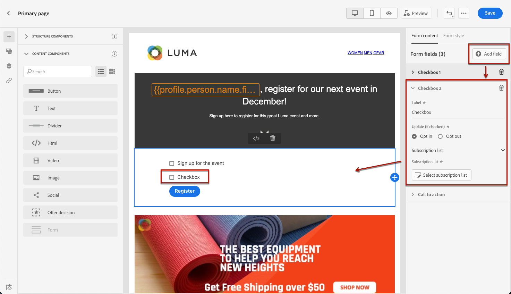

# 랜딩 페이지 콘텐츠 디자인 {#design-lp-content}

랜딩 컨텐츠를 만들려면 [기본 페이지](create-lp.md#configure-primary-page) 또는 [하위 페이지](create-lp.md#configure-subpages)를 클릭하고 마우스를 기본 페이지 컨텐츠 위에 올린 다음 를 클릭합니다 **[!UICONTROL Open Designer]**. You can also click the corresponding button from the right palette.

여기에서 다음을 수행할 수 있습니다.

* **처음부터 랜딩 페이지 디자인** 컨텐츠 디자이너의 인터페이스를 통해 [Adobe Experience Manager Assets Essentials](../messages/assets-essentials.md). 콘텐츠를 디자인하거나 기본 제공 템플릿을 사용하는 방법을 알아봅니다 [이 섹션](../messages/create-email-content.md).

* **Code or paste raw HTML** directly into the content designer. 자체 콘텐츠를 코딩하는 방법을 알아봅니다 [이 섹션](../messages/existing-content.md#import-raw-html-code).

* **기존 HTML 콘텐츠 가져오기** 파일 또는 .zip 폴더에서 사용할 수 있습니다. Learn how to import content [in this section](../messages/existing-content.md#import-html-content-from-file).

>[!NOTE]
>
>랜딩 페이지 콘텐츠 디자이너는 대부분 이메일 디자이너와 유사합니다. 추가 정보 [콘텐츠 디자인 [!DNL Journey Optimizer]](../messages/design-emails.md).

## Define landing page-specific content {#define-lp-specific-content}

사용자가 랜딩 페이지에서 선택 및 제출 할 수 있는 특정 콘텐츠를 정의하려면 아래 단계를 따르십시오.

1. 랜딩 페이지별로 끌어서 놓습니다 **[!UICONTROL Form]** 구성 요소를 생성할 수 있습니다.

   

   >[!NOTE]
   >
   >다음 **[!UICONTROL Form]** 구성 요소는 동일한 페이지에서 한 번만 사용할 수 있습니다.

1. 패턴을 선택합니다. 다음 **[!UICONTROL Form content]** 양식의 여러 필드를 편집할 수 있도록 오른쪽 팔레트에 탭이 표시됩니다.

   

   >[!NOTE]
   >
   >로 전환 **[!UICONTROL Form style]** 언제든지 탭하여 양식 구성 요소 컨텐츠의 스타일을 편집할 수 있습니다. [자세히 알아보기](#define-lp-styles)

1. From the **[!UICONTROL Checkbox 1]** section, you can edit the label corresponding to this checkbox.

1. Define if this checkbox is to opt users in or out: do they agree to receive communications or do they ask not to be contacted any more?

   

1. 다음 세 옵션 중에서 업데이트할 항목을 선택합니다.

   

   * **[!UICONTROL Subscription list]**: You must select the subscription list that will be updated if the profile selects this checkbox. 추가 정보 [구독 목록](subscription-list.md).

      

   * **[!UICONTROL Channel (email)]**: The opt-in or opt-out applies to the whole channel. 예를 들어 옵트아웃하는 프로필에 두 개의 이메일 주소가 있는 경우 두 주소가 모두 모든 통신에서 제외됩니다.

   * **[!UICONTROL Email identity]**: The opt-in or opt-out only applies to the email address that was used to access the landing page. For example, if a profile has two email addresses, only the one that was used to opt in will receive communications from your brand.

1. 클릭 **[!UICONTROL Add field]** > **[!UICONTROL Checkbox]** 다른 확인란을 추가합니다. 위의 단계를 반복하여 해당 속성을 정의합니다.

   

1. Once you added all the desired checkboxes, click **[!UICONTROL Call to action]** to expand the corresponding section. It enables you to define the behavior of the button in the **[!UICONTROL Form]** component.

   

1. Define what will happen upon clicking the button:

   * **[!UICONTROL Redirect URL]**: 사용자가 리디렉션될 페이지의 URL을 입력합니다.
   * **[!UICONTROL Confirmation text]**: 표시할 확인 텍스트를 입력합니다.
   * **[!UICONTROL Link to a subpage]**: 구성 [하위 페이지](create-lp.md#configure-subpages) 표시되는 드롭다운 목록에서 선택합니다.

   

1. 오류가 발생할 경우 버튼을 클릭하면 발생하는 내용을 정의합니다.

   * **[!UICONTROL Redirect URL]**: 사용자가 리디렉션될 페이지의 URL을 입력합니다.
   * **[!UICONTROL Error text]**: 표시할 오류 텍스트를 입력합니다. 를 정의할 때 오류 텍스트를 미리 볼 수 있습니다 [양식 스타일](#define-lp-styles).

   * **[!UICONTROL Link to a subpage]**: 구성 [하위 페이지](create-lp.md#configure-subpages) 표시되는 드롭다운 목록에서 선택합니다.

   

1. If you want to make additionnal updates upon submitting the form, select **[!UICONTROL Opt in]** or **[!UICONTROL Opt out]**, and define if you want to update a subscription list, the channel or just the email address used.

   

1. 컨텐츠를 저장하고 페이지 이름 옆에 있는 화살표를 클릭하여 로 돌아갑니다. [랜딩 페이지 속성](create-lp.md#configure-primary-page).

   

<!--Will the name Email Designer be kept if you can also design LP with the same tool? > To modify in Messages section > content designer or Designer-->

## Define landing page form styles {#define-lp-styles}

1. To modify the styles of your form component content, switch at any time to the **[!UICONTROL Form style]** tab.

   

1. Expand the **[!UICONTROL Checkboxes]** section to define the appearance of the checkboxes and corresponding text. 예를 들어 글꼴 패밀리나 크기, 확인란 테두리 색상을 조정할 수 있습니다.

   

1. 를 확장합니다. **[!UICONTROL Buttons]** 구성 요소 양식에서 단추 모양을 수정하는 섹션을 참조하십시오. 예를 들어 테두리를 추가하거나, 마우스로 가리키면 레이블 색상을 편집하거나, 단추의 정렬을 조정할 수 있습니다.

   

   You can preview some of your settings such as button label color on hover by using the **[!UICONTROL Preview]** button. 랜딩 페이지 테스트에 대해 자세히 알아보기 [여기](create-lp.md#test-landing-page).

   

1. Expand the **[!UICONTROL Form layout]** section to edit the layout settings such as the background color, padding, or margin.

   

1. Expand the **[!UICONTROL Form error]** section to adjust the display of the error message that displays in case a problem occurs. Check the corresponing option to preview the error text on the form.

   

