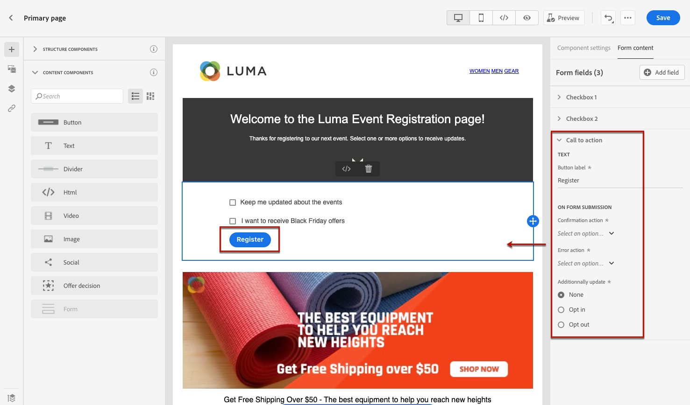
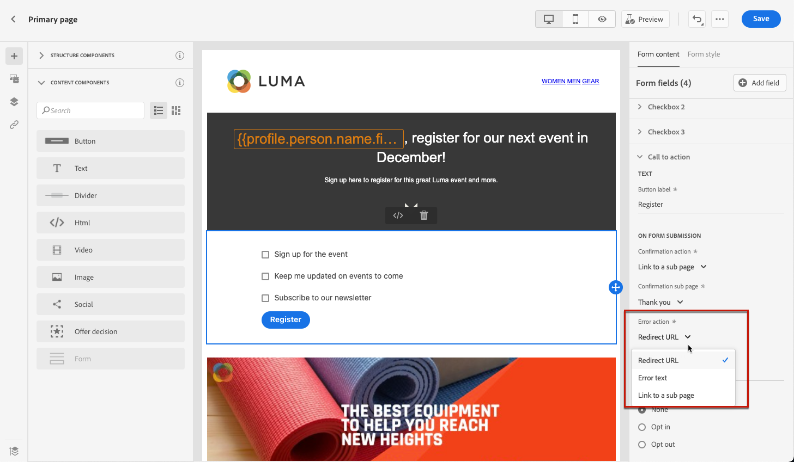

# 랜딩 페이지 콘텐츠 디자인 {#design-lp-content}

랜딩 컨텐츠를 만들려면 [기본 페이지](create-lp.md#configure-primary-page) 또는 [하위 페이지](create-lp.md#configure-subpages)를 클릭하고 마우스를 기본 페이지 컨텐츠 위에 올린 다음 를 클릭합니다 **[!UICONTROL Open Designer]**. 오른쪽 팔레트에서 해당 버튼을 클릭할 수도 있습니다.

여기에서 다음을 수행할 수 있습니다.

* **처음부터 랜딩 페이지 디자인** 컨텐츠 디자이너의 인터페이스를 통해 [Adobe Experience Manager Assets Essentials](../messages/assets-essentials.md). 콘텐츠를 디자인하거나 기본 제공 템플릿을 사용하는 방법을 알아봅니다 [이 섹션](../messages/create-email-content.md).

* **원시 HTML 코드 또는 붙여넣기** 에서 바로 콘텐츠를 디자인할 수 있습니다. 자체 콘텐츠를 코딩하는 방법을 알아봅니다 [이 섹션](../messages/existing-content.md#import-raw-html-code).

* **기존 HTML 콘텐츠 가져오기** 파일 또는 .zip 폴더에서 사용할 수 있습니다. 콘텐츠를 가져오는 방법 알아보기 [이 섹션](../messages/existing-content.md#import-html-content-from-file).

>[!NOTE]
>
>랜딩 페이지 콘텐츠 디자이너는 대부분 이메일 디자이너와 유사합니다. 추가 정보 [콘텐츠 디자인 [!DNL Journey Optimizer]](../messages/design-emails.md).

## 랜딩 페이지별 콘텐츠 정의 {#define-lp-specific-content}

사용자가 랜딩 페이지에서 선택 및 제출 할 수 있는 특정 콘텐츠를 정의하려면 아래 단계를 따르십시오.

1. 랜딩 페이지별로 끌어서 놓습니다 **[!UICONTROL Form]** 구성 요소를 생성할 수 있습니다.

   

   >[!NOTE]
   >
   >다음 **[!UICONTROL Form]** 구성 요소는 동일한 페이지에서 한 번만 사용할 수 있습니다.

1. 패턴을 선택합니다. 다음 **[!UICONTROL Form content]** 양식의 여러 필드를 편집할 수 있도록 오른쪽 팔레트에 탭이 표시됩니다.

   

   >[!NOTE]
   >
   >로 전환 **[!UICONTROL Form style]** 언제든지 탭하여 양식 구성 요소 컨텐츠의 스타일을 편집할 수 있습니다. [자세히 알아보기](#define-lp-styles)

1. 에서 **[!UICONTROL Checkbox 1]** 섹션에서 이 확인란에 해당하는 레이블을 편집할 수 있습니다.

1. 이 확인란을 사용하여 사용자를 옵트아웃할지 여부를 정의합니다. 그들은 통신을 받는 것에 동의합니까, 아니면 더 이상 연락을 받지 않도록 요청합니까?

   

1. 다음 세 옵션 중에서 업데이트할 항목을 선택합니다.

   

   * **[!UICONTROL Subscription list]**: 프로필에서 이 확인란을 선택하면 업데이트되는 구독 목록을 선택해야 합니다. 추가 정보 [구독 목록](subscription-list.md).

      

   * **[!UICONTROL Channel (email)]**: 옵트인 또는 옵트아웃은 전체 채널에 적용됩니다. 예를 들어 옵트아웃하는 프로필에 두 개의 이메일 주소가 있는 경우 두 주소가 모두 모든 통신에서 제외됩니다.

   * **[!UICONTROL Email identity]**: 옵트인 또는 옵트아웃은 랜딩 페이지에 액세스하는 데 사용한 이메일 주소에만 적용됩니다. 예를 들어 프로필에 두 개의 이메일 주소가 있는 경우 옵트인에 사용된 이메일 주소만 브랜드로부터 커뮤니케이션을 받습니다.

1. 클릭 **[!UICONTROL Add field]** > **[!UICONTROL Checkbox]** 다른 확인란을 추가합니다. 위의 단계를 반복하여 해당 속성을 정의합니다.

   

1. 원하는 확인란을 모두 추가했으면 을 클릭합니다 **[!UICONTROL Call to action]** 를 클릭하여 해당 섹션을 확장합니다. 여기에서 **[!UICONTROL Form]** 구성 요소.

   

1. 버튼을 클릭하면 발생할 작업을 정의합니다.

   * **[!UICONTROL Redirect URL]**: 사용자가 리디렉션될 페이지의 URL을 입력합니다.
   * **[!UICONTROL Confirmation text]**: 표시할 확인 텍스트를 입력합니다.
   * **[!UICONTROL Link to a subpage]**: 구성 [하위 페이지](create-lp.md#configure-subpages) 표시되는 드롭다운 목록에서 선택합니다.

   

1. 오류가 발생할 경우 버튼을 클릭하면 발생하는 내용을 정의합니다.

   * **[!UICONTROL Redirect URL]**: 사용자가 리디렉션될 페이지의 URL을 입력합니다.
   * **[!UICONTROL Error text]**: 표시할 오류 텍스트를 입력합니다. 를 정의할 때 오류 텍스트를 미리 볼 수 있습니다 [양식 스타일](#define-lp-styles).

   * **[!UICONTROL Link to a subpage]**: 구성 [하위 페이지](create-lp.md#configure-subpages) 표시되는 드롭다운 목록에서 선택합니다.

   

1. 양식을 제출할 때 추가 업데이트를 수행하려면 다음을 선택합니다 **[!UICONTROL Opt in]** 또는 **[!UICONTROL Opt out]**, 및에서 구독 목록, 채널 또는 사용된 이메일 주소를 업데이트할지 여부를 정의합니다.

   

1. 컨텐츠를 저장하고 페이지 이름 옆에 있는 화살표를 클릭하여 로 돌아갑니다. [랜딩 페이지 속성](create-lp.md#configure-primary-page).

   

<!--Will the name Email Designer be kept if you can also design LP with the same tool? > To modify in Messages section > content designer or Designer-->

## 랜딩 페이지 양식 스타일 정의 {#define-lp-styles}

1. 양식 구성 요소 콘텐츠의 스타일을 수정하려면 언제든지 **[!UICONTROL Form style]** 탭.

   

1. 를 확장합니다. **[!UICONTROL Checkboxes]** 섹션을 클릭하여 확인란과 해당 텍스트의 모양을 정의합니다. 예를 들어 글꼴 패밀리나 크기, 확인란 테두리 색상을 조정할 수 있습니다.

   

1. 를 확장합니다. **[!UICONTROL Buttons]** 구성 요소 양식에서 단추 모양을 수정하는 섹션을 참조하십시오. 예를 들어 테두리를 추가하거나, 마우스로 가리키면 레이블 색상을 편집하거나, 단추의 정렬을 조정할 수 있습니다.

   

   마우스로 가리키면 단추 레이블 색상과 같은 일부 설정을 **[!UICONTROL Preview]** 버튼을 클릭합니다. 랜딩 페이지 테스트에 대해 자세히 알아보기 [여기](create-lp.md#test-landing-page).

   

1. 를 확장합니다. **[!UICONTROL Form layout]** 섹션에 배경색, 패딩 또는 여백과 같은 레이아웃 설정을 편집할 수 있습니다.

   

1. 를 확장합니다. **[!UICONTROL Form error]** 문제가 발생할 경우 표시되는 오류 메시지 표시를 조정하는 섹션을 추가했습니다. 해당 옵션을 선택하여 양식의 오류 텍스트를 미리 봅니다.

   

