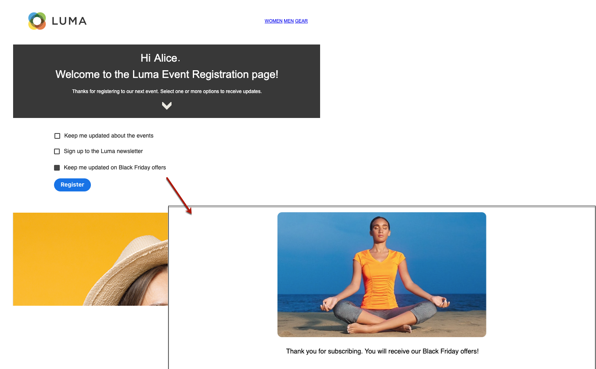
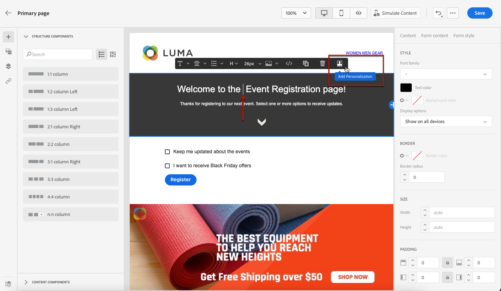
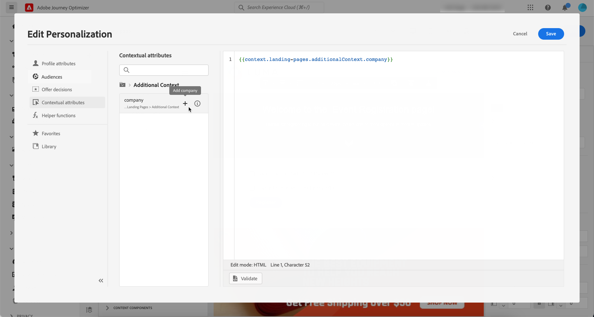

# 랜딩 페이지별 콘텐츠 정의 {#lp-content}

>[!CONTEXTUALHELP]
>id="ac_lp_components"
>title="콘텐츠 구성 요소 사용"
>abstract="콘텐츠 구성 요소는 랜딩 페이지 레이아웃 제작에 사용할 수 있는 빈 콘텐츠 플레이스홀더입니다. 사용자가 선택 사항을 선택하고 제출할 수 있는 특정 콘텐츠를 정의하려면 양식 구성 요소를 사용합니다."
>additional-url="https://experienceleague.adobe.com/en/docs/journey-optimizer/using/channels/email/design-email/add-content/content-components#add-content-components" text="콘텐츠 구성 요소 추가"

랜딩 페이지 콘텐츠를 디자인하기 위해 이메일과 동일한 구성 요소를 사용할 수 있습니다. [자세히 알아보기](../email/content-components.md#add-content-components)

사용자가 선택 항목을 선택하고 제출할 수 있도록 특정 콘텐츠를 디자인하려면 [양식 구성 요소를 사용](#use-form-component)하고 [랜딩 페이지별 스타일](#lp-form-styles)을(를) 정의하세요.

>[!NOTE]
>
>**[!UICONTROL 양식]** 구성 요소 없이 클릭스루 랜딩 페이지를 만들 수도 있습니다. 이 경우 랜딩 페이지가 사용자에게 표시되지만 양식을 제출할 필요는 없습니다. 이 기능은 옵트인 또는 옵트아웃과 같은 수신자의 작업 없이 랜딩 페이지를 표시하거나 사용자 입력이 필요하지 않은 정보를 제공하려는 경우에만 유용할 수 있습니다.

랜딩 페이지 콘텐츠 디자이너를 사용하여 하위 페이지의 기본 페이지에서 가져온 컨텍스트 데이터를 활용할 수도 있습니다. [자세히 알아보기](#use-primary-page-context)

## 양식 구성 요소 사용 {#use-form-component}

>[!CONTEXTUALHELP]
>id="ac_lp_formfield"
>title="양식 구성 요소 필드 설정"
>abstract="수신자가 랜딩 페이지에서 선택 사항을 표시하고 제출하는 방법을 정의합니다."
>additional-url="https://experienceleague.adobe.com/ko/docs/journey-optimizer/using/landing-pages/landing-pages-design/lp-content#lp-form-styles" text="랜딩 페이지 양식 스타일 정의"

>[!CONTEXTUALHELP]
>id="ac_lp_submission"
>title="버튼 클릭 시 나타나는 결과"
>abstract="사용자가 랜딩 페이지 양식을 제출할 때 나타나는 결과를 정의합니다."

사용자가 랜딩 페이지에서 선택한 항목을 선택하고 제출할 수 있도록 특정 콘텐츠를 정의하려면 **[!UICONTROL 양식]** 구성 요소를 사용합니다. 그 방법은 다음과 같습니다.

1. 왼쪽 팔레트에서 랜딩 페이지별 **[!UICONTROL 양식]** 구성 요소를 기본 작업 영역으로 끌어다 놓습니다.

   

   >[!NOTE]
   >
   >**[!UICONTROL Form]** 구성 요소는 같은 페이지에서 한 번만 사용할 수 있습니다.

1. 선택합니다. 양식의 여러 필드를 편집할 수 있도록 **[!UICONTROL 양식 콘텐츠]** 탭이 오른쪽 팔레트에 표시됩니다.

   

   >[!NOTE]
   >
   >언제든지 **[!UICONTROL 스타일]** 탭으로 전환하여 양식 구성 요소 콘텐츠의 스타일을 편집합니다. [자세히 알아보기](#define-lp-styles)

1. **[!UICONTROL 확인란 1]** 섹션에서 이 확인란에 해당하는 레이블을 편집할 수 있습니다.

1. 이 확인란이 사용자를 옵트인 또는 옵트아웃할지 여부를 정의합니다. 커뮤니케이션 수신에 동의합니까? 또는 더 이상 연락하지 않도록 요청합니까?

   

   아래 세 가지 옵션 중에서 선택하십시오.

   * **[!UICONTROL 선택한 경우 옵트인]**: 사용자가 동의(옵트인)하려면 확인란을 선택해야 합니다.
   * **[!UICONTROL 선택한 경우 옵트아웃]**: 사용자가 동의(옵트아웃)를 제거하려면 확인란을 선택해야 합니다.
   * **[!UICONTROL 선택한 경우 옵트인, 선택하지 않은 경우 옵트아웃]**: 이 옵션을 사용하면 옵트인/옵트아웃에 대한 단일 확인란을 삽입할 수 있습니다. 사용자는 동의(옵트인)하려면 이 확인란을 선택하고 동의를 제거(옵트아웃)하려면 선택을 해제해야 합니다.

1. 다음 세 가지 옵션 중 업데이트할 옵션을 선택합니다.

   

   * **[!UICONTROL 구독 목록]**: 프로필에서 이 확인란을 선택하면 업데이트할 구독 목록을 선택해야 합니다. [구독 목록](subscription-list.md)에 대해 자세히 알아보세요.

     <!---->

   * **[!UICONTROL 채널(이메일)]**: 옵트인 또는 옵트아웃이 전체 채널에 적용됩니다. 예를 들어 옵트아웃하는 프로필에 두 개의 이메일 주소가 있는 경우 두 주소가 모두 모든 통신에서 제외됩니다.

   * **[!UICONTROL 전자 메일 ID]**: 옵트인 또는 옵트아웃은 랜딩 페이지에 액세스하는 데 사용한 전자 메일 주소에만 적용됩니다. 예를 들어 프로필에 두 개의 이메일 주소가 있는 경우 옵트인하는 데 사용된 이메일 주소만 브랜드의 커뮤니케이션을 수신합니다.

1. 다른 확인란을 추가하려면 **[!UICONTROL 필드 추가]** > **[!UICONTROL 확인란]**&#x200B;을 클릭합니다. 위의 단계를 반복하여 속성을 정의합니다.

   

1. **[!UICONTROL 텍스트 필드]**&#x200B;를 추가할 수도 있습니다.

   

   * 양식의 필드 위에 표시할 **[!UICONTROL 레이블]**&#x200B;을(를) 입력하십시오.

   * **[!UICONTROL 자리 표시자]** 텍스트를 입력하십시오. 사용자가 필드를 채우기 전에 필드 내부에 표시됩니다.

   * 필요한 경우 **[!UICONTROL 양식 필드 필수]** 옵션을 선택하십시오. 이 경우 랜딩 페이지는 사용자가 이 필드를 입력한 경우에만 제출할 수 있습니다. 필수 필드를 입력하지 않으면 사용자가 페이지를 제출할 때 오류 메시지가 표시됩니다.

   

1. 원하는 확인란 및/또는 텍스트 필드를 모두 추가했으면 **[!UICONTROL 콜 투 액션을 클릭하여 해당 섹션을 확장합니다.]** 이를 통해 **[!UICONTROL Form]** 구성 요소에서 단추의 동작을 정의할 수 있습니다.

   

1. 버튼을 클릭하면 발생할 작업을 정의합니다.

   * **[!UICONTROL 리디렉션 URL]**: 사용자가 리디렉션될 페이지의 URL을 입력하십시오.
   * **[!UICONTROL 확인 텍스트]**: 표시할 확인 텍스트를 입력하십시오.
   * **[!UICONTROL 하위 페이지에 연결]**: [하위 페이지](create-lp.md#configure-subpages)를 구성하고 표시되는 드롭다운 목록에서 선택하십시오.

   

1. 오류가 발생하는 경우 버튼을 클릭하면 발생할 작업을 정의합니다.

   * **[!UICONTROL 리디렉션 URL]**: 사용자가 리디렉션될 페이지의 URL을 입력하십시오.
   * **[!UICONTROL 오류 텍스트]**: 표시할 오류 텍스트를 입력하십시오. [양식 스타일](#define-lp-styles)을 정의할 때 오류 텍스트를 미리 볼 수 있습니다.

   * **[!UICONTROL 하위 페이지에 연결]**: [하위 페이지](create-lp.md#configure-subpages)를 구성하고 표시되는 드롭다운 목록에서 선택하십시오.

   

1. 양식을 제출할 때 추가 업데이트를 하려면 **[!UICONTROL 옵트인]** 또는 **[!UICONTROL 옵트아웃]**&#x200B;을 선택하고 구독 목록을 업데이트할지, 사용한 채널 또는 이메일 주소만 업데이트할지를 정의합니다.

   

1. 콘텐츠를 저장하고 페이지 이름 옆에 있는 화살표를 클릭하여 [랜딩 페이지 속성](create-lp.md#configure-primary-page)(으)로 돌아갑니다.

   

## 랜딩 페이지 양식 스타일 정의 {#lp-form-styles}

1. 양식 구성 요소 콘텐츠의 스타일을 수정하려면 언제든지 **[!UICONTROL 스타일]** 탭으로 전환하십시오.

   

1. **[!UICONTROL 필드]** 섹션은 기본적으로 확장되어 레이블 및 자리 표시자 글꼴, 레이블의 위치, 필드 배경색 또는 필드 테두리와 같은 텍스트 필드의 모양을 편집할 수 있습니다.

   

1. **[!UICONTROL 확인란]** 섹션을 확장하여 확인란 모양과 해당 텍스트를 정의합니다. 예를 들어 글꼴 모음이나 크기 또는 확인란 테두리 색상을 조정할 수 있습니다.

   

1. **[!UICONTROL 단추]** 섹션을 확장하여 구성 요소 양식의 단추 모양을 수정합니다. 예를 들어 글꼴을 변경하거나, 테두리를 추가하거나, 마우스로 가리키면 레이블 색상을 편집하거나, 단추의 정렬을 조정할 수 있습니다.

   

   **[!UICONTROL 콘텐츠 시뮬레이션]** 단추를 사용하여 마우스로 가리키면 단추 레이블 색상과 같은 일부 설정을 미리 볼 수 있습니다. 랜딩 페이지 테스트에 대한 자세한 내용은 [여기](create-lp.md#test-landing-page)를 참조하세요.

   <!---->

1. **[!UICONTROL 양식 레이아웃]** 섹션을 확장하여 배경색, 패딩 또는 여백과 같은 레이아웃 설정을 편집합니다.

   

1. **[!UICONTROL 양식 오류]** 섹션을 확장하여 문제가 발생할 경우에 표시되는 오류 메시지의 표시를 조정합니다. 해당 옵션을 선택하여 양식의 오류 텍스트를 미리 봅니다.

   

## 기본 페이지 컨텍스트 사용 {#use-primary-page-context}

동일한 랜딩 페이지 내에서 다른 페이지에서 가져온 상황별 데이터를 사용할 수 있습니다.

예를 들어 <!-- or the submission of the page--> 확인란을 기본 랜딩 페이지의 [구독 목록](subscription-list.md)에 연결하는 경우 &quot;감사합니다&quot; 하위 페이지에서 해당 구독 목록을 사용할 수 있습니다.

기본 페이지의 두 확인란을 두 개의 다른 구독 목록에 연결한다고 가정해 보겠습니다. 사용자가 이 중 하나를 구독하면 선택한 확인란에 따라 양식 제출 시 특정 메시지를 표시할 수 있습니다.

이렇게 하려면 아래 절차를 따르십시오.

1. 기본 페이지에서 **[!UICONTROL Form]** 구성 요소의 각 확인란을 관련 구독 목록에 연결합니다. [자세히 알아보기](#use-form-component).

   

1. 하위 페이지에서 텍스트를 삽입할 위치에 마우스 포인터를 놓고 상황별 도구 모음에서 **[!UICONTROL 개인화 추가]**&#x200B;를 선택합니다.

   

1. **[!UICONTROL 개인화 편집]** 창에서 **[!UICONTROL 컨텍스트 특성]** > **[!UICONTROL 랜딩 페이지]** > **[!UICONTROL 기본 페이지 컨텍스트]** > **[!UICONTROL 구독]**&#x200B;을 선택합니다.

1. 기본 페이지에서 선택한 모든 구독 목록이 나열됩니다. + 아이콘을 사용하여 관련 항목을 선택합니다.

   

1. 개인화 편집기 도우미 기능을 사용하여 관련 조건을 추가합니다. [자세히 알아보기](../personalization/functions/functions.md)

   

   >[!CAUTION]
   >
   >표현식에 하이픈과 같은 특수 문자가 있으면 하이픈을 포함하는 텍스트를 이스케이프해야 합니다.

1. 변경 내용을 저장합니다.

이제 사용자가 확인란 중 하나를 선택하면

양식을 제출하면 선택한 확인란에 해당하는 메시지가 표시됩니다.

<!---->

>[!NOTE]
>
>사용자가 두 확인란을 선택하면 두 텍스트가 모두 표시됩니다.

<!--
## Use landing page additional data {#use-additional-data}

When [configuring the primary page](create-lp.md#configure-primary-page), you can create additional data to enable storing information when the landing page is being submitted.

>[!NOTE]
>
>This data may not be visible to users who visit the page.

If you defined one or more keys with their corresponding values when [configuring the primary page](create-lp.md#configure-primary-page), you can leverage these keys in the content of your primary page and subpages using the [personalization editor](../personalization/personalization-build-expressions.md).

///When you reuse the same text on a page, this enables you to dynamically change that text if needed, without going through each occurrence.

For example, if you define the company name as a key, you can quickly update it everywhere (on all the pages of a given landing page) by changing it only once in the [primary page settings](create-lp.md#configure-primary-page).///

To leverage these keys in a landing page, follow the steps below:

1. When configuring the primary page, define a key and its corresponding value in the **[!UICONTROL Additional data]** section. [Learn more](create-lp.md#configure-primary-page)

    

1. When editing your primary page with the designer, place the pointer of your mouse where you want to insert your key and select **[!UICONTROL Add personalization]** from the contextual toolbar.

    

1. In the **[!UICONTROL Edit Personalization]** window, select **[!UICONTROL Contextual attributes]** > **[!UICONTROL Landing Pages]** > **[!UICONTROL Additional Context]**.

    

1. All the keys that you created when configuring the primary page are listed. Select the key of your choice using the + icon.

    

1. Save your changes and repeat the steps above as many times as needed.

    

    You can see that the personalization item corresponding to your key is now displayed everywhere you inserted it.
-->