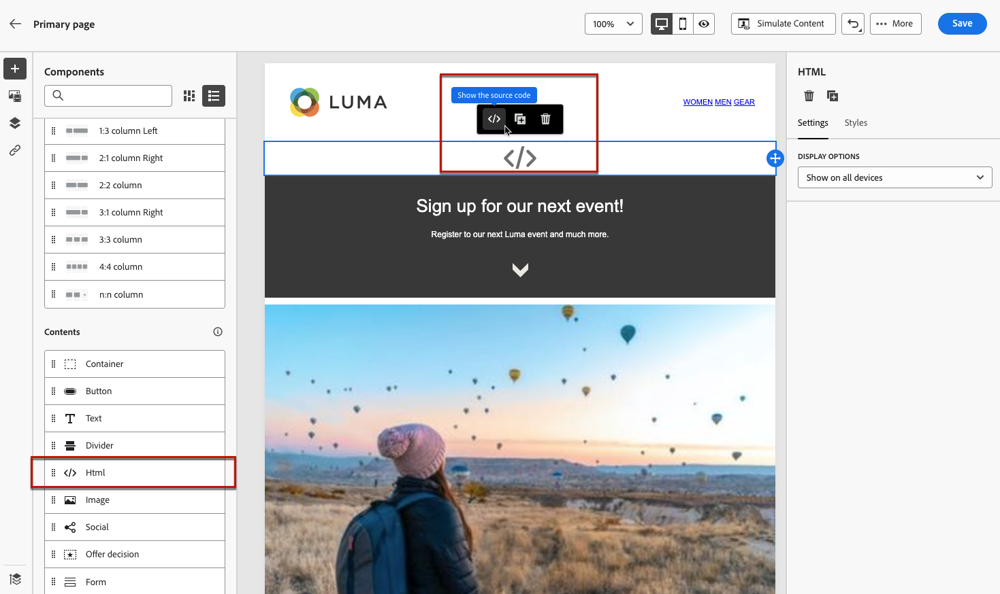

# 랜딩 페이지에서 사용자 지정 JavaScript 사용 {#lp-custom-js}

사용자 지정 JavaScript를 사용하여 랜딩 페이지 컨텐츠를 정의할 수 있습니다. 예를 들어 고급 스타일링을 수행해야 하거나 사용자 지정 동작을 랜딩 페이지에 추가하려면 고유한 컨트롤을 빌드하여 에서 실행할 수 있습니다. [!DNL Journey Optimizer].

## 랜딩 페이지에 JavaScript 코드 삽입

사용자 지정 JavaScript를 랜딩 페이지 컨텐츠에 삽입하려면 다음을 수행할 수 있습니다.

* 컨텐츠 만들기를 시작할 때 기존 HTML 컨텐츠를 가져오고 사용자 지정 JavaScript 코드가 포함된 파일을 선택합니다. 콘텐츠를 가져오는 방법 알아보기 [이 섹션](../design/existing-content.md).

* 랜딩 페이지를 처음부터 또는 저장된 템플릿에서 디자인합니다. 을(를) 끌어다 놓습니다 **[!UICONTROL HTML]** 컨텐츠 구성 요소를 캔버스에 업로드하고 소스 코드를 표시하여 구성 요소에 JavaSCript를 추가합니다. 에서 HTML 구성 요소를 사용하는 방법을 알아봅니다. [이 섹션](../design/content-components.md#HTML). <!--You can also simply switch the whole landing page content to code view and enter or paste your JavaScript code.-->

   

* JavaScript 코드를 콘텐츠 디자이너에 직접 입력하거나 붙여넣습니다. 자체 콘텐츠를 코딩하는 방법을 알아봅니다 [이 섹션](../design/code-content.md).

>[!NOTE]
>
>현재 실행 중인 JavaScript는 [랜딩 페이지 미리 보기](create-lp.md#test-landing-page).

랜딩 페이지를 올바르게 표시하려면 아래 섹션에 설명된 대로 다음 구문을 사용하십시오.

## 코드 초기화

JavaScript 코드를 삽입하려면 `lpRuntimeReady` 이벤트. 이 이벤트는 라이브러리의 성공적인 초기화 후 트리거됩니다. 콜백이 `lpRuntime` 객체를 사용하여 라이브러리 메서드 및 후크를 노출합니다.

`LpRuntime` 은 &quot;랜딩 페이지 런타임&quot;을 의미합니다. 이 개체는 기본 라이브러리 식별자입니다. 후크, 양식 제출 방법 및 사용자 지정 JavaScript에서 사용할 수 있는 기타 유틸리티 메서드를 노출합니다.

**예:**

```
if(window.lpRuntime){
    init(window.lpRuntime);
}else{
    window.addEventListener('lpRuntimeReady',function(e){
        init(e.detail);
    });
}
 
function init(lpRuntime){
    // Enter custom JavaScript here using methods from lpRuntime.
}
```

## 후크

후크를 사용하여 양식 제출 주기 동안 메서드를 첨부할 수 있습니다. 예를 들어, 실제로 양식을 제출하기 전에 후크를 사용하여 양식 유효성 검사를 수행할 수 있습니다.

사용할 수 있는 후크는 다음과 같습니다.

| 이름 | 설명 |
|--- |--- |
| addBeforeSubmitHook | 양식을 제출하기 전에 호출할 사용자 지정 후크입니다. 제출을 계속하려면 true를 반환하고, 실행을 차단하려면 false를 반환합니다. |
| addOnFailureHook | 양식 제출 실패 시 호출할 사용자 지정 후크입니다. |
| addOnSuccessHook | 양식 제출 시 호출할 사용자 지정 후크입니다. |

**예:**

```
//LpRuntime hooks
lpRuntime.hooks.addBeforeSubmitHook(function(){
    // Add your validation logic here.
});
```

## 사용자 지정 양식 제출

아래 나열된 방법은 사용자 지정 양식 제출을 수행하는 데 사용됩니다.

>[!NOTE]
>
>양식 제출은 사용자 지정 JavaScript에서 처리되므로 글로벌 변수를 설정하여 기본 제출을 명시적으로 비활성화해야 합니다 `disableDefaultFormSubmission` to `true`.

| 이름 | 설명 |
|--- |--- |
| submitForm | 이 메서드는 양식을 제출하고 사후 제출 흐름을 처리합니다. |
| submitFormPartial | 이 메서드는 양식도 제출하지만 게시 제출 플로우는 건너뜁니다. 예를 들어 성공 페이지로 리디렉션하도록 리디렉션을 성공적으로 제출하도록 구성한 경우 부분 양식 제출 시 해당 리디렉션이 발생하지 않습니다. |

**예:**

```
//LpRuntime methods
window.disableDefaultFormSubmission = true        // Flag to disable the default submission flow.
 
lpRuntime.submitForm(formSubmissionData);         // This will trigger the default form submission handling like redirecting to error or success page.
  
lpRuntime.submitFormPartial(formSubmissionData,{   // This will not trigger the default submission handling.
    beforeSubmit : callback,
    onFailure : failureCallback,                   // Custom onFailureCallback - will be used in partial submission of form.
    onSuccess : successCallback                    // Custom onSuccessCallback - will be used in partial submission of form.
})
```

## 유틸리티 함수

| 이름 | 설명 |
|--- |--- |
| getFormData | 이 메서드는 `formData` 를 JSON 개체 형태로 변환해야 합니다. 이 개체는에 전달할 수 있습니다 `submitForm` 참조하십시오. |

**예:**

```
let formData = lpRuntime.getFormData();                           // Method to generate formdata
 
lpRuntime.submitForm(formData);
```

## 사용 사례

### 사용 사례 1: 양식 제출 전에 유효성 검사 추가

```
<html>
<body>
// Enter HTML body here.
  
<script>
        if(window.lpRuntime){
          console.log('got runtime',lpRuntime);
          init(window.lpRuntime);
        }else{
          window.addEventListener('lpRuntimeReady',function(e){
            init(window.lpRuntime);
          });
        }
        
  
      // Here validate the function is checking if the checkbox is selected. This method should return true if you want form submission.
      function validateForm(){
        return document.querySelector('.spectrum-Checkbox-input').checked;
      }    
  
      function init(lpRuntime){
          lpRuntime.hooks.addBeforeSubmitHook(function(){
              return validateForm(); // This method should return true if you want to proceed with submission.
          })
      }
  
</script>  
  
</body>
</html>
```

### 사용 사례 2: 부분 양식 제출

예를 들어 페이지에 여러 개의 확인란이 있는 양식이 있습니다. 확인란을 선택하면 사용자가 제출 단추를 클릭할 때까지 기다리지 않고 이 데이터를 백엔드에 저장할 수 있습니다.

```
<html>
<body>
    <form>
        <input type='checkbox' value="1" name="name1"/>
        <input type='checkbox' value="2" name="name2"/>
        <input type='checkbox' value="3" name="name3"/>
        <input type='checkbox' value="4" name="name4"/>
    </form>
  
<script>
      window.disableDefaultFormSubmission=true;
 
      window.addEventListener('lpRuntimeReady',function(e){        
        init(e.detail)
      }
 
     function init(lpRuntime){
        window.getElementByTagName('input').addEventListener('change',function(e){
            let formData = lpRuntime.getFormData();
            lpRuntime.submitFormPartial(formData);
        })
      }
    </script>
  
</body>
</html>
```

### 사용 사례 3: 사용자 지정 분석 태그

JavaScript를 사용하여 입력 필드의 리스너를 추가하고 사용자 지정 분석 호출 트리거를 첨부할 수 있습니다.

```
<html>
<body>
    <form>
        <input type='checkbox' value="1" name="name1"/>
        <input type='checkbox' value="2" name="name2"/>
        <input type='checkbox' value="3" name="name3"/>
        <input type='checkbox' value="4" name="name4"/>
    </form>
  
<script>
      window.disableDefaultFormSubmission=false;  
 
      window.addEventListener('lpRuntimeReady',function(e){        
        init(e.detail)
      }
 
     function init(lpRuntime){
         window.getElementByTagName('input').addEventListener('change',function(e){
            //trigger analytics events
        })
      }
        
    </script>
  
</body>
</html>
```

### 사용 사례 4: 다이내믹 양식

```
<html>
<body>
    <form>
        <input type='checkbox' value="1" name="name1"/>
        <div class="hiddenInput hidden">
            <input type='text' name="name2"/>
        </div>
    </form>
  
<script>
      window.disableDefaultFormSubmission=false;     
 
      window.addEventListener('lpRuntimeReady',function(e){        
        init(e.detail)
      }
 
      function init(lpRuntime){
        window.getElementByTagName('input').addEventListener('change',function(e){
            document.querySelector('.hiddenInput').toggleClass('hidden');
        })
      }
        
    </script>
  
</body>
</html>
```
