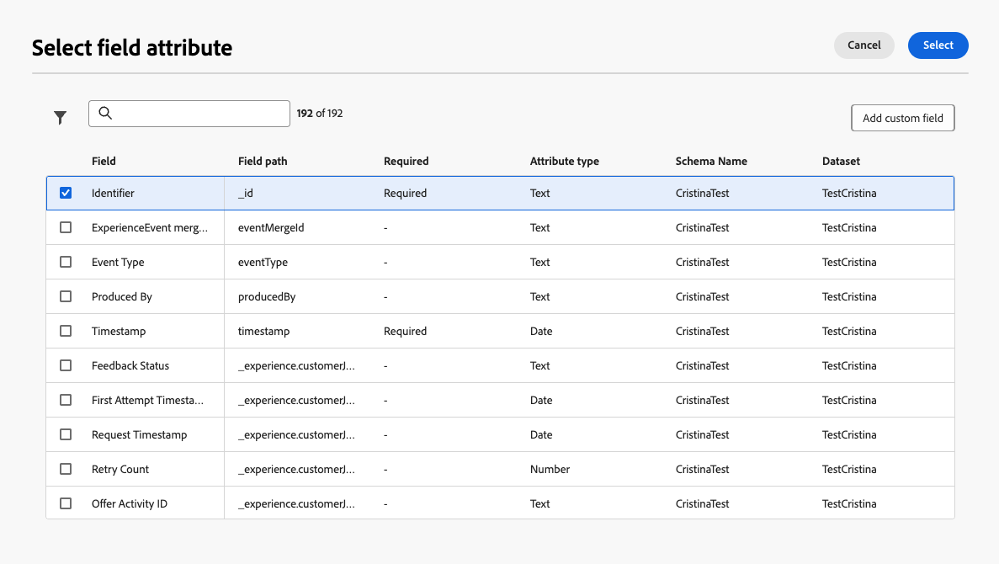

# 랜딩 페이지에서 양식 사용 {#lp-forms}

>[!AVAILABILITY]
>
>이 기능은 현재 미국 및 호주 고객에게 제한된 가용성으로 제공되고 있습니다. 액세스 권한을 얻으려면 Adobe 담당자에게 문의하십시오.

[!DNL Journey Optimizer] 랜딩 페이지로 프로필 데이터를 캡처하고 [!DNL Experience Platform] 데이터 세트를 보강하려면 랜딩 페이지의 양식을 활용할 수 있습니다.

## 양식 사전 설정 만들기 {#create-form-preset}

>[!CONTEXTUALHELP]
>id="ajo_lp_form_connection"
>title="사용할 엔드포인트 선택"
>abstract="양식 제출 시 데이터가 전송되는 스트리밍 끝점을 정의합니다."
>additional-url="https://experienceleague.adobe.com/ko/docs/experience-platform/sources/ui-tutorials/create/streaming/http" text="HTTP API 스트리밍 연결 만들기"

>[!CONTEXTUALHELP]
>id="ajo_lp_form_dataset"
>title="데이터 세트 선택"
>abstract="양식 응답을 저장 및 반영할 데이터 세트를 정의합니다. 특정 데이터 세트를 검색하도록 입력하거나 목록에서 선택할 수 있습니다."

양식을 만들려면 먼저 양식 제출 데이터가 전송되는 연결 끝점을 선택하는 전용 사전 설정과 양식을 통해 캡처한 데이터가 저장되는 데이터 세트를 만들어야 합니다.

스트리밍 끝점에 데이터가 도달하면 데이터 세트 정보와 연결됩니다. 그런 다음 생성된 소스/타겟 연결 및 소스 흐름을 사용하여 데이터가 데이터 세트로 푸시됩니다.

사전 설정을 만들 때:

* 다양한 데이터 세트 조합과 스트리밍 연결을 사용하여 여러 사전 설정을 설정할 수 있습니다.
* 여러 사전 설정에서 동일한 데이터 세트 또는 스트리밍 연결을 재사용할 수 있습니다.
* 각 스트리밍 연결은 다음과 같은 리소스를 자동으로 생성합니다.
   * **Source 연결** - 데이터가 생성되는 위치입니다.
   * **대상 연결** - 데이터가 저장되거나 사용되는 위치입니다.
   * **Source 흐름** - 매핑, 변환 및 유효성 검사를 처리하고 소스 연결에서 [!DNL Experience Platform]&#x200B;(으)로 데이터를 이동하는 파이프라인.

<!--
>[!NOTE]
>
> To access and edit form presets, you must have the **[!UICONTROL Manage form presets]** permission on the production sandbox. Learn more about permissions in [this section](../administration/high-low-permissions.md#administration-permissions).TBC
-->

양식 사전 설정을 만들려면 아래 단계를 수행합니다.

1. **[!UICONTROL 양식 사전 설정]** 인벤토리에 액세스하려면 왼쪽 메뉴에서 **[!UICONTROL 관리]** > **[!UICONTROL 채널]** >**[!UICONTROL 양식 설정]**&#x200B;을 선택하십시오.

1. **[!UICONTROL 양식 사전 설정 만들기]**&#x200B;를 클릭합니다.

1. 이름을 업데이트하여 보다 쉽게 검색하고 필요한 경우 설명을 추가합니다.

   {width=80%}

1. 해당 양식에 사용할 **[!UICONTROL 스트리밍 연결]**&#x200B;을(를) 선택하십시오. 양식을 제출할 때 데이터가 전송되는 스트리밍 엔드포인트입니다.

   >[!NOTE]
   >
   >[Experience Platform 설명서](https://experienceleague.adobe.com/ko/docs/experience-platform/sources/ui-tutorials/create/streaming/http){target="_blank"}에서 스트리밍 소스 연결을 만드는 방법에 대해 자세히 알아보세요.

1. 양식에 연결할 **[!UICONTROL 데이터 집합]**&#x200B;을(를) 선택하십시오. 여기에서 양식 응답이 저장되고 반영됩니다. 특정 데이터 세트를 검색하도록 입력하거나 목록에서 선택할 수 있습니다.

   >[!NOTE]
   >
   >현재 [!DNL Adobe Experience Platform]개의 데이터 세트만 선택할 수 있습니다. 한 번에 하나의 데이터 세트를 선택할 수 있습니다. [데이터 세트에 대해 자세히 알아보기](../data/get-started-datasets.md)

1. **[!UICONTROL 게시]**&#x200B;를 클릭합니다. 이제 사전 설정을 양식에서 사용할 준비가 되었습니다.

## 양식 액세스 및 관리 {#access-forms}

양식 목록에 액세스하려면 왼쪽 메뉴에서 **[!UICONTROL 콘텐츠 관리]** > **[!UICONTROL Forms]**&#x200B;을(를) 선택하십시오.

모든 기존 양식이 표시됩니다. 상태, 작성 또는 수정 날짜에 따라 양식을 필터링할 수 있습니다.

## 양식 만들기 및 디자인 {#create-form}

>[!CONTEXTUALHELP]
>id="ajo_lp_form_preset"
>title="사전 설정 선택"
>abstract="사용할 연결 및 양식에 대한 사전 정의된 데이터 세트가 포함된 사전 정의된 사전 설정을 선택합니다."
>additional-url="https://experienceleague.adobe.com/ko/docs/journey-optimizer/using/content-management/landing-pages/lp-forms#create-form-preset" text="양식 사전 설정 만들기"

양식을 만들려면 아래 단계를 수행합니다.

1. **[!UICONTROL Forms]** 목록에서 **[!UICONTROL 양식 만들기]**&#x200B;를 클릭합니다.

1. 이름을 추가합니다. 필요한 경우 설명을 추가할 수 있습니다.

   

1. 사용할 연결 및 양식에 대해 미리 정의된 데이터 세트가 포함된 **[!UICONTROL 사전 설정]**&#x200B;을(를) 선택하십시오. [양식 사전 설정을 만드는 방법을 알아봅니다](#create-form-preset)

1. Click **[!UICONTROL Create]**. 양식 디자이너가 열리고 구조체 및 콘텐츠 [구성 요소](../email/content-components.md#add-content-components)를 추가하여 콘텐츠를 작성할 수 있습니다. [텍스트](../email/content-components.md#text) 및 **[!UICONTROL 필드]** 구성 요소를 사용할 수 있습니다.

1. 프로필 데이터 및 속성을 캡처하려면 양식에 특정 필드를 추가합니다. [자세히 알아보기](#define-fields)

1. 이러한 필드를 구성하고 디자인합니다. [자세히 알아보기](#configure-fields)

1. **[!UICONTROL 스타일]** 창을 사용하여 필요에 따라 양식의 레이아웃, 스타일 및 차원을 조정할 수 있습니다. [스타일에 대해 자세히 알아보기](../email/get-started-email-style.md)

1. 모든 필드를 구성했으면 **[!UICONTROL 저장 및 닫기]**&#x200B;를 클릭합니다.

1. 감사 인사 페이지를 구성합니다. [방법 알아보기](#thank-you-page)

1. 양식을 **[!UICONTROL 게시]**&#x200B;하여 랜딩 페이지에서 선택할 수 있도록 합니다.

### 특정 필드 정의 {#define-fields}

양식에 특정 필드를 추가하려면 구조를 캔버스에 끌어다 놓고 내부에 **[!UICONTROL 필드]** 구성 요소를 끌어옵니다.<!--**[!UICONTROL Select field attribute]** or **[!UICONTROL Add custom field]**.-->

그런 다음 다음 옵션 중 하나를 선택합니다.

>[!BEGINTABS]

>[!TAB 필드 특성 선택]

이 옵션을 사용하여 양식에 연결된 데이터 세트 스키마를 기반으로 속성을 선택합니다.

>[!NOTE]
>
>데이터 세트는 양식에 대해 선택한 사전 설정에 정의됩니다. [자세히 알아보기](#create-form-preset)

{width=100%}

예를 들어 이메일 및 개인 ID를 설정할 수 있습니다. 사용자가 이러한 필드를 채우면 입력한 정보가 선택한 데이터 세트에 저장됩니다.

{width=55%}

수집된 데이터를 프로필에 매핑하려면 프로필 ID 필드를 선택합니다. ID 필드가 특성 목록에서 **[!UICONTROL 필수]**(으)로 표시되어 있습니다. 필터링할 수 있습니다.

{width=65%}

>[!TAB 사용자 지정 필드 추가]

이 옵션을 사용하면 연결된 데이터 세트의 필드에 매핑하지 않고 자유 필드를 정의할 수 있습니다.

{width=85%}

>[!ENDTABS]

### 필드 구성 및 디자인 {#configure-fields}

필드 속성을 선택하거나 사용자 지정 필드를 추가한 후에는 양식을 제출할 때 세부 정보와 동작을 추가로 조정할 수 있습니다.

1. 오른쪽의 **[!UICONTROL 콘텐츠]** 탭에 있는 **[!UICONTROL 필드 세부 정보]** 섹션에서 필요에 따라 다음 요소를 지정할 수 있습니다.

   * 양식 수신자를 명확히 하려면 **[!UICONTROL 레이블]**&#x200B;을(를) 조정하십시오.
   * 필요에 따라 **[!UICONTROL 필드 형식]**&#x200B;을(를) 변경합니다. 확인란, 통화, 날짜, 슬라이더, URL 등일 수 있습니다.

     >[!NOTE]
     >
     >다른 필드 세부 사항은 선택한 필드 유형에 따라 달라질 수 있습니다.

   * **[!UICONTROL 자리 표시자]**.<!--To explain--> 추가
   * **[!UICONTROL 지침]**.<!--How will they be displayed in the form? To explain--> 지정
   * 양식 사용자가 필드를 채우기 전에 표시되는 **[!UICONTROL 기본값]**&#x200B;을(를) 입력하십시오.
   * 사용자 지정 **[!UICONTROL 유효성 검사 메시지]**&#x200B;를 정의할 수 있습니다.
   * **[!UICONTROL 최대 길이]**&#x200B;를 설정합니다. 필드를 입력할 때 양식 수신자가 한도를 초과하면 오류 메시지가 표시됩니다.

   {width=85%}

1. **[!UICONTROL 필드 동작]** 섹션에서 다음을 정의할 수 있습니다.

   * 이 필드를 필수 항목으로 만들려면 **[!UICONTROL 필수]**&#x200B;을(를) 선택하십시오. 사용자가 필드를 입력하지 않으면 양식을 제출할 수 없습니다.
   * 필드의 대/소문자를 구분하려면 **[!UICONTROL 중요]**&#x200B;을(를) 선택하십시오. <!--To confirm - do you mean retain capitalization when added to the dataset?-->
   * 사용 가능한 경우 프로필 정보에서 필드를 채우려면 **[!UICONTROL 미리 채워진 사용]**&#x200B;을(를) 선택하십시오.<!--Even for a custom field, or a field not mapped to a profile? What happens if no data is available?-->
   * **[!UICONTROL 입력 마스크 사용]**&#x200B;을 선택하여 사용자의 입력을 일반 문자로 바꿉니다. *9*&#x200B;은(는) 임의의 숫자를 의미하고 *a*&#x200B;은(는) 임의의 문자를 의미하며 *는 임의의 숫자나 문자를 의미합니다.<!--Not sure how you define that in the form-->

   {width=75%}

### 감사 인사 페이지 구성 {#thank-you-page}

>[!CONTEXTUALHELP]
>id="ajo_lp_forms_thankyou_page"
>title="감사 인사 페이지"
>abstract="누군가가 양식을 작성하거나 전송할 때 발생하는 작업을 구성합니다."

**[!UICONTROL 감사 페이지]** 섹션에서 양식 세부 정보로 돌아가서 사용자가 양식을 작성할 때 수행되는 작업을 구성하십시오.

다음 작업 중 하나를 설정합니다.

* **[!UICONTROL 페이지에서 유지]** - 이 옵션은 양식을 제출할 때 방문자를 동일한 페이지에 유지합니다.
* **[!UICONTROL 랜딩 페이지]** - 양식을 제출한 후 사용자가 리디렉션할 게시된 [랜딩 페이지](create-lp.md)을(를) 선택합니다.
* **[!UICONTROL 외부 URL]** - 후속 페이지로 사용할 전체 URL을 입력합니다. 사용자가 양식을 제출하면 지정된 URL로 이동됩니다.
* **[!UICONTROL 조건부 리디렉션]** - 양식 응답을 기반으로 다양한 후속 작업을 동적으로 표시하는 규칙을 설정합니다.

  각 특정 대상에 대한 규칙을 정의할 수 있습니다. 예를 들어 미국 거주자를 위한 특정 랜딩 페이지, 캐나다 거주자를 위한 다른 페이지 등을 표시할 수 있습니다. 마지막으로, 정의한 규칙에 해당하지 않는 사용자에 대해 기본 작업을 설정합니다.

  >[!NOTE]
  >
  >규칙에 정의된 조건은 순차적으로 읽혀집니다.

  {width=40%}

## 게시된 양식 편집 {#edit-form}

양식이 게시되면 편집할 수 있습니다. 아래 단계를 수행합니다.

1. [양식 목록](#access-forms)에 액세스하여 게시된 양식을 선택하십시오.

1. **[!UICONTROL 양식 편집]** 단추를 클릭합니다.

   {width=90%}

1. 초안 상태로 양식의 새 버전이 만들어집니다. **[!UICONTROL 초안 버전 만들기]**&#x200B;를 클릭합니다.

1. 필요에 따라 양식을 업데이트하고 **[!UICONTROL 저장]**&#x200B;을 클릭합니다. 이제 양식이 **[!UICONTROL 게시됨(초안 있음)]** 상태입니다.

   * 업데이트된 버전을 게시하기 전까지 현재 버전은 계속 **[!UICONTROL 게시됨]** 상태입니다.

   * 업데이트된 버전의 상태가 **[!UICONTROL 초안]**&#x200B;입니다.

1. 양식 요약으로 돌아가서 양식의 두 버전 간을 탐색할 수 있습니다.

   {width=70%}

1. **[!UICONTROL 초안]** 섹션에서 초안을 게시하거나 삭제하고 양식의 세부 사항이나 내용을 편집할 수 있습니다.

   {width=75%}

## 랜딩 페이지에서 양식 활용 {#leverage-form-in-lp}

이제 양식에 정의한 속성에 해당하는 데이터를 캡처하고 선택한 데이터 세트에 저장하기 위해 이 양식을 랜딩 페이지에 포함할 수 있습니다. 아래 단계를 수행합니다.

1. 랜딩 페이지를 만듭니다. [방법 알아보기](create-lp.md#create-landing-page)

1. 랜딩 페이지 유형으로 **[!UICONTROL 데이터 캡처]**&#x200B;를 선택하고 **[!UICONTROL 만들기]**&#x200B;를 클릭합니다.

   {width=65%}

1. 기본 페이지를 구성합니다. [방법 알아보기](create-lp.md#configure-primary-page)

1. [랜딩 페이지 디자이너](design-lp.md)를 엽니다.

1. **[!UICONTROL 구조 구성 요소]**&#x200B;를 콘텐츠로 끌어서 놓습니다. **[!UICONTROL Form]** 구성 요소를 해당 구조로 끌어서 놓습니다.

   >[!NOTE]
   >
   >랜딩 페이지에서 게시된 양식만 선택할 수 있습니다.

1. **[!UICONTROL 양식 포함]** 섹션에서 만든 양식을 선택합니다.

   

   >[!NOTE]
   >
   >**[!UICONTROL 양식 편집]** 단추를 사용하여 선택한 양식을 업데이트할 수 있습니다. 양식이 새 탭에서 열립니다. 양식 콘텐츠를 편집하는 단계는 [이 섹션](#create-form)에 자세히 설명되어 있습니다.

1. **[!UICONTROL 추가 작업 형식]** 섹션에서 사용자가 양식을 작성할 때 수행할 작업을 구성합니다.

   * 포함된 양식에 정의된 작업을 선택하려면 **[!UICONTROL 정의된 양식]**&#x200B;을 선택하십시오. [자세히 알아보기](#thank-you-page)

   * 양식을 제출한 후 사용자가 리디렉션되는 게시된 [랜딩 페이지](create-lp.md)를 선택할 수도 있습니다.

   * 또는 **[!UICONTROL 외부 URL]**&#x200B;을(를) 사용자가 양식을 제출할 때 안내하는 후속 페이지로 정의하십시오.

1. 랜딩 페이지를 저장하고 테스트합니다. [방법 알아보기](create-lp.md#test-landing-page)

랜딩 페이지가 [게시됨](create-lp.md#publish-landing-page)되고 여정에서 사용되면 사용자가 양식을 채울 때 입력한 정보가 선택한 데이터 집합에 수집됩니다.

>[!NOTE]
>
>랜딩 페이지에 사용된 양식을 게시 취소하고 이 양식을 편집한 후 다시 게시하는 경우, 랜딩 페이지는 항상 게시된 최신 버전의 양식을 사용합니다.
