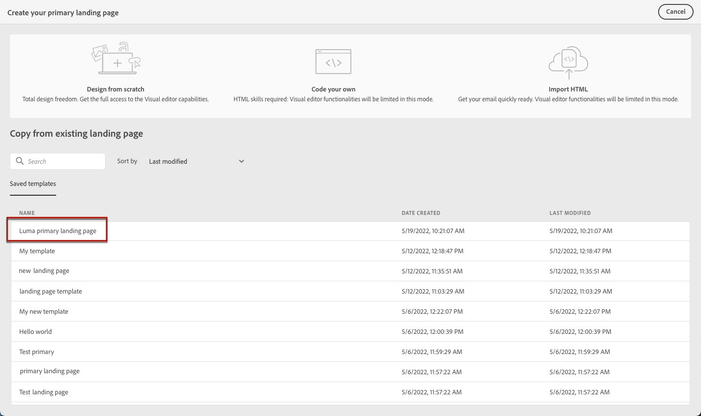

# 랜딩 페이지 템플릿 작업 {#work-with-templates}

## 페이지를 템플릿으로 저장 {#save-as-template}

디자인한 후에는 [랜딩 페이지 콘텐츠](lp-content.md)를 클릭하여 저장하면 나중에 다시 사용할 수 있습니다. 이렇게 하려면 아래 단계를 수행합니다.

1. 화면 오른쪽 상단의 생략 부호를 클릭합니다.

1. 선택 **[!UICONTROL 콘텐츠 템플릿으로 저장]** 드롭다운 메뉴에서 을(를) 선택합니다.

   

1. 이 템플릿의 이름을 추가합니다.

   

1. **[!UICONTROL 저장]**&#x200B;을 클릭합니다.

다음에 랜딩 페이지를 만들 때 이 템플릿을 사용하여 콘텐츠를 빌드할 수 있습니다. 에서 방법 알아보기 [섹션](#use-saved-template) 아래요.

## 저장된 템플릿 사용 {#use-saved-template}

1. 를 엽니다. [랜딩 페이지 콘텐츠 디자이너](design-lp.md). 이전에 저장된 모든 템플릿 목록이 표시됩니다.

1. **[!UICONTROL 이름]**, **[!UICONTROL 마지막 수정일]** 및 **[!UICONTROL 마지막 생성일]**&#x200B;을 기준으로 템플릿을 정렬할 수 있습니다.

   

1. 목록에서 원하는 템플릿을 선택합니다.

1. 선택한 후에는 오른쪽 및 왼쪽 화살표를 사용하여 저장된 모든 템플릿 간을 탐색할 수 있습니다.

   

1. 클릭 **[!UICONTROL 이 템플릿 사용]**.

1. 랜딩 페이지 디자이너를 사용하여 원하는 대로 콘텐츠를 편집합니다.

>[!NOTE]
>
>기본 페이지 템플릿과 하위 페이지 템플릿은 별도로 관리되므로 기본 페이지 템플릿을 사용하여 하위 페이지를 만들 수 없으며 그 반대의 경우도 마찬가지입니다.
