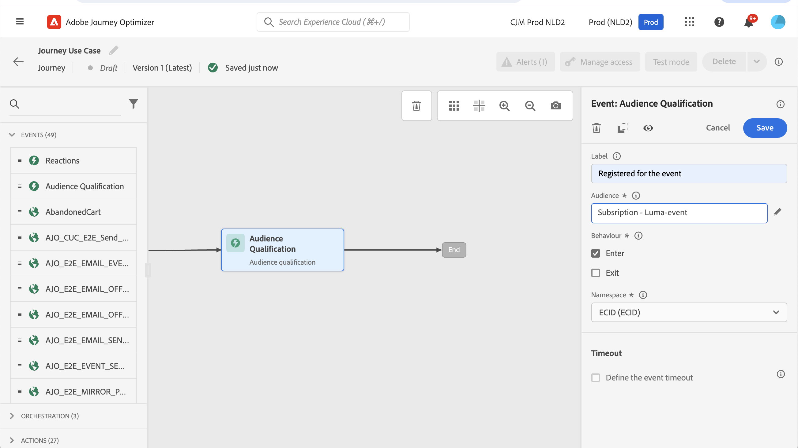

# 랜딩 페이지 사용 사례 {#lp-use-cases}

다음은 [!DNL Journey Optimizer] 랜딩 페이지를 사용하여 고객이 일부 또는 모든 커뮤니케이션 수신을 옵트인/옵트아웃하도록 하는 방법의 예입니다.

## 서비스 구독 {#subscription-to-a-service}

가장 일반적인 사용 사례 중 하나는 랜딩 페이지를 통해 고객을 [서비스 구독](subscription-list.md)(예: 뉴스레터 또는 이벤트)으로 초대하는 것입니다. 주요 단계는 아래 그래프에 나와 있습니다.

예를 들어 다음 달에 이벤트를 구성하고 이벤트 등록 캠페인 <!--to keep your customers that are interested updated on that event-->을(를) 시작한다고 가정해 보겠습니다. 이렇게 하려면 수신자가 이 이벤트에 등록할 수 있도록 랜딩 페이지에 대한 링크가 포함된 이메일을 보내게 됩니다. 등록한 사용자는 이 목적을 위해 만든 구독 목록에 추가됩니다.

### 랜딩 페이지 설정 {#set-up-lp}

1. 등록된 사용자를 저장하는 이벤트 등록의 구독 목록을 만듭니다. 구독 목록을 만드는 방법을 알아보세요. [여기](subscription-list.md#define-subscription-list).

   

1. 받는 사람이 이벤트에 등록할 수 있도록 [랜딩 페이지를 만듭니다](create-lp.md).

   

1. 등록 [기본 랜딩 페이지](create-lp.md#configure-primary-page)를 구성합니다.

1. [랜딩 페이지 콘텐츠](design-lp.md)를 디자인할 때 만든 구독 목록을 선택하여 등록 확인란을 선택하는 프로필로 업데이트하십시오.

   

1. 등록 양식을 제출하면 수신자에게 표시될 &#39;감사&#39; 페이지를 만듭니다. 랜딩 하위 페이지 [여기](create-lp.md#configure-subpages)를 구성하는 방법을 알아보세요.

   

1. 랜딩 페이지를 [Publish](create-lp.md#publish).

1. [여정](../building-journeys/journey.md)에서 **이메일** 활동을 추가하여 등록 랜딩 페이지로 트래픽을 유도합니다.

   

1. [전자 메일을 디자인](../email/get-started-email-design.md)하여 이벤트에 대한 등록이 열렸음을 알립니다.

1. 메시지 콘텐츠에 [링크 삽입](../email/message-tracking.md#insert-links) **[!UICONTROL 랜딩 페이지]**&#x200B;을(를) **[!UICONTROL 링크 형식]**(으)로 선택하고 등록을 위해 만든 [랜딩 페이지](create-lp.md#configure-primary-page)을(를) 선택합니다.

   

   >[!NOTE]
   >
   >메시지를 보내려면 선택한 랜딩 페이지가 아직 만료되지 않았는지 확인하십시오. 이 섹션](create-lp.md#configure-primary-page)에서 만료 날짜 [을(를) 업데이트하는 방법을 알아보세요.

   이메일을 수신하면 수신자가 랜딩 페이지 링크를 클릭하면 &#39;감사&#39; 페이지로 이동하며 구독 목록에 추가됩니다.

### 확인 이메일 보내기 {#send-confirmation-email}

또한 이벤트를 등록한 수신자에게 확인 이메일을 보낼 수 있습니다. 그 방법은 다음과 같습니다.

1. 다른 [여정](../building-journeys/journey.md)을(를) 만듭니다. **[!UICONTROL 여정 만들기]** 단추를 클릭하여 랜딩 페이지에서 직접 수행할 수 있습니다. [자세히 알아보기](create-lp.md#configure-primary-page)

   

1. **[!UICONTROL 이벤트]** 범주를 펼친 후 **[!UICONTROL 대상 자격]** 활동을 캔버스에 드롭하십시오. [자세히 알아보기](../building-journeys/audience-qualification-events.md)

1. **[!UICONTROL 대상자]** 필드를 클릭하고 만든 구독 목록을 선택합니다.

   

1. 선택한 확인 이메일을 추가하고 여정을 통해 보냅니다.

   

이벤트에 등록한 모든 사용자는 확인 이메일을 받게 됩니다.

<!--The event registration's subscription list tracks the profiles who registered and you can send them targeted event updates.-->

## 옵트아웃 랜딩 페이지 {#opt-out}

수신자가 커뮤니케이션에서 구독을 취소할 수 있도록 이메일에 옵트아웃 랜딩 페이지 링크를 포함할 수 있습니다.

>[!NOTE]
>
>받는 사람의 동의 관리에 대한 자세한 내용 및 [이 섹션](../privacy/opt-out.md)에서 이 내용이 중요한 이유에 대해 자세히 알아보세요.

### 옵트아웃 관리 {#opt-out-management}

수신자가 브랜드로부터 커뮤니케이션 수신을 거부할 수 있는 기능을 제공하는 것은 법적 요구사항입니다. 적용되는 법률에 대한 자세한 내용은[Experience Platform 설명서](https://experienceleague.adobe.com/docs/experience-platform/privacy/regulations/overview.html?lang=ko#regulations){target="_blank"}를 참조하세요.

따라서 수신자에게 보내는 모든 이메일에 항상 **구독 취소 링크**&#x200B;를 포함해야 합니다.

* 이 링크를 클릭하면 수신자는 옵트아웃을 확인하는 버튼이 포함된 랜딩 페이지로 이동됩니다.
* 옵트아웃 버튼을 클릭하면 프로필 데이터가 이 정보로 업데이트됩니다.

### 이메일 옵트아웃 구성 {#configure-opt-out}

이메일 수신자가 랜딩 페이지를 통해 커뮤니케이션 구독을 취소할 수 있도록 하려면 아래 단계를 수행합니다.

1. 랜딩 페이지를 만듭니다. [자세히 알아보기](create-lp.md)

1. 기본 페이지를 정의합니다. [자세히 알아보기](create-lp.md#configure-primary-page)

1. [기본 페이지 콘텐츠 디자인](design-lp.md): 랜딩 페이지별 **[!UICONTROL 양식]** 구성 요소를 사용하고, **[!UICONTROL 옵트아웃]** 확인란을 정의하고, **[!UICONTROL 채널(이메일)]**&#x200B;을 업데이트하도록 선택합니다. 랜딩 페이지에서 옵트아웃 상자를 확인하는 프로필은 모든 통신에서 옵트아웃됩니다.

   

   <!--You can also build your own landing page and host it on the third-party system of your choice.-->

1. 양식을 제출하는 사용자에게 표시되는 확인 [하위 페이지](create-lp.md#configure-subpages)를 추가하십시오.

   

   >[!NOTE]
   >
   >**[!UICONTROL 양식]** 구성 요소에 있는 기본 페이지의 **[!UICONTROL 콜 투 액션]** 섹션에서 하위 페이지를 참조하는지 확인하십시오. [자세히 알아보기](design-lp.md)

1. 페이지의 콘텐츠를 구성하고 정의했으면 랜딩 페이지를 [게시](create-lp.md#publish)합니다.

1. 여정에서 [전자 메일 메시지 만들기](../email/get-started-email-design.md).

1. 콘텐츠에서 텍스트를 선택하고 상황별 도구 모음을 사용하여 [링크를 삽입](../email/message-tracking.md#insert-links)합니다. 버튼에 대한 링크를 사용할 수도 있습니다.

1. **[!UICONTROL 링크 유형]** 드롭다운 목록에서 **[!UICONTROL 랜딩 페이지]**&#x200B;를 선택하고 옵트아웃하기 위해 만든 [랜딩 페이지](create-lp.md#configure-primary-page)를 선택합니다.

   

   >[!NOTE]
   >
   >메시지를 보내려면 선택한 랜딩 페이지가 아직 만료되지 않았는지 확인하십시오. 이 섹션](create-lp.md#configure-primary-page)에서 만료 날짜 [을(를) 업데이트하는 방법을 알아보세요.

1. Publish 를 실행하고 여정을 실행합니다. [자세히 알아보기](../building-journeys/journey.md).

1. 메시지가 수신되면 수신자가 이메일의 구독 취소 링크를 클릭하면 랜딩 페이지가 표시됩니다.

   

   수신자가 확인란을 선택하고 양식을 제출하는 경우:

   * 옵트아웃 수신자는 확인 메시지 화면으로 리디렉션됩니다.

   * 프로필 데이터가 업데이트되며, 다시 구독하지 않는 한 브랜드로부터 커뮤니케이션을 받지 않습니다.

해당 프로필의 선택 사항이 업데이트되었는지 확인하려면 Experience Platform으로 이동하여 ID 네임스페이스 및 해당 ID 값을 선택하여 프로필에 액세스합니다. 자세한 내용은 [Experience Platform 설명서](https://experienceleague.adobe.com/docs/experience-platform/profile/ui/user-guide.html?lang=ko#getting-started){target="_blank"}를 참조하세요.

**[!UICONTROL 특성]** 탭에서 **[!UICONTROL 선택]** 값이 **[!UICONTROL 아니요]**(으)로 변경되었음을 확인할 수 있습니다.

옵트아웃 정보는 **동의 서비스 데이터 집합**&#x200B;에 저장됩니다. [데이터 세트에 대해 자세히 알아보기](../data/get-started-datasets.md)

>[!NOTE]
>
>기본 [Adobe Experience Platform](https://experienceleague.adobe.com/docs/experience-platform/profile/home.html?lang=ko){target="_blank"} **[!UICONTROL 프로필]** 병합 정책의 병합 방법이 **[!UICONTROL 데이터 세트 우선 순위]**&#x200B;인 경우 **[!UICONTROL AJO 동의 서비스 데이터 세트]**&#x200B;를 사용하도록 설정하고 병합 정책에서 우선 순위를 지정하십시오. [자세히 알아보기](https://experienceleague.adobe.com/docs/experience-platform/profile/merge-policies/ui-guide.html#dataset-precedence-profile){target="_blank"}
>
>이 데이터 세트에 일괄 처리가 추가되지 않았더라도 여전히 옵트인/옵트아웃 정보가 포함됩니다.

**참고 항목:**

* [원클릭 옵트아웃](../email/email-opt-out.md#one-click-opt-out-link)
* [이메일 헤더의 옵트아웃 링크](../email/email-opt-out.md#unsubscribe-header)

<!--

### Other ways to opt out

You can also enable your recipients to unsubscribe whithout using landing pages.

* **One-click opt-out**

    You can add a one-click opt-out link into your email content. This will enable your recipients to quickly unsubscribe from your communications, without being redirected to a landing page where they need to confirm opting out. [Learn more](../privacy/opt-out.md#one-click-opt-out-link)

* **Unsubscribe link in header**

    If the recipients' email client supports displaying an unsubscribe link in the email header, emails sent with [!DNL Journey Optimizer] automatically include this link. [Learn more](../privacy/opt-out.md#unsubscribe-header)

////////

## Leverage landing page submission event {#leverage-lp-event}

You can use information that was submitted on a landing page to send communications to your customers. For example, if a user subscribes to a given subscription list, you can leverage that information to send an email recommending other subscription lists to that user.

To do this, you need to create an event containing the landing page submission information and use it in a journey. Follow the steps below.

1. Go to **[!UICONTROL Administration]** > **[!UICONTROL Configurations]**, and in the **[!UICONTROL Events]** section, select **[!UICONTROL Manage]**.

    

1. The list of events displays. Select **[!UICONTROL Create Event]**.

    

1. The event configuration pane opens on the right side of the screen. Configure a rule-based unitary event. [Learn more](../event/about-creating.md)

1. Define the schema: select **[!UICONTROL AJO Email Tracking Experience Event Schema v.1]** (available by default in [!DNL Journey Optimizer]).

    

1. In the **[!UICONTROL Fields]** section, select the following elements:

    * **[!UICONTROL _experience]** > **[!UICONTROL customerJourneyManagement]** > **[!UICONTROL messageInteraction]** > **[!UICONTROL Interaction Type]**
    
    * **[!UICONTROL _experience]** > **[!UICONTROL customerJourneyManagement]** > **[!UICONTROL messageInteraction]** > **[!UICONTROL Landing Page Details]** > **[!UICONTROL Landing Page ID]**

    

1. Click inside the **[!UICONTROL Event ID condition]** field. Using the simple personalization editor, define the condition for the **[!UICONTROL Interaction Type]** and **[!UICONTROL Landing Page ID]** fields. This will be used by the system to identify the events that will trigger your journey.

    

    >[!NOTE]
    >
    >To find the landing page ID, you can insert the landing page as a link into an email and select the source code from the contextual toolbar to display the landing page information.
    >
    >

1. Save your changes.

1. Create a [journey](../building-journeys/journey.md). You can do it directly from the landing page by clicking the **[!UICONTROL Create journey]** button. Learn more [here](create-lp.md#configure-primary-page)

    

1. In the journey, unfold the **[!UICONTROL Events]** category and drop the event that you created into the canvas. Learn more [here](../building-journeys/audience-qualification-events.md)

    

1. Unfold the **[!UICONTROL Actions]** category and drop an email action into the canvas.

    

///How do you use the information from the event to send an email to the users? -->
