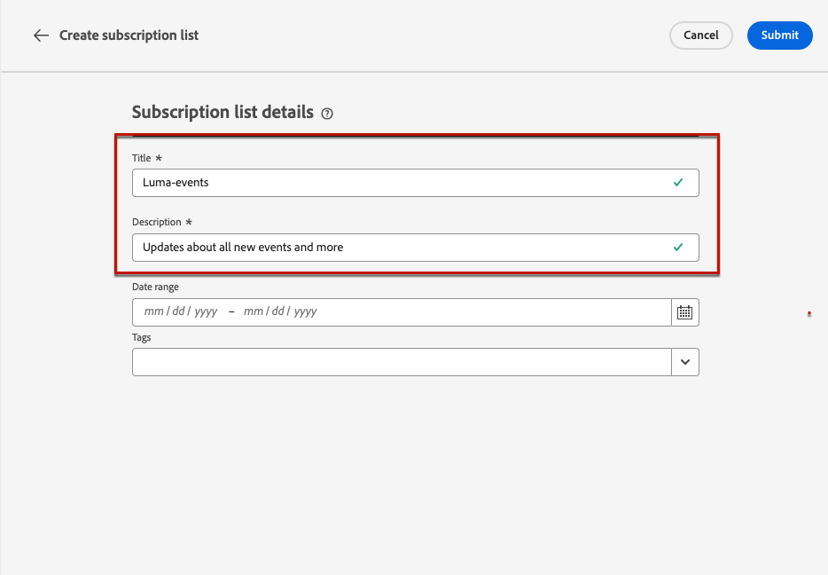

# 구독 목록 {#create-subscription-list}

>[!CONTEXTUALHELP]
>id="ajo_subscription_list"
>title="구독 목록 설정"
>abstract="구독 목록을 만들어 특정 주제 또는 이벤트에 대한 커뮤니케이션을 수신하도록 옵트인한 프로필을 수집합니다. "
>additional-url="https://experienceleague.adobe.com/docs/journey-optimizer/using/content-management/landing-pages/subscription-list.html#define-subscription-list" text="구독 목록 만들기"

구독 서비스는 특정 주제/이벤트/관심 분야 등에 대한 커뮤니케이션을 수신하도록 선택한 고객에게 제공되는 마케팅 상품 및 서비스를 의미합니다. 지속적으로. [!DNL Journey Optimizer]에서 이러한 옵트인 고객은 구독 목록에 수집됩니다.

구독 서비스는 다음 용도로 사용할 수 있습니다.

* 뉴스레터(예: &quot;시리즈 실행 중&quot;)
* 예: &quot;Summit 2021&quot;
* 웨비나(예: &quot;암호에 대해 자세히 알아보기&quot;)
* 특정 제품/스포츠/서비스 등에 대한 관심 분야(예: &quot;향후 12개월 이내에 주택을 구입하는 데 관심 있음&quot;)
* 알림 방법에 대한 환경 설정(예: &quot;이메일로 새 노래 알림 수신&quot;)

[랜딩 페이지](create-lp.md)를 통해 프로필을 구독 목록에 추가할 수 있습니다. 예제는 [이 섹션](lp-use-cases.md#subscription-to-a-service)에 나와 있습니다.

## 구독 목록 만들기 {#define-subscription-list}

구독 목록을 만들려면 아래 단계를 수행하십시오.

1. 구독 목록에 액세스하려면 **[!UICONTROL 고객]** > **[!UICONTROL 구독 목록]**&#x200B;을 선택하세요.

   

1. **[!UICONTROL 구독 목록 만들기]** 단추를 선택하십시오.

   

1. 제목 및 설명을 추가합니다. 이러한 필드는 필수입니다.

   

   >[!CAUTION]
   >
   >현재 **[!UICONTROL 제목]** 필드에 다른 구독 목록에 대해 이미 존재하는 이름을 입력하거나 간격을 사용할 수 없습니다.

1. 시작 날짜와 종료 날짜를 정의할 수 있습니다.

   

1. **[!UICONTROL 태그]** 필드에서 Adobe Experience Platform 태그를 선택하거나 만들어 랜딩 페이지를 분류하여 검색 기능을 개선합니다. [자세히 알아보기](../start/search-filter-categorize.md#tags)

1. **[!UICONTROL 저장]**&#x200B;을 클릭합니다.

## 구독 목록 사용 {#use-subscription-lists}

가입 목록이 생성되면 다음 작업을 수행할 수 있습니다.

* 구독 목록에 프로필 추가

  뉴스레터를 구독하거나 이벤트에 등록하여 **목록에 참여**&#x200B;하도록 사용자를 초대할 수 있습니다. 구독자에게 **개인화된 메시지를**&#x200B;보낼 수도 있습니다.

  예를 들어 대상자를 초대하여 이벤트에 등록하거나 뉴스레터를 구독하려면 대상자가 이벤트에 참여하거나 구독할 수 있도록 랜딩 페이지에 대한 링크가 포함된 메시지를 대상자에게 보낼 수 있습니다. 랜딩 페이지 양식을 통해 옵트인하는 프로필은 이를 위해 만든 구독 목록에 추가됩니다.

* 구독자에게 메시지 보내기

  여정을 작성하고 개인화를 추가할 때 구독 목록을 대상자로 사용할 수도 있습니다.

  예를 들어 고객이 스트리밍 서비스에 가입하면 환영 이메일 시리즈의 즉각적인 발송을 트리거하여 앱에 처음 로그인하고 보기 환경 설정을 지정할 수 있습니다.

[이 사용 사례](lp-use-cases.md#subscription-to-a-service)에서 구독 목록을 사용하는 방법을 알아보세요.

## 구독 목록 찾아보기 {#browse-subscription-lists}

이 목록에는 생성된 모든 가입 목록이 표시됩니다. 만든 날짜 또는 수정 날짜 및 해당 상태를 기준으로 필터링할 수 있습니다.

가능한 상태는 다음과 같습니다.

* **[!UICONTROL 시작되지 않음]**: 현재 날짜보다 늦은 시작 날짜를 정의했습니다. 구독한 프로필은 아직 이 구독 목록과 관련된 커뮤니케이션을 받지 않습니다.
* **[!UICONTROL Live]**: 현재 날짜가 구독 목록 시작 날짜와 종료 날짜 사이에 있거나 종료/시작 날짜를 정의하지 않았습니다. 즉, 구독 목록이 항상 활성 상태입니다.
* **[!UICONTROL 만료됨]**: 종료 날짜가 경과되어 구독 목록이 더 이상 유효하지 않습니다. 구독한 프로필은 이 구독 목록과 관련된 더 이상 커뮤니케이션을 받지 않습니다.

## 구독 목록 모니터링 {#monitor-subscription-lists}

전용 보고서를 통해 구독 목록이 미치는 영향을 모니터링할 수 있습니다. 다음 두 가지 유형의 보고서에 액세스할 수 있습니다.

* 구독 목록 실시간 보고서

  [최근 24시간] 탭에서 액세스할 수 있는 라이브 보고서에는 지난 24시간 내에 발생한 이벤트를 표시하며 이벤트 발생에서 최소 2분 간격이 있습니다. [자세히 알아보기](../reports/subscription-report-live.md)

* 구독 목록 모든 시간 보고서, Customer Journey Analytics 포함

  이 보고서는 최소 2시간 전에 발생한 이벤트에 중점을 두며 선택한 기간 동안의 이벤트를 다룹니다. **구독 보고서**&#x200B;는 특정 목록과 연결된 프로필의 구독 및 구독 취소에 대한 중요한 통찰력을 제공하여 참여 및 전환을 추진하는 데 있어 다양한 구독 캠페인과 이니셔티브의 효과를 이해하는 데 도움이 됩니다. [자세히 알아보기](../reports/subscription-report-global-cja.md)
