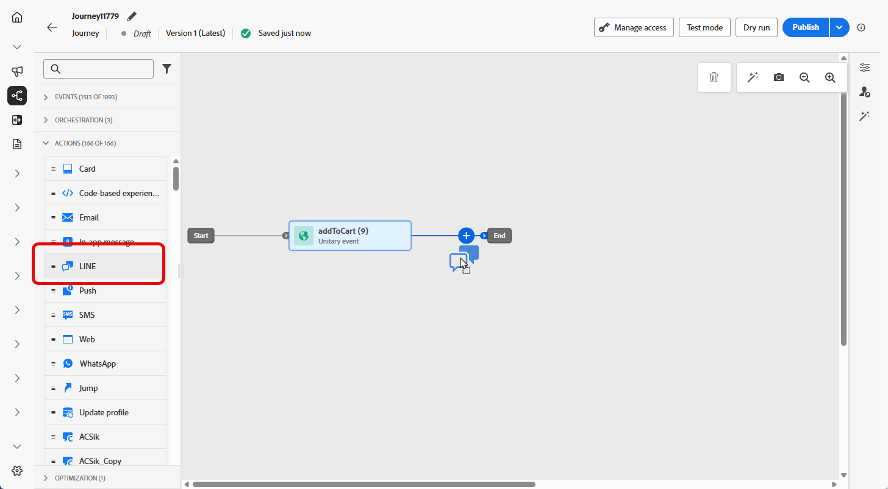

# LINE 메시지 만들기 {#create-line}

## LINE 메시지 추가 {#create-line-journey-campaign}

캠페인이나 여정에서 LINE 메시지를 추가하는 방법을 배우려면 아래 탭을 살펴보십시오.

>[!BEGINTABS]

>[!TAB 여정에 LINE 메시지 추가]

1. 여정을 열고 팔레트의 **작업** 섹션에서 **LINE** 활동을 끌어서 놓습니다.

   

1. 메시지에 대한 기본 정보(레이블, 설명, 카테고리)를 입력한 다음 사용할 메시지 구성을 선택합니다.

   여정 구성 방법에 대한 자세한 내용은 [이 페이지](../building-journeys/journey-gs.md)를 참조하세요.

   **[!UICONTROL 구성]** 필드는 기본적으로 미리 채워져 있으며 사용자가 해당 채널에 대해 마지막으로 사용한 구성입니다.

이제 **[!UICONTROL 콘텐츠 편집]** 단추에서 SMS 메시지의 콘텐츠 디자인을 시작할 수 있습니다. 자세한 내용은 다음과 같습니다.

>[!TAB LINE 메시지를 캠페인에 추가]

1. **[!UICONTROL 캠페인]** 메뉴에 액세스한 다음 **[!UICONTROL 캠페인 만들기]**&#x200B;를 클릭합니다.

1. 실행할 캠페인 유형 선택

   * **예약됨 - 마케팅**: 캠페인을 즉시 또는 지정한 날짜에 실행합니다. 예약된 캠페인은 마케팅 메시지 전송을 목적으로 합니다. 사용자 인터페이스에서 구성 및 실행됩니다.

   * **API 트리거됨 - 마케팅/트랜잭션**: API 호출을 사용하여 캠페인을 실행하십시오. API 트리거 캠페인은 마케팅 또는 트랜잭션 메시지(예: 암호 재설정, 장바구니 구매 등 개인이 수행한 작업에 따라 전송된 메시지)를 보내는 것을 목표로 합니다.

1. **[!UICONTROL 속성]** 섹션에서 Campaign의 **[!UICONTROL 제목]** 및 **[!UICONTROL 설명]**&#x200B;을(를) 편집합니다.

1. 사용 가능한 Adobe Experience Platform 대상 목록에서 타깃팅할 대상을 정의하려면 **[!UICONTROL 대상 선택]** 단추를 클릭하십시오. [자세히 알아보기](../audience/about-audiences.md).

1. **[!UICONTROL ID 네임스페이스]** 필드에서 선택한 대상에서 개인을 식별하기 위해 사용할 네임스페이스를 선택합니다. [자세히 알아보기](../event/about-creating.md#select-the-namespace).

1. **[!UICONTROL 작업]** 섹션에서 **[!UICONTROL LINE]**&#x200B;을(를) 선택하고 새 구성을 선택하거나 만드십시오.

   [이 페이지](line-configuration.md)에서 LINE 구성에 대해 자세히 알아보세요.

   

1. 콘텐츠 실험 구성을 시작하고 처리를 만들어 성능을 측정하고 대상 대상에 가장 적합한 옵션을 식별하려면 **[!UICONTROL 실험 만들기]**&#x200B;를 클릭하십시오. [자세히 알아보기](../content-management/content-experiment.md)

1. **[!UICONTROL 작업 추적]** 섹션에서 SMS 메시지의 링크 클릭을 추적할지 여부를 지정합니다.

1. 캠페인은 특정 날짜 또는 되풀이되는 빈도로 실행되도록 디자인됩니다. [이 섹션](../campaigns/create-campaign.md#schedule)에서 캠페인의 **[!UICONTROL 일정]**&#x200B;을 구성하는 방법을 알아보세요.

1. **[!UICONTROL 작업 트리거]** 메뉴에서 SMS 메시지의 **[!UICONTROL 빈도]**&#x200B;를 선택합니다.

   * 한 번
   * 일별
   * 주간
   * 월

이제 아래 자세히 설명된 대로 **[!UICONTROL 콘텐츠 편집]** 단추에서 문자 메시지의 콘텐츠 디자인을 시작할 수 있습니다.

>[!ENDTABS]

## LINE 콘텐츠 정의{#line-content}

LINE 콘텐츠를 구성하려면 아래 단계를 수행합니다.

1. 여정 또는 캠페인 구성 화면에서 **[!UICONTROL 콘텐츠 편집]** 단추를 클릭하여 텍스트 메시지 콘텐츠를 구성합니다.

1. JSON 콘텐츠를 편집하려면 **[!UICONTROL 코드 편집]**&#x200B;을 클릭하세요.

1. 개인화 편집기를 사용하여 콘텐츠를 정의하고 개인화 및 다이내믹 콘텐츠를 추가합니다. 프로필 이름 또는 도시 등의 모든 속성을 사용할 수 있습니다. 조건부 규칙을 정의할 수도 있습니다. 개인화 편집기에서 [개인화](../personalization/personalize.md) 및 [다이내믹 콘텐츠](../personalization/get-started-dynamic-content.md)에 대해 자세히 알아보려면 다음 페이지로 이동하십시오.

1. **[!UICONTROL 저장]**&#x200B;을 클릭하고 미리보기에서 메시지를 확인합니다.

1. **[!UICONTROL 콘텐츠 시뮬레이션]** 단추를 사용하여 LINE 메시지 콘텐츠와 개인화된 콘텐츠를 미리 봅니다.

테스트를 수행하고 콘텐츠의 유효성을 검사하면 대상자에게 LINE 메시지를 보낼 수 있습니다. 이러한 단계는 [이 페이지](send-line.md)에 자세히 설명되어 있습니다

전송되면 캠페인 또는 여정 보고서 내에서 LINE의 영향을 측정할 수 있습니다. 보고와 관련한 자세한 정보는 [이 섹션](../reports/campaign-global-report-cja.md)을 참조하십시오.

