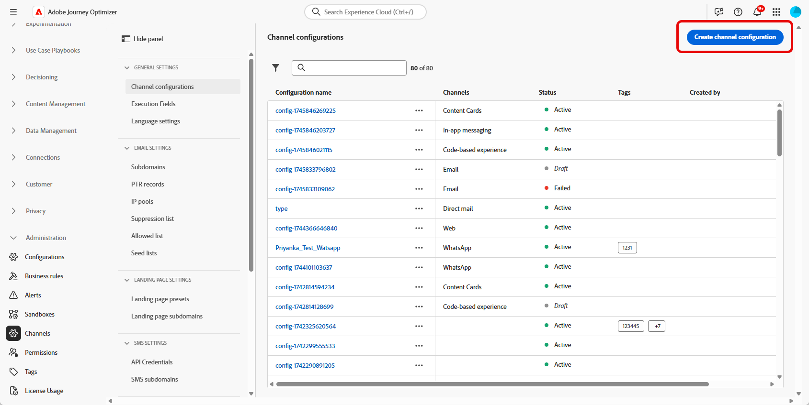

# Journey Optimizer에서 LINE 채널 구성 {#line-configuration}

1. **[!UICONTROL 채널]** > **[!UICONTROL 일반 설정]** > **[!UICONTROL 채널 구성]** 메뉴에 액세스한 다음 **[!UICONTROL 채널 구성 만들기]**&#x200B;를 클릭하십시오.

   

1. 구성의 이름 및 설명(선택 사항)을 입력한 다음 구성할 채널을 선택합니다.

   >[!NOTE]
   >
   > 이름은 문자(A-Z)로 시작해야 합니다. 영숫자만 포함할 수 있습니다. 밑줄 `_`, 점 `.`, 하이픈 `-`도 사용할 수 있습니다.

1. 구성에 사용자 지정 또는 핵심 데이터 사용 레이블을 할당하려면 **[!UICONTROL 액세스 관리]**&#x200B;를 선택할 수 있습니다. [OLAC(개체 수준 액세스 제어)에 대해 자세히 알아보세요](../administration/object-based-access.md).

1. **LINE** 채널을 선택하십시오.

   

1. 이 구성을 사용하여 동의 정책을 메시지에 연결하려면 **[!UICONTROL 마케팅 액션]**&#x200B;을 선택하십시오. 마케팅 액션과 관련된 모든 동의 정책은 고객의 선호도를 존중하기 위해 활용됩니다. [자세히 알아보기](../action/consent.md#surface-marketing-actions)

1. 구성에 대한 메시지 유형을 선택합니다.

   * **마케팅**: 소매점의 주별 프로모션과 같은 프로모션 메시지. 이러한 메시지는 사용자 동의가 필요하며 사용자 옵트인에 대한 LINE의 정책을 준수해야 합니다.
   * **트랜잭션**: 주문 확인, 암호 재설정 알림 또는 게재 업데이트와 같은 비상업적인 메시지의 경우. 이러한 메시지는 마케팅 커뮤니케이션의 구독을 취소했지만 특정 트랜잭션 컨텍스트로 엄격히 제한된 사용자에게도 보낼 수 있습니다.

1. **[!UICONTROL 채널 설정]**&#x200B;을 선택하세요.

   Adobe 담당자에게 연락하여 **[!UICONTROL 채널 설정]**&#x200B;을 설정합니다.

   

1. 매핑할 **[!UICONTROL LINE 사용자 ID]**&#x200B;를 선택하십시오. LINE 채널 내에서 개별 사용자에게 메시지를 연결하는 데 사용되는 식별자입니다.

1. 브랜드 이름과 같은 **[!UICONTROL 보낸 사람 이름]**&#x200B;을 입력하세요.

1. 변경 사항을 제출합니다.

이제 LINE 메시지를 만들 때 구성을 선택할 수 있습니다.
