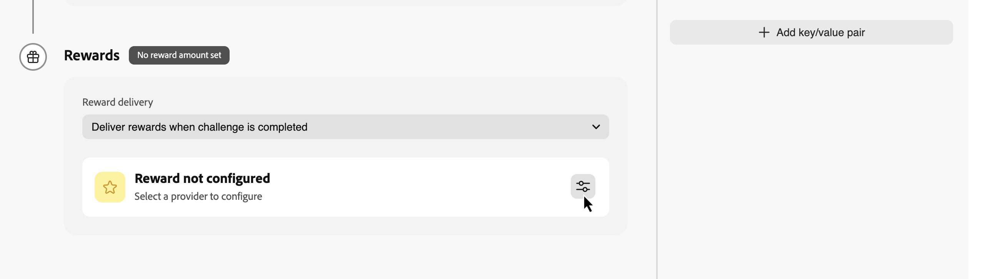
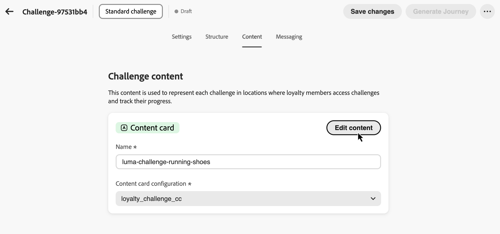
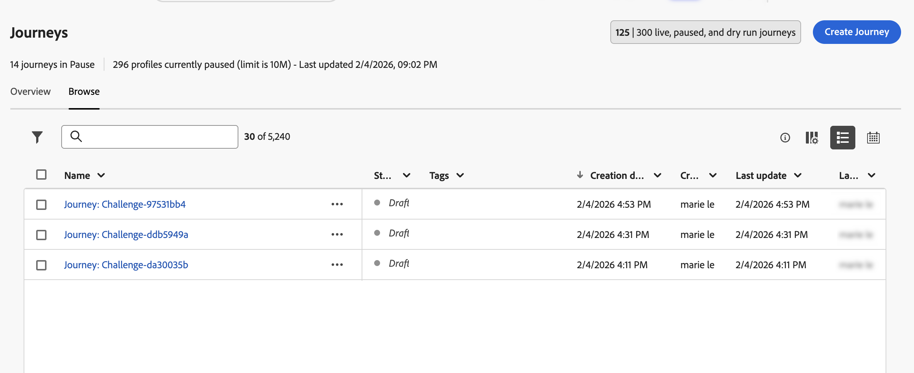

# 과제 만들기 {#create-challenges}

이 페이지에서는 Adobe Journey Optimizer에서 충성도 문제를 만들고 게시하는 전체 프로세스를 다룹니다.

문제 만들기에는 다음 단계가 포함됩니다.

1. **[챌린지 만들기](#create-the-challenge)** — 챌린지 유형을 선택하고 챌린지 편집기를 엽니다.
1. **[설정 구성](#settings)** — 과제 이름, 대상, 일정, 옵트인 규칙 및 반복 제한을 정의합니다.
1. **[구조 구성](#structure)** - 작업 및 보상을 추가합니다(고유한 데이터 가져오기 문제에 해당되지 않음).
1. **[콘텐츠 구성](#configure-content-cards)** *(선택 사항)* — 콘텐츠 카드 또는 코드 기반 경험을 사용하는 구성원에게 문제가 표시되는 방식을 정의합니다.
1. **[메시지 구성](#configure-messaging)** *(선택 사항)* - 시작, 진행 중 및 종료 단계에 대한 채널 메시지를 설정합니다.
1. **[문제를 게시](#launch)** — 여정 생성에 문제를 사용할 수 있도록 합니다.
1. **[여정 생성 및 게시](#launch)** - 고객에게 과제를 제공하는 자동 생성된 여정을 트리거합니다.

➡️ [문제를 만드는 방법 보기](#video)

## 과제 만들기 {#create-the-challenge}

1. Journey Optimizer의 **[!UICONTROL 충성도 과제]**(으)로 이동합니다.

1. **[!UICONTROL 과제]** 탭을 선택하고 **[!UICONTROL 과제 만들기]**&#x200B;를 선택합니다.

   

1. 과제 유형 선택:

   * **[!UICONTROL 표준]**: 고객은 지정된 수의 작업을 순서에 관계없이 완료합니다\
     *예: 사용 가능한 작업 5개 중 3개를 완료*

   * **[!UICONTROL 연속]**: 고객은 동일한 작업을 여러 번 연속적으로 완료합니다\
     *예: 7일 연속으로 구매*

   * **[!UICONTROL 순차적]**: 고객은 정의된 순서로 작업을 완료합니다\
     *예: 구매 → 검토 → 공유(이 순서로 완료해야 함)*

   * **[!UICONTROL 고유 데이터 가져오기]**: 충성도 과제 데이터 통합에서 작업 및 보상과 같은 과제 프레임워크를 조합하려면 **[!UICONTROL 고유 데이터 가져오기]**&#x200B;를 선택하십시오. 이 유형을 선택하면 **[!UICONTROL 구조]** 탭이 읽기 전용입니다. 다른 도전 유형과 동일한 방식으로 **[!UICONTROL 설정]**, **[!UICONTROL 콘텐츠]** 및 **[!UICONTROL 메시징]**&#x200B;을 구성하십시오.

     >[!AVAILABILITY]
     >
     >**[!UICONTROL 자신의 데이터 가져오기]** 챌린지 유형은 현재 제한된 조직 집합에서 사용할 수 있으며 향후 릴리스에서 더 광범위하게 사용할 수 있습니다.

   과제 유형을 선택하면 과제 편집기가 **[!UICONTROL 설정]**, **[!UICONTROL 구조]**, **[!UICONTROL 콘텐츠]** 및 **[!UICONTROL 메시징]** 탭으로 열립니다. **[!UICONTROL 설정]**(으)로 시작하여 문제 세부 정보, 대상자, 일정 및 규칙을 정의합니다. 그런 다음 **[!UICONTROL 고유한 데이터 가져오기]**&#x200B;를 제외한 모든 형식에 대해 **[!UICONTROL 구조]**(작업 및 보상)를 구성하십시오.

## 과제 설정 구성 {#settings}

**[!UICONTROL 설정]** 탭에서 참여 가능 사용자, 챌린지 실행 시기, 구성원의 옵트인 및 진행 상황 획득 방법, 선택적 메타데이터 등 챌린지 수준 속성을 구성합니다.

### 챌린지 세부 정보 {#challenge-details}

>[!CONTEXTUALHELP]
>id="ajo_loyalty_challenge_properties"
>title="챌린지 세부 정보"
>abstract="챌린지 이름과 설명을 설정합니다. 챌린지 ID는 챌린지가 생성될 때 자동으로 할당되며 API 또는 통합 사용을 위해 복사할 수 있습니다."

1. **[!UICONTROL 과제 세부 정보]** 섹션에서 다음을 정의합니다.

   * **[!UICONTROL 이름]**: 챌린지를 설명하는 이름을 입력하십시오. 이 이름은 과제 인벤토리에 표시됩니다.
   * **[!UICONTROL 도전 ID]**: 도전을 만들 때 할당된 고유 식별자입니다. API 또는 외부 시스템에서 이 ID를 참조하려면 복사 컨트롤을 사용하십시오.
   * **[!UICONTROL 설명]**: 도전 목적과 목표를 설명하는 설명을 입력하십시오.

   

### 대상자 {#audience}

>[!CONTEXTUALHELP]
>id="ajo_loyalty_challenge_audience"
>title="대상자"
>abstract="챌린지에 참여할 수 있는 사람을 선택합니다. Adobe Experience Platform 대상자를 추가하거나, 모든 충성도 멤버가 자격을 갖도록 대상을 비워둡니다. 필요한 경우 전제 조건으로 다른 챌린지를 완료하도록 요구합니다."

충성도 도전에 참여할 수 있는 사용자를 정의합니다.

1. **[!UICONTROL 대상]** 섹션에서 **[!UICONTROL 대상 추가]**&#x200B;를 선택하여 문제를 특정 Adobe Experience Platform 대상으로 제한합니다. [대상자를 사용하여 작업하는 방법을 알아봅니다](../audience/about-audiences.md).

   

1. **[!UICONTROL 챌린지 필수 구성 요소]**&#x200B;에서 **[!UICONTROL 챌린지 완료 필요]**&#x200B;를 선택하여 하나 이상의 선택한 챌린지를 이미 완료한 구성원으로 자격을 제한합니다.

### 일정 {#schedule}

>[!CONTEXTUALHELP]
>id="ajo_loyalty_challenge_schedule"
>title="챌린지 일정"
>abstract="시작 및 종료 날짜 및 시간과 시간대를 사용하여 챌린지를 활성화 시점을 설정합니다. 작업 완료 창에서 고객이 챌린지 기간 동안 작업을 완료할 수 있는 시점을 선택합니다."

과제 실행 시기 구성:

1. **[!UICONTROL 일정]** 섹션에서 다음을 설정합니다.

   * **[!UICONTROL 시작 날짜 및 시간]**: 고객이 도전을 사용할 수 있게 되는 시기
   * **[!UICONTROL 종료 날짜 및 시간]**: 문제가 만료되어 더 이상 새 완료를 수락하지 않는 경우.
   * **[!UICONTROL 시간대]**: 챌린지 일정에 사용되는 시간대입니다.

   

1. **[!UICONTROL 작업 완료 창]**&#x200B;에서 고객이 작업을 완료할 수 있는 시기를 선택하십시오.

   * **[!UICONTROL 도전 중 언제든지]**: 고객은 도전 시작일과 종료일 사이에 언제든지 작업을 완료할 수 있습니다.
   * **[!UICONTROL 하루 중 특정 시간]**: **[!UICONTROL 시작 시간]** 및 **[!UICONTROL 종료 시간]**&#x200B;을 설정하여 작업 완료를 특정 일일 시간으로 제한합니다.

### 규칙 {#rules}

구성원이 옵트인하는 방법, 작업 진행률이 문제에 카운트되는 시기 및 도전이 완료될 수 있는 횟수를 구성합니다.

* **[!UICONTROL 옵트인 트리거]**:

  * **[!UICONTROL 옵트인 메서드]**: 고객이 문제에 수동으로 참여할지 또는 이벤트 트리거를 통해 참여할지 여부를 선택합니다.
  * **[!UICONTROL 이벤트]**: 이벤트 기반 옵트인의 경우 옵트인을 트리거하는 이벤트를 선택합니다. 관리자는  단추를 클릭하여 이벤트 정의를 만들 수 있습니다. [이벤트 정의를 구성하는 방법을 알아봅니다](loyalty-admin.md#event-definitions)

* **[!UICONTROL 추적 시작]**:

  * **[!UICONTROL 작업 진행률 추적 시작]**: 작업 완료가 문제 진행률에 카운트될 때 선택합니다. 예를 들어, **[!UICONTROL 도전이 시작되면(옵트인 후)]**&#x200B;을(를) 선택하면 구성원이 옵트인하고 도전이 활성 상태가 된 후에 진행이 시작됩니다.

    진행 상황이 추적될 때에서 도전이 멤버에게 표시되면 분리할 수 있습니다. 예를 들어 작업 완료가 나중 날짜의 진행률로 카운트되기 전에 챌린지 카드가 표시되어 옵트인을 수락할 수 있습니다.

  * **[!UICONTROL 시작]**: 사용자 지정 시작 옵션을 선택할 때 진행 추적이 시작되는 날짜와 시간을 설정합니다.

* **[!UICONTROL 반복 제한]**:

  * **[!UICONTROL 도전을 완료할 수 있음]**: 도전을 한 번 또는 여러 번 완료할 수 있는지 여부를 선택합니다. 예를 들어 **[!UICONTROL Once]** 또는 정의된 완료 수가 있습니다.

  * **[!UICONTROL 완료 가능 횟수]**: 반복이 활성화된 경우 구성원이 도전을 완료할 수 있는 횟수를 지정합니다.

* **[!UICONTROL 완료 요구 사항]** *(표준 과제만 해당)*:

  * **[!UICONTROL 단일 트랜잭션에서 완료]**: 활성화되면 고객은 단일 트랜잭션 내에서 모든 작업을 완료해야 합니다. 비활성화되면 별도의 트랜잭션에서 작업을 완료할 수 있습니다.

### 사용자 지정 메타데이터 {#custom-metadata}

**[!UICONTROL 사용자 지정 메타데이터]** 섹션에서 **[!UICONTROL 키/값 쌍 추가]**&#x200B;를 선택하여 사용자 지정 메타데이터를 추가합니다. 추적 또는 외부 시스템과의 통합을 위해 메타데이터를 사용합니다.

## 과제 구조 구성 {#structure}

**[!UICONTROL 구조]** 탭에서 고객이 완료해야 하는 작업과 고객이 받는 보상을 정의합니다. 이 탭은 **[!UICONTROL 데이터 가져오기]** 문제에 사용되지 않습니다.

### 작업 추가 {#add-tasks}

>[!CONTEXTUALHELP]
>id="ajo_loyalty_challenge_tasks"
>title="작업"
>abstract="챌린지 완료를 위해 수행할 작업을 선택합니다. 다음으로 챌린지 완료 방법을 구성합니다. 사용 가능한 옵션은 챌린지 유형(표준, 연속 또는 순차적)에 따라 다릅니다."

작업은 고객이 보상을 받기 위해 완료해야 하는 특정 작업을 정의합니다. 작업 유형(구매, 지출 또는 사용자 지정 이벤트), 수량, 제품 필터 및 기타 속성을 구성할 수 있습니다.

과제에 작업을 추가하려면 다음 단계를 수행합니다.

1. **[!UICONTROL 작업]** 섹션에서 **[!UICONTROL 작업 추가]**&#x200B;를 선택합니다.

   

1. **[!UICONTROL 작업 인벤토리]**&#x200B;가 열립니다. 목록에서 작업을 하나 이상 선택하고 **[!UICONTROL 추가]**&#x200B;를 선택합니다. 새 작업을 만들려면 **[!UICONTROL 새로 만들기]**&#x200B;를 선택하세요. [작업을 만들고 구성하는 방법에 대해 알아보세요](create-tasks.md).

1. 챌린지가 완료된 것으로 간주되는 시기를 지정합니다. 사용 가능한 설정은 과제 유형에 따라 다릅니다.

   +++표준 과제

   **[!UICONTROL 작업 완료 요구 사항]** 드롭다운에서 다음 중 하나를 선택합니다.

   * **[!UICONTROL 고객이 완료할 작업 1개 선택]** - *고객은 보상 받을 단일 작업을 선택하고 완료할 수 있음*
   * **[!UICONTROL 고객이 특정 수의 작업을 완료합니다]** - *고객은 정의된 수의 작업을 완료해야 합니다. 완료할 필수 작업 수를 지정하십시오.*

   +++

   +++연속 도전

   **[!UICONTROL Streak 유형]** 드롭다운에서 다음 중 하나를 선택합니다.

   * **연속**: 고객은 연속해서 며칠씩 쉬지 않고 작업을 완료해야 합니다. *예: 월요일, 화요일, 수요일에 구매—하루 누락 시 연속 누락.*

   * **연속되지 않음**: 고객은 완료 사이에 간격이 있는 상태로 작업을 완료할 수 있습니다. *예: 30일 동안 7회 구입을 완료하고 할인이 허용됩니다.*

   **[!UICONTROL Streak length]** 필드에 작업을 완료해야 하는 횟수를 지정합니다. *예: &quot;7일 연속 구매&quot;에 대해 7로 설정합니다.*

   +++

   +++순차적인 문제

   **[!UICONTROL 작업 완료 요구 사항]** 드롭다운에서 다음 중 하나를 선택합니다.

   * **[!UICONTROL 고객이 완료할 작업 1개 선택]** - *고객은 보상 받을 단일 작업을 선택하고 완료할 수 있음*
   * **[!UICONTROL 고객이 특정 수의 작업을 완료합니다]** - *고객은 사용자가 정의한 정확한 순서대로 정의된 수의 작업을 완료해야 합니다. 작업이 누락되거나 건너뛸 경우 시퀀스가 중단됩니다. 완료할 작업 수 지정*

   +++

과제에 작업을 추가한 후 고객이 작업을 완료하여 얻게 되는 보상을 구성합니다.

### 보상 구성 {#rewards}

>[!CONTEXTUALHELP]
>id="ajo_loyalty_challenge_rewards"
>title="보상"
>abstract="고객이 포인트를 얻는 시점(전체 챌린지 완료 시 또는 진행 중인 작업 마일스톤 시)를 선택합니다. 보상 공급자(포인트 및 보상을 관리하는 충성도 솔루션)를 선택한 다음 금액을 설정합니다. 전체 완료에 대한 1회 총액 또는 마일스톤별 작업당 값으로, 지급하려는 작업에 대해서만 보상을 설정합니다."

리워드는 고객이 도전을 완료하여 얻는 충성도 포인트 또는 혜택입니다.

보상 제공 시기 및 방법을 구성하려면 다음을 수행합니다.

1. **[!UICONTROL 보상 전달]** 드롭다운 메뉴에서 보상을 전달할 시기를 선택합니다.

   * **[!UICONTROL 도전이 완료되면 보상 제공]**: 고객이 전체 도전을 완료하면 보상 제공\
     *예: 5개의 작업을 모두 완료한 후 100점을 부여합니다*

   * **[!UICONTROL 과제 진행에 따라 과제 완료 시점에 따라 보상 제공]**: 고객이 개별 과제를 완료하면 점진적으로 보상 제공(두 개 이상의 과제를 요구하는 과제에만 제공)\
     *예: 작업 1 다음에 10포인트, 작업 2 다음에 20포인트, 작업 3 다음에 50포인트를 부여합니다*

1. 보상 제공자를 선택합니다. 고객 포인트와 보상을 관리하는 충성도 솔루션입니다. 보상 공급자는 **[!UICONTROL 충성도 관리자]** 메뉴에서 만든 후에 문제를 작성합니다. [보상 공급자를 구성하는 방법을 알아보세요](loyalty-admin.md#reward-providers)

   

1. 선택한 게재 방법에 따라 보상 금액을 구성합니다.

   +++도전이 완료되면 보상 제공

   고객이 전체 과제를 완료할 때 제공할 총 보상 금액을 지정합니다.

   *아래 예에서 고객은 과제를 완료할 때 100점을 받습니다.*

   

   +++

   +++작업 완료 이정표에 대한 보상 제공

   작업 완료 이정표에 대한 보상 금액을 지정합니다. 이 옵션을 사용하면 문제를 해결할 때 고객 동기를 높이는 점진적 보상을 만들 수 있습니다.

   보상을 전달하려는 작업의 경우 보상 옵션을 켜고 고객이 해당 특정 작업을 완료할 때 보상을 줄 점수 수를 지정합니다. 특정 작업 완료만 보상하도록 선택할 수 있습니다. 예를 들어, 작업이 10개인 경우 작업 1, 5, 10만 보상하도록 선택할 수 있습니다.

   *아래 예에서 고객은 첫 번째 작업을 완료할 때 10점을 받은 다음 두 번째 작업을 완료한 후 50점을 추가로 받습니다.*

   

   +++

작업 및 보상으로 과제 구조를 구성한 후 고객에게 과제가 표시되는 방식을 선택적으로 구성할 수 있습니다. 챌린지 콘텐츠가 필요하지 않은 경우 이 단계를 건너뛰고 [메시징 구성](#configure-messaging)으로 바로 진행하십시오.

## 챌린지 콘텐츠 구성(선택 사항) {#configure-content-cards}

>[!CONTEXTUALHELP]
>id="ajo_loyalty_challenge_content"
>title="콘텐츠"
>abstract="충성도 멤버가 챌린지에 액세스하고 진행 상황을 추적하는 위치에 챌린지가 표시되도록 하는 방법을 구성합니다. 추가 액션을 사용하여 카드 스타일의 경험을 표시할 콘텐츠 카드를 선택하거나 사용자 정의 구현을 통해 콘텐츠를 전달할 코드 기반 경험을 선택할 수 있습니다."

**[!UICONTROL 콘텐츠]** 탭은 충성도 멤버가 문제에 액세스하고 진행 상황을 추적하는 위치에서 문제가 표시되는 방식을 제어합니다.

과제 콘텐츠를 구성하려면 다음을 수행합니다.

1. **[!UICONTROL 콘텐츠]** 탭으로 이동하여 **[!UICONTROL 작업 추가]**&#x200B;를 클릭합니다.

1. 작업 유형을 선택합니다.

   * **[!UICONTROL 콘텐츠 카드]**: 고객 장치에서 과제를 카드 스타일의 경험으로 표시합니다. 카드를 디자인하고 개인화하려면 **[!UICONTROL 채널 구성]**&#x200B;을 선택하고 **[!UICONTROL 콘텐츠 편집]**&#x200B;을 클릭하세요. [콘텐츠 카드에 대해 자세히 알아보기](../content-card/create-content-card.md).
   * **[!UICONTROL 코드 기반 경험]**: Journey Optimizer의 코드 기반 채널을 사용하여 사용자 지정 구현을 통해 도전 콘텐츠를 제공합니다. **[!UICONTROL 채널 구성]**&#x200B;을 선택하고 **[!UICONTROL 콘텐츠 편집]**&#x200B;을 클릭하여 콘텐츠를 정의합니다. [코드 기반 경험에 대해 자세히 알아보세요](../code-based/create-code-based.md).

   

   여러 작업을 추가하여 서로 다른 서피스에 걸쳐 문제를 나타낼 수 있습니다.

콘텐츠를 구성한 후 메시지를 설정하여 과제 라이프사이클 전반에 걸쳐 고객을 참여시킵니다.

### 메시지 구성 {#configure-messaging}

>[!CONTEXTUALHELP]
>id="ajo_loyalty_challenge_messaging"
>title="메시지"
>abstract="메시징은 챌린지 라이프사이클 전반에 대한 참여를 돕습니다. 메시징 탭에서 시작(챌린지 공지 및 참여자 초대), 진행 중(참여자의 참여 유지 및 작업 완료 중), 종료(완료 축하 및 참여자에게 보상 알림) 등 각 단계에 대한 메시지를 추가합니다. 각 단계에 대해 메시지 추가 버튼을 클릭하고, 채널을 선택하고, 채널 구성을 선택한 다음 편집을 선택하여 메시지 콘텐츠를 디자인합니다."

멀티채널 메시지를 설정하여 과제 라이프사이클의 주요 단계에서 고객을 참여시킵니다. 메시지는 선택 사항이지만 고객 참여를 극대화하기 위해 권장됩니다.

**[!UICONTROL 메시징]** 탭으로 이동하여 각 라이프사이클 단계에 대한 메시지를 구성합니다.

* **[!UICONTROL 시작]**: 도전을 알리고 참가자를 참가하도록 초대합니다.
* **[!UICONTROL 진행 중]**: 참가자의 참여를 유지하고 작업을 완료하십시오.
* **[!UICONTROL 종료]**: 완료를 축하하고 참가자에게 보상을 알립니다.

각 단계에 대해 메시지 추가 단추(**[!UICONTROL 시작 메시지 추가]**, **[!UICONTROL 진행 중인 메시지 추가]** 또는 **[!UICONTROL 종료된 문제 메시지 추가]**)를 클릭하고 채널을 선택합니다.

메시지 콘텐츠를 디자인하려면 연결된 **[!UICONTROL 채널 구성]**&#x200B;을 선택하고 **[!UICONTROL 편집]**&#x200B;을 클릭하세요.

| 채널 | 설명 |
|---|---|
| **[!UICONTROL 인앱]** | 모바일 또는 웹 앱 내에 메시지를 표시합니다. [인앱 메시지 정보](../in-app/get-started-in-app.md) · [인앱 메시지 디자인](../in-app/design-in-app.md) |
| **[!UICONTROL 이메일]** | 이메일 알림을 보냅니다. [전자 메일 정보](../email/get-started-email.md) · [전자 메일 콘텐츠 디자인](../email/get-started-email-design.md) |
| **[!UICONTROL 푸시 알림]** | 모바일 장치로 푸시 알림을 보냅니다. [푸시 알림 정보](../push/get-started-push.md) · [푸시 알림 디자인](../push/design-push.md) |
| **[!UICONTROL 콘텐츠 카드]** | 앱 또는 웹 표면에 영구 카드 스타일의 메시지를 전달합니다. [콘텐츠 카드 정보](../content-card/get-started-content-card.md) · [콘텐츠 카드 디자인](../content-card/design-content-card.md) |
| **[!UICONTROL 코드 기반 경험]** | AJO의 코드 기반 채널을 사용하여 맞춤형 구현을 통해 콘텐츠를 전달합니다. [코드 기반 경험 정보](../code-based/get-started-code-based.md) · [코드 기반 경험 만들기](../code-based/create-code-based.md) |
| **[!UICONTROL 사용자 지정 작업]** | 외부 시스템 또는 사용자 지정 끝점을 트리거합니다. [사용자 지정 작업 정보](../action/about-custom-action-configuration.md) |

이제 과제 설정, 구조, 콘텐츠 및 메시징으로 완전히 구성됩니다. 시작하려면 문제와 관련 여정을 게시해야 합니다.

## 과제 실행 {#launch}

다음과 같은 두 가지 방법으로 문제를 해결할 수 있습니다.

* **[!UICONTROL 여정 게시]**(**[!UICONTROL ..]** 메뉴에서 사용 가능) — 이 옵션을 사용하여 게시를 생성하지 않고 문제를 게시합니다. 이를 통해 게재 전에 과제 경험을 테스트하고, 미리 보고, 시뮬레이션할 수 있습니다. 고객은 여정을 생성하고 게시할 때까지 챌린지를 받지 않습니다.

* **[!UICONTROL 여정 생성]** — 이 옵션을 사용하여 자동으로 문제를 게시하고 고객에게 문제 전달을 오케스트레이션할 여정을 만드십시오.

### 과제 게시 {#publish-challenge}

1. 과제 구성을 검토하여 모든 필수 필드를 완료하십시오.

1. **[!UICONTROL 여정 생성]** 단추 옆에 있는  아이콘을 클릭하고 **[!UICONTROL 게시]**&#x200B;를 선택합니다.

   

   과제 인벤토리로 이동합니다. 이제 문제가 **[!UICONTROL 게시됨]** 상태로 나타납니다.

   고객에게 문제를 전달할 준비가 되면 관련 여정을 생성할 수 있습니다. 자세한 내용은 [여정 생성](#generate-journey)을 참조하세요.

### 여정 생성 {#generate-journey}

1. 과제 구성을 검토하여 모든 필수 필드를 완료하십시오.

1. **[!UICONTROL 여정 생성]**&#x200B;을 선택하여 자동으로 문제를 게시하고 문제 전달을 오케스트레이션할 여정을 만드십시오.

   

   확인 메시지가 나타납니다. 생성된 여정으로 직접 이동하려면 **[!UICONTROL 여정 열기]**&#x200B;를 클릭하고, 무시하고 나중에 여정에 액세스하려면 **[!UICONTROL 확인]**&#x200B;을 클릭하십시오.

   >[!IMPORTANT]
   >
   >챌린지에 대한 모든 변경 사항은 로열티 챌린지 편집기에서 수행해야 하며 새 여정을 생성해야 합니다. 문제를 변경하면 기존 문제 여정에서 직접 수행한 모든 작업이 손실됩니다.

1. 생성된 여정을 열고 게시합니다. 여정이 이름 형식 *&quot;여정: [도전 이름]&quot;*&#x200B;의 **초안** 상태로 표시되며 다음 위치에서 액세스할 수 있습니다.

   * 이전 단계의 확인 메시지 —**[!UICONTROL 여정 열기]**&#x200B;를 클릭합니다.
   * **문제 인벤토리** — 문제 옆에 있는 **[!UICONTROL 여정]** 열 링크를 사용합니다.
   * **여정 인벤토리** — 이름별로 여정을 찾습니다.

   게시되면 여정은 지정된 챌린지 시작 날짜에 자동으로 시작됩니다. [여정 게시 방법을 알아보세요](../building-journeys/publish-journey.md).

   

1. 문제가 실행되면 [충성도 문제 보고서](loyalty-reporting.md)에서 프로그램 KPI, 문제 결과 및 작업 수준 지표를 모니터링합니다. [여정 보고서](../reports/journey-global-report-cja.md)에서 메시지 배달을 모니터링할 수도 있습니다.

## 방법 비디오 {#video}

다음 단계별 비디오 튜토리얼을 통해 충성도 문제를 만들고 구성하는 방법에 대해 알아보십시오.

* **충성도 과제 설정** - 새 충성도 과제를 만들고 구성합니다.

>[!VIDEO](https://video.tv.adobe.com/v/3496471?quality=12)

* **보상 구성** - 보상 전달 및 이행 설정

>[!VIDEO](https://video.tv.adobe.com/v/3496481?quality=12)

