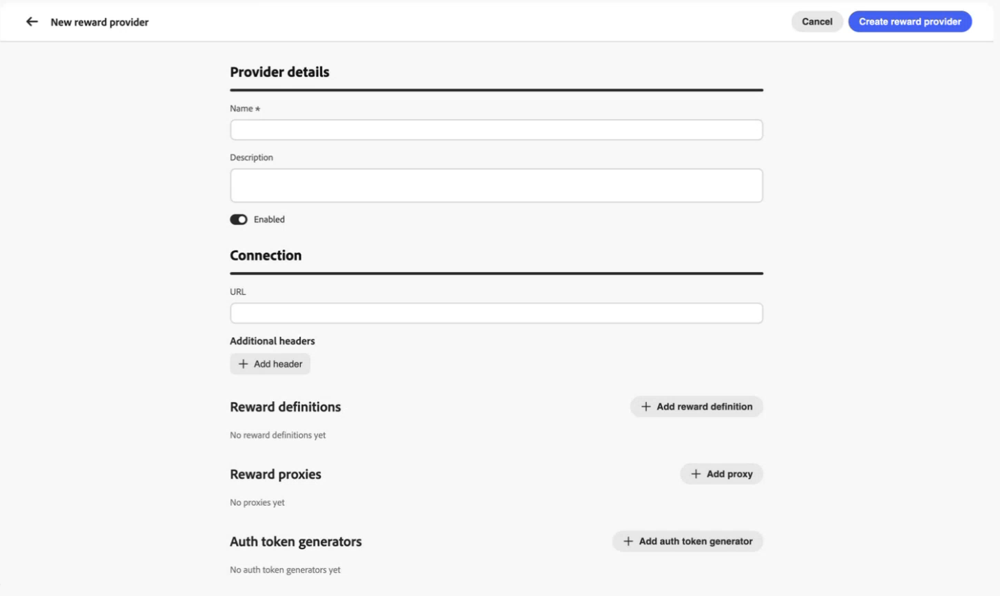
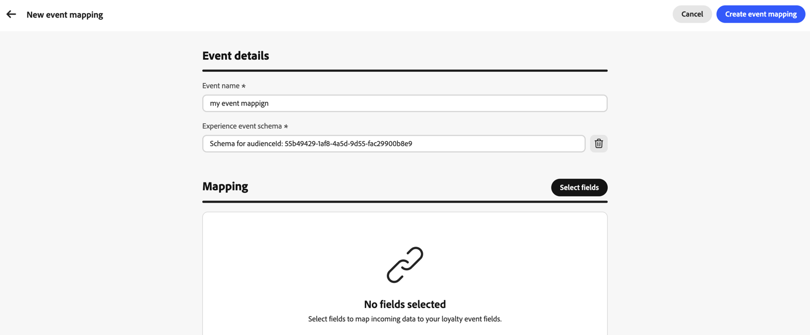
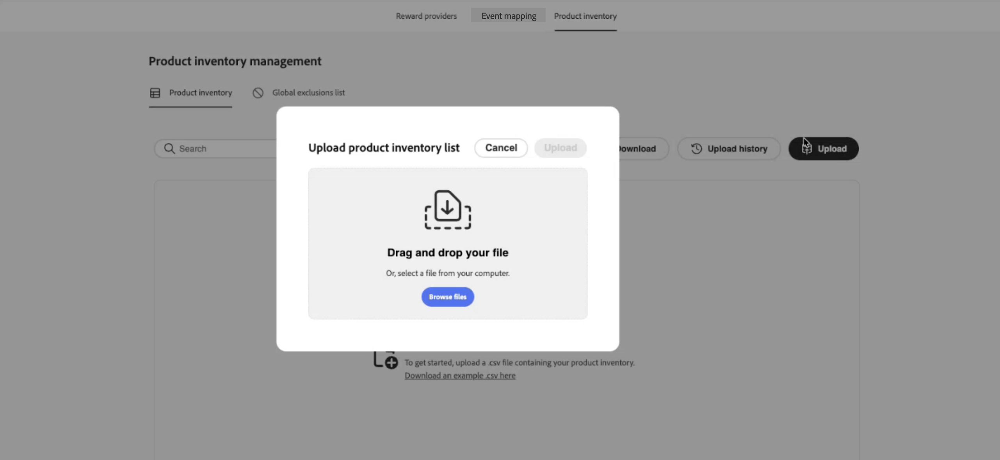
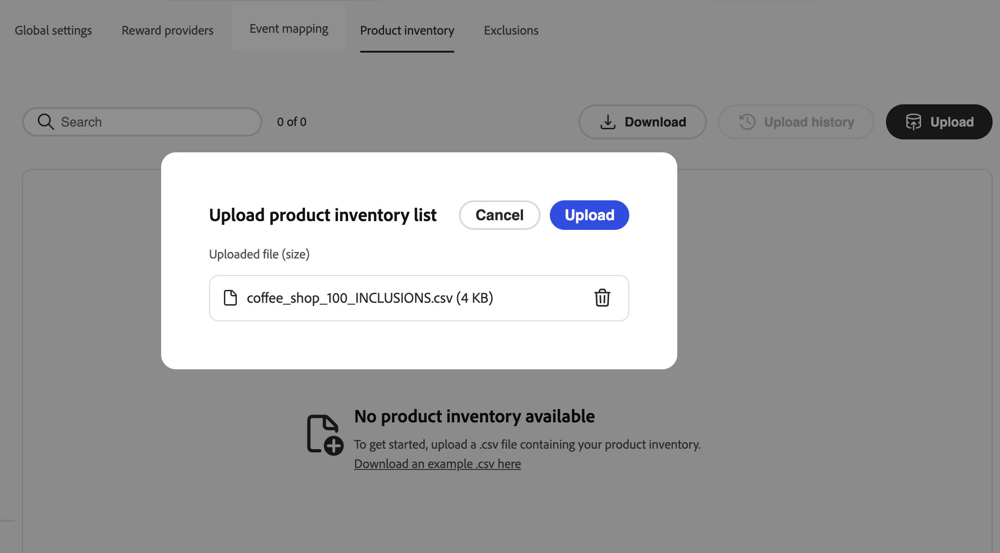
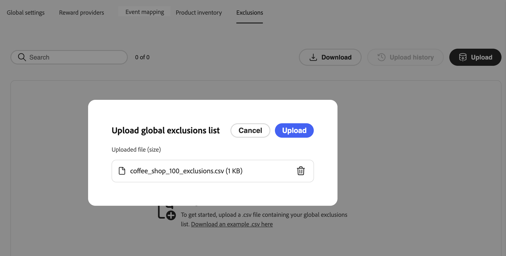

# 충성도 문제 구성 {#loyalty-admin}

## 개요 {#access-loyalty-admin}

충성도 과제 구성은 마케터가 도전하기 전에 보상 이행, 이벤트 매핑, 제품 인벤토리 및 제외를 설정하여 [!DNL Journey Optimizer]을(를) 외부 충성도 시스템에 연결합니다.

>[!NOTE]
>
>충성도 문제를 구성하려면 충성도 문제에 필요한 권한과 함께 [!DNL Journey Optimizer] 인스턴스에 대한 관리자 액세스 권한이 필요합니다. 액세스 권한을 얻으려면 Adobe 관리자에게 문의하십시오.

구성 인터페이스를 열려면 왼쪽 탐색에서 **[!UICONTROL 충성도 관리자]** 메뉴를 선택하십시오. 인터페이스는 탭으로 구성됩니다.

* **전역 설정** — 프로그램의 Experience Platform ID 네임스페이스를 선택합니다. [전역 설정을 구성하는 방법을 알아봅니다](#global-settings)
* **보상 제공자** - 고객이 진행하거나 문제를 완료할 때 보상을 이행하는 API를 연결합니다. [보상 공급자를 구성하는 방법을 알아보세요](#reward-providers).
* **이벤트 정의** — 들어오는 경험 이벤트를 **[!UICONTROL 사용자 지정 이벤트]** 작업에 사용되는 활동에 매핑합니다. [이벤트 정의를 구성하는 방법을 알아봅니다](#event-definitions).
* **제품 인벤토리** - 작업 자격 규칙에 사용할 항목-그룹 매핑을 업로드합니다. [제품 인벤토리를 구성하는 방법을 알아봅니다](#product-inventory)
* **제외** — 작업 구성에 대한 조직 전체 항목 및 그룹 제외를 업로드합니다. [제외 구성 방법 알아보기](#exclusions)

## 글로벌 설정 {#global-settings}

>[!CONTEXTUALHELP]
>id="ajo_loyalty_admin_global_settings"
>title="글로벌 설정"
>abstract="글로벌 설정은 이벤트 및 챌린지 전반에서 멤버를 식별하는 데 사용되는 ID 네임스페이스를 포함하여 충성도 챌린지에 대한 조직 수준의 구성을 정의합니다."

충성도 문제에 대한 전역 설정을 구성하려면 **[!UICONTROL 전역 설정]** 탭을 엽니다.


* **[!UICONTROL 조직 구성]** 섹션에서 충성도 문제를 위한 Adobe Experience Platform [ID 네임스페이스](https://experienceleague.adobe.com/ko/docs/experience-platform/identity/features/namespaces)를 선택합니다. 이 네임스페이스는 멤버 프로필이 데이터에서 식별되는 방식과 일치해야 합니다.

  ➡️ [ID 네임스페이스로 작업하는 방법을 알아봅니다](https://experienceleague.adobe.com/ko/docs/experience-platform/identity/features/namespaces){target="_blank"}

* **[!UICONTROL 보고]** 섹션을 사용하여 충성도 인사이트 대시보드에 대한 조직의 우선 순위 지표를 설정하십시오. 이 설정은 피드에서 강조를 받는 인사이트를 결정하므로 비즈니스에 가장 중요한 지표에 집중할 수 있습니다.

  다음 KPI 옵션 중 하나를 선택합니다.

  * **[!UICONTROL 매출]** — 통화 거래 및 판매 실적과 관련된 통찰력의 우선 순위 지정
  * **[!UICONTROL 참여]** — 구성원 활동 및 참여와 관련된 통찰력의 우선 순위 지정
  * **[!UICONTROL 상환]** - 보상 상환율 및 활동과 관련된 통찰력의 우선 순위 지정
  * **[!UICONTROL 전환]** — 전환 지표 및 목표 완료와 관련된 통찰력의 우선 순위 지정

  KPI를 선택하면 해당 지표와 관련된 인사이트가 채점 증가를 받아 피드의 맨 위로 상승합니다. 즉, 선택한 KPI에 대해 가장 관련성이 높은 인사이트가 먼저 표시됩니다. 인사이트가 숨겨지지 않음: 다른 지표보다 우선 순위가 높은 선택한 KPI로 중요도 등급을 매겨 전체 insight 피드가 계속 표시됩니다. 이 설정은 피드의 인사이트 등급 지정 방식에만 영향을 주며 충성도 프로그램 작동 방식 또는 과제 평가 방식에는 영향을 주지 않습니다. 언제든지 KPI 선택을 변경할 수 있으며 insight 피드는 다음 새로 고침 주기에 새 우선 순위를 반영하도록 우선 순위를 다시 지정합니다.

  충성도 통찰력 및 성능 모니터링에 대한 자세한 내용은 [충성도 챌린지 성능 모니터링](loyalty-reporting.md)을 참조하십시오.

## 보상 제공자 {#reward-providers}

>[!CONTEXTUALHELP]
>id="ajo_loyalty_admin_reward_providers"
>title="보상 제공자"
>abstract="보상 제공자는 고객이 챌린지를 완료했을 때 보상을 이행하기 위해 [!DNL Journey Optimizer]가 호출하는 외부 시스템을 정의합니다. 각 통합에 대한 제공자 엔드포인트, 보상 정의, 프록시 설정 및 인증을 구성하십시오."

>[!CONTEXTUALHELP]
>id="ajo_loyalty_admin_reward_providers_connection"
>title="보상 제공자 연결"
>abstract="[!DNL Journey Optimizer]가 보상 API에 연결하는 방법(이행 호출에 필요한 제공자 이름, 설명, 엔드포인트 URL 및 HTTP 헤더)을 구성합니다."

>[!CONTEXTUALHELP]
>id="ajo_loyalty_admin_reward_providers_details"
>title="보상 정의"
>abstract="보상 정의는 이 제공자가 발행할 수 있는 각 보상 유형(예: 포인트 또는 별)을 지정하며 보상이 이행될 때 [!DNL Journey Optimizer] 페이로드가 전송됩니다."

>[!CONTEXTUALHELP]
>id="ajo_loyalty_admin_reward_providers_proxy"
>title="보상 프록시"
>abstract="필요한 경우 보상 API 엔드포인트로 직접 전송하는 대신 프록시 서버를 통해 이행 호출을 라우팅합니다. 호스트, 포트, 자격 증명 및 프록시의 활성화 여부를 구성합니다. 자격 증명 값은 일반적으로 다음과 같은 형식을 취합니다. `{ "userName": "test", "password": "xxxx" }`"

**보상 공급자**&#x200B;가 [!DNL Journey Optimizer]에 챌린지 진행률이 기록되거나 챌린지가 완료되면 이행 호출을 보낼 위치를 알려줍니다. 예를 들어 회원 계정에 충성도 포인트 또는 스타를 크레딧하는 API입니다.

엔드 투 엔드 공급자 설정(연결, 프록시, 인증 토큰 생성기 및 보상 정의 리소스)에 이 섹션을 사용합니다. 보상 정의 디자인 및 페이로드 전략에 대한 집중 지침은 [보상 정의 안내서](reward-definition-guide.md)를 참조하십시오.

보상 제공자를 생성하려면 다음 단계를 수행합니다.

1. **[!UICONTROL 보상 공급자]** 탭을 열고 **[!UICONTROL 보상 공급자 만들기]**&#x200B;를 선택합니다.

   

1. **[!UICONTROL 이름]** 및 **[!UICONTROL 설명]**&#x200B;을 입력하십시오.

1. **[!UICONTROL URL]** 필드에 이행 요청을 받는 API 끝점을 입력합니다.

1. 필요에 따라 API(예: API 키 또는 콘텐츠 유형)에 **[!UICONTROL 헤더]**&#x200B;를 추가합니다.

1. 보상 공급자와 연관된 리소스를 구성합니다. 필드 세부 사항을 보려면 아래의 각 섹션을 확장하십시오.

   +++보상 정의

   공급자가 지원하는 보상 유형당 하나의 항목을 추가합니다(예: 프로그램 포인트, 별점 또는 통화 크레딧). 각 정의에 대해 다음 작업을 수행합니다.

   * **[!UICONTROL 이름]** 및 **[!UICONTROL 설명]**&#x200B;을 입력하십시오.
   * 정의가 **[!UICONTROL 활성화됨]**&#x200B;인지 여부를 지정하십시오.
   * **[!UICONTROL Default]**&#x200B;을(를) 전환하여 한 정의를 이 공급자에 대한 기본값으로 표시합니다.
   * JSONata 표현식을 사용하여 보상 페이로드가 이행 페이로드 요청으로 변환되는 방법을 정의합니다.

   자세한 내용은 [보상 정의 가이드](reward-definition-guide.md#writing-the-rewardjsonata-expression)를 참조하세요.

   

   +++

   +++보상 프록시

   중간 서버를 통해 라우트 이행 호출을 라우팅하여 엔드포인트로 직접 전송하는 대신 보상 공급자와 **[!UICONTROL 프록시 만들기]** 화면에서 프록시 인증에 **[!UICONTROL 자격 증명]** 필드를 사용하십시오.

   * **[!UICONTROL 이름]** 및 **[!UICONTROL 설명]**&#x200B;을 입력하십시오.
   * **[!UICONTROL 호스트]** 및 **[!UICONTROL 포트]**&#x200B;를 입력하십시오.
   * 프록시가 **[!UICONTROL 사용]**&#x200B;인지 여부를 지정하십시오.
   * **[!UICONTROL 자격 증명]**&#x200B;에서 프록시 사용자 이름과 암호를 JSON으로 입력하십시오. 자격 증명 값은 일반적으로 다음과 같습니다.

     ```json
     { "userName": "test", "password": "xxxx" }
     ```

   

   +++

   +++인증 토큰 생성기

   API에 전달자 토큰 또는 유사한 인증이 필요한 경우 사용합니다.

   * **[!UICONTROL 이름]** 및 **[!UICONTROL 설명]**&#x200B;을 입력하십시오.
   * **[!UICONTROL 인증 유형]**&#x200B;에 인증 유형(예: 전달자)을 입력하십시오.
   * HTTP 메서드(예: POST)를 선택합니다.
   * 토큰 끝점 URL과 **[!UICONTROL 토큰 키]**&#x200B;를 응답에 입력하십시오(예: `access_token`).
   * 인증 토큰 생성기가 **[!UICONTROL 활성화됨]**&#x200B;인지 여부를 지정하십시오.
   * 토큰 엔드포인트에 필요한 헤더를 추가합니다.

   [!DNL Journey Optimizer]은(는) 보상 API를 호출할 때마다 이 구성을 사용하여 새 토큰을 가져옵니다.

   

   +++

1. **[!UICONTROL 보상 공급자 만들기]**&#x200B;를 선택하십시오. 공급자와 구성된 모든 리소스가 함께 저장됩니다.

저장하면 보상 제공자 목록에 제공자가 나타납니다. 마케팅 담당자는 과제 보상을 구성할 때 이를 선택할 수 있습니다. [도전 보상을 구성하는 방법 알아보기](create-challenges.md#rewards)

보상 공급자를 편집하려면 **[!UICONTROL 보상 공급자]** 탭을 열고 공급자를 선택한 다음 필드를 업데이트하십시오. 보상 정의, 프록시 및 인증 토큰 생성기에 대한 변경 사항은 업데이트할 때 자동으로 저장됩니다.

>[!NOTE]
>
>**[!UICONTROL 자신의 데이터를 가져오세요]** 도전은 자신의 데이터 통합을 통해 보상을 충족합니다. 여기에 구성된 보상 제공자는 이러한 문제에 적용되지 않습니다. [데이터 가져오기 문제를 만드는 방법을 알아봅니다](create-challenges.md#create-the-challenge)

## 이벤트 정의 {#event-definitions}

>[!CONTEXTUALHELP]
>id="ajo_loyalty_admin_event_definitions"
>title="이벤트 정의"
>abstract="이벤트 정의는 외부 소스에서 들어오는 이벤트 데이터를 식별하고 해석하는 방법을 [!DNL Journey Optimizer]에게 알려줍니다. 각 정의는 구매 또는 결제와 같은 특정 이벤트 유형을 매핑하므로 시스템이 챌린지 작업에 대한 고객 진행 상황을 추적할 수 있습니다."

>[!CONTEXTUALHELP]
>id="ajo_loyalty_admin_event_schema"
>title="이벤트 스키마 및 변환기"
>abstract="이벤트 스키마 섹션에서, 수신되는 이벤트 필드를 충성도 챌린지가 예상하는 형식으로 매핑하기 위해 **[!UICONTROL 변환기]** JSONata 표현식을 제공합니다."

>[!CONTEXTUALHELP]
>id="ajo_loyalty_admin_event_identification"
>title="이벤트 식별"
>abstract="이벤트 식별 섹션에서, 수신되는 이벤트를 식별하는 데 사용되는 이벤트 이름 및 필수 XDM 스키마 ID를 입력합니다."

**[!UICONTROL 이벤트 정의]**&#x200B;은(는) 처리할 수신 Adobe Experience Platform 경험 이벤트를 [!DNL Journey Optimizer]에 알려줍니다. 예를 들어, 구매 또는 호텔 체크인 등이 있습니다. 마케터는 작업 빌더에서 **[!UICONTROL 사용자 지정 이벤트]** 작업을 만들 때 이러한 정의를 참조합니다. 정의와 일치하지 않는 이벤트는 무시됩니다.

종단 간 정의 설정(이벤트 식별 및 변환기 표현식)에 이 섹션을 사용합니다. 변환기 작성에 대한 집중 지침은 [이벤트 변환기 안내서](event-transformer-guide.md)를 참조하십시오.

조직에서 자체 JSON 형식으로 이벤트를 보낼 때 [**[!UICONTROL 변환기]**](event-transformer-guide.md#writing-the-transformer)를 통해 [!DNL Journey Optimizer]에서 들어오는 페이로드를 매핑하고 구문 분석하여 이벤트를 올바르게 추적할 수 있습니다.

이벤트 정의를 생성하려면 다음 단계를 수행합니다.

1. **[!UICONTROL 이벤트 정의]** 탭을 열고 새 정의를 만듭니다.

   

1. **[!UICONTROL 이벤트 식별]**&#x200B;에서 필요한 값을 입력하십시오.

   * **[!UICONTROL 이름]** — 이벤트 정의의 레이블입니다(예: `Coffee purchase`).
   * **[!UICONTROL XDM 스키마 ID]** — 이 이벤트 유형에 대한 Experience Platform XDM 스키마의 ID입니다.

1. **[!UICONTROL 이벤트 스키마]**&#x200B;에서 페이로드를 충성도 문제가 예상하는 형식에 매핑하는 필수 [JSONata](event-transformer-guide.md#writing-the-transformer) 식을 제공합니다.

1. 이벤트 정의를 저장합니다. **[!UICONTROL 이벤트 정의]** 목록에 표시되며 마케터가 **[!UICONTROL 사용자 지정 이벤트]** 작업을 만들 때 사용할 수 있습니다. [작업을 만드는 방법 알아보기](create-tasks.md#choose-activity)

## 제품 인벤토리 {#product-inventory}

>[!CONTEXTUALHELP]
>id="ajo_loyalty_admin_product_inventory"
>title="제품 인벤토리"
>abstract="항목 식별자를 제품 그룹에 매핑하는 CSV 파일을 업로드합니다. 마케터는 모든 항목 ID를 입력하지 않고 구매 및 지출 작업에 대해 적격한 항목을 구성할 때 이들 그룹을 참조할 수 있습니다."

**[!UICONTROL 제품 인벤토리]** 탭은 카탈로그 항목을 그룹화하므로 마케터는 모든 항목 ID를 입력하지 않고 작업에서 이 항목을 타깃팅할 수 있습니다. 각 항목 식별자를 하나 이상의 **제품 그룹**&#x200B;에 매핑하는 **CSV 파일**&#x200B;을 업로드하십시오(동일한 항목이 여러 그룹에 속할 수 있음). 가져온 그룹은 작업 적격성을 구성할 때 사용할 수 있습니다. [작업을 만드는 방법 알아보기](create-tasks.md)

제품 인벤토리 파일을 업로드하려면 다음 단계를 수행합니다.

1. 각 항목 식별자를 하나 이상의 제품 그룹에 매핑하는 CSV 파일을 준비합니다. 아래 섹션을 확장하여 예제를 확인합니다.

   +++제품 재고 CSV 예

   

   +++

1. **[!UICONTROL 제품 인벤토리]** 탭을 엽니다.

1. **[!UICONTROL 업로드]**&#x200B;를 선택하고 CSV 파일을 선택하십시오.

   

1. 인벤토리 목록에서 가져온 데이터를 검토합니다. 목록에는 항목당 하나의 행이 표시됩니다. **열에 포함된**&#x200B;그룹 열은 해당 항목에 대한 모든 제품 그룹을 알약 또는 여러 그룹에 속하는 경우 여러 알약으로 표시합니다.

   

1. 제품 그룹의 모든 항목을 보려면 행의 **[!UICONTROL 포함된 그룹]** 열에서 해당 그룹의 알약을 선택하십시오. 그룹 세부 사항 보기에는 그룹의 모든 항목이 나열됩니다.

   

1. 이전 CSV 업로드를 보려면 **[!UICONTROL 업로드 기록]**&#x200B;을 여십시오.

## 제외 {#exclusions}

>[!CONTEXTUALHELP]
>id="ajo_loyalty_admin_exclusions"
>title="제외"
>abstract="프로그램 전체에서 제외된 카탈로그 항목 및 그룹을 정의하는 CSV 파일을 업로드합니다. 마케터가 작업에 대한 적격 항목 및 제외를 구성할 때 가져온 제외 그룹이 표시됩니다."

**[!UICONTROL 제외]** 탭은 프로그램 전체에서 제외되는 카탈로그 항목 및 그룹을 정의하므로 마케터는 모든 작업에서 동일한 제외를 나열할 필요가 없습니다. 각 항목 식별자를 하나 이상의 **제외 그룹**&#x200B;에 매핑하는 **CSV 파일**&#x200B;을 업로드하십시오(동일한 항목이 여러 그룹에 속할 수 있음).

가져온 후 마케터가 **[!UICONTROL 적격 항목 및 제외]**&#x200B;를 구성할 때 제외된 항목 및 그룹이 작업 빌더에 표시됩니다. [작업에 대한 적격 항목 및 제외를 정의하는 방법 알아보기](create-tasks.md#eligible-items-exclusions)

제외를 업로드하려면 다음 단계를 수행합니다.

1. 각 항목 식별자를 하나 이상의 제외 그룹에 매핑하는 CSV 파일을 준비합니다. 아래 섹션을 확장하여 예제를 확인합니다.

   +++제외 CSV 예

   

   +++

1. **[!UICONTROL 제외]** 탭을 엽니다.

1. **[!UICONTROL 업로드]**&#x200B;를 선택하고 CSV 파일을 선택하십시오.

   

1. 제외 목록에서 가져온 데이터를 검토합니다. 목록에는 항목당 하나의 행이 표시됩니다. **열에 포함된** Groups는 해당 항목에 대한 모든 제외 그룹을 알약 또는 여러 그룹에 속한 경우 여러 알약으로 표시합니다.

<!-- SCREENSHOT: Exclusions list after CSV upload -->

1. 제외 그룹의 모든 항목을 보려면 행의 **[!UICONTROL 포함된 그룹]** 열에서 해당 그룹의 알약을 선택하십시오. 그룹 세부 사항 보기에는 그룹의 모든 항목이 나열됩니다.

<!-- SCREENSHOT: Exclusion group details -->

1. 이전 CSV 업로드를 보려면 **[!UICONTROL 업로드 기록]**&#x200B;을 여십시오.
