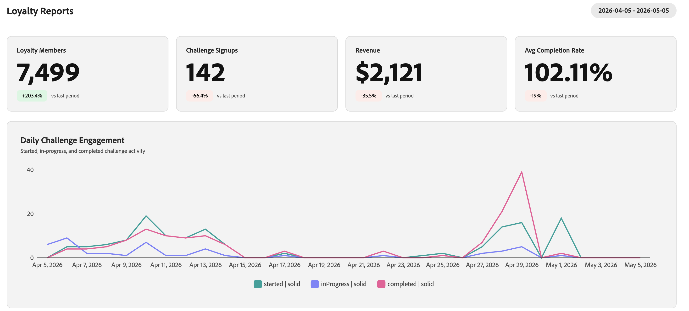

# 충성도 과제 성능 모니터링 {#loyalty-reporting}

>[!BEGINSHADEBOX]

**충성도 과제 설명서:**

* [충성도 문제 시작](get-started.md)
* [과제 및 작업 액세스 및 관리](access-loyalty-challenges.md)
* [과제 만들기](create-challenges.md)
* [작업 만들기](create-tasks.md)
* **충성도 챌린지 성능 모니터링** ◀︎**현재 상태**
* [충성도 과제 API 참조](https://developer.adobe.com/journey-optimizer-apis/references/loyalty-challenges){target="_blank"}

>[!ENDSHADEBOX]

>[!AVAILABILITY]
>
>이 기능은 현재 **개인 베타**&#x200B;에 있습니다. 릴리스 주기 및 가용성 단계에 대한 자세한 내용은 [Journey Optimizer 릴리스 주기](../rn/releases.md)를 참조하십시오.

충성도 과제 보고는 대상 funnel 성과, 작업 완료율, 보상 발행 및 매출 영향과 같은 주요 지표를 추적할 수 있도록 과제 수준 대시보드를 제공합니다. 모든 데이터는 Adobe Customer Journey Analytics에서 가져온 것이며, 사용자 지정 맞춤형 인터페이스에 제공됩니다.

<!--
A direct **Analyze in CJA** button will be added to the reporting interface before the feature reaches general availability.
-->

## 충성도 보고서 액세스 {#access-reports}

충성도 보고 대시보드를 열려면 Journey Optimizer의 **[!UICONTROL 충성도 과제(Beta)]**(으)로 이동한 다음 왼쪽 탐색에서 **[!UICONTROL 충성도 보고서]**&#x200B;를 선택하십시오.

보고 인터페이스에서는 각각 다른 수준의 세부 정보를 제공하는 세 개의 보기를 제공합니다. **[개요](#overview)**&#x200B;에는 모든 활성 문제에 대한 요약이 표시됩니다. 그 아래에는 두 개의 탭을 사용하여 보다 세분화된 보기 사이를 전환할 수 있습니다.

* **[과제](#challenges-view)**: 드릴다운 기능을 포함한 과제별 분류,
* **[작업](#tasks-view)**: 매출 및 완료 지표에 대한 작업 수준 보기입니다.

페이지 상단의 날짜 선택기를 사용하여 모든 보기에 대한 날짜 범위를 조정할 수 있습니다. 표준 날짜 사전 설정도 사용할 수 있습니다.

## 개요 {#overview}

**개요** 페이지에는 선택한 기간 동안 모든 활성 문제에 대해 집계된 지표가 표시됩니다.

페이지 맨 위에는 다음 지표가 표시됩니다.

**충성도 멤버** - 선택한 기간 동안 활동한 충성도 프로그램 멤버 수입니다.
**챌린지 등록** - 모든 챌린지에 새로 등록한 총 횟수입니다.
**매출** - 해당 기간 동안 도전 활동에 연결된 총 매출액.
**평균 완료율** - 하나 이상의 문제를 완료한 등록된 고객의 비율입니다.

이 지표 아래에 있는 **일일 도전 참여** 타임라인은 도전 참여도가 이 기간 동안 3개의 시리즈를 플로팅하면서 어떻게 발전했는지 보여 줍니다.

* 도전을 **시작**&#x200B;한 고객,
* **진행 중** 상태로 이동한 고객,
* 도전을 **완료**&#x200B;한 고객.

## 과제 보기 {#challenges-view}

**과제** 탭은 개별 과제별로 성능을 분류합니다. 각 과제에는 유형, 상태, 등록, 완료 등과 같은 주요 열이 나열됩니다. 이 목록은 마지막 수정 날짜별로 정렬되며 한 번에 10개의 문제를 표시합니다. 아래쪽의 **다음** 단추를 사용하여 더 찾아보십시오.

목록에서 챌린지를 선택하여 세부 사항 보기를 엽니다. 이 보고서에는 총 매출액, 등록, 완료율 및 추세 차트와 같은 몇 가지 지표 블록과 일별 분류가 포함됩니다.

+++과제 보고서 예

+++

## 작업 보기 {#tasks-view}

**작업** 탭에서는 작업 성능에 대한 상호 과제 보기를 제공합니다. 매출액별 상위 작업과 완료별 상위 작업 간을 전환하여 가장 관련이 있는 지표에 집중할 수 있습니다.

이 탭에서는 매출액별 상위 6개 작업도 강조 표시되어 가장 많은 가치를 창출하는 작업을 한눈에 볼 수 있습니다.

레이더 그래프 아래에 완료, 매출 및 각 작업이 속한 문제와 같은 주요 열이 있는 모든 작업이 작업 목록에 표시됩니다. 이 목록은 매출별로 정렬되며 한 번에 10개의 작업을 보여 줍니다. **다음** 단추를 사용하여 자세히 찾아보십시오.

