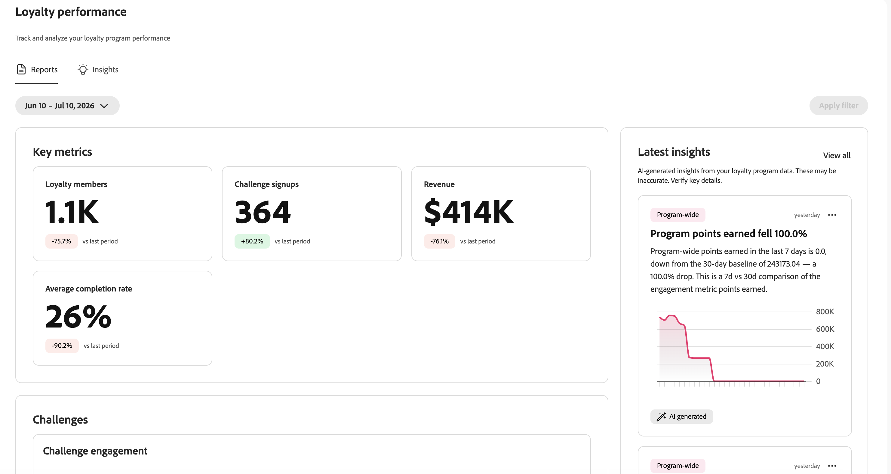

# 충성도 과제 성능 모니터링 {#loyalty-reporting}

충성도 과제 보고를 사용하여 과제의 성과를 확인하십시오. 누가 가입하고 있는지, 누가 도전을 완료하고 있는지, 프로그램의 매출액이 얼마나 되는지 모두 한 곳에서 확인합니다. 데이터는 Adobe Customer Journey Analytics에서 가져옵니다.

보고 대시보드를 열려면 Journey Optimizer의 **[!UICONTROL 충성도 과제]**(으)로 이동한 다음 왼쪽 탐색에서 **[!UICONTROL 성능]**&#x200B;을 선택하십시오.

보고 인터페이스에는 두 개의 탭이 있습니다.

* **[보고서](#reports-view)**: 어려움에 대한 숫자와 차트입니다.
* **[인사이트](#insights-cards)**: 현재 주의 깊게 살펴볼 수 있는 카드입니다.

## 보고서 보기 {#reports-view}

**보고서** 탭에는 선택한 기간 동안 프로그램이 어떻게 작동하는지 개요가 표시됩니다. 페이지 상단의 날짜 선택기를 사용하여 **[!UICONTROL 필터 적용]** 단추를 선택하여 보고 기간을 변경하고 업데이트된 숫자와 차트를 확인합니다.

**주요 지표** 영역에는 네 개의 숫자가 한 눈에 표시됩니다. 각 지표에는 이전 기간과 비교한 백분율 변경 사항도 표시됩니다.

* **충성도 멤버**: 해당 기간 동안 활동한 충성도 멤버 수.
* **챌린지 등록**: 챌린지에 등록한 구성원 수
* **매출**: 도전 활동에 연결된 총 매출액.
* **평균 완료율**: 하나 이상의 문제를 완료한 등록된 멤버의 비율입니다.

오른쪽의 **최신 인사이트** 패널에는 프로그램에서 가장 최근에 AI가 생성한 인사이트가 표시됩니다. **[!UICONTROL 모두 보기]**&#x200B;를 선택하여 전체 **인사이트** 탭을 엽니다.

주요 지표 아래에 있는 **과제** 섹션에서는 과제 활동에 대한 두 가지 보기를 제공합니다.

* **챌린지 참여**: 일정 기간 동안 시작되고, 진행 중이고, 완료된 챌린지를 보여 주는 타임라인입니다.
* **과제 보고서**: 유형, 작업, 상태 및 등록 번호와 같은 세부 정보가 포함된 모든 과제 테이블. 검색 창을 사용하여 특정 문제를 찾습니다. 참여 트렌드 및 성과 세부 정보가 포함된 전체 보고서를 보려면 과제를 선택하십시오.

  +++과제 보고서 예

  

  +++

## 인사이트 탭 {#insights-cards}

**인사이트** 탭에는 고객 충성도 프로그램의 예외 항목, 트렌드 및 기회를 표시하는 AI 생성 카드가 표시됩니다. 각 카드는 단일 관찰을 나타내며 현재 프로그램 데이터와 비교하여 얼마나 중요한지에 따라 순위가 매겨집니다.

오른쪽 상단의 **마지막 크롤링** 타임스탬프는 insight 엔진이 프로그램 데이터를 마지막으로 처리한 시점을 보여 줍니다.

### 카드 작업 {#insight-card-actions}

각 카드에는 두 가지 작업이 포함된  메뉴가 있습니다.

* **취소**: 인사이트 목록에서 카드를 영구적으로 제거합니다.
* **다시 알림**: 카드를 일시적으로 숨깁니다. **1일**, **3일** 또는 **7일** 동안 다시 시작하도록 선택하세요. 스누징 기간이 끝나면 카드가 다시 나타납니다.

<!--
### Priority badges {#insight-badges}

Each card has a priority badge — **High**, **Medium**, or **Low** — based on how significant the underlying signal is relative to your current program data. These levels are relative: there are always a few **High** cards, even in a quiet week. **High** means "most relevant right now", not that a fixed threshold was crossed.
-->

### 범주 태그 {#insight-category-tags}

각 카드에는 insight과 관련된 프로그램의 일부를 식별하는 **category 태그**&#x200B;가 있습니다.

| 카테고리 | 대상 |
| --- | --- |
| **프로그램 전체** | 충성도 프로그램의 전반적인 건강 및 성과 |
| **계층 수준** | 구성원 계층 간의 비율, 이동 및 배포 획득 |
| **과제** | 특정 과제 또는 여러 과제에 대한 활동, 완료율 및 예외 항목 |
| **제품** | 보기, 상환 및 카탈로그 수준 트렌드를 포함한 제품 카탈로그 성능 |
| **구성원 주기** | 멤버가 등록, 참여 및 이탈 단계를 진행하는 방식 |
| **트렌드** | 주별 주기, 계절별 급증 또는 추세 역전과 같은 시간 기반 패턴 |

