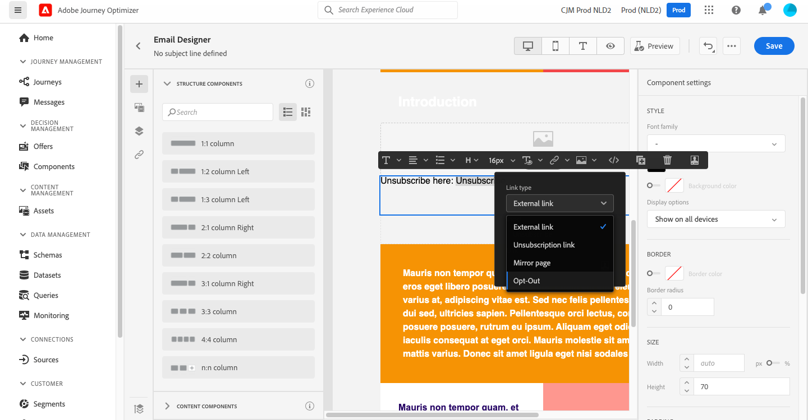

# 링크 추가 및 메시지 추적 {#tracking}

수신자의 동작을 모니터링하기 위해 [!DNL Journey Optimizer] 을 사용하여 컨텐츠에 링크를 추가하고 전송된 메시지를 추적합니다.

## 추적 활성화 {#enable-tracking}

[메시지를 만들 때 **[!UICONTROL Open Tracking for email]** 및/또는 **[!UICONTROL Click Tracking for email]** 옵션을 선택하여 이메일 메시지 수준에서 추적을 활성화할 수 있습니다](create-message.md).

>[!NOTE]
>
>두 옵션 모두 기본적으로 활성화되어 있습니다.

이를 통해 수신자의 동작을 추적할 수 있습니다.
* **[!UICONTROL Open Tracking for email]**: 열린 메시지.
* **[!UICONTROL Click Tracking for email]**: 이메일의 링크에 대한 클릭 수.

## 링크 삽입 {#insert-links}

메시지를 디자인할 때 콘텐츠에 링크를 추가할 수 있습니다.

>[!NOTE]
>
>[추적이 활성화되면 메시지 콘텐츠에 포함된 모든 링크가 추적됩니다.](#enable-tracking)

이메일 콘텐츠에 링크를 삽입하려면 아래 단계를 수행하십시오.

1. 요소를 선택하고 상황별 도구 모음에서 **[!UICONTROL Insert link]** 를 클릭합니다.

   

1. 만들 링크 유형을 선택합니다.

   * **[!UICONTROL External link]**: 외부 URL에 대한 링크를 삽입합니다.

   * **[!UICONTROL Unsubscription link]**: 브랜드의 커뮤니케이션 수신을 취소할 링크를 삽입합니다. [이 섹션](consent.md#opt-out-management)에서 옵트아웃 관리에 대해 자세히 알아보십시오.

   * **[!UICONTROL Mirror page]**: 웹 브라우저에 이메일 콘텐츠를 표시할 링크를 삽입합니다. 자세한 내용은 [이 섹션](#mirror-page)을 참조하십시오.

   * **[!UICONTROL Opt-out]**: 옵트아웃을 확인하지 않고 사용자가 커뮤니케이션에서 빠르게 가입을 해지할 수 있는 링크를 삽입합니다. 자세한 내용은 [이 섹션](#one-click-opt-out-link)을 참조하십시오.

   

1. 링크를 개인화할 수 있습니다. [이 섹션](personalization/personalization-syntax.md#perso-urls)에서 개인화된 URL에 대해 자세히 알아보십시오.

1. 변경 내용을 저장합니다.

1. 링크가 만들어져도 오른쪽의 **[!UICONTROL Component settings]** 창에서 수정할 수 있습니다.

   * 연필 아이콘을 클릭하여 링크를 편집합니다.
   * 해당 옵션을 선택하여 링크에 밑줄을 긋도록 선택할 수 있습니다.

   

## 미러 페이지에 대한 링크 {#mirror-page}

미러 페이지는 웹 브라우저를 통해 온라인으로 액세스할 수 있는 HTML 페이지입니다. 콘텐츠는 전자 메일의 콘텐츠와 동일합니다.

이메일의 미러 페이지에 대한 링크를 추가하려면 [링크](#insert-links)를 삽입하고 링크 유형으로 **[!UICONTROL Mirror page]**&#x200B;을(를) 선택합니다.

미러 페이지가 자동으로 생성됩니다.

>[!NOTE]
>
>자동 생성된 링크는 편집할 수 없습니다.

전자 메일이 전송되면 수신자가 미러 페이지 링크를 클릭하면 전자 메일의 컨텐츠가 기본 웹 브라우저에 표시됩니다.

>[!NOTE]
>
>테스트 프로필로 전송된 [증명](preview.md#send-proofs)에서 미러 페이지에 대한 링크가 활성 상태가 아닙니다. 최종 메시지에서만 활성화됩니다.

미러 페이지의 보존 기간은 60일입니다. 이후 미러 페이지는 더 이상 사용할 수 없습니다.

## 옵트아웃 링크를 한 번 클릭 {#one-click-opt-out-link}

수신자가 브랜드로부터 커뮤니케이션 수신을 신속히 해지할 수 있도록 하려면 1번의 클릭으로 이메일 콘텐츠에 옵트아웃 링크를 삽입할 수 있습니다. 이 용량을 사용하면 사용자가 선택을 확인해야 하는 랜딩 페이지로 리디렉션되지 않고 가입 해지 프로세스를 가속화합니다.

이메일에 옵트아웃 링크를 추가하려면 아래 단계를 따르십시오.

1. [링크를 ](#insert-links) 삽입하고 링크  **[!UICONTROL Opt-out]** 유형으로 을(를) 선택합니다.

   

1. 옵트아웃을 적용할 방법을 선택합니다. 채널, id 또는 구독 수준에서

   

   * **[!UICONTROL Channel]**: 옵트아웃은 현재 채널의 프로필 대상(즉, 이메일 주소)에 전송된 향후 메시지에 적용됩니다. 여러 대상이 프로필과 연결되어 있는 경우 옵트아웃은 해당 채널에 대한 프로필의 모든 타겟(즉, 이메일 주소)에 적용됩니다.
   * **[!UICONTROL Identity]**: 옵트아웃은 현재 메시지에 사용하는 특정 대상(즉, 이메일 주소)에 전송된 향후 메시지에 적용됩니다.
   * **[!UICONTROL Subscription]**: 옵트아웃은 특정 구독 목록과 연결된 향후 메시지에 적용됩니다. 이 옵션은 현재 메시지가 구독 목록과 연결된 경우에만 선택할 수 있습니다.

1. 사용자가 가입 해지되면 리디렉션될 랜딩 페이지의 URL을 입력합니다. 이 페이지는 옵트아웃이 성공했는지 확인하기 위한 것입니다.

   

1. **[!UICONTROL Save]**&#x200B;을(를) 클릭합니다.

메시지가 전송되면 수신자가 옵트아웃 링크를 클릭하면 즉시 옵트아웃됩니다.

## 추적 관리 {#manage-tracking}

[이메일 디자이너](create-email-content.md)를 사용하면 각 링크에 대한 추적 유형 편집과 같이 추적된 URL을 관리할 수 있습니다.

1. 왼쪽 창에서 **[!UICONTROL Links]** 아이콘을 클릭하여 추적할 컨텐츠의 모든 URL 목록을 표시합니다.

   이 목록을 사용하면 중앙 집중식 보기를 사용하고 이메일 콘텐츠에서 각 URL을 찾을 수 있습니다.

1. 링크를 편집하려면 해당 연필 아이콘을 클릭합니다.

   

1. 필요한 경우 **[!UICONTROL Tracking Type]**&#x200B;을 수정할 수 있습니다.

   

   추적된 각 URL에 대해 추적 모드를 다음 값 중 하나로 설정할 수 있습니다.

   * **[!UICONTROL Tracked]**: 이 URL에서 추적을 활성화합니다.
   * **[!UICONTROL Opt out]**: 이 URL을 옵트아웃 또는 구독 취소 URL로 간주합니다.
   * **[!UICONTROL Mirror page]**: 이 URL이 미러 페이지 URL인 것으로 간주합니다.
   * **[!UICONTROL Never]**: 이 URL의 추적을 활성화하지 않습니다.  <!--This information is saved: if the URL appears again in a future message, its tracking is automatically deactivated.-->

열린 메시지 수와 클릭한 링크 수가 [실행 탭](message-monitoring.md)에 나열됩니다.

개구부 및 클릭에 대한 보고는 [Email Live 보고서](reports/email-live-report.md) 및 [Email Global 보고서](reports/email-global-report.md)에서 사용할 수 있습니다.
